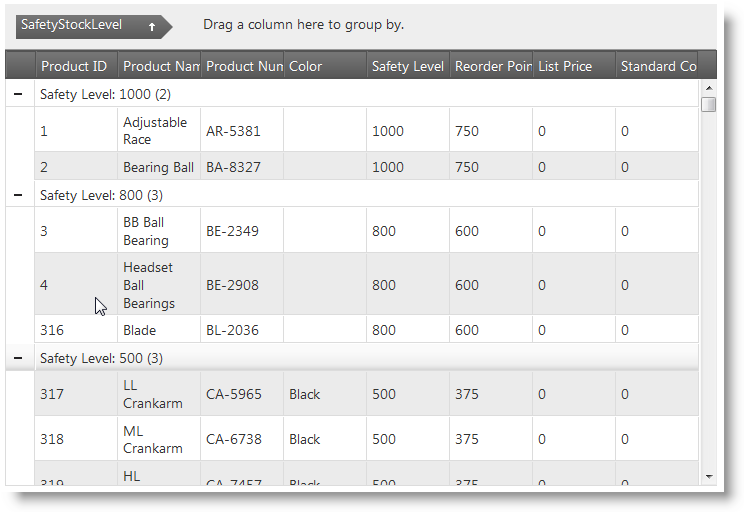
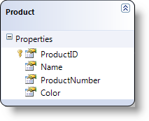

<!--
|metadata|
{
    "fileName": "iggrid-enabling-groupby",
    "controlName": "igGrid",
    "tags": ["Getting Started","Grids","Grouping"]
}
|metadata|
-->

# Enabling Column Grouping (igGrid)

## Topic Overview

### Purpose

This topic demonstrates how to enable the grouping functionality in an `igGrid`™ in both jQuery and MVC patterns.

### In this topic

This topic contains the following sections:

-   [**Introduction**](#introduction)
-   [**Preview**](#preview)
-   [**Requirements**](#requirements)
    -   [General Requirements](#general-requirements)
    -   [Script Requirements](#script-requirements)
    -   [Database Requirements](#database-requirements)
-   [**Enabling grouping in jQuery**](#enabling-grouping-jquery)
-   [**Enabling grouping in MVC**](#enabling-grouping-mvc)
-   [**Custom Grouping Implementations**](#custom-grouping-implementations)
-   [**Related Content**](#related-content)
    -   [Topics](#topics)
    -   [Samples](#samples)

## <a id="introduction"></a> Introduction


The GroupBy feature of the `igGrid` control is not enabled by default, so you need to enable it explicitly. You need to also explicitly set the columns that you want to be grouped when the grid is created together with any additional properties you might want configured, like the sorting direction inside the group.

The example below configures a grid with the grouping feature enabled and the content grouped by default by one of the grid’s columns – Safety Level.

## <a id="preview"></a> Preview

Following is a preview of the final result.



## <a id="requirements"></a> Requirements

### <a id="general-requirements"></a> General Requirements

-   jQuery-specific requirements
    -   An HTML web page with a grid connected to a data source
    -   A table tag in the body of the HTML page to serve as a container for the grid

        **In HTML:**

        ```html
        <table id="t1">
        </table>
        ```

-   MVC-specific requirements
    -   An MVC 2 or above project in MS Visual Studio® with a grid connected to a data source
    -   A reference to the Infragistics MVC dll (stores the MVC IG wrappers)

### <a id="script-requirements"></a> Script Requirements

The required scripts for both jQuery and MVC sample are the same because the MVC wrappers just render a jQuery widget.

The following scripts are required to run the grid and its grouping functionality:

-   The jQuery library script
-   The jQuery User Interface (UI) library
-   The Infragistics library script (This is obfuscated code for the controls)

The following code sample demonstrates the scripts as added to the header code of the HTML file.

**In HTML:**

```html
<script type="text/javascript"src="jquery.min.js"></script>
<script type="text/javascript" src="jquery-ui.min.js"></script>
<script type="text/javascript" src="infragistics.core.js"></script>
<script type="text/javascript" src="infragistics.lob.js"></script>
```

### <a id="database-requirements"></a> Database Requirements

For the purpose of this example only:

-   jQuery – Adventure Works in JSON format.
-   MVC – Adventure Works database.

## <a id="enabling-grouping-jquery"></a> Enabling grouping in jQuery

Inside the `$(document).ready()` event handler you create an `igGrid` with grouping feature configuration to allow grouping by column. In the example code below the grid is sorted by default by one of its columns (SafetyStockLevel).

**In Javascript:**

```js
$("#grid1").igGrid({
     features: [
        {
            name: 'GroupBy',
            columnSettings: [
                {
                    columnKey: "SafetyStockLevel",
                    isGroupBy: true,
                    dir: "asc"
                }
            ]
        }
    ],
    dataSource: adventureWorks,
    responseDataKey: 'Records',
    autoGenerateColumns: true
});
```

To verify the result, open the HTML file in your browser. You should see the grid grouped by the default grouped column (as shown in the Preview above) and you should also able to group by other columns or undo the current grouping.

## <a id="enabling-grouping-mvc"></a> Enabling grouping in MVC

1. Create a LINQ to the SQL model.

	

2. Create an MVC Controller method.

	Create MVC Controller method to get the data from the SQL Model and to call the View.

	**In MVC:**

	```csharp
	public ActionResult Default()
	{
	    var ctx = new AdventureWorksDataContext("ConnString");
	    var ds = ctx.Products;

	    return View("Events", ds);
	}
	```

3. Create the grid.

	Define the grid itself along with the Group By feature and all his configurations:

	**In Razor:**

	```csharp
	@(Html.Infragistics()
        .Grid(Model)
        .ID("grid1")
        .Features(feature => {
            feature.GroupBy().ColumnSettings(groupedGolumn =>
            {
                groupedGolumn.ColumnSetting().ColumnKey("Color").IsGroupBy(true);
            });
        })
        .AutoGenerateColumns(true)
        .PrimaryKey("ProductID")
        .Width("750px")
        .DataBind()
        .Render()
    )
	```

4. Save the project.

5. (Optional) Verify the result.

	To verify the result, run your application. You should see the grid grouped by the default grouped column (as shown in the Preview REF above) and you should also able to group by other columns or undo the current grouping.

## <a id="custom-grouping-implementations"></a> Custom Grouping Implementations

The grouping functionality allows for using a custom function to group the data using some criteria that differ from the default ones. For example, you may want to group a column based on the parity (the oddness or the evenness) of certain numbers.


## <a id="related-content"></a> Related Content

### <a id="topics"></a> Topics

The following topics provide additional information related to this topic.

- [Grouping Overview](igGrid-GroupBy-Overview.html)

- [Grouping Properties Reference](%%jQueryApiUrl%%/ui.igGridGroupBy#options)

- [igGrid Known Issues and Breaking Changes](igGrid-Known-Issues.html)

### <a id="samples"></a> Samples

The following samples provide additional information related to this topic.

- [Grouping](%%SamplesUrl%%/grid/grouping)


