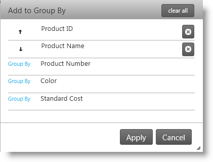
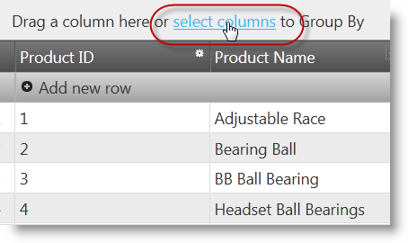
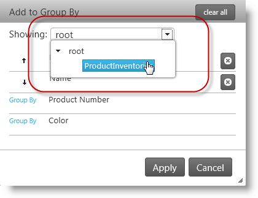
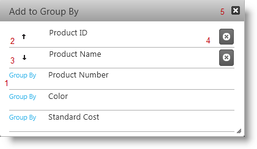
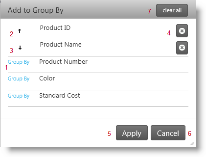

<!--
|metadata|
{
    "fileName": "iggrid-group-by-dialog-overview",
    "controlName": "igGrid",
    "tags": []
}
|metadata|
-->

# Group By Dialog Overview (igGrid)

## Topic Overview

### Purpose

This topic explains the Group By dialog of the `igGrid`™ control.

### Required background

The following table lists the topics required as a prerequisite to understanding this topic.

- [Touch Support for Ignite UI Controls](Touch-Support-for-NetAdvantage-for-jQuery-Controls.html): This topic introduces the updates to Ignite UI™ controls for touch-support interactions.

- [Feature Chooser](igGrid-Feature-Chooser.html): This topic explains the `igGrid`™ Feature Chooser menu and its sections.

- [igGrid Group By Overview](igGrid-GroupBy-Overview.html): This topics demonstrates grouping in the `igGrid`.

- [igHierarchicalGrid™ Group By Overview](igHierarchicalGrid-Grouping-Overview.html): This topics demonstrates grouping in the `igHierarchicalGrid`.

### In this topic

This topic contains the following sections:

-   [**Introduction**](#introduction)
-   [**Configurable Behaviors**](#configurable-behaviors)
-   [**User Interactions**](#user-interactions)
    -   [User interactions summary](#user-interactions-summary)
    -   [Grouping with immediate grouping enabled](#interactions-immediate-grouping)
    -   [Grouping with deferred grouping enabled](#interactions-deferred-grouping)
-   [**Property Reference**](#property-reference)
-   [**Method Reference**](#method-reference)
-   [**Event Reference**](#event-reference)
-   [**Related Content**](#related-content)
    -   [Topics](#topics)
    -   [Samples](#samples)

##  Introduction

### Group By dialog summary

The `igGrid` Group By Modal Dialog is a window that allows you to group the grid by any column. The Group By Modal Dialog allows you to select the order of the grouped columns as well as to apply the changes immediately for every column or to apply them at once for more than one a column. It’s very comfortable when you want to group by the `igGrid` under touch-platform devices. The Group By Dialog Window is designed especially for touch-platform devices.

The Modal Dialog window displays the grouped columns in the order they are grouped in the grid.

### Accessing the Group By dialog

The Group By modal dialog window may be opened by clicking the select columns label on the Group By area.

To display the *Group By* dialog, click the *select column* link in the `igGrid` Group By area, which by default is at the top of the grid.

### Difference between the igGrid and igHierarchicalGrid Group By dialogs

The difference between the dialogs among the `igGrid` and `igHierarchicalGrid` is that `igHierarchicalGrid` has an additional drop down which allows you to choose a column layout from the hierarchy. By selecting a layout form the dropdown, the Modal Dialog displays all the columns for the current grid layout. Than you can group the grid by selecting some of the columns that are displayed. If you select a new grid layout and then return to the same layout again, the order of the grouped columns is preserved. You can clear all the groupings by pressing Modal Dialog *Clear All* button.

igGrid | igHierarchicalGrid
----   | -----
 | 

##  Configurable Behaviors

The window has two grouping behaviors – immediate grouping and deferred grouping (default) which define whether the grid updates automatically when the user performs a grouping action. These behaviors are managed by the state of the [`modalDialogGroupByOnClick`](%%jQueryApiUrl%%/ui.iggridgroupby#options:modalDialogGroupByOnClick) property. See the configurable behaviors chart for further details.

### igGrid configurable behaviors chart

The following table lists the configurable behaviors of the Group By dialog. Additional details are available after the table.

Behavior | Description | *modalDialogGroupByOnClick* value
-------  | ----------- | ------------
[Immediate grouping](#interactions-immediate-grouping) | When the user selects a column, the grid is grouped by that column without delay. | true
[Deferred grouping](#interactions-deferred-grouping) | When the user selects a column, the grid is not grouped until the **Apply** button is clicked. This enables the user to select multiple columns and define their order before the grouping action takes place. | false

##  User Interactions

###  User interactions summary

The way the user performs the grouping differs depending on whether immediate grouping and deferred grouping *is enabled. The following table summarizes the respective user actions.* Additional details are available after the table.

User interaction | Description
-------  | -----------
[Grouping with immediate grouping enabled](#interactions-immediate-grouping) | The user groups the grid by a particular column by clicking on the column.
[Grouping with deferred grouping enabled](#interactions-deferred-grouping) | The user selects the desired column(s), and then applies the grouping action by clicking the **Apply** button.

###  Grouping with immediate grouping enabled

Use the following buttons:

1.  Group by – to group by the current column in ascending order ( the whole row is clickable)
2.  Up Arrow – the column is grouped by in an ascending order. Press the button to group by in a descending order ( the whole row is clickable)
3.  Down arrow – the column is grouped by in a descending order. Press the button to group by in an ascending order ( the whole row is clickable)
4.  Ungroup by – to ungroup by the current column
5.  Close button - close the modal dialog
6.  ESC (key) - close the modal dialog.

###  Grouping with deferred grouping enabled

By default the property [`modalDialogGroupByOnClick`](%%jQueryApiUrl%%/ui.iggridgroupby#options:modalDialogGroupByOnClick) is set to false by default. This means that you must choose which columns to group by and then apply the changes to the grid to apply the groupings.

Use the following buttons:

1.  Group by – to group by the current column in ascending order ( the whole row is clickable)
2.  Up Arrow – the column is grouped by in an ascending order. Press the button to group by in a descending order ( the whole row is clickable)
3.  Down arrow – the column is grouped by in a descending order. Press the button to group by in an ascending order ( the whole row is clickable)
4.  Ungroup by – to ungroup by the current column
5.  Apply – to apply the columns, you want to group by and their order.
6.  Cancel – to close the Modal Dialog and don’t apply any changes.
7.  Clear all – to remove all grouped columns, in all layouts.
8.  ESC (key) - close the modal dialog.

> **Note**: For the `igHierarchicalGrid` widget, an additional dropdown is available which first allows you to select any child layout and then allows you to choose column(s) to group by.

## Property Reference

This section explains `igGrid` Group By properties that affect Modal Dialog.

The following table shows the `igGrid` Group By properties that are responsible for the configuration of the Modal Dialog

Property | Description
-------  | -----------
[modalDialogGroupByOnClick](%%jQueryApiUrl%%/ui.iggridgroupby#options:modalDialogGroupByOnClick) | Specifies what happens when you select a column in the group by dialog window - to be immediately grouped/ungrouped or to wait until “Apply” button is cleared.
[modalDialogWidth](%%jQueryApiUrl%%/ui.iggridgroupby#options:modalDialogWidth) | Specifies the width of the dialog
[modalDialogHeight](%%jQueryApiUrl%%/ui.iggridgroupby#options:modalDialogHeight) | Specifies the height of the dialog
[modalDialogAnimationDuration](%%jQueryApiUrl%%/ui.iggridgroupby#options:modalDialogAnimationDuration) | Specifies time in milliseconds for the animation duration to show or hide the dialog
[modalDialogDropDownWidth](%%jQueryApiUrl%%/ui.iggridgroupby#options:modalDialogDropDownWidth) | Specifies the width of dropdown in the Modal Dialog, that shows grid layouts .
[modalDialogDropDownAreaWidth](%%jQueryApiUrl%%/ui.iggridgroupby#options:modalDialogDropDownAreaWidth) | Specifies the height of layouts dropdown in dialog
[modalDialogGroupByButtonText](%%jQueryApiUrl%%/ui.iggridgroupby#options:modalDialogGroupByButtonText) | Specifies the text of Group By button in the dialog
[modalDialogCaptionButtonDesc](%%jQueryApiUrl%%/ui.iggridgroupby#options:modalDialogCaptionButtonDesc) | Specifies the caption for each descending sorted column in the dialog
[modalDialogCaptionButtonAsc](%%jQueryApiUrl%%/ui.iggridgroupby#options:modalDialogCaptionButtonAsc) | Specifies the caption for each ascending sorted column in dialog.
[modalDialogCaptionButtonUngroup](%%jQueryApiUrl%%/ui.iggridgroupby#options:modalDialogCaptionButtonUngroup) | Specifies caption button ungroup in group by dialog
[modalDialogCaptionText](%%jQueryApiUrl%%/ui.iggridgroupby#options:modalDialogCaptionText) | Specifies the caption text for the dialog
[modalDialogDropDownLabel](%%jQueryApiUrl%%/ui.iggridgroupby#options:modalDialogDropDownLabel) | Specifies the label for the dropdown in Modal Dialog that shows grid layouts.
[modalDialogRootLevelHierarchicalGrid](%%jQueryApiUrl%%/ui.iggridgroupby#options:modalDialogRootLevelHierarchicalGrid) | Specifies the name of the root layout which is shown layouts tree dialog
[modalDialogDropDownButtonCaption](%%jQueryApiUrl%%/ui.iggridgroupby#options:modalDialogDropDownButtonCaption) | Specifies the caption of grid layouts dropdown button in the dialog
[modalDialogClearAllButtonLabel](%%jQueryApiUrl%%/ui.iggridgroupby#options:modalDialogClearAllButtonLabel) | Specifies the label for the Clear All button in the dialog
[emptyGroupByAreaContentSelectColumnsCaption](%%jQueryApiUrl%%/ui.iggridgroupby#options:emptyGroupByAreaContentSelectColumnsCaption) | Specifies the caption for the button which opens dialog
[modalDialogButtonApplyText](%%jQueryApiUrl%%/ui.iggridgroupby#options:modalDialogButtonApplyText) | Specifies the text of the button which applies changes in the dialog
[modalDialogButtonCancelText](%%jQueryApiUrl%%/ui.iggridgroupby#options:modalDialogButtonCancelText) | Specifies the text of the button which cancel changes in the dialog

##  Method Reference

This section explains `igGrid` Group By methods that affect the modal dialog.

The following table shows the `igGrid` Group By methods, which are defined in the Modal Dialog API.

Method | Description
------ | -----------
[openGroupByDialog](%%jQueryApiUrl%%/ui.iggridgroupby#methods:openGroupByDialog) | Shows the dialog. If it is visible the method does nothing.
[closeGroupByDialog](%%jQueryApiUrl%%/ui.iggridgroupby#methods:closeGroupByDialog) | Hides the dialog. If it is not visible the method does nothing.
[renderGroupByModalDialog](%%jQueryApiUrl%%/ui.iggridgroupby#methods:renderGroupByModalDialog) | Renders the markup of the Group By Modal Dialog. When the markup is already rendered the `openGroupByDialog` and `closeGroupByDialog` properties are used to open and close the Modal Dialog.
[openDropDown](%%jQueryApiUrl%%/ui.iggridgroupby#methods:openDropDown) | Open layouts dropdown (only for `igHierarchicalGrid`).
[closeDropDown](%%jQueryApiUrl%%/ui.iggridgroupby#methods:closeDropDown) | Close layouts dropdown (only for `igHierarchicalGrid`).

##  Event Reference

This section explains `igGrid` GroupBy events associated with the Modal Windows.

The following table shows the `igGrid` Sorting events that are fired during interacting with the Modal Dialog.

Event | Description
----- | -----------
[modalDialogOpening](%%jQueryApiUrl%%/ui.iggridgroupby#events:modalDialogOpening) | Event fired before the modal dialog is opened.
[modalDialogOpened](%%jQueryApiUrl%%/ui.iggridgroupby#events:modalDialogOpened) | Event fired after the modal dialog is already opened.
[modalDialogMoving](%%jQueryApiUrl%%/ui.iggridgroupby#events:modalDialogMoving) | Event fired every time the column chooser changes its position.
[modalDialogClosing](%%jQueryApiUrl%%/ui.iggridgroupby#events:modalDialogClosing) | Event fired before the modal dialog is closed.
[modalDialogClosed](%%jQueryApiUrl%%/ui.iggridgroupby#events:modalDialogClosed) | Event fired after the modal dialog has been closed.
[modalDialogContentsRendering](%%jQueryApiUrl%%/ui.iggridgroupby#events:modalDialogContentsRendering) | Event fired before the contents of the column chooser are rendered.
[modalDialogContentsRendered](%%jQueryApiUrl%%/ui.iggridgroupby#events:modalDialogContentsRendered) | Event fired after the contents of the column chooser are rendered.
[modalDialogButtonApplyClick](%%jQueryApiUrl%%/ui.iggridgroupby#events:modalDialogButtonApplyClick) | Event fired when Reset button in column chooser is clicked
[modalDialogButtonResetClick](%%jQueryApiUrl%%/ui.iggridgroupby#events:modalDialogButtonResetClick) | Event fired when Reset button in column chooser is clicked.
[modalDialogGroupingColumn](%%jQueryApiUrl%%/ui.iggridgroupby#events:modalDialogGroupingColumn) | Event fired when column in modal dialog is clicked to be grouped.
[modalDialogGroupColumn](%%jQueryApiUrl%%/ui.iggridgroupby#events:modalDialogGroupColumn) | Event fired when column in modal dialog is clicked to be grouped.
[modalDialogUngroupingColumn](%%jQueryApiUrl%%/ui.iggridgroupby#events:modalDialogUngroupingColumn) | Event fired when column in modal dialog is clicked to be ungrouped.
[modalDialogUngroupColumn](%%jQueryApiUrl%%/ui.iggridgroupby#events:modalDialogUngroupColumn) | Event fired when column in modal dialog is clicked to be ungrouped.
[modalDialogSortGroupedColumn](%%jQueryApiUrl%%/ui.iggridgroupby#events:modalDialogSortGroupedColumn) | Event fired when column in modal dialog is clicked to be ungrouped.

##  Related Content

###  Topics

The following topics provide additional information related to this topic.

- [Touch Support for Ignite UI Controls](Touch-Support-for-NetAdvantage-for-jQuery-Controls.html): This topic introduces the updates to Ignite UI™ controls for touch-support interactions.

- [Feature Chooser](igGrid-Feature-Chooser.html): This topic explains the `igGrid`™ Feature Chooser menu and its sections.

- [igGrid Group By Overview](igGrid-GroupBy-Overview.html): This topics demonstrates grouping in the `igGrid`.

- [igHierarchicalGrid™ Group By Overview](igHierarchicalGrid-Grouping-Overview.html): This topics demonstrates grouping in the `igHierarchicalGrid`.

###  Samples

The following samples provide additional information related to this topic.

- [Grouping](%%SamplesUrl%%/grid/grouping): Sample that shows the interactions with the igGrid GroupBy modal dialog window.

