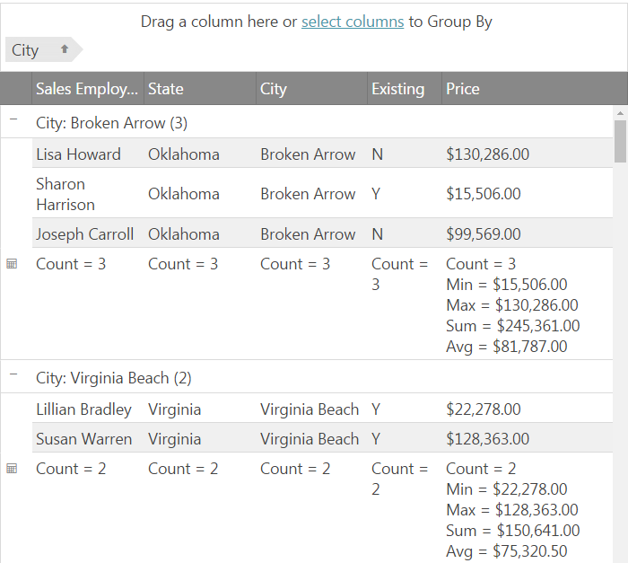

<!--
|metadata|
{
    "fileName": "iggrid-groupby-summaries",
    "controlName": "igGrid",
    "tags": ["Getting Started","Grids","Grouping", "Summaries"]
}
|metadata|
-->

# GroupBy Summaries Feature Overview (igGrid)

## Topic Overview

### Purpose

This topic introduces the GroupBy Summaries functionality of the `igGrid`™.


### In this topic

This topic contains the following sections:

-   [GroupBy Summmaries Feature Overview](#summaries-overview)
-   [Enabling GroupBy Summmaries](#enable-summaries)
	- [Basic settings](#summaries-basic)
	- [Advanced settings](#summaries-advanced)
    - [Custom Summaries](#summaries-custom)
-   [Related Content](#related-content)


## <a id="summaries-overview"></a> GroupBy Summmaries Feature Overview

The GroupBy Summaries feature allows an additional summary row to be displayed below each group data island that displays summary information for the data columns in that island. The summary row is visible only when the related group is expanded. The below image demonstrates a grid with grouped columns where below each group the total sum of the "Price" column is displayed in a summary row:


    
This feature allows the user to display the result for either a default summary function (Sum, Min, Max, Avg etc.) or a custom one in order to provide a meaningful summary of the data group.

This feature can also be combined with the igGrid Summaries feature in order to display summary information for the whole data in the grid footer. 

## <a id="enable-summaries"></a> Enabling GroupBy Summmaries

### <a id='summaries-basic'></a> Basic settings

In order to enable the group summaries feature the [`groupSummaries`](%%jQueryApiUrl%%/ui.iggridgroupby#options:groupSummaries) option should be enabled:

```js
$("#grid1").igGrid({
     features: [
       {
           name: 'GroupBy',
           groupSummaries: true
       }
    ],
    dataSource: data
});
```


When enabled the grid will render the default summaries for the related column type. 
The default column summaries per column type are:

Summary | Applicable for column of type |
-------  | ------- |
Count | All column types
Min | number, date
Max | number, date
Sum | number
Avg | number

Below you can see an example result with the default settings:



The applicabe column types as well as other default summaries related options can be modified via the `$.ig.util.defaultSummaryMethods` array.

The summary method object in the `$.ig.util.defaultSummaryMethods` array has the following options:

Name | Description | Type 
-----| ------------| -----
label | Label that will be applied to the result of the summary function. | string
name | Name of the summary function. Ex: {summaryFunction: "count"} | string
summaryFunction | Speficies the function that will be used when calculating the summary. | function
dataType | Speficies to which type of column this summary is applicable. Setting it to 'any' will apply this summary to all column types. | 'any' or array 
active | Sets if the summary should be applied. | boolean | true
order | Speficies the order in which this summary will be placed when there are multiple summaries. order: 0 means that it will be displayed on top of all summaries. |  number 
applyFormat | Sets whether formatting will be applicable for the summary value. | boolean


### <a id='summaries-advanced'></a>Advanced settings

The following list contains information on the main summaries related options.

| Option | Description | Default values | Valid Values|
|--------|-------------|----------------|-------------|
[groupSummaries](%%jQueryApiUrl%%/ui.iggridgroupby#options:groupSummaries) |Controls the default summary methods that will be applied to each column. <br/> When **true** - default summaries are enabled for all columns.  <br/> When **false** - default summaries are disabled  for all columns.  <br/>When **array** - the specified in the array summaries are applied for all columns.  See [groupSummariesObject](#groupSummariesObject) for summary object format. <br/>| false | true, false, array|
[columnSettings.groupSummaries](%%jQueryApiUrl%%/ui.iggridgroupby#options:columnSettings.groupSummaries)| Array of objects setting the summaries for the column the columnSettings responds to. Takes precedent over the main groupSummaries option.<br/> When **true** - default summaries are enabled for specific column.  <br/> When **false** - default summaries are disabled for specific column.  <br/>When **array** - the specified in the array summaries are applied for specific column. See [groupSummariesObject](#groupSummariesObject) for summary object format.<br/> | null | true, false, array, null|

The groupSummaries option allows enabling/disabling the summaries by setting true/false or specifying an array of the default summary methods that will be applied for all columns that allow that summary type. The below example demonstrates specifying a single default summary of type "Sum":

```js
$("#grid1").igGrid({
   features: [
	{
       	name: "GroupBy",
		initialExpand: false,
		groupSummaries: [
			{
				summaryFunction: "Sum",
				label: "Total = "
			}
		]
     ]
    dataSource: data
});
```

This summary will be applied for all columns whose data type allows applying it. 
In this example since the "Sum" summary is only applicable for numeric columns only the numeric columns in the grid will have a "Sum" summary displayed in the summary row.

The `columnSettings.groupSummaries` option allows specifying a summary per column, which takes higher priority than the groupSummaries main level option. When this option is set for a particular column any settings related to this column from the main `groupSummaries` option are disregarded.

The <a id="groupSummariesObject"></a>**groupSummariesObject** used for specifying the summary options has the following properties:
Name| Description | Type | Default value |
----|-------------|------|---------------|
summaryFunction|Name or custom function specifying the summary.| string or function |
label | Sets the label that will be used when displaying the summary value.| string |
summaryTemplate| Sets the template for each summary result. |string | "{label}{value}"
format | Applies format for the summary value. | string | The grid’s column.format value.

They allow futher customization of the look of the summary when it gets displayed in the grid summary row.

### <a id='summaries-custom'></a> Custom summaries

Custom summaries allow specifying a custom function for aggregating the data from the data islands.
In order to set a custom summary you can set a function to the `summaryFunction` property of the group summaries object.

The group summaries object can be added to one of the following collections, which will determine which columns the custom summary will be applied to as follows:

When set in: | Custom summary is applied to: 
---|---
[columnSettings.groupSummaries](%%jQueryApiUrl%%/ui.iggridgroupby#options:columnSettings.groupSummaries) | The particular column only.
[groupSummaries](%%jQueryApiUrl%%/ui.iggridgroupby#options:groupSummaries) | All columns.
$.ig.util.defaultSummaryMethods | All columns.

The function accepsts the data island data and should return the summary result for that data.

Custom Summary Example:

```js
$("#grid1").igGrid({
    features: [
         {
            name: "GroupBy",
            initialExpand: false,
            columnSettings: [
                {
                    columnKey: "ExisitingCustomer",
                    groupSummaries: [
                     {
                         summaryFunction: existingCount,
                         label: "Existing Count: "
                      }
                    ]
                }
        }
    ],
    dataSource: data
 });

function existingCount(data, dataType) {
    var i, count = 0; 
    for (i = 0; i < data.length; i++) {
        if(data[i] === "Y"){
           count++;
       }
    }
    return count;
}
 ```


## <a id="related-content"></a> Related Content

### <a id="samples"></a> Related Samples

The following sample provides additional information related to this topic.

- [Grouping with summaries](%%SamplesUrl%%/grid/grouping)

### <a id="topics"></a> Topics

The following topics provide additional information related to this topic.

- [Enabling Column Grouping (igGrid)](igGrid-Enabling-GroupBy.html)

- [Grid Group By Properties Reference](%%jQueryApiUrl%%/ui.iggridgroupby#options)
