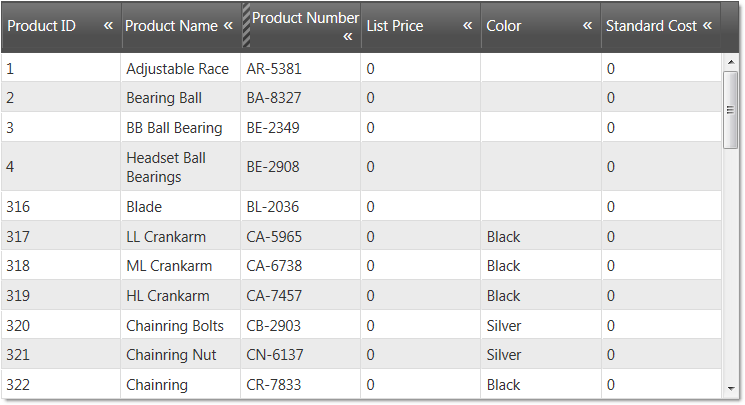
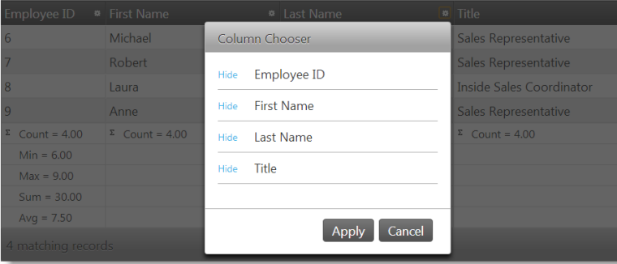
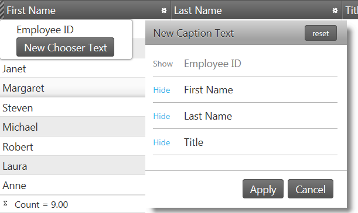

<!--
|metadata|
{
    "fileName": "iggrid-configure-column-hiding",
    "controlName": "igGrid",
    "tags": ["Getting Started","Grids"]
}
|metadata|
-->

# Configuring Column Hiding (igGrid)

## Topic Overview

### Purpose

This topic explains how to configure in code the columns of the `igGrid`™ control.


### In this topic

This topic contains the following sections:

-   [**Column Configuration Overview**](#column-configuration-overview)
-   [**Example: Hiding a Column by Default**](#example-hiding-column-by-default)
    -   [Property settings](#example-hiding-column-by-default-property-settings)
    -   [Code](#example-hiding-column-by-default-code)
-   [**Example: Hiding a Column Completely**](#example-hiding-column-completely)
    -   [Preview](#example-hiding-column-completely-preview)
    -   [Property settings](#example-hiding-column-completely-property-settings)
    -   [Code](#example-hiding-column-completely-code)
-   [**Example: Canceling Column Hiding**](#example-canceling-column-hiding)
    -   [Overview](#example-canceling-column-hiding-overview)
    -   [Steps](#example-canceling-column-hiding-steps)
-   [**Example: Configuring the Column Chooser**](#example-configuring-column-chooser)
    -   [Preview](#example-configuring-column-chooser-preview)
    -   [Property settings](#example-configuring-column-chooser-property-settings)
    -   [Code](#example-configuring-column-chooser-code)
-   [**Related Content**](#related-content)
    -   [Topics](#topics)

### Required Background

The table bellows lists the required background you need for fully understanding the information in this topic.

- Topics
	- You need to first read the [Enabling Column Hiding](igGrid-Column-Hiding-Enabling-Column-Hiding.html) topic.
- External Resources
	- You need to first read the following article:
	- [jQuery on() API](http://api.jquery.com/on/)

## <a id="column-configuration-overview"></a> Column Configuration Overview

The table below lists the configurable behaviors of the `igGrid` control columns. These behaviors are managed through the properties of the `columnSettings` option of the control. For some of the behaviors/features, detailed explanations and examples are provided in the blocks following the chart.

> **Note:** In the following table, the propertis and methods specific to the [Hiding Column Chooser](igGrid-Hiding-Column-Chooser.html) are not listed. They are available in the [Hiding Column Chooser](igGrid-Hiding-Column-Chooser.html) topic.

Configurable behavior/feature | Configuration details | Configuration properties
------------------------------|-----------------------|-------------------------
Hiding a Column by Default | A column is hidden upon grid initialization. | hidden
Hiding a Column Completely | A column is hidden upon grid initialization with no user options to be displayed. | allowHiding
Enabling column hiding | Allows hiding the column by the user. | allowHiding
Width of the Hidden Column Indicator | The width in pixels of the hidden column indicator in the header | hiddenColumnIndicatorHeaderWidth
Configuring the Column Chooser | The default column chooser width in pixels | columnChooserWidth
Configuring the Column Chooser | The default column chooser height in pixels. | columnChooserHeight
Duration of the drop-down animation | The duration of the dropdown animation in milliseconds. | dropDownAnimationDuration
Showing/hiding Drop-down button. | The visibility of the footer button. | showDropDownButton
Configuring the Column Chooser | Text of the caption of the column Chooser window. | columnChooserCaptionText
Configuring the Column Chooser | The caption of the the drop-down tools menu (Feature Chooser). | columnChooserDisplayText
Tooltip text | The text displayed in the tooltip of the hidden column indicator. | hiddenColumnIndicatorTooltipText
Configuring the column key | The column key. This is the preferred column identifier. | columnKey
Configuring the column index | Column index. Can be used in if no column key has been set. | columnIndex


## <a id="example-hiding-column-by-default"></a> Example: Hiding a Column by Default

In the picture below, the Reorder Point column is hidden on initialization.



### <a id="example-hiding-column-by-default-property-settings"></a> Property settings

The table below maps the desired configurations to property settings. The properties are accessed through the `igGridHiding` options.

Property | Setting
----|----
[columnKey](%%jQueryApiUrl%%/ui.igGridHiding#options:columnSettings.columnKey) | ReorderPoint
[allowHiding](%%jQueryApiUrl%%/ui.igGridHiding#options:columnSettings.allowHiding) | true
[hidden](%%jQueryApiUrl%%/ui.igGridHiding#options:columnSettings.hidden) | true

### <a id="example-hiding-column-by-default-code"></a> Code

**In JavaScript:**

```javascript
<script type="text/javascript">
$(function () {
    $("#grid1").igGrid({
        autoGenerateColumns: true,
        dataSource: adventureWorks,
        responseDataKey: 'Records',
        features: [
        {
            name: 'Hiding',
            columnSettings: [
                {columnKey: 'ReorderPoint', allowHiding: true, hidden: true}
            ]
        }
    });
});
</script>
```


**In Razor:**

```csharp
@(Html.Infragistics().Grid(Model)
    .AutoGenerateColumns(true)
    .Features(feature =>{
        feature.Hiding().ColumnSettings(settings =>    settings.ColumnSetting()
        .ColumnKey("ReorderPoint")
        .AllowHiding(true)
        .Hidden(true));
    }).DataBind().Render()
)
```

## <a id="example-hiding-column-completely"></a> Example: Hiding a Column Completely

### <a id="example-hiding-column-completely-preview"></a> Preview

The following picture displays a grid with two columns – Address and BirthDate – hidden completely. There are no indications about these columns, so the user cannot realize the columns are hidden.



### <a id="example-hiding-column-completely-property-settings"></a> Property settings

The table below maps the desired configurations to property settings. The properties are accessed through the igGridHiding options.

Property | Setting
----|----
[columnKey](%%jQueryApiUrl%%/ui.igGridHiding#options:columnSettings.columnKey) | true
[allowHiding](%%jQueryApiUrl%%/ui.igGridHiding#options:columnSettings.allowHiding) | false

### <a id="example-hiding-column-completely-code"></a> Code

**In JavaScript:**

```javascript
<script type="text/javascript">
$(function () {
    $("#grid1").igGrid({
        autoGenerateColumns: true,
        dataSource: adventureWorks,
        responseDataKey: 'Records',
        features: [
        {
            name: 'Hiding',
            columnSettings: [
                {columnKey: 'Address', allowHiding: false, hidden: true}
                {columnKey: 'BirthDate', allowHiding: false, hidden: true}
            ]
        }
    });
});
</script>
```

**In Razor:**

```csharp
@(Html.Infragistics().Grid(Model)
    .AutoGenerateColumns(true)
    .Features(feature =>{
        feature.Hiding().
        .ColumnSettings(settings =>
        {
            settings.ColumnSetting().ColumnKey("Address").Hidden(true).AllowHiding(false);
            settings.ColumnSetting().ColumnKey("BirthDate").Hidden(true).AllowHiding(false);
        })
    ).DataBind().Render()
)
```

### <a id="example-canceling-column-hiding"></a> Canceling Column Hiding

Canceling column hiding is done by canceling the `columnHiding` event. The purpose of this is to prevent hiding the column if the `columnHiding` has been fired.

### <a id="example-canceling-column-hiding-overview"></a> Overview

Following is a conceptual overview of the process:

1.  Handling the `columnHiding` event
2.  Canceling the event

### <a id="example-canceling-column-hiding-steps"></a> Steps

1.  Handle the `columnHiding` event.
    1.  Define a handler function.

        Define a function that will be called when the `columnHiding` event fires.

        **In JavaScript:**

        ```javascript
        <script type="text/javascript">
            function gridColumnHiding (evt, ui) {

            };
        </script>
        ```

	2. Set the handler to the `columnHiding` event of the `igGrid`.

		Once you have a handler defined, it has to be set as the handler for the `columnHiding` event. In jQuery, this can be done when the widget is instantiated. In ASP.NET MVC, the event must be attached using the jQuery `on` API. Using the on API is an option for attaching the event in a pure jQuery implementation as well. The type for this event is `iggridhidingcolumnhiding`.

		**In JavaScript:**

		```javascript
		$(function () {
			$("#grid1").igGrid({
				autoGenerateColumns: true,
				dataSource: adventureWorks,
				responseDataKey: 'Records',
				features: [
				{
				     name: 'Hiding',
				     columnHiding: gridColumnHiding
				}
				]
			});
		});
		```

		**In JavaScript:**

		```js
		$("# grid1").on("iggridhidingcolumnhiding", comboSelectionChanging);
		```

2.  Cancel the event.

    To cancel the event, return false.

    **In JavaScript:**

    ```javascript
    <script type="text/javascript">
        function gridColumnHiding (evt, ui) {
           if (conditionNotMet)
              return false;
         };
    </script>
    ```

For detailed information about these events, refer to their listing in the property reference section:

-   [igGridColumnHiding Events](%%jQueryApiUrl%%/ui.igGridHiding#events)

## <a id="example-configuring-column-chooser"></a> Example: Configuring the Column Chooser

In this example, the Column Chooser is configured with the following settings:

-   width – 300 pixels
-   height – 300 pixels
-   caption saying New caption text
-   Chooser button saying New caption text

### <a id="example-configuring-column-chooser-preview"></a> Preview

Following is a preview of the final result.



### <a id="example-configuring-column-chooser-property-settings"></a> Property settings

The table below maps the desired configurations to property settings.
The properties are accessed through the `igGridHiding` options.

Property | Setting
---------|-------
[columnChooserWidth](%%jQueryApiUrl%%/ui.igGridHiding#options:columnChooserWidth) | 300
[columnChooserHeight](%%jQueryApiUrl%%/ui.igGridHiding#options:columnChooserHeight) | 300
[columnChooserCaptionText](%%jQueryApiUrl%%/ui.igGridHiding#options:columnChooserCaptionText) | New Caption Text
[columnChooserDisplayText](%%jQueryApiUrl%%/ui.igGridHiding#options:columnChooserDisplayText) | New Chooser Text


### <a id="example-configuring-column-chooser-code"></a> Code

**In JavaScript:**

```html
<script type="text/javascript">
$(function () {
    $("#grid").igGrid({
          autoGenerateColumns: true,
          dataSource: source,
              features: [
              {
                  name: 'Hiding',
                  columnChooserWidth: 300,
                  columnChooserHeight: 300,
                  columnChooserCaptionText: 'New Caption Text',
                  columnChooserDisplayText: 'New Chooser Text'
              }]
    });
});
</script>
```

**In Razor:**

```csharp
@(Html.Infragistics().Grid(Model)
    .AutoGenerateColumns(true)
    .Features(feature =>{
            feature.Hiding()
            .ColumnChooserHeight(300)
            .ColumnChooserWidth(300)
            .ColumnChooserCaptionText("New Caption Text")
            .ColumnChooserDisplayText("New Chooser Text");
        }).DataBind().Render()
)
```

## <a id="related-content"></a> Related Content

### <a id="topics"></a> Topics

The following topics provide additional information related to this topic.

-   [Enabling Column Hiding](igGrid-Column-Hiding-Enabling-Column-Hiding.html)
-   [Column Hiding Events API](%%jQueryApiUrl%%/ui.iggridhiding#events)

