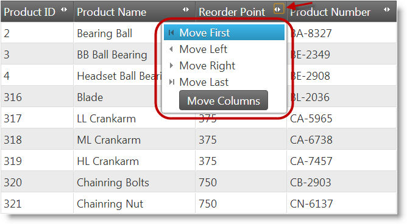
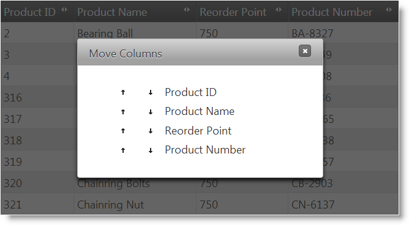
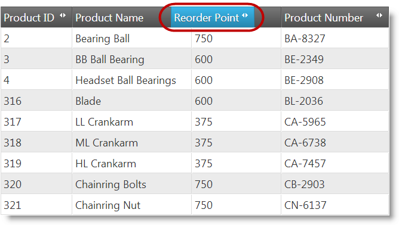
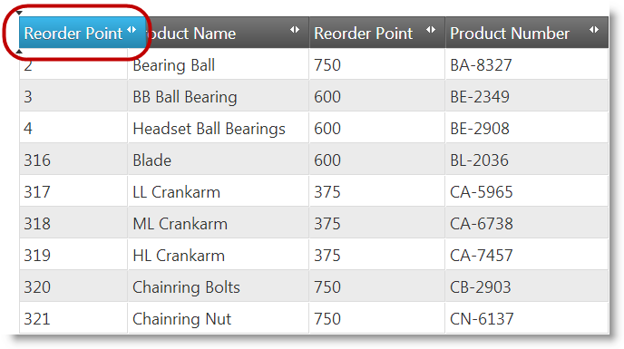

<!--
|metadata|
{
    "fileName": "iggrid-columnmoving-overview",
    "controlName": "igGrid",
    "tags": ["Grids"]
}
|metadata|
-->

# Column Moving Overview (igGrid)

## Topic Overview

### Purpose

This topic explains conceptually the Column Moving feature of the `igGrid`™ and the functionalities this feature provides.

### Required background

The following topics are prerequisites to understanding this topic:

- [igGrid Overview](igGrid-Overview.html): This topic explains how to add the `igGrid` to a web page.

- [igGrid/igDataSource Architecture Overview](igGrid-igDataSource-Architecture-Overview.html): This topic explains the inner workings of the `igGrid` and how it interacts with the `igDataSource` to enable binding to different data sources.

- [igGrid Features](igGrid-Features-Landing-Page.html): This is a group of topics explaining all `igGrid` features.

### In this topic

This topic contains the following sections:

-   [**Introduction**](#introduction)
    -   [igGrid Column moving summary](#summary)
    -   [Column Moving type](#type)
    -   [Moving of grouped columns](#grouped-columns)
-   [**User Interactions and Usability**](#user-interactions)
    -   [User interactions summary table](#user-interactions-summary-table)
    -   [Moving columns by drag-and-drop](#drag-drop)
    -   [Moving columns through the Column Moving drop-down menu](#drop-down-menu)
    -   [Moving columns through the Column Moving dialog](#column-moving-dialog)
    -   [Touch Support](#touch-support)
    -   [Column Moving mode](#mode)
-   [**Configuring Column Moving**](#configuring)
    -   [Column Moving default configuration](#default-configuration)
-   [**Keyboard Interactions**](#keyboard-interaction)   
-   [**Related Content**](#related-content)
    -   [Topics](#topics)
    -   [Samples](#samples)

##  Introduction

###  *igGrid* Column moving summary

Column Moving is a feature of the `igGrid` that enables changing the position of a column in the grid and, in effect, reordering of the grid’s columns. This can be performed either by the user from the grid interface or programmatically through the API of the Column Moving feature. The user can move columns by either dragging them or through selecting the desire column position from a special [column moving interface](#drop-down-menu) (invoked with a button in the column header). Draging is not supported on touch-enabled devices.

Only one column can be moved at a time. For details on how to move columns from the `igGrid` interface, see [User Interactions and Usability](#user-interactions). For information on how to move columns in code, refer to the [Moving Columns Programmatically](igGrid-ColumnMoving-MovingColumnsProgrammatically.html) topic.

Column moving can be performed on individual columns or on groups of columns. Column Moving is rendered in the [Feature Chooser](igGrid-Feature-Chooser.html) and is compatible with all other `igGrid` features including [Multi-Column Headers](igGrid-MultiColumnHeaders-LandingPage.html).

The Column Moving feature re-renders the data in the grid only. It does not alter the data source in any way.

Column Moving is enabled by adding a new feature object to the `features` array of the `igGrid` and setting the `name` property of that feature object to *ColumnMoving*. When enabled, column moving is allowed for all columns unless explicitly specified otherwise. For details, refer to the [Enabling Column Moving](igGrid-ColumnMoving-Enabling.html) topic.

###  Column Moving type

The type of the Column Moving defines how columns are moved in the Document Object Model (DOM). The types are:

-   DOM Manipulation – the column is moved by detaching the column DOM and then re-attaching it back in the DOM tree
-   Grid Re-Rendering – the column is moved by destroying the grid first and then re-creating it with the column in the destination position.

By default, column moving is performed through DOM Manipulation. In some browsers, however, re-creating the grid is faster than detaching and attaching nodes so you might want to explicitly set the type to Grid Re-Rendering.

> **Note:** In general, column moving in Internet Explorer® is faster with grid re-rendering, while other browsers perform better with DOM Manipulation. Results may vary depending on the features enabled in the grid and the amount of data rendered. In addition to that, the browser requirements of your application may have an impact on the choice of using one type over another.

The Column Moving type is configured through its type property. For details, refer to the [Configuring Column Moving](igGrid-ColumnMoving-Configuring.html) topic.

###  Moving of grouped columns

Column Moving can be used in combination with the Multi-Column Headers feature. More precisely:

-   Users can move column groups in the same manner as individual columns, but a column in a group can be moved only within the same level of column hierarchy.
-   The column moving indicators are rendered for every header cell (the Table Header (TH) HTML element) so users can move the column group in one click. Column groups are also displayed in the column moving dialog.

##  User Interactions and Usability

Users can move columns with:

-   **Drag-and-drop**
-   Special column moving interface:
    -   A **column moving drop-down** – a drop-down listing the target positions to which to move the column
    -   The **Move Columns dialog** – a dialog window listing all columns of the grid with options to re-arrange them

Drag-and-drop is supported on mouse-enabled devices (laptops, desktop computers) and so is moving columns through drag-and-drop. Moving columns through drag-and-drop has two modes of operation: Immediate and Deferred based on whether the grid continually refreshes as the mouse is being drag or is refreshed only once upon releasing the mouse button. For more information on modes, refer to [Column Moving mode](#mode) section.

The column moving drop-down is supported for all kinds of devices, but is most useful on touch-enabled devices. It is accessed through a button in the column header which opens a drop-down menu with options listing the target positions to which to move the column: First, Left, Right or Last.

The **Move Columns** dialog is supported for all devices. Dialog is accessed by clicking on the **Move Columns** button from the column moving drop-down of each column. The dialog lists all columns of the grid with options to re-arrange them.

###  User interactions summary table

The following table lists the actions with which the user can move columns on either a standard computer or a mobile device. Further details on moving columns on mobile devices are available in the [Touch Support](#touch-support) block.

<table class="table table-bordered">
	<thead>
		<tr>
            <th colspan="2">
Interface
			</th>

            <th>
User Action
			</th>

            <th>
Details
			</th>

            <th>
Supported on touch-enabled devices?
			</th>

            <th>
Configurable?
			</th>
        </tr>
	</thead>
	<tbody>
        

        <tr>
            <td colspan="2">
Mouse
			</td>

            <td>
[Drag-and-drop](#drag-drop)
			</td>

            <td>
The user can drag the column to the desired position.
			</td>

            <td>

			</td>

            <td>
                The drag-and-drop can be configured in one of the following two modes: Immediate or Deferred based on whether the grid continually refreshes as the mouse is being drag or is refreshed only once upon releasing the mouse button

                <ul>
                    <li>
[Configuring Column Moving](igGrid-ColumnMoving-Configuring.html)
					</li>
                </ul>
            </td>
        </tr>

        <tr>
            <td>
Column moving interface
			</td>

            <td>
Drop-down menu
			</td>

            <td>
[Column position selection from a drop-down menu](#drop-down-menu)
			</td>

            <td>
The user changes the column position with the drop-down menu items: Move First, Move Left, Move Right, Move Last.
			</td>

            <td>

			</td>

            <td>
The column moving interface can be either enabled (default) or disabled. When enabled, both the menu and the dialog are available; when disabled, both are unavailable.

                <ul>
                    <li>
[Configuring Column Moving](igGrid-ColumnMoving-Configuring.html)
					</li>
                </ul>
            </td>
        </tr>

        <tr>
            <td>

			</td>

            <td>
Dialog
			</td>

            <td>
[Column position selection from a Column Moving dialog](#column-moving-dialog)
			</td>

            <td>
The user re-arranges the column with options provided in a dialog window. The dialog is accessed from the column moving drop-down menu.
			</td>

            <td>

			</td>

            <td>

			</td>
        </tr>
    </tbody>
</table>

###  Moving columns by drag-and-drop

Moving columns by drag-and-drop is supported only on mouse-enabled devices.

The user moves a column by dragging it by its header and dropping it at the desired target position.

When a column is selected (automatically at mouse hover over the column header), the color of its header changes to indicate the selection. The user then clicks and drags and the selection color of the header is preserved during dragging. How the column is moved as a result of the dragging action depend on which [Column Moving mode](#mode) has been configured.

In Immediate mode, the entire column is moved as soon as its header gets over another column (Looks like columns are being swapped).

In deferred mode, the column is not moved until its header is dropped onto a new location. Instead, column dragging is indicated by a copy of its header is created and the current potential drop position is indicated by a pair of arrowheads.

Columns can be disabled from drag-and-drop on a per-column by column basis. For details, refer to the [Configuring Column Moving](igGrid-ColumnMoving-Configuring.html) topic.

###  Moving columns through the Column Moving drop-down menu

This moving columns option is supported on all kinds of devices, but is especially useful on touch-enabled devices, because drag-and-drop is not supported on them.

The user moves a column by selecting its target position from a drop-down menu.

The menu is accessible through a column-moving button which is available by default in the header of each column. When clicked/touched this button opens a Column Moving drop-down menu. The Column Moving menu has options for moving the column to a particular position in the grid:

-   **First** – the column is moved to the utmost-left position
-   **Left** – the column is moved one position to the left (swapping places with the column on the left)
-   **Right** – the column is moved one position to the right (swapping places with the column on the right)
-   **Last** – the column is moved to the utmost-right position

Each menu item, when clicked performs the operation immediately.

The Column Moving drop-down menu also has a Move Columns button which opens a column moving dialog with the same name (Move Columns). (See the [Moving columns through the Column Moving dialog](#column-moving-dialog) section).

The Column Moving drop-down menu can be enabled/disabled on all-or-none basis meaning that you can enable/disable it for all columns in the grid and not on individual columns. The menu is enabled by default. You disable it by setting the [`addMovingDropdown`](igGrid-ColumnMoving-PropertyReference.html#addMovingDropdown) property to false.

**Related Topics**

-   [Configuring Column Moving](igGrid-ColumnMoving-Configuring.html)
-   [Property Reference](igGrid-ColumnMoving-PropertyReference.html)

###  Moving columns through the Column Moving dialog

The **Move Columns** dialog provides users a convenient way to re-arrange the columns in in the grid. The dialog opens when the user presses the Move Columns button in the column moving drop-down.

The Move Columns dialog is supported on all kinds of devices, but is especially useful on touch-enabled devices, because drag-and-drop is not supported on them. The Move Columns dialog is available only when the column moving drop-down is enabled; it cannot be enabled or called separately from that drop-down.

The Move Columns dialog offers users two alternative ways to move/re-arrange columns:

-   using the

    

    buttons

-   drag-and-drop

The column position changes take place immediately as the user is operating with the dialog. That is the dialog has no **OK** and **Cancel** buttons.

You can configure the dialog’s width, height, and drag animation duration with the [movingDialogWidth](igGrid-ColumnMoving-PropertyReference.html#movingDialogWidth), [movingDialogHeight](igGrid-ColumnMoving-PropertyReference.html#movingDialogHeight), [movingDialogAnimationDuration](igGrid-ColumnMoving-PropertyReference.html#movingDialogAnimationDuration) properties of the Column Moving feature.

**Related Topics**

-   [Configuring Column Moving](igGrid-ColumnMoving-Configuring.html)
-   [Property Reference](igGrid-ColumnMoving-PropertyReference.html)

###  Touch Support

On touch-enabled devices, users can move columns only through the column moving drop-down or Move Columns dialog. They cannot move columns by because drag-and-drop is not supported on these devices.

###  Column Moving mode

The `mode` of the Column Moving feature specifies how the user experiences column moving when dragging the column header. The modes are Immediate and Deffered:

-   Immediate mode – as the user is dragging the column header, the columns swap animatedly thus keping the grid up-to-date with the current position of the header.
-   Deferred mode – dragging does not move the column header but, instead, arrowheads appear to mark the position where the column would be dropped if the user releases the mouse button. The actual moving of the column contents is performed when the column header is dropped on the new location.

The following screenshot demonstrates a column being dragged in Immediate mode. Note how the header of the dragged column has changed its appearace and position. Once the header passes over the Product Name column, the Reorder Point and Product Name columns will swap their positions.

The following screenshot demonstrates a column being dragged in Deferred mode. A copy of the Reorder Point column header has been dragged over the Product ID column, but the Reorder Point column itself has not moved yet from its original position; instead, drop indicators (the two vertical arrowheads) suggest the new position of the column. Once the mouse button is released, the Reorder Point column will move to that new position.

The Column Moving mode is configured from the mode property of the Column Moving feature. The default Column Moving mode is Immediate.

**Related Topics:**

- [Configuring Column Moving](igGrid-ColumnMoving-Configuring.html)

- [Property Reference](igGrid-ColumnMoving-PropertyReference.html)

##  Configuring Column Moving

The following table lists the configurable aspects of `igGrid` Column Moving. Additional details are available after the table.

<table class="table">
	<thead>
		<tr>
            <th>
Configurable aspect
			</th>

            <th>
Details
			</th>

            <th>
Properties
			</th>
        </tr>
	</thead>
	<tbody>
        

        <tr>
            <td>
Mode
			</td>

            <td>
By default, the [Column Moving mode](#mode) is Immediate. You can configure Deferred mode instead.
			</td>

            <td>
                <ul>
                    <li>
[mode](igGrid-ColumnMoving-PropertyReference.html#mode)
					</li>
                </ul>
            </td>
        </tr>

        <tr>
            <td>
Type
			</td>

            <td>
By default, the [Column Moving type](#type) is DOM Manipulation. You can configure the type to be Grid Re-Rendering instead. The type affects the feature performance differently across browsers.
			</td>

            <td>
                <ul>
                    <li>
[moveType](igGrid-ColumnMoving-PropertyReference.html#moveType)
					</li>
                </ul>
            </td>
        </tr>

        <tr>
            <td>
Columns
			</td>

            <td>
You can specify which columns should allow for moving and which shouldn’t.
			</td>

            <td>
                <ul>
                    <li>
[columnSettings](igGrid-ColumnMoving-PropertyReference.html#columnSettings)
					</li>

                    <li>
[columnSettings.columnKey](igGrid-ColumnMoving-PropertyReference.html#columnKey)
					</li>

                    <li>
[columnSettings.allowMoving](igGrid-ColumnMoving-PropertyReference.html#allowMoving)
					</li>
                </ul>
            </td>
        </tr>

        <tr>
            <td>
Interface
			</td>

            <td>
You can enable/disable the column moving interface of the grid.
			</td>

            <td>
                <ul>
                    <li>
[addMovingDropdown](igGrid-ColumnMoving-PropertyReference.html#addMovingDropdown)
					</li>
                </ul>
            </td>
        </tr>
    </tbody>
</table>

###  Column Moving default configuration

By default, Column Moving is configured with DOM Manipulation [type](#type), Immediate [mode](#mode), and with its column moving interface enabled. The following table lists the default settings of the respective properties.

Property | Type | Default Value | Description
---|---|---|---
[mode](igGrid-ColumnMoving-PropertyReference.html#mode) | string | “immediate” | The default [Column Moving mode](#mode) is set to Immediate.
[moveType](igGrid-ColumnMoving-PropertyReference.html#moveType) | string | “dom“ | The default [Column Moving type](#type) is set to DOM Manipulation.
[addMovingDropdown](igGrid-ColumnMoving-PropertyReference.html#addMovingDropdown) | bool | true | The Column Moving interface is visible to the user and operational.

##  Keyboard Interactions

The following keyboard interactions are available.

When focus is on the grid:

-	TAB: Can move focus between the focusable elements of the column moving UI: column moving indicator in the column headers.

When focus is on the column moving indicator:

-	ENTER/SPACE: Opens/Closes the column moving drop-down.
-	UP/DOWN: Allows to navigate in the column moving drop-down items.

When an item is active:

-	ENTER/SPACE: Applies the specified action. If the Move Column button was on focus then the move columns dialog opens.

##  Related Content

###  Topics

The following topics provide additional information related to this topic.

- [Enabling Column Moving](igGrid-ColumnMoving-Enabling.html): This topic explains, with code examples, how to enable the Column Moving feature of the `igGrid`.

- [Configuring Column Moving](igGrid-ColumnMoving-Configuring.html): This topic explains, with code examples, how to configure the Column Moving feature of the `igGrid`.

- [Moving Columns Programmatically](igGrid-ColumnMoving-MovingColumnsProgrammatically.html): This topic explains, with code examples, how to move columns using the column moving API.

- [Property Reference](igGrid-ColumnMoving-PropertyReference.html): This topic provides reference information on some of the properties of the Column Moving feature API of the `igGrid`.

###  Samples

The following sample provides additional information related to this topic.

- [Column Moving](%%SamplesUrl%%/grid/column-management): This sample demonstrates configuring column moving in the `igGrid`.

 

 

