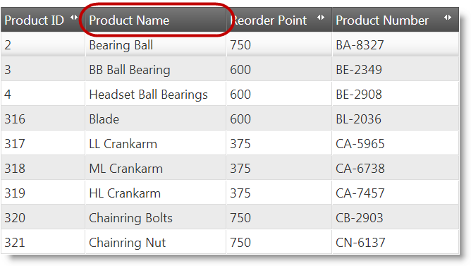
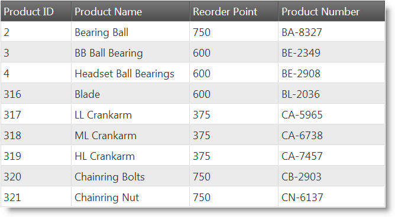

<!--
|metadata|
{
    "fileName": "iggrid-columnmoving-configuring",
    "controlName": "igGrid",
    "tags": ["Grids","How Do I"]
}
|metadata|
-->

# Configuring Column Moving (igGrid)

## Topic Overview

### Purpose

This topic explains, with code examples, how to configure the Column Moving feature of the `igGrid`™.

### Required background

The following topics are prerequisites to understanding this topic:

- [Column Moving Overview](igGrid-ColumnMoving-Overview.html): This topic explains conceptually the Column Moving feature of the `igGrid` and the functionalities this feature provides.

- [Enabling Column Moving](igGrid-ColumnMoving-Enabling.html): This topic explains, with code examples, how to enable the Column Moving feature of the `igGrid`.


### In this topic

This topic contains the following sections:

-   [**Column Moving Configuration Summary**](#summary)
-   [**Configuring the Column Moving Mode**](#mode)
    -   [Property settings](#mode-property-settings)
    -   [Example](#mode-example)
-   [**Configuring the Column Moving Type**](#type)
    -   [Property settings](#type-property-settings)
    -   [Example](#type-example)
-   [**Disabling Column Moving for a Column**](#disable)
    -   [Overview](#disable-overview)
    -   [Property settings](#disable-property-settings)
    -   [Disabling Column Moving for a column in JavaScript](#disable-js)
    -   [Disabling Column Moving for a column in MVC](#disable-mvc)
    -   [Example](#disable-example)
-   [**Disabling the Column Moving Interface**](#disable-interface)
    -   [Overview](#disable-interface-overview)
    -   [Property settings](#disable-interface-property-settings)
    -   [Example](#disable-interface-example)
-   [**Related Content**](#related-content)
    -   [Topics](#topics)
    -   [Samples](#samples)


## <a id="summary"></a> Column Moving Configuration Summary

The following table lists the configurable aspects of `igGrid` Column Moving. Additional details are available after the table.
<table class="table table-bordered">
	<thead>
		<tr>
            <th colspan="2">
Configurable aspect
			</th>

            <th>
Details
			</th>

            <th>
Properties
			</th>
        </tr>
	</thead>
	<tbody>


        <tr>
            <td colspan="2">
[Mode](#mode)
			</td>

            <td>
By default, the [Column Moving mode](igGrid-ColumnMoving-Overview.html#mode) is Immediate. You can configure Deferred mode instead.
			</td>

            <td>
                <ul>
                    <li>
[mode](igGrid-ColumnMoving-PropertyReference.html#mode)
					</li>
                </ul>
            </td>
        </tr>

        <tr>
            <td colspan="2">
[Type](igGrid-ColumnMoving-Configuring.html#type)
			</td>

            <td>
By default, the [Column Moving type](igGrid-ColumnMoving-Overview.html#type) is DOM Manipulation. You can configure the type to be Grid Re-Rendering instead.

                The type affects the feature performance differently across browsers.
			</td>

            <td>
                <ul>
                    <li>
[moveType](igGrid-ColumnMoving-PropertyReference.html#moveType)
					</li>
                </ul>
            </td>
        </tr>

        <tr>
            <td colspan="2">
[Columns](igGrid-ColumnMoving-Configuring.html#disable)
			</td>

            <td>
You can specify which columns should allow moving and which shouldn’t.
			</td>

            <td>
                <ul>
                    <li>
[columnSettings](igGrid-ColumnMoving-PropertyReference.html#columnSettings)
					</li>

                    <li>
[columnSettings.columnKey](igGrid-ColumnMoving-PropertyReference.html#columnKey)
					</li>

                    <li>
[columnSettings.allowMoving](igGrid-ColumnMoving-PropertyReference.html#allowMoving)
					</li>
                </ul>
            </td>
        </tr>

        <tr>
            <td>
[Interface](igGrid-ColumnMoving-Configuring.html#disable-interface)
			</td>

            <td>
Enable/Disable
			</td>

            <td>
You can enable/disable the column moving interface of the grid.
			</td>

            <td>
                <ul>
                    <li>
[addMovingDropdown](igGrid-ColumnMoving-PropertyReference.html#addMovingDropdown)
					</li>
                </ul>
            </td>
        </tr>

        <tr>
            <td>

			</td>

            <td>
Move Columns dialog look-and-feel
			</td>

            <td>
You can configure the dialog’s width, height, and drag animation duration.
			</td>

            <td>
                <ul>
                    <li>
[movingDialogWidth](igGrid-ColumnMoving-PropertyReference.html#movingDialogWidth)
					</li>

                    <li>
[movingDialogHeight](igGrid-ColumnMoving-PropertyReference.html#movingDialogHeight)
					</li>

                    <li>
[movingDialogAnimationDuration](igGrid-ColumnMoving-PropertyReference.html#movingDialogAnimationDuration)
					</li>
                </ul>
            </td>
        </tr>
    </tbody>
</table>


## <a id="mode"></a> Configuring the Column Moving Mode

By default, the [Column Moving mode](igGrid-ColumnMoving-Overview.html#mode) is Immediate. You can configure Deferred mode instead.

The mode of Column Moving is managed by the [`mode`](igGrid-ColumnMoving-PropertyReference.html#mode) property of the Column Moving feature.

### <a id="mode-property-settings"></a> Property settings

The following table maps the desired configuration to property settings.

In order to: | Use this property: | And set it to:
---|---|---
Configure Deferred mode | [mode](igGrid-ColumnMoving-PropertyReference.html#mode) | ”deferred”
Configure Immediate mode | [mode](igGrid-ColumnMoving-PropertyReference.html#mode) | “immediate”


### <a id="mode-example"></a> Example

The following code demonstrates how to set the Column Moving mode to Deferred.

**In JavaScript:**

```js
$("#grid").igGrid({
    dataSource: adventureWorks,
    autoGenerateColumns: true,
    features: [
        {
            name: "ColumnMoving",
            mode: "deferred"
        }
    ]
});
```

**In Razor:**

```csharp
@(Html.Infragistics().Grid(Model)
.AutoGenerateColumns(true)
.ID("grid1")
.Features(f => f.ColumnMoving().Mode(MovingMode.Deferred))
.DataBind()
.Render())
```


## <a id="type"></a> Configuring the Column Moving Type

By default, the [Column Moving type](igGrid-ColumnMoving-Overview.html#type) is DOM Manipulation. You can configure the type to be Grid Re-Rendering instead. The type affects the feature performance differently across browsers.

The type of Column Moving is managed by the [`moveType`](igGrid-ColumnMoving-PropertyReference.html#moveType) property of the Column Moving feature. (For details, on the Column Moving [type](igGrid-ColumnMoving-Overview.html#type), refer to the [Column Moving Overview](igGrid-ColumnMoving-Overview.html) topic.)

### <a id="type-property-settings"></a> Property settings

The following table maps the desired configuration to property settings.

In order to: | Use this property: | And set it to:
---|---|---
Configure Grid Re-Rendering type | [moveType](igGrid-ColumnMoving-PropertyReference.html#moveType) | "render"
Configure DOM Manipulation type | [moveType](igGrid-ColumnMoving-PropertyReference.html#moveType) | “dom”


### <a id="type-example"></a> Example

The following code demonstrates setting the Column Moving type to Grid Re-Rendering.

**In JavaScript:**

```js
$("#grid").igGrid({
    dataSource: adventureWorks,
    autoGenerateColumns: true,
    features: [
        {
            name: "ColumnMoving",
            moveType: "render"
        }
    ]
});
```

**In Razor:**

```csharp
@(Html.Infragistics().Grid(Model)
.AutoGenerateColumns(true)
.ID("grid1")
.Features(f => f.ColumnMoving().MoveType(MovingType.Render))
.DataBind()
.Render())
```


## <a id="disable"></a> Disabling Column Moving for a Column

### <a id="disable-overview"></a> Overview

You can specify which columns the user should be allowed to move and which shouldn’t. By default, Column Moving is enabled for all columns in the grid. Disabling column moving is done on individual columns.

To disable moving for a column, you need to specify the column (through a column identificator which is either the column key or the column index) and set the [`allowMoving`](igGrid-ColumnMoving-PropertyReference.html#allowMoving) property to false:

-   In JavaScript – set the `columnSettings` property of the feature to an array the objects of which consist of the column identificator and the setting of the [`allowMoving`](igGrid-ColumnMoving-PropertyReference.html#allowMoving) property for that column. For details, see the [Disabling Column Moving for a column in JavaScript](#disable-js) block.

-   In ASP.NET MVC – when configuring the grid in the View with the chaining method, use the feature’s `ColumnSettings` method. For details, see the [Disabling Column Moving for a column in MVC](#disable-mvc) block.

When column is disabled from moving, the Column Moving menu button for that column is hidden.

### <a id="disable-property-settings"></a> Property settings

The following table lists the properties and their settings that disable column moving.

In order to: | Use these properties: | And set it to:
------------ | -------------------- | ---------------
Disable Column Moving for a column | either [`columnSettings.columnKey`](igGrid-ColumnMoving-PropertyReference.html#columnKey) or [`columnSettings.columnIndex`](igGrid-ColumnMoving-PropertyReference.html#columnIndex) | respectively, either <br /> **the key of the column** <br /> or  <br /> **the index number of the column**
 | [columnSettings.allowMoving](igGrid-ColumnMoving-PropertyReference.html#allowMoving) | false


### <a id="disable-js"></a> Disabling Column Moving for a column in JavaScript

To disable column moving for a column in JavaScript, set the `columnSettings` property of the feature to an array the objects of which consist of the column identificator and the setting of the [`allowMoving`](igGrid-ColumnMoving-PropertyReference.html#allowMoving) property for that column.

Use the Column Moving feature `columnSettings` property to disable one or more columns from moving. columnSettings is an array, so it can hold and arbitrary number of column configuration objects. Each column configuration object consists of `columnKey` or `columnIndex` and `allowMoving` properties. `columnKey` and `columnIndex` properties indicate the column to configure. `allowMoving` property when set to true enables moving of the column (this is the default behavior, so you won’t need to set `allowMoving` to true).

Setting `allowMoving` to false disables moving of the column. Use `columnKey` property when you want to reference the grid columns by its key. Use `columnIndex` property when you want to reference the initial grid column configuration by index.

### <a id="disable-mvc"></a> Disabling Column Moving for a column in MVC

To disable column moving for a column in ASP.NET MVC, when configuring the grid in the View with the chaining method, use the `ColumnSettings` method.

The `ColumnSettings` method accepts lambda expression representing the column settings. In the lambda expression, call the `ColumnSetting` method which returns a `ColumnMovingSettingWrapper` object. This object contains the methods to configure individual column: `ColumnKey`, `ColumnIndex` and `AllowMoving`. Those methods mimic the functionality of their counterparts in JavaScript. For an example of a lambda expression, see the [Example](#disable-example) block.

### <a id="disable-example"></a> Example

The code below demonstrates disabling Column Moving for the Product Name column (with column key “Name”) in code as a result of the following settings:

Property | Value
---- | ---
[columnSettings.columnKey](igGrid-ColumnMoving-PropertyReference.html#columnKey) | "Name"
[columnSettings.allowMoving](igGrid-ColumnMoving-PropertyReference.html#allowMoving) | false




**In JavaScript:**

```js
$("#grid").igGrid({
    dataSource: adventureWorks,
    autoGenerateColumns: true,
    features: [
        {
            name: "ColumnMoving",
            columnSettings: [
                {
                    columnKey: "Name",
                    allowMoving: false
                }
            ]
        }
    ]});
```

**In Razor:**

```csharp
@(Html.Infragistics().Grid(Model)
.AutoGenerateColumns(true)
.ID("grid1")
.Features(f =>
    f.ColumnMoving()
    .MoveType(MovingType.Render)
    .ColumnSettings(cs => cs.ColumnSetting().ColumnKey("Name").AllowMoving(false)))
.DataBind()
.Render())
```


## <a id="disable-interface"></a> Disabling the Column Moving Interface

### <a id="disable-interface-overview"></a> Overview

You can enable/disable [the column moving interface](igGrid-ColumnMoving-Overview.html#drop-down-menu) of the grid. Disabling the Column Moving interface hides it from the user.

By default, when the Column Moving feature is enabled, the column moving interface (the drop-down and the button that activates it), is available too. This is to support column moving for touch devices because the user cannot move columns in them by drag-and-drop. You can however choose to disable this interface (In such case, the button opening the drop-down is hidden). Disabling the Column Moving interface affects all columns in the grid.

The column moving interface is managed by the [`addMovingDropdown`](igGrid-ColumnMoving-PropertyReference.html#addMovingDropdown) property of the feature.

> **Note:** The Column Moving interface is disabled also on columns for which Column Moving is disabled. (For details, see [Disabling Column Moving for a Column](#disable).)

### <a id="disable-interface-property-settings"></a> Property settings

The following table maps the desired configuration to property settings.

In order to: | Use these properties: | And set it to:
------------ | -------------------- | ---------------
Disable column moving interface | [addMovingDropdown](igGrid-ColumnMoving-PropertyReference.html#addMovingDropdown) | false


### <a id="disable-interface-example"></a> Example

The code samples below demonstrate how to disable the column moving drop-down for column moving:

Property | Value
------- | --------
[addMovingDropdown](igGrid-ColumnMoving-PropertyReference.html#addMovingDropdown) | false




The following code snippets demonstrate how to set column moving using the `addMovingDropdown` property in code:

**In JavaScript:**

```js
$("#grid").igGrid({
    dataSource: adventureWorks,
    autoGenerateColumns: true,
    features: [
        {
            name: "ColumnMoving",
            addMovingDropdown: false
        }
    ]
});
```

**In Razor:**

```csharp
@(Html.Infragistics().Grid(Model)
.AutoGenerateColumns(true)
.ID("grid1")
.Features(f => f.ColumnMoving().AddMovingDropdown(false))
.DataBind()
.Render())
```


## <a id="related-content"></a> Related Content

### <a id="topics"></a> Topics

The following topics provide additional information related to this topic.

- [Moving Columns Programmatically](igGrid-ColumnMoving-MovingColumnsProgrammatically.html): This topic explains, with code examples, how to move columns using the column moving API.

- [Property Reference](igGrid-ColumnMoving-PropertyReference.html): This topic provides reference information on some of the properties of the Column Moving feature API of the `igGrid`.

### <a id="samples"></a> Samples

The following samples provide additional information related to this topic.

- [Column Moving](%%SamplesUrl%%/grid/column-moving): This sample demonstrates configuring column moving in the `igGrid`.


