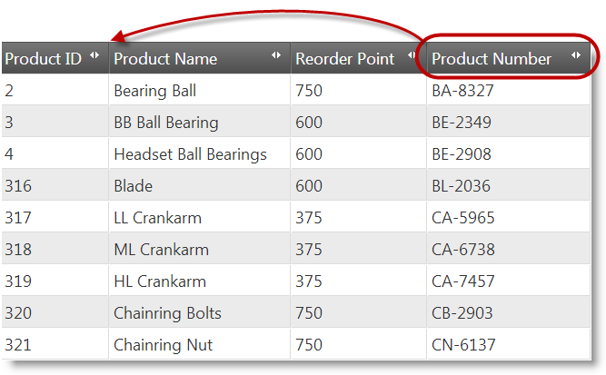
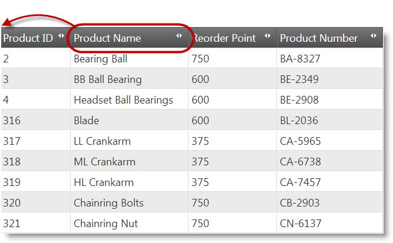
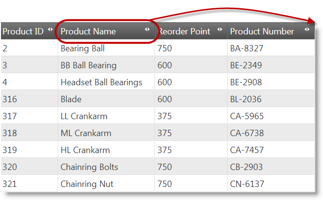

<!--
|metadata|
{
    "fileName": "iggrid-columnmoving-movingcolumnsprogrammatically",
    "controlName": "igGrid",
    "tags": ["API","Grids"]
}
|metadata|
-->

# Moving Columns Programmatically (igGrid)

## Topic Overview

### Purpose

This topic explains how to move columns in code using the Column Moving feature API.

### Required background

The following topics are prerequisites to understanding this topic:

- [Column Moving Overview](igGrid-ColumnMoving-Overview.html): This topic explains conceptually the Column Moving feature of the `igGrid` and the functionalities this feature provides.


### In this topic

This topic contains the following sections:

-   [**Introduction**](#introduction)
-   [**moveColumn Method**](#moveColumn)
    -   [moveColumn method summary](#moveColumn-summary)
    -   [moveColumn method parameters](#moveColumn-parameters)
    -   [Using the moveColumn method with multi-column headers](#moveColumn-multi-column-headers)
-   [**Code Examples Overview**](#examples-overview)
-   [**Code Example: Moving a Column By Re-Rendering the Grid**](#example-render)
    -   [Description](#example-render-description)
    -   [Code Example 1](#example-render-1)
    -   [Code Example 2](#example-render-2)
-   [**Code Example: Moving a Column By DOM Manipulation**](#example-dom)
    -   [Description](#example-dom-description)
    -   [Code Example 1](#example-dom-1)
    -   [Code Example 2](#example-dom-2)
-   [**Code Example: Moving a Column to the Utmost-Left Position**](#example-left)
    -   [Description](#example-left-description)
    -   [Code Example 1](#example-left-1)
    -   [Code Example 2](#example-left-2)
-   [**Code Example: Moving a Column to the Utmost-Right Position**](#example-right)
    -   [Description](#example-right-description)
    -   [Code Example 1](#example-right-1)
    -   [Code Example 2](#example-right-2)
-   [**Related Content**](#related-content)
    -   [Topics](#topics)
    -   [Samples](#samples)


## <a id="introduction"></a> Introduction

Column moving can be done programmatically through the API of the `igGrid`’s Column Moving feature. You do not need to have the Column Moving feature enabled in order to move columns programmatically.

The Column Moving API consists of the following public methods:

-   [`moveColumn`](%%jQueryApiUrl%%/ui.iggridcolumnmoving#methods:moveColumn) – moves the columns in the grid to a specified position defined as relative to another column in the grid
-   [`destroy`](%%jQueryApiUrl%%/ui.iggridcolumnmoving#methods:destroy) – destroys the feature


## <a id="moveColumn"></a> moveColumn Method

### <a id="moveColumn-summary"></a> moveColumn method summary

The `moveColumn` method works by specifying the source and the target columns, as well as the relative positioning to the target column and the algorithm to use to move the column.

For specifying the new position of the column that is being moved, two approaches are possible:

-   specify the column preceding that position and indicate that the column being moved should be placed after it
-   specify the column following that position and indicate that the column being moved should be placed before it

Because there is no direct way to indicate the first and the last column position in the grid, when you want to move the column to that position, you need to use the current utmost-left or utmost-right column of the grid as a `targetColumn` parameter and also set the `insertAfterTargetColumn` parameter to false when moving to the utmost-left position or true when moving to the utmost-right position.

The signature of the `moveColumn` method is:

```
moveColumn(sourceColumn, targetColumn, insertAfterTargetColumn, useDOM)
```

Example:

```
$(“#grid1”).igGrid(“moveColumn”, “Name”, “ProductID”, false);
```

The `moveColumn` method of Column Moving feature of the `igGrid` uses the `igGrid`’s own `moveColumn` public method. This is why the Column Moving API can be used without enabling Column Moving feature.

### <a id="moveColumn-parameters"></a> moveColumn method parameters

The following table lists the parameters of the `moveColumn` method of the Column Moving features together with their recommended and default values.

Parameter | Type | Description | Default Value | Required
---|---|---|---|---
sourceColumn | number/ string | The column to be moved identified by its key or index. | null | 
targetColumn | number/ string | The reference column next to which the column being moved is going to be placed. The reference column is identified by its key or index. This parameter, together with insertAfterTargetColumn, identifies the destination position for the column being moved. | null | 
insertAfterTargetColumn | bool | When true, the column being moved will be inserted before (on the left of) the reference column; otherwise the column will be inserted after (on the right of) it. This parameter, together with targetColumn, identifies the destination position for the column being moved. | true | 
inDOM | bool | Specifies the [Column Moving type](igGrid-ColumnMoving-Overview.html#type) of the column moving operation: <br /> **true** – the column will be moved using DOM Manipulation (detaching the column DOM and then re-attaching it back in the DOM tree) <br /> **false** – the column will be moved using Grid Re-Rendering (destroying the grid first and then re-creating it) | true | 


### <a id="moveColumn-multi-column-headers"></a> Using the moveColumn method with multi-column headers

In the context of multi-column headers, `sourceColumn` cannot be an index. The `targetColumn` parameter can be an index, but it must be an index in the context of that particular group.

When using the moveColumn method with multi-column headers, it is recommended to set column keys for the group columns manually. This is because the auto-generated column keys (which the Multi-Column Headers feature assigns to the groups by default) are for internal use only.


## <a id="examples-overview"></a> Code Examples Overview

The following table lists the code examples included in this topic.

Example | Description
---|---
[Moving a Column By Re-Rendering the Grid](#example-render) | This code example demonstrates moving a column using [Grid Re-Rendering](igGrid-ColumnMoving-Overview.html#type).
[Moving a Column By DOM Manipulation](#example-dom) | This code example demonstrates moving a column using [DOM Manipulation](igGrid-ColumnMoving-Overview.html#type).
[Moving a Column to the Utmost-Left Position](#example-left) | This code example demonstrates how to move a column so that it becomes the first column the grid.
[Moving a Column to the Utmost-Right Position](#example-right) | This code example demonstrates how to move a column so that it becomes the last column the grid.


## <a id="example-render"></a> Code Example: Moving a Column By Re-Rendering the Grid

### <a id="example-render-description"></a> Description

The code in this example moves the Product Number column between the Product ID and Product Name column. The actual moving is performed by [Grid Re-Rendering](igGrid-ColumnMoving-Overview.html#type).



The following code snippets demonstrate the two possible approaches for specifying the new position of the column that is being moved.

### <a id="example-render-1"></a> Code Example 1

The adopted approach in this code snippet is to define the new position of the Product Number column relative to the column following that position, Product Name. This is done using the keys for these columns, `ProductNumber` and `Name`, respectively, and setting the `insertAfterTargetColumn` parameter to *false*.

**In JavaScript:**

```js
$("#grid1").igGridColumnMoving("moveColumn", "ProductNumber", "Name", false, false);
```

### <a id="example-render-2"></a> Code Example 2

The adopted approach in this code snippet is to define the new position of the Product Number column relative to the column preceding that position, Product ID. This is done using the keys for these columns, `ProductNumber` and `ProductID`, respectively, and setting the `insertAfterTargetColumn` parameter to *true*.

**In JavaScript:**

```js
$("#grid1").igGridColumnMoving("moveColumn", "ProductNumber", "ProductID", true, false);
```


## <a id="example-dom"></a> Code Example: Moving a Column By DOM Manipulation

### <a id="example-dom-description"></a> Description

The code in this example moves the Product Number column between the Product ID and Product Name column. The actual moving is performed by [DOM Manipulation](igGrid-ColumnMoving-Overview.html#type).


The following code snippets demonstrate the two possible approaches for specifying the new position of the column that is being moved.

### <a id="example-dom-1"></a> Code Example 1

The adopted approach in this code snippet is to define the new position of the Product Number column relative to the column following that position, Product Name. This is done using the keys for these columns, `ProductNumber` and `Name`, respectively, and setting the `insertAfterTargetColumn` parameter to *false*.

**In JavaScript:**

```js
$("#grid1").igGridColumnMoving("moveColumn", "ProductNumber", "Name", false, true);
```

### <a id="example-dom-2"></a> Code Example 2

The adopted approach in this code snippet is to define the new position of the Product Number column relative to the column preceding that position, Product ID. This is done using the keys for these columns, `ProductNumber` and `ProductID`, respectively, and setting the `insertAfterTargetColumn` parameter to *true*.

**In JavaScript:**

```js
$("#grid1").igGridColumnMoving("moveColumn", "ProductNumber", "ProductID", true, true);
```

Because `insertAfterTargetColumn` and `inDOM` parameters default to true and are not required, they can be omitted:

**In JavaScript:**

```js
$("#grid1").igGridColumnMoving("moveColumn", "ProductNumber", "ProductID");
```


## <a id="example-left"></a> Code Example: Moving a Column to the Utmost-Left Position

### <a id="example-left-description"></a> Description

In this example, the Product Name column is moved to the utmost-left (first) position in the grid.



Since there is no direct API method or parameter for moving the column to the first position of the grid, this is achieved with the `moveColumn` method by specifying the target position as relative to the column that currently occupies that first position (Product ID) and indicating preceding of that column. This is done using the keys for these columns, `Name` and `ProductID`, respectively, and setting the `insertAfterTargetColumn` parameter to *false*.

The [move type](igGrid-ColumnMoving-Overview.html#type) in the example is DOM Manipulation (`inDOM` is *true*).

### <a id="example-left-1"></a> Code Example 1

The following is the `moveColumn` method implemented with all its parameters.

**In JavaScript:**

```js
$("#grid1").igGridColumnMoving("moveColumn", "Name", "ProductID", false, true);
```

### <a id="example-left-2"></a> Code Example 2

The following is the `moveColumn` method implemented with the optional parameters omitted. (The `inDOM` parameter defaults to *true* so it can be omitted.)

**In JavaScript:**

```js
$("#grid1").igGridColumnMoving("moveColumn", "Name", "ProductID", false);
```


## <a id="example-right"></a> Code Example: Moving a Column to the Utmost-Right Position

### <a id="example-right-description"></a> Description

In this example, the Product Name column is moved to the utmost-right (last) position in the grid.



Since there is no direct API method or parameter for moving the column to the last position of the grid, this is achieved with the `moveColumn` method by specifying the target position as relative to the column that currently occupies that last position (Product Number) and indicating behind of that column. This is done using the keys for these columns, `Name` and `ProductNumber`, respectively, and setting the `insertAfterTargetColumn` parameter to *true*.

The [move type](igGrid-ColumnMoving-Overview.html#type) in the example is DOM Manipulation (`inDOM` is *true*).

### <a id="example-right-1"></a> Code Example 1

The following is the `moveColumn` method implemented with all its parameters.

**In JavaScript:**

```js
$("#grid1").igGridColumnMoving("moveColumn", "Name", "ProductNumber", true, true);
```

### <a id="example-right-2"></a> Code Example 2

The following is the `moveColumn` method implemented with the optional parameters omitted. (The  `insertAfterTargetColumn` and `inDOM` parameters default to *true* so they can be omitted.)

**In JavaScript:**

```js
$("#grid1").igGridColumnMoving("moveColumn", "Name", "ProductNumber");
```


## <a id="related-content"></a> Related Content

### <a id="topics"></a> Topics

The following topics provide additional information related to this topic.

- [Enabling Column Moving](igGrid-ColumnMoving-Enabling.html): This topic explains, with code examples, how to enable the Column Moving feature of the `igGrid`.

- [Configuring Column Moving](igGrid-ColumnMoving-Configuring.html): This topic explains, with code examples, how to configure the Column Moving feature of the `igGrid`.

- [Property Reference](igGrid-ColumnMoving-PropertyReference.html): This topic provides reference information on some of the properties of the Column Moving feature API of the `igGrid`.


### <a id="samples"></a> Samples

The following samples provide additional information related to this topic.

- [Column Moving](%%SamplesUrl%%/grid/column-management): This sample demonstrates configuring column moving in the `igGrid`.


 

 


