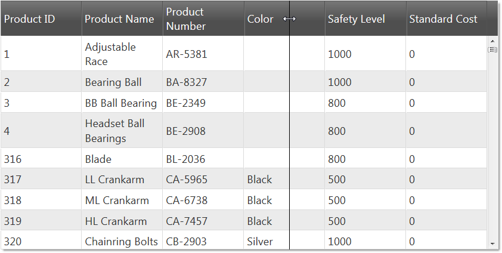

<!--
|metadata|
{
    "fileName": "iggrid-column-resizing",
    "controlName": "igGrid",
    "tags": ["Resizing"]
}
|metadata|
-->

# Column Resizing (igGrid)

## Topic Overview

### Purpose

This topic explains the column resizing functionality of the `igGrid`™ control.

### In this topic

This topic contains the following sections:

-   [**Overview**](#overview)
    -   [Resizing Features](#resizing-features)
-   [**Enabling Resizing**](#enabling-resizing)
    -   [Requirements](#requirements)
    -   [Examples](#examples)
-   [**Client-Side Events**](#client-side-events)
-   [**Column Resizing Properties**](#column-resizing-properties)
-   [**Related Topics**](#topics)

## <a id="overview"></a> Overview

The column resizing functionality of the `igGrid` control allows the user to change the width of the grid’s columns. Resizing feature can be enabled on two levels – for the entire grid (default) and per column. You can however programmatically disable/enable resizing for individual columns.

> **Note:** Column resizing is not supported on touch devices.

### <a id="resizing-features"></a> Resizing Features 

-   Enabling/disabling column resizing. This feature is managed through the [`allowResizing`](%%jQueryApiUrl%%/ui.igGridResizing#options:columnSettings.allowResizing) property.

-   Enabling resizing on double click – when enabled, resizes the column to the width of the widest cell that is currently visible. This feature is managed through the [`allowDoubleClickToResize`](%%jQueryApiUrl%%/ui.igGridResizing#options:allowDoubleClickToResize) option.

-   Maximum/minimum column width – the minimum/maximum width to which the user can change the width of a column when performing resizing. This feature is managed through the [`minimumWidth`](%%jQueryApiUrl%%/ui.igGridResizing#options:columnSettings.minimumWidth)/[`maximumWidth`](%%jQueryApiUrl%%/ui.igGridResizing#options:columnSettings.maximumWidth) properties, respectively.

-   Deferred resizing - resizing is deferred until the user finishes resizing or applied immediately. This feature is managed through the [`deferredResizing`](%%jQueryApiUrl%%/ui.igGridResizing#options:deferredResizing.) option.

-   Configurable resizing handle – the width in pixels of the resizing handle on the right of each resizable column header can be customized. This feature is managed through the [`handleTreshold`](%%jQueryApiUrl%%/ui.igGridResizing#options:handleTreshold) option.

-   Column Key – specifies a column which will apply specified column settings. This feature is managed through the [`columnKey`](%%jQueryApiUrl%%/ui.igGridResizing#options:columnSettings.columnKey) option.

-   Column index - specifies a column which will apply specified column settings.This feature is managed through the [`columnIndex`](%%jQueryApiUrl%%/ui.igGridResizing#options:columnSettings.columnIndex) option.

## <a id="enabling-resizing"></a> Enabling Resizing 

Following is a preview of the final result.



### <a id="requirements"></a> Requirements

Listing 1: Required CSS and JavaScript references you need to include in your application

**In HTML:**

```html
<link type="text/css" href="infragistics.theme.css" rel="stylesheet" />
<link type="text/css" href="infragistics.css" rel="stylesheet" />
<script type="text/javascript" src="jquery.min.js"></script>
<script type="text/javascript" src="jquery-ui.min.js"></script>
<script type="text/javascript" src="infragistics.core.js"></script>
<script type="text/javascript" src="infragistics.lob.js"></script>
```

Listing 2: Minimal set of CSS and JavaScript references (not minified and combined) – needed only for resizing

**In HTML:**

```html
<script type="text/javascript" src="infragistics.util.js"></script>
<script type="text/javascript" src="infragistics.dataSource.js"></script>
<script type="text/javascript" src="infragistics.ui.shared.js"></script>
<script type="text/javascript" src="infragistics.ui.grid.framework.js"></script>
<script type="text/javascript" src="infragistics.ui.grid.resizing.js"></script>
```

### <a id="examples"></a> Examples

Listing 3: Example `igGrid` code with column resizing enabled

**In Javascript:**

```js
$("#grid1").igGrid({
    columns: [
        { headerText: "Product ID", key: "ProductID", dataType: "number" },
        { headerText: "Product Name", key: "Name", dataType: "string" },
        { headerText: "ProductNumber", key: "ProductNumber", dataType: "string" }
    ],
dataSource: adventureWorks,
    responseDataKey: 'Records',
    width: "800px",
    height:'400px',
    features: [
        {
            name : 'Resizing',
        }
    ]
});

```
**In ASPX(MVC):**

```csharp
<%= Html.Infragistics().Grid(Model).ID("grid1").PrimaryKey("ProductID").Columns(column =>
	{
	    column.For(x => x.ProductID).HeaderText("Product ID");
	    column.For(x => x.Name).HeaderText("Product Name");
	    column.For(x => x.ProductNumber).HeaderText("Product Number");
	}).Features(features => {
	    features.Resizing();
	}).Height("400").Width("800").DataSourceUrl(Url.Action("ColumnResizingGetData"))
	.DataBind().Render()%>
```

Listing 4: Example grid code for disabling column resizing on a specific column

**In Javascript:**

```js
$("#grid1").igGrid({
    columns: [
        { headerText: "Product ID", key: "ProductID", dataType: "number" },
        { headerText: "Product Name", key: "Name", dataType: "string" },
        { headerText: "ProductNumber", key: "ProductNumber", dataType: "string" }
    ],
	dataSource: adventureWorks,
    responseDataKey: 'Records',
    width: "800px",
    height:'400px',
    features: [
        {
            name : 'Resizing',
            columnSettings: [
                { columnKey: "ProductID", allowResizing: false }
            ],
        }
    ]
});
```

**In C#:**

```csharp
<%=Html.Infragistics().Grid(Model).ID("grid1").PrimaryKey("ProductID")
	.Columns(column =>
	    {
	        column.For(x => x.ProductID).HeaderText("Product ID").Width("100px");
	        column.For(x => x.Name).HeaderText("Product Name").Width("200px");
	        column.For(x => x.ModifiedDate).HeaderText("Modified Date").Width("200px");
	        column.For(x => x.ListPrice).HeaderText("List Price").Width("200px");
	    })
	.Features(features => {
		features.Resizing().AllowDoubleClickToResize(true).DeferredResizing(true)
			.ColumnSettings(s =>
			{
				s.ColumnSetting().ColumnKey("ProductID").AllowResizing(false);
			});
	}).Height("500").DataSourceUrl(Url.Action("ColumnResizingGetData"))
	.DataBind().Render()%>
```

**In ASPX(MVC):**

```csharp
<%= Html.Infragistics().Grid(Model).ID("grid1").PrimaryKey("ProductID").Columns(column =>
    {
        column.For(x => x.ProductID).HeaderText("Product ID");
        column.For(x => x.Name).HeaderText("Product Name");
        column.For(x => x.ProductNumber).HeaderText("Product Number");
    })
	.Features(features => {
		features.Resizing();
	}).Height("400").Width("800").DataSourceUrl(Url.Action("ColumnResizingGetData"))
	.DataBind().Render()%>
```

## <a id="client-side-events"></a> Client-Side Events 

You can bind a handler to Reisizing in two ways, shown in Listing 5 and Listing 6, respectively.

Listing 5: Binding to client-side events from anywhere in your application

**In Javascript:**

```js
    $("#grid1").bind("iggridresizingcolumnresizing", handler);
```

Listing 6: Binding to client-side events by specifying the event name as an option when you initialize the resizing feature (case sensitive)

**In Javascript:**

```js
$("#grid1").igGrid({
    columns: [
        { headerText: "Product ID", key: "ProductID", dataType: "number" },
        { headerText: "Product Name", key: "Name", dataType: "string" },
        { headerText: "Product Number", key: "ProductNumber", dataType: "string" },
    ],
    width: '500px',
    dataSource: products,
    features: [
        {
            name: 'Resizing',
            columnResizing: handler
        }
    ]
});

//Handler code
function handler(event, args) {

}
```

> **Note:**
> The `columnResizing` event is cancelable. In order to cancel a `columnResizing` event, its respective event handler must return false.

The grid column resizing functionality exposes the client-side events detailed in Table 1.

Table 1: Argument object definitions for the Resizing feature

<table class="table">
	<thead>
		<tr>
            <th>
Event Name
			</th>

            <th>
Argument (args) Parameters
			</th>
        </tr>
	</thead>
	<tbody>
        

        <tr>
            <td>
[columnResizing](%%jQueryApiUrl%%/ui.igGridResizing#events:columnResizing)
			</td>

            <td>
columnIndex: Current selected grid column index <br />

columnKey: Current selected grid column key <br />

owner: Reference to the resizing widget object <br />

desiredWidth: The desired width of the current selected column <br />
			</td>
        </tr>

        <tr>
            <td>
[columnResized](%%jQueryApiUrl%%/ui.igGridResizing#events:columnResized)
			</td>

            <td>
columnIndex: Current selected grid column index <br />
            
columnKey: Current selected grid column key <br />
            
owner: Reference to the resizing widget object <br />
            
originalWidth: The original width of the current selected column <br />
            
newWidth: The new width of the current selected column
            </td>
        </tr>
    </tbody>
</table>

## <a id="column-resizing-properties"></a> Column Resizing Properties 
The following table provides further details about the properties that manage the column resizing functionality.

Property Name | Type and Default Value | Description
--------------|------------------------|------------
[allowDoubleClickToResize](%%jQueryApiUrl%%/ui.igGridResizing#options:allowDoubleClickToResize) | Boolean (default: True) | Enables/disables Resize the column to the size of the longest currently visible cell value
[deferredResizing](%%jQueryApiUrl%%/ui.igGridResizing#options:deferredResizing) | Boolean (default: False) | Specifies whether the resizing should be deferred until the user finishes resizing or the resizing should be applied immediately.
[handleTreshold](%%jQueryApiUrl%%/ui.igGridResizing#options:handleTreshold) | Int (default: 5) | The width in pixels of the resizing handle which is position at the right side of each resizeable column header.


## <a id="topics"></a> Related Topics
 
Following are some other topics you may find useful.

-   [igGrid Overview](igGrid-Overview.html)
-   [igGrid Features](igGrid-Features-Landing-Page.html)

 

 

