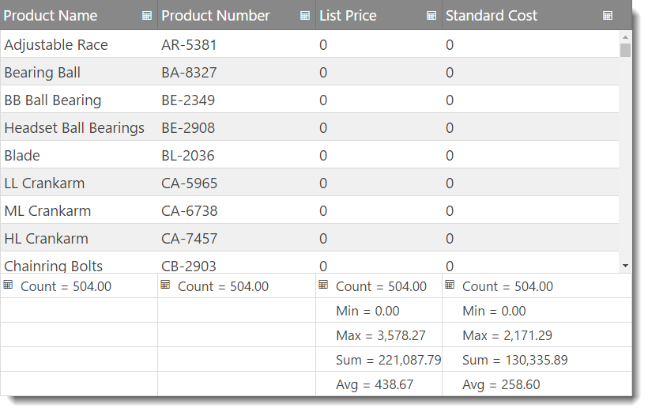

<!--
|metadata|
{
    "fileName": "iggrid-enabling--column-summaries",
    "controlName": "igGrid",
    "tags": ["Getting Started","Grids","Summaries"]
}
|metadata|
-->

# Enabling Column Summaries (igGrid)

## Topic Overview

### Purpose
This demonstrates how to programmatically enable the column summaries widget of `igGrid`™ control.

### In This Topic
This topic contains the following sections:

-   [**Introduction**](#introduction)
-   [**Preview**](#preview)
-   [**Requirements**](#requirements)
    -   [General requirements](#general-requirements)
    -   [Script-requirements](#scrip-requirements)
    -   [Database requirements](#database-requirements)
-   [**Enabling Column Summaries in JQuery**](#enabling-js)
-   [**Enabling Column Summaries in MVC**](#enabling-mvc)
-	[**Keyboard Interactions**](#keyboard-interaction)
-   [**Related Content**](#related-content)
    -   [Topics](#topics)
    -   [Samples](#samples)

## <a id="introduction"></a> Introduction
The column summaries widget allows the `igGrid` to display a summary row for the data in the columns of the grid. There are predefined summary functions, but you can create custom function to calculate custom summaries.

The Column summaries feature of the `igGrid` control by default, so you need to enable it explicitly.

The example below configures an `igGrid` with the summaries feature enabled.

## <a id="preview"></a> Preview
Following is a preview of the final result.



## <a id="requirements"></a> Requirements

### <a id="general-requirements"></a> General requirements 
-   jQuery-specific requirements

    -   An HTML web page with a grid connected to a data source
    -   A table tag in the body of the HTML page to serve as a container for the grid

    **In HTML:**

    ```html
    <table id="grid">
    </table>
    ```

-   MVC-specific requirements
    -   An MVC 2 or MVC 3 project in MS Visual Studio® with a grid connected to a data source
    -   A reference to the Infragistics MVC dll (stores the MVC IG wrappers)

### <a id="scrip-requirements"></a> Script requirements 

-   The required scripts for both jQuery and MVC sample are the same because in the end MVC wrappers just render again jQuery widget. You will need:

    1.  The jQuery library script
    2.  The jQuery UI library
    3.  The IG library script, which is obfuscated code for the controls

The following code sample demonstrates the scripts as added to the header code of the HTML file.

**In HTML:**

```html
<script type="text/javascript" src="jquery.min.js"></script>
<script type="text/javascript" src="jquery-ui.min.js"></script>
<script type="text/javascript" src="infragistics.core.js"></script>
<script type="text/javascript" src="infragistics.lob.js"></script>
```

### <a id="database-requirements"></a> Database requirements 
For the purpose of this example only:

-   MVC – Adventure Works database

## <a id="enabling-js"></a> Enabling Column Summaries in JQuery

1.  Set up the data source.

    The data source used in the following code snipped is for the purpose of this example.

    **In HTML:**

    ```html
    <script type="text/javascript">
    var adventureWorks = [
{ "ProductID": 1, "Name": "Adjustable Race", "ProductNumber": "AR-5381", "StandardCost": 0.0000, "ListPrice": 0.0000 }, 
{ "ProductID": 2, "Name": "Bearing Ball", "ProductNumber": "BA-8327", "StandardCost": 0.0000, "ListPrice": 0.0000 }, 
{ "ProductID": 3, "Name": "BB Ball Bearing", "ProductNumber": "BE-2349", "StandardCost": 0.0000, "ListPrice": 0.0000 },
    ...
    ]

    </script>
    ```

2.  Create an igGrid with summaries feature.

    Inside the `$(document).ready()` event handler, you first create an igGrid with summaries feature configuration.

    **In Javascript:**

    ```js
    $("#grid").igGrid({
        autoGenerateColumns: false,
        dataSource: adventureWorks,
        columns: [
                    { headerText: "Product Name", key: "Name", dataType: "string", width: "40%" },
                    { headerText: "Product Number", key: "ProductNumber", dataType: "string", width: "20%" },
                    { headerText: "List Price", key: "ListPrice", dataType: "number", width: "20%" },
                    { headerText: "Standard Cost", key: "StandardCost", dataType: "number", width: "20%" }
        ],
        features: [
                   {
                     name: 'Summaries'
                   }
              ]
    });
    ```

3.  Save the file.
4.  (Optional) Verify the result.

    To verify the result, open the file. The result should look as shown in the Preview above.
5. Running sample
    <div class="embed-sample">
        [igGrid Summaries](%%SamplesEmbedUrl%%/grid/summaries)
    </div>


## <a id="enabling-mvc"></a> Enabling Column Summaries in MVC

1.  Create an MVC Controller method.

    Create an MVC Controller method to get data from the Model and will call the View.

    **In MVC:**

    ```csharp
    public ActionResult Default()
    {
        var ds = this.DataRepository.GetDataContext().Products.Take(4);
        return View(ds);
    }
    ```

2.  Instantiate the igGrid.

    Instantiate the igGrid with the columnSummaries feature enabled.

    **In ASPX:**

    ```csharp
    <%= Html.Infragistics().Grid(Model)
            .AutoGenerateColumns(true)
            .Features(feature =>{
                feature.Summaries();
                }).DataBind()
            .Render()
    %>
    ```

    **In Razor:**

    ```csharp
    @( Html.Infragistics().Grid(Model)
            .AutoGenerateColumns(true)
            .Features(feature =>{
                feature.Summaries();
                }).DataBind()
            .Render()
        )
    ```

3.  Save the file.
4.  (Optional) Verify the result.

    To verify the result, run the MVC project and open the file. The result should look as shown in the Preview above.

## <a id="keyboard-interaction"></a> Keyboard Interactions

The following keyboard interactions are available.
When focus is on the grid:

-	TAB: Can move focus between the focusable elements of the summaries UI:  summaries buttons and drop-downs.

When focus is on the show/hide summaries button in the header of a column:

-	ENTER: Hides/Shows the summaries at the bottom of the grid.

When focus is on the summaries buttons in the footer of a column:

-	ENTER/SPACE: Opens the summaries drop-down.

When focus is on the summaries drop-down:

-	TAB: Moves focus between the available summary items.
-	ENTER/SPACE: selects/deselects the currently active summary item from the list. If focus is on the OK or Cancel buttons then the drop-down will close and the changes will be applies or discarded depending on the button.
-	ESCAPE: Discards any changes made in the drop-down and closes it.


## <a id="related-content"></a> Related Content

### <a id="topics"></a> Topics

Following are some other topics you may find useful.

- [Configuring Column Summaries (igGrid)](igGrid-Configuring-Column-Summaries.html)

- [Using JavaScript Resources in Ignite UI](Deployment-Guide-JavaScript-Resources.html)

- [Styling and Theming in Ignite UI](Deployment-Guide-Styling-and-Theming.html)

### <a id="samples"></a> Samples

-   [Column Summaries](%%SamplesUrl%%/grid/summaries)
-   [Summaries (Remote Calculation)](%%SamplesUrl%%/grid/summaries-remote)
-   [Custom Summaries](%%SamplesUrl%%/grid/summaries-custom)

 

 


