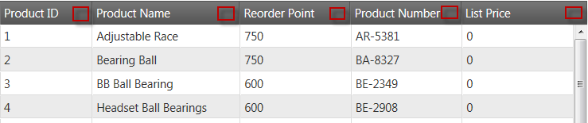

<!--
|metadata|
{
    "fileName": "iggrid-configuring-column-summaries",
    "controlName": "igGrid",
    "tags": ["Getting Started","Grids","Summaries"]
}
|metadata|
-->

# Configuring Column Summaries (igGrid)

## Topic Overview

### Purpose
 This topic discusses how to configure the column summaries in the `igGrid`™.

### In this topic
This topic contains the following sections:

-   [**Summaries Configuration Overview**](#overview)
-   [**Configuring the Summary Type**](#type)
    -   [Preview](#type-preview)
    -   [Property settings](#type-property-settings)
    -   [Code](#type-code)
-   [**Configuring the Calculation Mode (Automatic/Manual)**](#calculation-mode)
    -   [Preview](#calculation-preview)
    -   [Property settings](#calculation-property-settings)
    -   [Code](#calculation-code)
-   [**Enabling Summary Compacting**](#compacting)
    -   [Preview](#compacting-preview)
    -   [Property settings](#compacting-property-settings)
    -   [Code](#compacting-code)
-   [**Configuring a Summary Button**](#button)
    -   [Preview](#button-preview)
    -   [Property settings](#button-property-settings)
    -   [Code](#button-code)
-   [**Configuring a Summary Menu Button**](#menu-button)
    -   [Preview](#menu-button-preview)
    -   [Property settings](#menu-button-property-settings)
    -   [Code](#menu-button-code)
-   [**Canceling Summary Calculation**](#cancel-calculation)
    -   [Steps](#cancel-calculation-steps)
-   [**Custom Summaries**](#custom-summaries)
    - [Running sample](#demo)
-   [**Related Topics**](#topics)

## Required background
The list below includes the required background you need for fully understanding the information in this topic.

- **Topics**
	- You need to first read the Enabling Column Summaries. topic.
- **External Resources** - You need to first read the following articles:
	- [jQuery bind() API](http://api.jquery.com/bind/)
	- [jQuery live() API](http://api.jquery.com/live/)


## <a id="overview"></a> Summaries Configuration Overview
The table below lists the configurable[screen elements and] behaviors of the `columnSummaries` feature of the `igGrid` control.

 
Configurable behavior/feature | Configuration details | Configuration properties
------------------------------|-----------------------|-------------------------
Summary type | The type of the summary calculationis set through a property. | [type](%%jQueryApiUrl%%/ui.iggridsummaries#options:type)
Automatic/manual calculation | Calculations can be performed either automatically (immediately after a value is entered) or after the user clicks a button. This functionality is delivered through two rendering modes. | [calculateRenderMode](%%jQueryApiUrl%%/ui.iggridsummaries#options:calculateRenderMode)
Summary compacting | Summaries can be rendered compactly through a special rendering mode. | [compactRenderingMode](%%jQueryApiUrl%%/ui.iggridsummaries#options:compactRenderingMode)
Summary button | A summary button in the header cell, configurable through a dedicated property. | [showSummariesButton](%%jQueryApiUrl%%/ui.iggridsummaries#options:showSummariesButton)
Summary menu button | Summary menu button - A summary menu button in the footer cell, configurable through a dedicated property. | [showDropDownButton](%%jQueryApiUrl%%/ui.iggridsummaries#options:showDropDownButton)
Canceling summary calculation | Handle `summaryCalculation` event and, on some condition, cancel it. | -
Configurable events | For detailed information about these events, refer to their listing in the property reference section: [Column Summaries Events (igGrid)](igGrid-Column-Summaries-Events.html) | 


> **Note:** The predefined summary functions by default are enabled depending on the `dataType` of the column. For example if you have defined your column’s `dataType` to be “number” or “numeric” than the default summary functions will be: “Count”, “Min”, “Max”, “Sum”, “Avg”(average). If the dataType is “date”, the default summary function will be: “Count”, “Min” and “Max”. Otherwise (if dataType is “string”, “bool” or “object”) the default summary function will be only “Count”.


## <a id="type"></a> Configuring the Summary Type 

There are two summary types – local and remote. This option specifies if the calculation of the summary should be made on the client, or on the server. If the option is set to *local* , and the user chooses summary functions, the calculation is made instantly on the browser, but when it is set to remote and the user adds summary functions (the image on the right), the calculation will be sent to the server after the user has finished selecting.

## <a id="type-preview"></a> Preview 

In the picture below, the type is set to *local* (the image on the left) and type set to *remote* (the image on the right)


## <a id="type-property-settings"></a> Property settings 
The table below maps the desired configurations to property settings. The properties are accessed through the *igGridSummaries* options.


 Property    | Setting                              
-------------|-----------
 type        | *local*                              

### <a id="type-code"></a> Code 

**In HTML:**

```html
<script type="text/javascript">
$(function () {
    $("#grid1").igGrid({
       autoGenerateColumns: true,
       dataSource: adventureWorks,
       responseDataKey: 'Records',
                features: [
                {
                    name: 'Summaries',
                    type: 'local'             
                }
            ]
       });
});
</script>
```

**In MVC:**

```csharp
<%= Html.Infragistics().Grid(Model)
        .AutoGenerateColumns(true)
        .Features(feature =>{ 
      feature.Summaries().Type(OpType.Local);
     }).DataBind().Render()

%>
```

Related links:

[Summaries (Remote Calculation)](%%SamplesUrl%%/grid/summaries-remote)

## <a id="calculation-mode"></a> Configuring the Calculation Mode(Automatic/Manual)

There are two rendering modes defining how calculatins are performed. They are managed by `calculateRenderMode` property. This option specifies if the calculation should be made instantly or after the OK button is clicked. If the option is set to *onselect*, no OK/Cancel buttons appear (the image on the right), when check/uncheck summary it’s updated instantly and when we click outside the drop down menu that means we are ready with our choice. When option is set to *okcancelbuttons* (the image on the left) when we check/uncheck summaries, they are not calculated, but just selected/unselected. When we click outside the drop down that operation is equal to cancel button click.

### <a id="calculation-preview"></a> Preview 

In the pictures below, the option calculateRenderMode is set to "okcancelbuttons" (the image on the left) and “onselect” (the image on the right).

<p style="display:inline-block">
    
    
</p>

### <a id="calculation-property-settings"></a> Property settings for configuring the calculation mode 

The table below maps the desired configurations to property settings. The properties are accessed through the `igGridSummaries` options.

 Property    | Setting                              
-------------|-----------
calculateRenderMode  | *onselect*    

 

### <a id="calculation-code"></a> Code 

**In HTML:**

```html
<script type="text/javascript">
$(function () {
    $("#grid1").igGrid({
       autoGenerateColumns: true,
       dataSource: adventureWorks,
       responseDataKey: 'Records',
                features: [
                {
                    name: 'Summaries',
                    calculateRenderMode: 'onselect'
                }
            ]
    });
});
</script>
```

 

**In MVC:**

```csharp
<%= Html.Infragistics().Grid(Model)
        .AutoGenerateColumns(true)
        .Features(feature => { feature.Summaries().CalculateRenderMode(SummaryCalculateRenderMode.OnSelect); }).DataBind().Render()
%>
```

 

Setting the rendering mode using igGridSummaries options: 

**In HTML:**

```html
<script type="text/javascript">
    $(function () {
      $("#grid1").igGridSummaries('option', 'calculateRenderMode', 'onselect');
    });
</script>
```

 

## <a id="compacting"></a> Enabling Summary Compacting

This feature specifies how to compact the summaries that are rendered. It is controlled by `compactRenderingMode` option and it has three possible values – true (the upper image), false (the middle image), and auto (the lower image). When *true* is set - the summaries may be rendered compactly, even mixing different summaries on the same line.

The *false* option ensures that each summary type is occupying a separate line. And if the option is set to *auto*, it will use *true* if the maximum number of visible summaries is 1 and *false* – otherwise.

 

### <a id="compacting-preview"></a> Preview 

In the pictures below, `compactRenderingMode` is set to *true* (the upper image), *false* (the middle image), and *auto* (the lower image).


 

 


           

### <a id="compacting-property-settings"></a> Property settings for enabling summary compacting 

The table below maps the desired configurations to property settings.
The properties are accessed through the `igGridSummaries` options.


 Property    | Setting                              
-------------|-----------
 compactRenderingMode | *true*  


### <a id="compacting-code"></a> Code 
**In HTML:**

```html
<script type="text/javascript">
$(function () {
    $("#grid1").igGrid({
       autoGenerateColumns: true,
       dataSource: adventureWorks,
```
           responseDataKey: 'Records',
                    features: [
                    {
                        name: 'Summaries',
                        compactRenderingMode: true
                    }
                ]
        });
    });
    </script>

 

**In ASPX:**

    <%= Html.Infragistics().Grid(Model)
            .AutoGenerateColumns(true)
            .Features(feature =>{ feature.Summaries().CompactRenderingMode(SummaryCompactRenderingMode.True); }).DataBind().Render()
    %>

 

Setting the compact mode using `igGridSummaries` options.

**In HTML:**

```html
<script type="text/javascript">
    $(function () {
      $("#grid1").igGridSummaries('option', 'compactRenderingMode', true);
    });
</script>
```

## <a id="button"></a> Configuring a Summary Button

The `showSummariesButton` property enables you to show/hide a summary button in the header of a column. When set to *true* (the upper image), the user can click to hide/show the summaries in the grid. When the `showSummariesButton` option is set to false (the lower image) no buttons appear.

### <a id="button-preview"></a> Preview 
In the pictures below, the `showSummariesButton` option is set to *true* (the upper image) and *false* (the lower image).





### <a id="button-property-settings"></a> Property settings for enabling the summary button 

The table below maps the desired configurations to property settings.
The properties are accessed through the `igGridSummaries` options.

Property    | Setting                              
-------------|-----------
 showSummariesButton | *true*  


### <a id="button-code"></a> Code 

**In HTML:**

    <script type="text/javascript">
    $(function () {
        $("#grid1").igGrid({
           autoGenerateColumns: true,
           dataSource: adventureWorks,
           responseDataKey: 'Records',
                    features: [
                    {
                        name: 'Summaries',
                        showSummariesButton: true
                    }
                ]
        });
    });
    </script>

 

**In ASPX:**

```csharp
<%= Html.Infragistics().Grid(Model)
        .AutoGenerateColumns(true)
        .Features(feature =>{      
           feature.Summaries().ShowSummariesButton(true);
            }).DataBind().Render()
%>
```

Set the summary button using `igGridSummaries` options:

**In HTML:**

```html
<script type="text/javascript">
    $(function () {
      $("#grid1").igGridSummaries('option', 'showSummariesButton', true);
    });
</script>
```

## <a id="menu-button"></a> Configuring a Summary Menu Button

The `showDropDownButton` property enables you to show/hide a button that open a menu with the available button summaries. If this option is set to *true* (the upper image), the summary menu button is available.

When the `showDropDownButton` property is set to *false* (the lower image), the the summary menu button is not visible in the grid. This may be useful when you want to show specific summaries and do not want the user to be able to change them after initialization.

### <a id="menu-button-preview"></a> Preview 

In the pictures below, `showDropDownButton` is set *true* (the upper image) and *false* (the lower image).


### <a id="menu-button-property-settings"></a> Property settings for enabling the summary menu button 

The table below maps the desired configurations to property settings. The properties are accessed through the `igGridSummaries` options.


Property    | Setting                              
-------------|-----------
 showDropDownButton | *true*  

 
### <a id="menu-button-code"></a> Code 

**In HTML:**

```html
<script type="text/javascript">
$(function () {
    $("#grid1").igGrid({
       autoGenerateColumns: true,
       dataSource: adventureWorks,
       responseDataKey: 'Records',
                features: [
                {
                    name: 'Summaries',
                    showDropDownButton: true
                }
            ]
     });
});
</script>
```

**In ASPX:**

```csharp
<%= Html.Infragistics().Grid(Model)
        .AutoGenerateColumns(true)
        .Features(feature =>{      
           feature.Summaries().ShowDropDownButton(true);
            }).DataBind().Render()
%>
```

Set the dropdown button using `igGridSummaries` options.

**In HTML:**

```html
<script type="text/javascript">
    $(function () {
      $("#grid1").igGridSummaries('option', 'showDropDownButton', true);
    });
</script>
```

 

## <a id="cancel-calculation"></a> Canceling Summary Calculation

By handling the `summariesCalculating` event, a summary calculation can be cancelled.

Following is a conceptual overview of the process:

1.  **Handling the summariesCalculating event**
2.  **Canceling the event**

### <a id="cancel-calculation-steps"></a> Steps 

1.  **Handle the `summariesCalculating` event.**

    1.  **Define a handler function.**

        Define a function that will be called when the `summariesCalculating` event fires.

	    **In HTML and JavaScript:**

	    ```html
	    <script type="text/javascript"> 
	        function gridSummariesCalculating (evt, ui) { ... };   
	    </script>
	    ```
     
	2.  **Set the handler to the *summariesCalculating* event of the igGrid.**
	
		Once you have a handler defined, it needs to be set as the handler for the `summariesCalculating event`. In jQuery, this can be done when the widget is instantiated.
		
		In ASP.NET MVC, the event should be attached using the jQuery live or bind API. Using the live or bind API is an option for attaching the event in a pure jQuery implementation as well. The type for this event is `'iggridsummariessummariescalculating'`.
  
		**In HTML:**
	    ```html
	    $(function () {
	        $("#grid1").igGrid({
	           autoGenerateColumns: true,
	           dataSource: adventureWorks,
	           responseDataKey: 'Records',
	                    features: [
	                    {
	                        name: 'Summaries',
	                        showDropDownButton: true,
	                        summariesCalculating: gridSummariesCalculating
	                    }
	                ]
	          });
	    });
	    ```
	
		**In JavaScript**
	    ```js
	    $("#grid1").live("iggridsummariessummariescalculating ", gridSummariesCalculating);
	    ```

2.  **Cancel the event by returning false**

	**In HTML and JavaScript:**
	
	```html
	<script type="text/javascript">       
	    function gridSummariesCalculating (evt, ui) {
	       if (conditionNotMet) 
	          return false;
	     };   
	</script>
	```
## <a id="custom-summaries"></a> Custom Summaries
By defining a custom summaryOperands object (`summaryOperands` with type *custom*) you point the Summaries feature to a custom function to calculate the row summary. When the `compactRenderingMode` option is set to false, the results from both the predefined and the custom methods are positioned in summary rows according to their sort order. The sample below has two custom summary functions (*countTrueValues*, *countFalseValues*) each calculating the number of *true* or *false* values in a boolean column. Those summary functions are then used for the "Make Flag" column.
### <a id="demo"></a> Running sample
    <div class="embed-sample">
        [igGrid Custom Summaries](%%SamplesEmbedUrl%%/grid/summaries-custom)
    </div>

## <a id="topics"></a> Related Topics

Following are some other topics you may find useful.

-   [Enabling Column Summaries (igGrid)](igGrid-Enabling--Column-Summaries.html)
-   [Column Summaries Events (igGrid)](igGrid-Column-Summaries-Events.html)