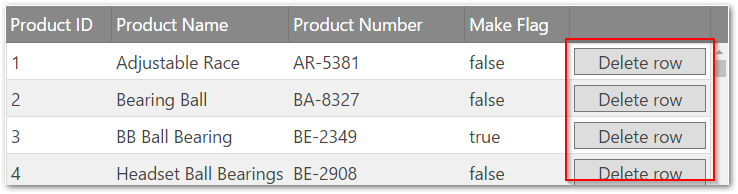

<!--
|metadata|
{
    "fileName": "creating-a-basic-column-template-in-the-iggrid",
    "controlName": "igGrid",
    "tags": ["Grids","How Do I","Templating"]
}
|metadata|
-->

# Creating a Basic Column Template (igGrid)

## Topic Overview

### Purpose

This topic demonstrates how to create basic column template for the `igGrid`™ control.

### In this topic

This topic contains the following sections:

-   [**Creating a Basic Colum Template in the igGrid**](#basic-tempalte)
    -   [Preview](#preview)
    -   [Prerequisites](#prerequisites)
    -   [Steps](#steps)
-   [**Related Content**](#related-content)
    -   [Topics](#topics)


## <a id="basic-tempalte"></a> Creating a Basic Colum Template in the igGrid

In this example a basic column template is applied to the grid. An extra unbound column is added to the grid. It has a template that renders a button in its cells. 

### <a id="preview"></a> Preview

The following screenshot is a preview of the final result. Only the column with red outline has column template assigned.



### <a id="prerequisites"></a> Prerequisites

To complete the procedure you need an empty html page.

### <a id="steps"></a> Steps

The following steps demonstrate how to create a basic column template in the `igGrid`

1. Prepare html page

    To prepare the html page, add an `igLoader` and configure it to load `igGrid` resources.
    
**In Javascript:**

```js
    <script src="http://localhost/ig_ui/js/infragistics.loader.js"></script>
    <script type="text/javascript">
         $.ig.loader({
            scriptPath: "http://localhost/ig_ui/js/",
            cssPath: "http://localhost/ig_ui/css/",
            resources: "igGrid"
        });
    </script>
```

2. Add and apply the column template

    1. Add sample data to the page and table tag to the body of the page.

        **In Javascript:**

        ```js
        <script src="http://www.igniteui.com/data-files/adventureworks.min.js"></script>
        ```

        **In HTML:**

        ```html
        <body>
            <table id="grid1"></table>
        </body>
        ```

        ​2. Add igGrid with column templates set.

        **In Javascript:**
        ```js
            <script type="text/javascript">
            $.ig.loader(function () {
                $("#grid").igGrid({
                    autoGenerateColumns: false,
                    width: "100%",
                    height: "500px",
                    columns: [
                        { headerText: "Product ID", key: "ProductID", dataType: "number", width: "15%" },
                        { headerText: "Product Name", key: "Name", dataType: "string", width: "25%" },
                        { headerText: "Product Number", key: "ProductNumber", dataType: "string", width: "25%" },
                        { headerText: "Make Flag", key: "MakeFlag", dataType: "bool", width: "15%" },
                        {
                            headerText: "", 
                            key: "Delete", 
                            dataType: "string", 
                            width: "20%", 
                            unbound: true, 
                            template: "<input type='button' onclick='deleteRow(${ProductID})' value='Delete row' class='delete-button'/>"
                        }
                    ],
                    primaryKey: "ProductID",
                    dataSource: adventureWorks
                });
            });
            </script>
        ```

        3. Create the function that deletes the row

        **In Javascript:**        
        ```js
            <script type="text/javascript">
                function deleteRow(rowId) {
                    var grid = $("#grid").data("igGrid");
                    grid.dataSource.deleteRow(rowId);
                    grid.commit();
                }
            </script>
        ```

        4. Verify the result

            Look at the sample below to preview the result.

<div class="embed-sample">
   [Column Template](%%SamplesEmbedUrl%%/grid/column-template)
</div>


## <a id="related-content"></a> Related Content

### <a id="topics"></a> Topics

The following topics provide additional information related to this topic.

- [Infragistics Templating Engine](igTemplating-Overview.html): This section contains topics covering the use the Infragistics® Templating Engine.


 

 


