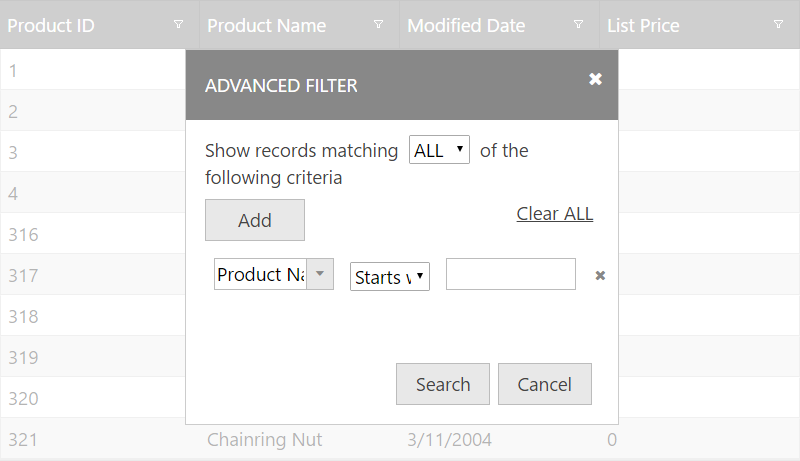
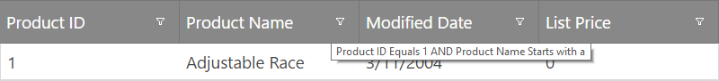

<!--
|metadata|
{
    "fileName": "iggrid-filtering",
    "controlName": "igGrid",
    "tags": ["Filtering"]
}
|metadata|
-->

# Filtering (igGrid)

## Overview

The Filtering feature of the `igGrid` allows users to do Excel-style filtering of data.

> **Note:** Filtering is implemented as a jQuery UI widget which follows the lifecycle of any jQuery UI widget.

### In this topic

This topic contains the following sections:

-   [Filtering Persistence](#persistence)
-   [Filtering Modes](#modes)
-   [Configuration Considerations](#considerations)
-   [Enabling Filtering](#enable)
-   [Remote Filtering](#remote)
-   [Column Settings](#column-settings)
-   [Client-Side events](#client-side-events)
-   [API Usage](#api)
-   [Default Conditions List](#default-conditions-list)
-   [List of Filtering Options (Properties)](#properties)
-	[Custom Filtering Conditions](#customCond)
-   [Filtering CSS Classes](#css)
-   [Keyboard Interactions](#keyboard-interaction)
-   [Breaking Changes](#changes)
-   [Related Content](#related-content)


## <a id="persistence"></a> Filtering Persistence

Persisting Filtering between `igGrid` re-bindings is made easy in version 14.1 and in fact replaces the previous default behavior.

> **Note**
> Filtering persistence is true by default. This is a breaking change.

When you enable `igGridFiltering` you are already using it in a [`persist`](%%jQueryApiUrl%%/ui.iggridfiltering#options:persist) mode. This means that after explicitly calls of **dataBind()**, that persistence is applied for UI and data source view (the filter editors are not cleared and the data source remains filtered)

Filtering persistence is implemented for `igHierarchicalGrid` too.

The following sample demonstrates the persistance capabilities of the Filtering feature.

<div class="embed-sample">
   [Feature Persistence](%%SamplesEmbedUrl%%/grid/feature-persistence)
</div>

If you would like to retain the previous behavior of filtering being cleared after user re-binds the *igGrid*, you can do this by disabling the feature through the [`persist`](%%jQueryApiUrl%%/ui.iggridfiltering#options:persist) option as shown in the code snippet below:

**In JavaScript:**

```js
features: [
  {
     name: "Filtering",
     persist: false
  }
]
```

## <a id="modes"></a> Filtering Modes

The mode option accepts two value values: advanced or simple. When the simple filtering mode is set, all filters are rendered for every column header, below the respective column header cell. When advanced filtering is configured, then an advanced filtering button is rendered next to the column header text (default). Once the advanced button is clicked, the “advanced” filtering dialog appears where more complex filtering conditions are available to the user.

## <a id="considerations"></a> Configuration Considerations

-   All filter row conditions are always combined using the “AND” operator.
-   The advanced filtering dialog does expose the “AND” or “OR” operators in order to combine multiple filters.
-   The advanced filter dialog also allows multiple filters to be set for a single column.
-   The actual data filtering is performed solely through the `igDataSource` control.
-   By default if no expression URL keys are set, an oData encoding is assumed – same as in the `igDataSource` filtering functionality.
-   The filter row can be navigated with the keyboard using TAB / SHIFT and TAB.
-   When the focus is on a filter dropdown, it can be opened with the ENTER key, and then filter dropdown items can be navigated with the UP and DOWN arrow keys.
-   Whenever some other grid feature triggers a “UI dirty” event (for example when the page size is changed when paging is enabled), filtering automatically clears all of the UI presets, if they are different than the defaults.
-   In order to have multiple filtering conditions configured for the same column, they should be added through the advanced filter dialog – when the filtering mode is set to advanced.
-   Whenever advanced filtering is used, and a column is chosen from the first column (in an advanced dialog filter row), the second column with the conditions is automatically updated depending on the column type. Therefore if the column is a numeric column, only numeric conditions are listed, and so on. Further the third column editor is updated, so if it is a date column, a date picker is rendered instead of a regular input element.
-   The `filterDelay` option combined with mode: “simple” can play an important role for making the end users’ work seamless. The greater the delay, the more time the end user can spend typing in the filter input before a filtering request is triggered.
-   It is very important to set the correct column types when filtering is used. If they are not configured properly, some unexpected errors and behaviors may occur, for example when setting a numeric column to be of type “string”, or the reverse.
-   Filtering can also be case sensitive, which can be turned on by setting the `caseSensitive` option to true. This options works only for local filtering.

You can get the current list of expression objects from the `dataFiltering` event arguments.

**In JavaScript:**

```js
$(document).delegate("#grid1", "iggridfilteringdatafiltering", function (evt, ui) {
	var expressions = ui.expressions;
}
```


Figure 1: Simple Filtering (mode: “simple”)


Figure 2: Advanced Filtering (mode: “advanced”)



Figure 3: Advanced Filtering dialog



Figure 4: Filtering tooltips (mode: “advanced”)

## <a id="enable"></a> Enabling Filtering

In order to get started with Filtering, you first need to include the necessary JavaScript and CSS dependencies. The easiest way to do that is to use the combined / minified version of the scripts and styles.

Listing 1: Necessary CSS and JavaScript references you need to include in your application

**In HTML:**

```html
<link type="text/css" href="infragistics.theme.css" rel="stylesheet" />
<link type="text/css" href="infragistics.css" rel="stylesheet" />
<script type="text/javascript" src="jquery.min.js"></script>
<script type="text/javascript" src="jquery-ui.min.js"></script>
<script type="text/javascript" src="infragistics.core.js"></script>
<script type="text/javascript" src="infragistics.lob.js"></script>
```

Listing 2: Minimal set of CSS and JavaScript references (not minified and combined) – needed only for filtering


**In HTML:**

```html
<script type="text/javascript" src="infragistics.util.js"></script>
<script type="text/javascript" src="infragistics.dataSource.js"></script>
<script type="text/javascript" src="infragistics.ui.shared.js"></script>
<script type="text/javascript" src="infragistics.ui.popover.js"></script>
<script type="text/javascript" src="infragistics.ui.editors.js"></script>
<script type="text/javascript" src="infragistics.ui.grid.framework.js"></script>
<script type="text/javascript" src="infragistics.ui.grid.shared.js"></script>
<script type="text/javascript" src="infragistics.ui.grid.filtering.js"></script>
```

Listing 3 shows sample code used to configure grid filtering.

Listing 3: Sample grid code for filtering

**In JavaScript:**

```js
//Basic filtering on client
$("#myGrid").igGrid({
    dataSource: "/GetCensusData/",
    columns: [
        { headerText: "State", key: "StateName" },
        { headerText: "Congressional District", key: "CongressionalDistrict" },
        { headerText: "Population", key: "TotalPopulation" }
    ]
    features:[
        {
            name: "Filtering",
            allowFiltering: true,
            caseSensitive: false,
            columnSettings: [
                {columnKey: "StateName", allowFiltering: false}
            ]
        }
    ]
});
```

Listing 4: Sample JSON response

**In JavaScript:**

```js
[
   {"AverageFamilySize":3.36, "AverageHouseholdSize":2.91, "CongressionalDistrict":"14", "StateName": "Illinois", "TotalPopulation":720663},
   {"AverageFamilySize":3.00, "AverageHouseholdSize":2.43, "CongressionalDistrict":"15", "StateName": "Illinois", "TotalPopulation":595833},
   {"AverageFamilySize":3.16, "AverageHouseholdSize":2.67, "CongressionalDistrict":"16", "StateName": "Illinois", "TotalPopulation":691356}
]
```

Listing 5: HTML element required to instantiate the grid


**In HTML:**

```html
<table id="myGrid"></table>
```
**Running sample with advanced filtering**
<div class="embed-sample">
   [igGrid Advanced Filtering](%%SamplesEmbedUrl%%/grid/advanced-filtering)
</div>

Listing 6: Razor or CSHTML markup for use with the ASP.NET MVC wrapper


**In Razor:**

```csharp
@(Html.Infragistics().Grid(Model).ID("grid1").PrimaryKey("ProductID").Height("400px").Columns(column =>
    {
        column.For(x => x.ProductID).HeaderText("Product ID").DataType("number");
        column.For(x => x.Name).HeaderText("Product Name");
        column.For(x => x.ModifiedDate).HeaderText("Modified Date");
        column.For(x => x.ListPrice).HeaderText("List Price");
    }).Features(features => {
        features.Filtering().Mode(FilterMode.Advanced);
    })
	.DataSourceUrl(Url.Action("GridGetData"))
	.DataBind()
	.Render()
)
```

## <a id="remote"></a> Remote Filtering
If filtering is configured to be remotely (ie: the type option is set to remote), the URL is automatically configured so that all filtering expressions are encoded automatically based on the end user actions (or based on the parameters passed, if programmatic filtering is performed). If no `filterExprUrlKey` is specified, oData URI conventions are automatically used in the encoding.

> **Note:** For more information regarding oData URI conventions, please visit: [http://www.odata.org/documentation/odata-version-2-0/uri-conventions/](http://www.odata.org/documentation/odata-version-2-0/uri-conventions/)

Otherwise, the grid encodes filtering information in the following way (example):

```
http://<SERVER>/grid/GridGetData? filter(Name)=startsWith(a)&filter(ModifiedDate)=today()&filterLogic=AND
```

When the ASP.NET MVC wrapper is used to bind to server-side data through LINQ (IQueryable), all filtering information that’s encoded in the URL is automatically translated to LINQ expression clauses (Where clause), so you do not need to do anything additional in order to filter the data.


## <a id="column-settings"></a> Column Settings

Each column setting can contain custom options that apply for a specific column, that is specified by the columnKey property. Table 1 shows all available properties that can be set in a single object that is part of the `columnSettings` option.

> **Note:** The `columnSettings` option is an array of objects listed in Table 1.

Table 1: igGridFiltering columnSettings

Property | Description
---|---
[`columnKey`](%%jQueryApiUrl%%/ui.iggridfiltering#options:columnSettings.columnKey) | Key of the column for which this column setting applies. The columnKey and columnIndex are mutually exclusive.
[`columnIndex`](%%jQueryApiUrl%%/ui.iggridfiltering#options:columnSettings.columnIndex) | Index of the column for which this column setting applies. The columnKey and columnIndex are mutually exclusive.
[`allowFiltering`](%%jQueryApiUrl%%/ui.iggridfiltering#options:columnSettings.allowFiltering) | Whether filtering is enabled or disabled on the respective column. Default is true.
[`condition`](%%jQueryApiUrl%%/ui.iggridfiltering#options:columnSettings.condition) | The [default filtering condition](#default-conditions-list) that will be used for the column.
[`conditionList`](%%jQueryApiUrl%%/ui.iggridfiltering#options:columnSettings.conditionList) | An array of strings that defines the available conditions for the column. When not set the default conditions by column data type are set plus the conditions defined in the `customConditions` option.
[`customConditions`](%%jQueryApiUrl%%/ui.iggridfiltering#options:columnSettings.customConditions) | An object (with the following schema {labelText: "/*dataType='string'*/", expressionText: "/*dataType='string'*/", requireExpr: /*dataType='bool'*/, filterImgIcon: "/*dataType='string'*/", filterFunc: /*dataType='string or function'*/ }) defining a [custom filtering condition](#customCond).
[`defaultExpressions`](%%jQueryApiUrl%%/ui.iggridfiltering#options:columnSettings.defaultExpressions) | An array of initial filtering expressions. A filtering expression object schema looks like this: {fieldName: "/*dataType='string'*/", cond: "/*dataType='string'*/" expr: "/*dataType='string'*/"}

Listing 7: Example usage of columnSettings


**In JavaScript:**
```
$("#grid1").igGrid({
    columns: [
        { headerText: "Product ID", key: "ProductID", dataType: "number" },
        { headerText: "Product Name", key: "Name", dataType: "string" },
        { headerText: "Product Number", key: "ProductNumber", dataType: "string" },
    ],
    width: '500px',
    dataSource: products,
    features: [
        {
            name: 'Filtering',
            columnSettings: [
                {columnKey: 'ProductID', condition: "startsWith" }
            ]
        }
    ]
});
```
## <a id="client-side-events"></a> Client-Side events

You can bind to Filtering client-side events in two ways, which are described in Listing 8 and Listing 9, respectively. If you would like to bind using the approach described in Listing 8, you can use the jQuery `on()` method.

Listing 8: Binding to client-side events from anywhere in your application


**In JavaScript:**
```
$("#grid1").on("iggridfilteringdatafiltered", handler);
```

Listing 9: Binding to client-side events by specifying the event name as an option when you initialize the filtering feature (case sensitive)

**In JavaScript:**
```
    $(function () {
        $("#grid1").igGrid({
            columns: [
                { headerText: "Product ID", key: "ProductID", dataType: "number" },
                { headerText: "Product Name", key: "Name", dataType: "string" },
                { headerText: "Product Number", key: "ProductNumber", dataType: "string" },
            ],
            width: '500px',
            dataSource: products,
            features: [
                {
                    name: 'Filtering',
                    dataFiltering: handler
                }
            ]
        });
    });

    //Handler code
    function handler(event, args) {

    }
```

> **Note:** All ‘ing’ events are cancellable. In order to cancel an ‘ing’ event, its respective event handler must return false.

Table 2: Filtering Client-side events

<table class="table table-striped">
	<thead>
		<tr>
            <th>
Client-side event name
			</th>
            <th>
Description
			</th>
            <th>
Args
			</th>
        </tr>
	</thead>
	<tbody>
        <tr>
            <td>
dataFiltering
			</td>
            <td>
Event which is raised before a filtering request is made (either local or remote)
			</td>
            <td>
columnKey: The column key from which filtering is triggered <br />

columnIndex: Index of the column <br />

owner: Reference to the filtering widget object <br />
			</td>
        </tr>
        <tr>
            <td>
dataFiltered
			</td>

            <td>
Event which is raised after data is filtered and rendered in the grid
			</td>

            <td>
Same as dataFiltering

                <blockquote>
**Note:** The expressions array can be obtained from the `dataFiltering` event arguments: ui.expressions.
				</blockquote>
			</td>
        </tr>
        <tr>
            <td>
dropDownOpening
			</td>
            <td>
Event raised before a filtering dropdown is about to be opened
			</td>
            <td>
dropDown: Reference to the filtering drop down <br />
owner: Reference to the filtering widget object
			</td>
        </tr>
        <tr>
            <td>
dropDownOpened
			</td>
            <td>
Event which is raised after a filtering dropdown is opened.
			</td>
            <td>
Same as dropDownOpening
			</td>
        </tr>
        <tr>
            <td>
dropDownClosing
			</td>
            <td>
Event which is raised before a filtering dropdown is about to be closed
			</td>
            <td>
Same as dropDownOpening
			</td>
        </tr>

        <tr>
            <td>
dropDownClosed
			</td>
            <td>
Event which is raised after a filtering dropdown is closed
			</td>
            <td>
Same as dropDownOpening
			</td>
        </tr>
        <tr>
            <td>
filterDialogOpening
			</td>
            <td>
Event which is raised before the advanced filtering dialog is opened
			</td>
            <td>
dialog: Reference to the filtering element – in a jQuery object wrapper <br />
owner: Reference to the filter widget object
			</td>
        </tr>
        <tr>
            <td>
filterDialogOpened
			</td>
            <td>
Event which is raised after the advanced filtering dialog gets opened
			</td>
            <td>
Same as filterDialogOpening
			</td>
        </tr>
        <tr>
            <td>
filterDialogMoving
			</td>
            <td>
Event which is raised when the advanced filtering dialog is moving
			</td>
            <td>
Same as filterDialogOpening
			</td>
        </tr>
        <tr>
            <td>
filterDialogFilterAdding
			</td>
            <td>
Event raised before a new filter is added in the advanced filtering dialog
			</td>
            <td>
filtersTableBody: Reference to the TABLE element holding any filters, wrapped with the jQuery object <br />
owner: Reference to the Filtering widget object
			</td>
        </tr>

        <tr>
            <td>
filterDialogFilterAdded
			</td>
            <td>
Event raised after a new filter is added in the advanced filtering dialog
			</td>
            <td>
filter: Reference to the filterRow element in a jQuery object wrapper <br />
owner: Reference to the filtering widget object
			</td>
        </tr>

        <tr>
            <td>
filterDialogClosing
			</td>
            <td>
Event raised before the advanced filtering dialog starts closing
			</td>
            <td>
owner: Reference to the calling widget (this)
			</td>
        </tr>

        <tr>
            <td>
filterDialogClosed
			</td>
            <td>
Event raised after the advanced filtering dialog is closed
			</td>
            <td>
owner: Reference to the calling widget (this)
			</td>
        </tr>

        <tr>
            <td>
filterDialogContentsRendering
			</td>
            <td>
Event raised before contents are rendered in the advanced filtering dialog
			</td>
            <td>
dialogElement: The dialog element where contents are going to be rendered, in a jQuery object wrapper <br />
owner: Reference to the filtering widget object
			</td>
        </tr>

        <tr>
            <td>
filterDialogContentsRendered
			</td>
            <td>
Event raised after contents are rendered in the advanced filtering dialog
			</td>
            <td>
Same as filterDialogContentsRendering
			</td>
        </tr>

        <tr>
            <td>
filterDialogFiltering
			</td>
            <td>
Event raised when the OK button is pressed in the advanced filtering dialog and it starts filtering.
				<blockquote>
**Note:** The dataFiltering and dataFiltered events are still raised after this event.
                </blockquote>
            </td>
            <td>
Same as filterDialogOpening
			</td>
        </tr>
    </tbody>
</table>

## <a id="api"></a> API Usage

In order to filter the grid programmatically, you need to call the filter() function on the `igGridFiltering` widget. The filter function is defined in the following way:

```
filter(expressions, updateUI)
```


The expressions argument is an array of expression objects. Listing 10 gives an overview of the structure of each expression object. The updateUI argument is optional and it can be set explicitly to false so that the UI is not updated when the grid is filtered programmatically.

Listing 10: Filtering expression object structure

**In JavaScript:**

```js
{
    expr: <filter expression string>,
    cond: [<filtering condition>](#default-conditions-list),
    fieldName: [<column key>](%%jQueryApiUrl%%/ui.iggrid#options:columns.key)
}
```

Listing 11 and Listing 12 show examples of using the filter() function off the `igGridFiltering` widget.

Listing 11: Filter by ProductID = 1

**In JavaScript:**

```js
$("#grid1").igGridFiltering('filter', ([{ fieldName: "ProductID", expr: 1, cond: "equals"}]));
```

Listing 12: Filter by ProductID = 1 and ProductName startsWith “a”:

**In JavaScript:**
```js
$("#grid1").igGridFiltering('filter', ([{ fieldName: "ProductID", expr: 1, cond: "equals"}, {fieldName: "ProductName", expr: "a", cond: "startsWith"} ]));
```

Listing 13: Retrieving the applied filtering expressions

**In JavaScript:**

```js
var expressions = $('#grid1').data('igGrid').dataSource.settings.filtering.expressions;
```

## <a id="default-conditions-list"></a> Default Conditions List

The following conditions (grouped by data type) are available to perform filtering on the grid:

- String
  -   startsWith
  -   endsWith
  -   contains
  -   doesNotContain
  -   equals
  -   doesNotEqual
  -   null
  -   notNull
  -   empty
  -   notEmpty
- Number
  -   equals
  -   doesNotEqual
  -   greaterThan
  -   lessThan
  -   greaterThanOrEqualTo
  -   lessThanOrEqualTo
  -   null
  -   notNull
  -   empty
  -   notEmpty
- Boolean
  -   true
  -   false
  -   null
  -   notNull
  -   empty
  -   notEmpty
- Date
  -   on
  -   notOn
  -   after
  -   before
  -   today
  -   yesterday
  -   thisMonth
  -   lastMonth
  -   nextMonth
  -   thisYear
  -   lastYear
  -   nextYear
  -   null
  -   notNull
  -   empty
  -   notEmpty
- Object
  -   null
  -   notNull
  -   empty
  -   notEmpty

## <a id="properties"></a> List of Filtering Options (Properties)

Option and default value shows in brackets

Option and default value shows in brackets | Description
---|---
caseSensitive (false) | Enables / disables case sensitive filtering (boolean). This options works only for local filtering.
filterSummaryAlwaysVisible (true) | By default, once filtering is performed, a summary label will appear in the footer area of the grid stating how many matches have been found. When paging is enabled, the filter summary replaces the area on the left which denotes how many records are shown. When the page is changed, respectively, the filter summary is replaced with the paging label.
filterSummaryTemplate (${matches} matching records) | Template for the filter summary label
filterDropDownAnimations (“linear”) | Accepted values are “linear” and “none”
filterDropDownAnimationDuration (500) | Duration of the animations when filterDropDownAnimations is set to “linear”
filterDropDownWidth (0) | Default width of the filter dropdown width. When set to 0, the width will grow with contents automatically
filterDropDownHeight (0) | Same as filterDropDownWidth but for height
filterExprUrlKey (null) | Expression key to encode in the URL when remote filtering is performed. Default value of null assumes oData URI Conventions will be used ([documentation/odata-version-2-0/uri-conventions/](http://www.odata.org/documentation/odata-version-2-0/uri-conventions/))
filterDropDownItemIcons (true) | Small image icons for the filtering conditions will be rendered in front of every dropdown item if this option is enabled – it is enabled by default.
columnSettings ([]) | A list of custom column settings for filtering conditions. The format of each column settings object in the list is described below.
type (“remote”) | Type of the filtering operations. Can be remote or local. The local setting implies filtering is performed on the currently bound data in the data source.
filterDelay (500) | Delay before filtering is triggered. As the end user is typing, most of the times we don’t want a filtering request after every keystroke, so this is the delay that starts after every keystroke, and is cancelled if the time between the previous and the potential next keystroke (if any) exceeds this value.
mode (“simple”) | Simple filtering renders a filter row below the grid’s headers, where each column has a dedicated editor and button (optional) that is always visible. “advanced” filtering renders a button in the header which, after clicked, opens up the advanced filtering dialog where multiple conditions can be configured (even more than 1 conditions per column)
advancedModeEditorsVisible (false) | When this option is set to true, dedicated filtering editors are still rendered for every column header, even though the filter mode is Advanced. The advanced filtering dialog can be accessed from the “Advanced” button located at the end of every column filter dropdown.
advancedModeHeaderButtonLocation (“left”) | When the filtering mode is Advanced, and advancedModeEditorsVisible is false, the advanced button is renderd in the header next to the header text, so this property controls if it will be rendered before the header text or after it. If there is sorting enabled, and a column is sorted, the sorting indicator gets rendered always to the right of anything else.
filterDialogWidth (350) | Width of the advanced filtering dialog (if applicable)
filterDialogHeight (‘’) | Height of the advanced filtering dialog (if applicable). By default no height is set to that it grows with the contents.
filterDialogFilterDropDownDefaultWidth (80) | This is the default width of every dropdown Filter Condition added in the advanced filtering. That’s the second dropdown in every filter row, which is also a plain HTML SELECT element, and lets the end user choose from the filtering conditions list.
filterDialogExprInputDefaultWidth (80) | This is the default width for every filter expression input which is added as the last box of every filter row in the advanced filtering dialog.
filterDialogColumnDropDownDefaultWidth (null) | This is the default width of every dropdown column filter added in the advanced filtering. That’s the first dropdown in every filter row, which is also an igEditor, and lets the end user choose from the columns list.
renderFilterButton (true) | Enables / disables rendering of the filter dropdown button in every filter row cell. If this is set to false, it means the end user can only use the predefined filter and enter text in the input.
filterButtonLocation (“left”) | Location of the filter dropdown button. Can be “left” or “right”.
tooltipTemplate ("${condition} filter applied") | Tooltip template that will appear when the end user hovers over the filtering dropdown button
filterDialogAddButtonWidth (100) | Width of the “Add” button in the advanced filter dialog
filterDialogOkCancelButtonWidth (100) | Width of the Ok and Cancel buttons in the advanced filter dialog
filterDialogMaxFilterCount (5) | Maximum number of filters that can be added in the advanced filtering dialog. If this number is exceeded, a validation error message will appear.
featureChooserText ("Hide Filter") | Feature chooser text when filter is shown and filter mode is simple.
featureChooserTextHide ("Show Filter") | Feature chooser text when filter is hidden and filter mode is simple.
featureChooserTextAdvancedFilter ("Advanced Filter") | Feature chooser text when filter mode is advanced.

## <a id="customCond"></a> Custom Filtering Conditions

The Filtering feature when in local mode (type="local") allows the user to define custom filtering conditions per column.
The custom conditions are appended to the conditions list (following the default conditions list based on the column data type) for the specific column and allow you to specify a custom comparer filtering function to process the data.
The condition needs to be defined in the column settings for the related column via the [`customConditions`](%%jQueryApiUrl%%/ui.iggridfiltering#options:columnSettings.customConditions) option.
The assigned value should be an object, where each property name represents an unique condition key and the value represents the custom condition's declaration.

There are additional options that further affect the behavior and visualization of the conditions:
-	`requireExpr` - specifies whether this condition requires the user to input a filtering expression or not.
-	`labelText`  -  specifies the label text that will appear in the column's condition dropdown.
- 	`expressionText` - specifies the text that will display in the editor if requireExpr is false and the condition is selected from the dropdown.
-	`filterImgIcon` - specifies the css class applied to the dropdown item when in simple filtering mode.
-	`filterFunc` - specifies the custom comparing filter function(or name of a function) that will be used when the condition is applied.

 Listing 14: Example usage of custom conditions with running sample


**In JavaScript:**
```
$("#grid1").igGrid({
   columns: [
                { headerText: "Employee ID", key: "EmployeeID", dataType: "string", hidden: true },
                { headerText: "First Name", key: "FirstName", dataType: "string" },
                { headerText: "Last Name", key: "LastName", dataType: "string" },
                { headerText: "Register Date", key: "RegistererDate", dataType: "date" },
                { headerText: "Country", key: "Country", dataType: "string" },
                { headerText: "Age", key: "Age", dataType: "number" },
                { headerText: "Is Active", key: "IsActive", dataType: "bool" }
            ],
    dataSource: employees,
    width: '500px',
    dataSource: products,
    features: [
        {
            name: 'Filtering',
            columnSettings: [
               {
                     columnKey: "Country",
                     customConditions: {
                        USA: {
                             labelText: 'USA',
                             expressionText: "USA",
                             filterFunc: function(value, expression, dataType, ignoreCase, preciseDateFormat) {  return value === "USA";}
                        },
                        Canada:{
                              labelText: 'Canada',
                              expressionText: "Canada",
                              filterFunc: function(value, expression, dataType, ignoreCase, preciseDateFormat) {  return value === "Canada";}
                        }
                     }
                }
            ]
        }
    ]
});
```
 **Demo:**
 <div class="embed-sample">
   [igGrid Filtering Custom Conditions](%%SamplesEmbedUrl%%/grid/custom-conditions-filtering)
</div>


## <a id="css"></a> Filtering CSS Classes

List of CSS classes applied to the element | Area where CSS classes are applied
---|---
ui-iggrid-filterrow ui-widget | Classes applied to the filter row TR in the headers table
ui-iggrid-filtercell | Classes applied to every filter cell TH
ui-iggrid-filtereditor | Classes applied to every filter editor element (igEditor)
ui-menu ui-widget ui-widget-content ui-iggrid-filterddlist ui-corner-all | Classes applied to the UL filter dropdown list
ui-iggrid-filterdd | Classes applied to the DIV which wraps the dropdown UL
ui-iggrid-filterddlistitem | Classes applied to each filter dropdown list item (LI)
ui-iggrid-filterddlistitemcontainer | Classes applied to the element that holds the text in every filter list item (LI)
ui-iggrid-filterddlistitemadvanced | Class applied to the list item that holds the Advanced button, if options are configured such that editors are shown when mode is advanced
ui-iggrid-filterddlistitemicons ui-state-default | Classes applied to the list item when filtering icons are visible for it
ui-iggrid-filterddlistitemclear | Classes applied to the “clear” filter list item
ui-iggrid-filterddlistitemhover ui-state-hover | Classes applied to the list item when it is hovered
ui-iggrid-filterddlistitemactive ui-state-active | Classes applied to the list item when it is selected
ui-iggrid-filterbutton ui-corner-all ui-icon ui-icon-triangle-1-s | Classes applied to every filtering dropdown button
ui-iggrid-filterbutton ui-iggrid-filterbuttonadvanced ui-icon ui-icon-search | Classes applied to the button when mode is advanced. This also applies to the button when it’s rendered in the header (which is the default behavior).
ui-iggrid-filterbuttonright ui-iggrid-filterbuttonadvanced ui-icon ui-icon-search | Classes applied to the advanced filtering button when it is rendered on the right
ui-iggrid-filterbuttonhover ui-state-hover | Classes applied to the filter button when it is hovered
ui-iggrid-filterbuttonactive ui-state-active | Classes applied to the filter button when it is selected
ui-iggrid-filterbuttonfocus ui-state-focus | Classes applied to the filter button when it has focus but is not selected.
ui-iggrid-filterbuttondisabled ui-state-disabled | Classes applied to the filtering button when it is disabled
ui-iggrid-filterbuttondate | Classes applied to the filter button when a date filter is defined for the column
ui-iggrid-filterbuttonstring | Classes applied to the filter button when a string filter is applied for the column (default)
ui-iggrid-filterbuttonnumber | Classes applied to the filter button when a number filter is applied for the column (default)
ui-iggrid-filterbuttonbool | Classes applied to the filter button when a boolean filter is applied for the column (default)
ui-iggrid-filterbuttonadvancedhover ui-state-hover | Classes applied on the advanced button when it is hovered
ui-iggrid-filterbuttonadvancedactive ui-state-active | Classes applied on the advanced button when it is selected
ui-iggrid-filterbuttonadvancedfocus ui-state-focus | Classes applied on the advanced button when it has focus
ui-iggrid-filterbuttonadvanceddisabled ui-state-disabled | Classes applied on the advanced button when it is disabled
ui-iggrid-filtericon | Classes applied to every filter dropdown list item’s image icon area
ui-iggrid-filtericoncontainer | Classes applied to the item icon’s container element
ui-iggrid-filtericonstartswith | Classes applied to the item icon’s span when the item holds a “startsWith” condition
ui-iggrid-filtericonendswith | Classes applied to the item icon’s span when the item holds an “endsWith” condition
ui-iggrid-filtericoncontains | Classes applied to the item icon’s span when the item holds a “contains” condition
ui-iggrid-filtericonequals | Classes applied to the item icon’s span when the item holds an “equals” condition
ui-iggrid-filtericondoesnotequal | Classes applied to the item icon’s span when the item holds a “notEquals” condition
ui-iggrid-filtericondoesnotcontain | Classes applied to the item icon’s span when the item holds a “doesNotContain” condition
ui-iggrid-filtericongreaterthan | Classes applied to the item icon’s span when the item holds a “greaterThan” condition
ui-iggrid-filtericonlessthan | Classes applied to the item icon’s span when the item holds a “lessThan” condition
ui-iggrid-filtericongreaterthanorequalto | Classes applied to the item icon’s span when the item holds a “greaterThanOrEqualTo” condition
ui-iggrid-filtericonlessthanorequalto | Classes applied to the item icon’s span when the item holds a “lessThanOrEqualTo” condition
ui-iggrid-filtericontrue | Classes applied to the item icon’s span when the item holds a “true” condition
ui-iggrid-filtericonfalse | Classes applied to the item icon’s span when the item holds a “false” condition
ui-iggrid-filtericonafter | Classes applied to the item icon’s span when the item holds an “after” condition
ui-iggrid-filtericonbefore | Classes applied to the item icon’s span when the item holds a “before” condition
ui-iggrid-filtericontoday | Classes applied to the item icon’s span when the item holds a “today” condition
ui-iggrid-filtericonyesterday | Classes applied to the item icon’s span when the item holds a “yesterday” condition
ui-iggrid-filtericonthismonth | Classes applied to the item icon’s span when the item holds a “thisMonth” condition
ui-iggrid-filtericonlastmonth | Classes applied to the item icon’s span when the item holds a “lastMonth” condition
ui-iggrid-filtericonnextmonth | Classes applied to the item icon’s span when the item holds a “nextMonth” condition
ui-iggrid-filtericonthisyear | Classes applied to the item icon’s span when the item holds a “this year” condition
ui-iggrid-filtericonlastyear | Classes applied to the item icon’s span when the item holds a “lastYear” condition
ui-iggrid-filtericonnextyear | Classes applied to the item icon’s span when the item holds a “nextYear” condition
ui-iggrid-filtericonon | Classes applied to the item icon’s span when the item holds an “on” condition
ui-iggrid-filtericonnoton | Classes applied to the item icon’s span when the item holds a “notOn” condition
ui-iggrid-filtericonclear | Classes applied to the item icon’s span when the item holds a “clear” condition
ui-widget-overlay ui-iggrid-blockarea | Classes applied to the filtering block area, when the advanced filter dialog is opened and the area behind it is grayed out (that’s the block area)
ui-dialog ui-draggable ui-resizable ui-iggrid-dialog ui-widget-content ui-corner-all | Classes applied to the filter dialog element
ui-dialog-titlebar ui-iggrid-filterdialogcaption ui-widget-header ui-corner-all ui-helper-reset ui-helper-clearfix | Classes applied to the filter dialog header caption area
ui-dialog-title | Class applied to the filter dialog header caption title
ui-iggrid-filterdialogaddcondition | Classes applied to the filter dialog add condition area
ui-iggrid-filterdialogaddconditionlist | Classes applied to the filter dialog add condition SELECT dropdown.
ui-iggrid-filterdialogaddbuttoncontainer ui-helper-reset | Classes applied to the filter dialog add button
ui-dialog-buttonpane ui-widget-content ui-helper-clearfix ui-iggrid-filterdialogokcancelbuttoncontainer | Classes applied to the filter dialog OK and Cancel buttons.
ui-iggrid-filtertable ui-helper-reset | Classes applied to the filter dialog filters table
ui-icon ui-icon-closethick | Classes applied to the “X” button used to remove filters from the filters table
ui-iggrid-filterdialogclearall | Classes applied to the filter dialog “Clear All” button.

## <a id="keyboard-interaction"></a> Keyboard Interactions

When _simple_ filtering mode is enabled the following keyboard interactions are available.

When focus is on the grid:

-	TAB: Can move focus between the focusable elements of the filtering UI: filtering buttons and editors.
When focus is on the filtering button:
-	ENTER/SPACE: Opens the filtering conditions drop down. You can then navigate the available items in the drop down with the UP/DOWN keys.
-	UP/DOWN:  Changes the active filtering condition for the cell.
-	TAB: Moves focus to the filtering editor element.

When _advanced_ filtering mode is enabled the following keyboard interactions are available.

When focus is on the grid:
-	TAB: Moves focus to the first filter button.
When focus is on the filter buttons:
-	ENTER: Opens the advanced filter dialog.
-	TAB: Moves focus to the next filter button or the next focusable element on the page.

When focus is on the advanced filter dialog:

-	TAB: Moves focus between the elements of the dialog.
-	ESCAPE: Closes the dialog.

_Note_: There is a difference between the drop-down for selecting the column and the condition drop-down. One is an igCombo, the other a standard < select > element. The < select > element opens on SPACE/ENTER and its content can be navigated with the UP/DOWN keys and selected with ENTER. The igCombo cannot be opened with enter/space. Its values can be changed directly using the UP/DOWN keys.

## <a id="changes"></a> Breaking Changes

- Option changes

`filterDialogFilterConditionTemplate` option's default value was changed.

|Old default value|New default value|
|---|---|
|`"<option value='${conditionName}'>${conditionLabel}</option>"`|`"<option value='${condition}'>${text}</option>"`|

- Behavioral changes

|Old behavior|New behavior|
|---|---|
|When filtering on a date column, the filter is applied each time the text in the editor is changed.| When filtering on a date column, the filter is applied only after you move the focus outside of the editor or when you hit the Enter key.|


## <a id="related-content"></a> Related Content

### <a id="topics"></a> Topics

-   [igGrid Overview](igGrid-Overview.html)

### <a id="samples"></a> Samples

-   [Filtering](%%SamplesUrl%%/grid/simple-filtering)