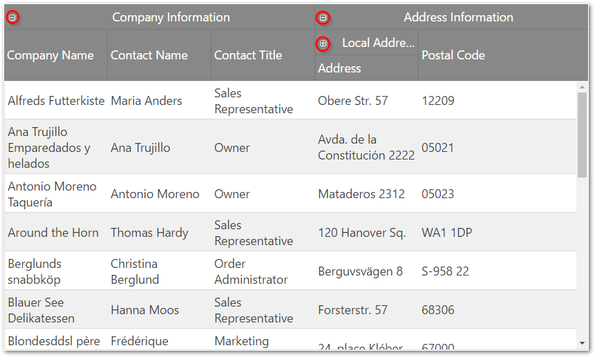

<!--
|metadata|
{
    "fileName": "iggrid-multicolumnheaders-multicolumnheaders",
    "controlName": "igGrid",
    "tags": ["API","Getting Started","Grids","Layouts"]
}
|metadata|
-->

# Multi-Column Headers Overview (igGrid)

## Topic Overview

### Purpose

This topic explains the `igGrid`™ multi-column headers feature.

### Required background

The following topics are prerequisites to understanding this topic:

- [igGrid Overview](igGrid-Overview.html): This topic explains how to add igGrid to a web page.

- [igGrid/igDataSource Architecture Overview](igGrid-igDataSource-Architecture-Overview.html): This topic explains the inner workings of `igGrid` and how it collaborates with `igDataSource` to enable binding to different data sources.

### In this topic

This topic contains the following sections:

-   [Introduction](#introduction)
-	[Collapsible column groups](#collapsible-column-groups)
-   [Multi-column headers Property Reference](#property-reference)
-   [Multi-column headers Method Reference](#method-reference)
-   [Other features integration reference](#features-integration)
-   [Related Content](#related-content)


## <a id="introduction"></a> Introduction

The multi-column headers feature provides header grouping. To accomplish this in the `igGrid.options.columns` array, there is a new property off of each column object called group. This property can contain an array of other column definitions. The `group` property is cascading, which means that you can group multi-column headers together. When defining a grouped column you can set the `headerText`, `key` and the `rowspan` properties (all of the properties are not mandatory). The `headerText` property is used to set the group caption, `key` is used to reference the column group when used with other features, and `rowspan` is used to adjust the span of the group header cell.  The multi-column headers API is exposed through the grid’s column objects. As with other features, you must add it to the `igGrid`.options.features array and also reference in the feature’s JavaScript files.

There are two type of cells in the multi-column headers feature:

1.  Table header cell – this is a header cell which is directly mapped to leaf column in the columns hierarchy. A leaf column is bound to data and its key option is the data source column key. This column cannot have children i.e. does not contain a group option.
2.  Group header cell – this cell is mapped to a parent column which is not data bound. The column key property is automatically generated or manually defined, but should always be unique. This column has a group option defined.

In the DOM, the multi-column headers feature alters the THEAD element. The number of rows (TR) in the THEAD is equal to the number of levels in the column hierarchy. Each table row has a `data-mch-level` attribute which marks the row level from bottom to top.

Individual column header cells (TH) have the `rowspan` attribute set by the `rowspan` property of the column or is automatically calculated by the multi-column header feature.

Data bound column header cells (TH) have the `data-isheadercell` attribute set to true.

Group columns have the `data-mch-id` attribute set to the `key` property of the column or they are automatically generated by the multi-column header feature.

> **Note:**
> When you try to get the grid columns by using the API `$(“.selector”).igGrid(“option”, “columns”)` you will get the flat view of the actual data columns. If you want to get the actual column hierarchy of multi-column headers you should use `getMultiColumnHeaders` method.
> 
> Example: `var columnDefinitions = $(".selector ").igGridMultiColumnHeaders("getMultiColumnHeaders");`

In the following screenshot, you can see a multi-column header configured for the `CompanyName`, `ContactName` and `ContactTitle` columns of the Customers table in the Northwind database.


The following sample demonstrates how to configure Multi-Column Headers:

<div class="embed-sample">
   [Multi-Column Headers](%%SamplesEmbedUrl%%/grid/multi-column-headers)
</div>


## <a id="collapsible-column-groups"></a> Collapsible column groups

Collapsible Column Groups is a part of the multi-column headers feature which provides a way to collapse/expand a column group to a smaller set of data. A column group usually consists of two or more columns. When a column group is collapsed, a subset of the columns will be shown to the end-user. This subset can be one or more of the previously shown columns, or an entirely new set of columns. Each collapsed/expanded column can be bound to the data source of the grid, or it may be unbound, thus calculated.

A group can be expanded/collapsed by clicking on its expand/collapse header indicator.



This functionality can be controlled by manipulating the `expanded`, `allowGroupCollapsing` and `hidden` properties of the `groupOptions` object.

## <a id="property-reference"></a> Multi-column headers Property Reference

This section describes the various properties of `igGridMultiColumnHeaders` feature.

The following table summarizes the purpose and functionality of the `igGridMultiColumnHeaders` control’s featured properties.

- [group](%%jQueryApiUrl%%/ui.iggrid#options:columns.group): If a column has a `group` property this column is a group column and it’s not bound to data from the data source. Parent columns are for display purposes only, i.e. they are rendered only in the THEAD of the grid.

- [groupOptions](%%jQueryApiUrl%%/ui.iggrid#options:columns.groupOptions): The options of the `group`.

- [groupOptions.expanded](%%jQueryApiUrl%%/ui.iggrid#options:columns.groupOptions.expanded): Makes the `group` expanded or collapsed. This property is applied only if we have `allowGroupCollapsing` enabled.

- [groupOptions.allowGroupCollapsing](%%jQueryApiUrl%%/ui.iggrid#options:columns.groupOptions.allowGroupCollapsing): Allows to collapse/expand a `group` and makes expansion indicators visible in the group header.

- [groupOptions.hidden](%%jQueryApiUrl%%/ui.iggrid#options:columns.groupOptions.hidden): Controls when should the group be hidden. This property is applied only if we have `allowGroupCollapsing` enabled. There are four options for group hiding: never , always, when the parent group is collapsed and when the parent group is expanded.

- [headerText](%%jQueryApiUrl%%/ui.iggrid#options:columns.headerText): The caption of the column.

- [key](%%jQueryApiUrl%%/ui.iggrid#options:columns.key): Group columns accept a key property whose value is used as an identifier when the multi-column headers feature is used in combination with other features. For example, use the `key` of the group column to initially hide the group. However, the value of the `key` property should not be a column key from the data source. If the `key` is not specified, then it is generated automatically. Each `key` value must be unique in the `columns` array.

- [rowspan](%%jQueryApiUrl%%/ui.iggrid#options:columns.rowspan): Allows you to modify the `rowspan` attribute of the table header cell.

	By default, table header cells have the maximum possible rowspan depending on the level on which they are defined.

	By default, group header cells don’t have a `rowspan` defined. When you set a custom `rowspan` for group columns, it is recommended to set the `rowspan` for all cells in the column where necessary.

	The sum of the `rowspan` for column cells should not exceed the number of the table rows defined.

	Example:
	
	**In HTML:**
	
	```html
	<thead>
	    <tr><th rowspan="2">Address Information</th><th>row 1</th></tr>
	    <tr><th>row 2</th></tr>
	    <tr><th rowspan="2">Local address</th><th>row 3</th></tr>
	    <tr><th>row 4</th></tr>
	</thead>
	```
	
	In the example above there are four table rows. For the first column there are *Address Information* and *Local address* cells which have `rowspan` set to 2. The sum of the `rowspan` is 4 which is equal to the number of the rows defined in the THEAD element.
	
	When a `rowspan` is not specified then the row span is calculated by the multi-column headers automatically to fit the maximum rows from the header depending on the row level.

- [hidden](%%jQueryApiUrl%%/ui.iggrid#options:columns.hidden): You can use the `hidden` property to initially hide a group column.


## <a id="method-reference"></a> Multi-column headers Method Reference

You can alter the multi-column headers at runtime by using the method [`renderMultiColumnHeader`](%%jQueryApiUrl%%/ui.iggrid#methods:renderMultiColumnHeader). This method accepts an array of columns with the new hierarchy. When `renderMultiColumnHeader` is executed, the whole grid is rebound and re-rendered. This is the only way to modify the `igGrid.options.columns` array.

### Method reference summary

The following table summarizes the purpose and functionality of the `igGridMultiColumnHeaders` control’s featured methods.

Method | Description | Parameters
-------|-------------|--------
renderMultiColumnHeader | When called the method re-renders the whole grid (also rebinds to the data source) and renders the cols object.| -   cols - an array of column objects
[getMultiColumnHeaders](%%jQueryApiUrl%%/ui.iggridmulticolumnheaders#methods:getMultiColumnHeaders) | Returns the multi-column headers array. If there are no multi-column headers defined it returns *undefined.* | N/A
[expandGroup](%%jQueryApiUrl%%/ui.iggridmulticolumnheaders#methods:expandGroup) | Expands a group | group key, callback
[collapseGroup](%%jQueryApiUrl%%/ui.iggridmulticolumnheaders#methods:collapseGroup) | Collapses a group | group key, callback
[toggleGroup](%%jQueryApiUrl%%/ui.iggridmulticolumnheaders#methods:toggleGroup) | Toggles a group | group key, callback

## <a id="features-integration"></a> Other features integration reference

This section describes the `igGridMultiColumnHeaders` integration with other features.

### Features integration summary

The following table summarizes the integration between `igGridMultiColumnHeaders` and other `igGrid` features.

<table class="table table-bordered">
	<thead>
		<tr>
            <th>
Feature
			</th>

            <th>
Description
			</th>
        </tr>
	</thead>
	<tbody>
        

        <tr>
            <td>
Hiding
			</td>

            <td>
Through the API you can hide a column group or individual columns by using the key property. <br />

Hiding indicators are rendered for every header cell (TH) so users can hide column group or single column in one click. However column groups are not displayed in the column chooser, so when users unhide columns they have to click on each data bound column. Nevertheless column grouping is restored correctly.
                <blockquote>
Note: The hiding feature is not integrated with multi-column headers with enabled collapsible column groups.
                </blockquote>
			</td>
        </tr>

        <tr>
            <td>
Resizing
			</td>

            <td>
In code you can allow resizing only for table header cells. You cannot disable column groups from the resizing feature’s columnSettings.  <br />
                
Users can resize data bound columns as well as column groups.  <br />

When a column group is resized, its child columns are resized accordingly.

                <blockquote>
Note: Performance of immediate resizing depends on the column hierarchy. You can use deferred resizing when you find such performance degradation.
                </blockquote>
            </td>
        </tr>

        <tr>
            <td>
ColumnMoving
			</td>

            <td>
In code, you can allow moving of column groups or individual columns by using their key property. <br />

Users can move both column group or individual column, but the moving is only within the same level (user can re-arrange only sibling columns). For example an individual column cannot be moved between column groups or in a parent group. <br />

Moving indicators are rendered for every header cell (TH) so users can move column groups or individual columns in one click. Column groups are displayed in the column dialog and users can move column groups as well as individual columns.
			</td>
        </tr>
    </tbody>
</table>


## <a id="related-content"></a> Related Content

### Topics

The following topics provide additional information related to this topic.

- [Configure Multi-Column Headers (igGrid)](igGrid-MultiColumnHeaders-Configuring.html): This topic walks you through configuring multi-column headers in `igGrid`.

- [Configure Column Hiding](igGrid-Configure-Column-Hiding.html): This topic explains how to configure the columns of the `igGrid` control in code.

- [Column Resizing (igGrid)](igGrid-Column-Resizing.html): This topic explains the column resizing functionality of the `igGrid` control.


### Samples

The following samples provide additional information related to this topic.

- [Collapsible Multi-Column Headers](%%SamplesUrl%%/grid/collapsible-column-groups): This sample shows how to configure collapsible multi-column headers.


 

 


