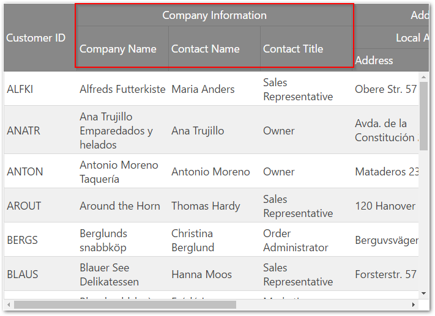
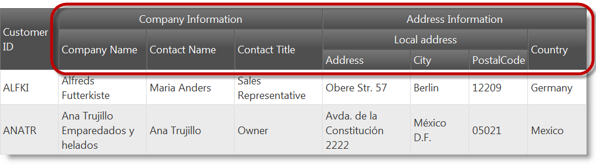
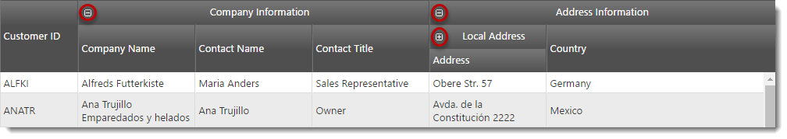
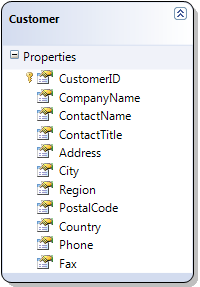

<!--
|metadata|
{
    "fileName": "iggrid-multicolumnheaders-configuring",
    "controlName": "igGrid",
    "tags": ["Grids","How Do I","Layouts"]
}
|metadata|
-->

# Configuring Multi-Column Headers (igGrid)

## Topic Overview

### Purpose

This topic explains how to configure the `igGrid`™ multi-column headers feature.

### Required background

The following topics are prerequisites to understanding this topic:

- [Multi-Column Headers (igGrid)](igGrid-MultiColumnHeaders-MultiColumnHeaders.html): This topic explains the `igGrid` multi-column headers feature.


### In this topic

This topic contains the following sections:

-   [**Introduction**](#introduction)
-   [**Configuring Multi-Column Headers in JavaScript**](#js)
    -   [Preview](#js-preview)
    -   [Overview](#js-overview)
    -   [Steps](#js-steps)
-	[**Configuring Collapsible Column Groups in JavaScript**](#ccg-js)
	-	[Preview](#ccg-js-preview)
	-	[Overview](#ccg-js-overview)
	-	[Steps](#ccg-js-steps)
-   [**Configuring Multi-Column Headers in ASP.NET MVC**](#mvc)
    -   [Preview](#mvc-preview)
    -   [Requirements](#mvc-requirements)
    -   [Overview](#mvc-overview)
    -   [Steps](#mvc-steps)
-	[**Configuring Collapsible Column Groups in ASP.NET MVC**](#ccg-mvc)
    -   [Preview](#ccg-mvc-preview)
    -   [Requirements](#ccg-mvc-requirements)
    -   [Overview](#ccg-mvc-overview)
    -   [Steps](#ccg-mvc-steps)
-   [**Related Content**](#related-content)
    -   [Topics](#topics)
    -   [Samples](#samples)


## <a id="introduction"></a> Introduction

The multi-column headers feature provides header grouping. To accomplish this in the `igGrid.options.columns` array, there is a new option off of each column object called group. This option can contain an array of other column definitions. The `group` option is cascading, which means that you can group multi-column headers together. When defining a grouped column you can set the `headerText`, key and the `rowspan` properties. The `headerText` option is used to set the group caption, key is used to reference the column group when used with other features, and `rowspan` is used to adjust the span of the group header cell.  The multi-column headers API is exposed through the grid’s column objects. As with other features, you must add it to the `igGrid`.options.features array and also reference in the feature’s JavaScript files.  In the following screenshot, you see a multi-column header configured for the `CompanyName`, `ContactName` and `ContactTitle` columns.




## <a id="js"></a> Configuring Multi-Column Headers in JavaScript

This procedure guides you through the process of configuring multi-column headers in the `igGrid`.

### <a id="js-preview"></a> Preview

The following screenshot is a preview of the final result.



### <a id="js-overview"></a> Overview

Following is a conceptual overview of the process:

1. [Referencing the required JavaScript and CSS files](#js-reference-resources)
2. [Defining sample data](#js-define-the-data)
3. [Defining the HTML placeholder](#js-define-the-html-placeholder)
4. [Instantiating the igGrid](#js-instantiate-the-grid)

### <a id="js-steps"></a> Steps

The following steps demonstrate how to configure multi-column headers in `igGrid`.

1. Reference the required JavaScript and CSS files. <a id="js-reference-resources"></a>
	
	The following code snippet is using Infragistics loader to reference Multi-Column Headers feature
	
	**In HTML:**
	
	```html
	<script src="jquery.min.js" type="text/javascript"></script>
	<script src="jquery-ui.min.js" type="text/javascript"></script> 
	<script src="infragistics.loader.js"></script>
	```
	
	**In JavaScript:**
	
	```js
	<script type="text/javascript">
	    $.ig.loader({
	        scriptPath: "http://localhost/ig_ui/js/",
	        cssPath: "http://localhost/ig_ui/css/",
	        resources: "igGrid.MultiColumnHeaders"
	    });
	</script>
	```

2. Define the data to bind to. <a id="js-define-the-data"></a>
	
	The following code defines a JavaScript array of objects. This data is used as the igGrid’s data source.
	
	**In JavaScript:**
	
	```js
	var northwindCustomers = [
	{
	    "CustomerID": "ALFKI",
	    "CompanyName": "Alfreds Futterkiste",
	    "ContactName": "Maria Anders",
	    "ContactTitle": "Sales Representative",
	    "Address": "Obere Str. 57",
	    "City": "Berlin",
	    "Region": null,
	    "PostalCode": "12209",
	    "Country": "Germany",
	    "Phone": "030-0074321",
	    "Fax": "030-0076545"
	}, {
	    "CustomerID": "ANATR",
	    "CompanyName": "Ana Trujillo Emparedados y helados",
	    "ContactName": "Ana Trujillo",
	    "ContactTitle": "Owner",
	    "Address": "Avda. de la Constituciu00f3n 2222",
	    "City": "Mu00e9xico D.F.",
	    "Region": null,
	    "PostalCode": "05021",
	    "Country": "Mexico",
	    "Phone": "(5) 555-4729",
	    "Fax": "(5) 555-3745"
	}];
	```

3. Define the HTML placeholder. <a id="js-define-the-html-placeholder"></a>

	**In HTML:**
	
	```html
	<table id="grid1"></table>
	```

4. Instantiate the `igGrid`. <a id="js-instantiate-the-grid"></a>

	In the following code, there are two groups defined.  The first is named “Company Information” and contains `CompanyName`, `ContactName` and `ContactTitle` columns.
	
	The second is called “Address Information” and contains a `Country` column as well as another group column. The inner group is named “Local address” and contains the `Address`, `City` and `PostalCode` columns.
	
	**In JavaScript:**
	
	```js
	$.ig.loader(function () {
	    $("#grid1").igGrid({
	        autoGenerateColumns: false,
	        dataSource: northwindCustomers,
	        columns: [
	            { headerText: "Customer ID", key: "CustomerID", width: "100px" },
	            { headerText: "Company Information",
	                group: [
	                    { headerText: "Company Name", key: "CompanyName", width: "150px" },
	                    { headerText: "Contact Name", key: "ContactName", width: "150px" },
	                    { headerText: "Contact Title", key: "ContactTitle", width: "150px" }
	                ]
	            },
	            { headerText: "Address Information", columnKey: "AddressInformation",
	            group: [
	                { headerText: "Local address",
	                    group: [
	                        { headerText: "Address", key: "Address", width: "150px" },
	                        { headerText: "City", key: "City", width: "100px" },
	                        { headerText: "PostalCode", key: "PostalCode", width: "100px" }
	                    ]
	                },
	                { headerText: "Country", key: "Country", width: "100px" }
	            ]}
	        ],
	        features: [
	            {
	                name: 'MultiColumnHeaders'
	            }
	        ]
	    });
	});
	```

## <a id="ccg-js"></a> Configuring Collapsible Column Groups in JavaScript

This procedure guides you through the process of configuring multi-column headers with collapsible column groups in the `igGrid`.

### <a id="ccg-js-preview"></a> Preview

The following screenshot is a preview of the final result.



### <a id="ccg-js-overview"></a> Overview

Following is a conceptual overview of the process:

1. [Referencing the required JavaScript and CSS files](#ccg-js-reference-resources)
2. [Defining sample data](#ccg-js-define-the-data)
3. [Defining the HTML placeholder](#ccg-js-define-the-html-placeholder)
4. [Instantiating the igGrid](#ccg-js-instantiate-the-grid)

### <a id="ccg-js-steps"></a> Steps

The following steps demonstrate how to configure multi-column headers with collapsible column groups in `igGrid`.

1. Reference the required JavaScript and CSS files. <a id="ccg-js-reference-resources"></a>
	
	The following code snippet is using Infragistics loader to reference Multi-Column Headers feature
	
	**In HTML:**
	
	```html
	<script src="jquery.min.js" type="text/javascript"></script>
	<script src="jquery-ui.min.js" type="text/javascript"></script> 
	<script src="infragistics.loader.js"></script>
	```
	
	**In JavaScript:**
	
	```js
	<script type="text/javascript">
	    $.ig.loader({
	        scriptPath: "http://localhost/ig_ui/js/",
	        cssPath: "http://localhost/ig_ui/css/",
	        resources: "igGrid.MultiColumnHeaders"
	    });
	</script>
	```

2. Define the data to bind to. <a id="ccg-js-define-the-data"></a>
	
	The following code defines a JavaScript array of objects. This data is used as the igGrid’s data source.
	
	**In JavaScript:**
	
	```js
	var northwindCustomers = [
	{
	    "CustomerID": "ALFKI",
	    "CompanyName": "Alfreds Futterkiste",
	    "ContactName": "Maria Anders",
	    "ContactTitle": "Sales Representative",
	    "Address": "Obere Str. 57",
	    "City": "Berlin",
	    "Region": null,
	    "PostalCode": "12209",
	    "Country": "Germany",
	    "Phone": "030-0074321",
	    "Fax": "030-0076545"
	}, {
	    "CustomerID": "ANATR",
	    "CompanyName": "Ana Trujillo Emparedados y helados",
	    "ContactName": "Ana Trujillo",
	    "ContactTitle": "Owner",
	    "Address": "Avda. de la Constituciu00f3n 2222",
	    "City": "Mu00e9xico D.F.",
	    "Region": null,
	    "PostalCode": "05021",
	    "Country": "Mexico",
	    "Phone": "(5) 555-4729",
	    "Fax": "(5) 555-3745"
	}];
	```

3. Define the HTML placeholder. <a id="ccg-js-define-the-html-placeholder"></a>

	**In HTML:**
	
	```html
	<table id="grid1"></table>
	```

4. Instantiate the `igGrid`. <a id="ccg-js-instantiate-the-grid"></a>

	In the following code, there are two groups defined.  The first is named “Company Information” and contains `CompanyName`, `ContactName` and `ContactTitle` columns.
	
	The second is called “Address Information” and contains `Country` and `Full Address` columns as well as another group column. The inner group is named “Local address” and contains the `Address`, `City` and `PostalCode` columns.

	The “Company Information” group is collapsible and expanded initially. When it collapses, only the `ComapnyName` column is visible.

	The “Address Information” group is also expanded intitially. When it collapses, an unbounded `FullAddress` column is shown.

	The “Local address” group is initially collapsed with only `Address` column shown. When expanded, the `City` and `PostalCode` columns become visible.
	
	**In JavaScript:**
	
	```js
	$.ig.loader(function () {
	    $("#grid1").igGrid({
	        autoGenerateColumns: false,
	        dataSource: northwindCustomers,
	        columns: [
                { headerText: "Customer ID", key: "CustomerID", dataType: "string", width: "100px" },
                {
                    headerText: "Company Information",
                    group: [
                        {
                            headerText: "Company Name",
                            key: "CompanyName",
                            dataType: "string",
                            width: "150px"
                        },
                        {
                            headerText: "Contact Name",
                            key: "ContactName",
                            dataType: "string",
                            width: "150px",
                            groupOptions: {
                                hidden: "parentcollapsed"
                            }
                        },
                        {
                            headerText: "Contact Title",
                            key: "ContactTitle",
                            dataType: "string",
                            width: "150px",
                            groupOptions: {
                                hidden: "parentcollapsed"
                            }
                        }
                    ],
                    groupOptions: {
                        expanded: true,
                        allowGroupCollapsing: true
                    }
                },
                {
                    headerText: "Address Information",
                    group: [
                        {
                            headerText: "Local Address",
                            group: [
                                {
                                    headerText: "Address",
                                    key: "Address",
                                    dataType: "string",
                                    width: "150px"
                                },
                                {
                                    headerText: "City",
                                    key: "City",
                                    dataType: "string",
                                    width: "100px",
                                    groupOptions: {
                                        hidden: "parentcollapsed"
                                    }
                                },
                                {
                                    headerText: "Postal Code",
                                    key: "PostalCode",
                                    dataType: "string",
                                    width: "100px",
                                    groupOptions: {
                                        hidden: "parentcollapsed"
                                    }
                                }
                            ],
                            groupOptions: {
                                expanded: false,
                                allowGroupCollapsing: true,
                                hidden: "parentcollapsed"
                            }
                        },                            
                        {
                            headerText: "Country",
                            key: "Country",
                            width: "100px",
                            groupOptions: {
                                hidden: "parentcollapsed"
                            }
                        },
                        {
                            headerText: "Full Address",
                            width: "200px",
                            key: "FullAddress",
                            dataType: "string",
                            unbound: true,
                            formula: function (data, grid) {
                                return data["Address"] + ", " + data["City"];
                            },
                            groupOptions: {
                                hidden: "parentexpanded"
                            }
                        }
                    ],
                    groupOptions: {
                        expanded: true,
                        allowGroupCollapsing: true
                    }
                }
            ],
	        features: [
	            {
	                name: 'MultiColumnHeaders'
	            }
	        ]
	    });
	});
	```


## <a id="mvc"></a> Configuring Multi-Column Headers in ASP.NET MVC

This procedure guides you through the process of configuring multi-column headers in the `igGrid`.

### <a id="mvc-preview"></a> Preview

The following screenshot is a preview of the final result.


### <a id="mvc-requirements"></a> Requirements

To complete the procedure, you need the following:

-   Microsoft ® Visual Studio 2010 or newer installed
-   ASP.NET MVC 3 or newer Framework installed
-   The Northwind Database installed
-   A reference to the Infragistics.Web.Mvc.dll assembly
-   Ignite UI JavaScript and theme resources

### <a id="mvc-overview"></a> Overview

Following is a conceptual overview of the process:

1. [Referencing the required JavaScript and CSS files](#mvc-reference-resources)
2. [Defining the model](#mvc-define-model)
3. [Defining the view](#mvc-define-view)
4. [Defining the controller](#mvc-define-controller)

### <a id="mvc-steps"></a> Steps

The following steps demonstrate how to configure multi-column headers in `igGrid`.

1. Reference the required JavaScript and CSS files <a id="mvc-reference-resources"></a>

	In the Index.cshtml View, add the required JavaScript references and instantiate the Infragistics loader.
	
	The following code snippet is using the Infragistics loader to reference the Multi-Column Headers feature
	
	**In HTML:**
	
	```html
	<script src="jquery.min.js" type="text/javascript"></script>
	<script src="jquery-ui.min.js" type="text/javascript"></script> 
	<script src="infragistics.loader.js"></script>
	```
	
	**In C#:**
	
	```csharp
	@Html.Infragistics()
	.Loader()
	.ScriptPath("http://localhost/ig_ui/js/")
	.CssPath("http://localhost/ig_ui/css/")
	.Resources("igGrid.MultiColumnHeaders")
	.Render()
	```

2. Define the model <a id="mvc-define-model"></a>

	Add an ADO.NET Entity Data Model for the Customers table of the Northwind Database and name it NorthwindModel.
	
	

3. Define the view <a id="mvc-define-view"></a>

	Open the Index.cshtml View and add the code below.
	
	In the code there are two groups defined.  The first is named “Company Information” and contains the `CompanyName`, `ContactName` and `ContactTitle` columns.
	
	The second group is called “Address Information” and contains a Country column as well as another group column. The inner group is named “Local address” and contains the `Address`, `City` and `PostalCode` columns.
	
	**In C#:**
	
	```csharp
	@Html.Infragistics().Grid(Model)
	.AutoGenerateColumns(false)
	.ID("grid1")
	.PrimaryKey("CustomerID")
	.Height("400px")
	.Width("100%")
	.Columns(column =>
	{
	    column.For(x => x.CustomerID).HeaderText("Customer ID").Width("100px");
	    column.MultiColumnHeader().HeaderText("Company Information").Group(c => {
	        c.For(x => x.CompanyName).HeaderText("Company Name").Width("150px");
	        c.For(x => x.ContactName).HeaderText("Contact Name").Width("150px");
	        c.For(x => x.ContactTitle).HeaderText("Contact Title").Width("150px");
	    });
	    column.MultiColumnHeader().HeaderText("Address Information").Group(c => {
	        c.MultiColumnHeader().HeaderText("Local address").Group(c2 => {
	            c2.For(x => x.Address).HeaderText("Address").Width("150px");
	            c2.For(x => x.City).HeaderText("City").Width("100px");
	            c2.For(x => x.PostalCode).HeaderText("PostalCode").Width("100px");
	        });
	    });
	    column.For(x => x.Country).HeaderText("Country").Width("100px");
	})
	.Features(features => { 
	    features.MultiColumnHeaders();
	})
	.DataBind().Render()
	```

	> **Note:**
	> Column key for multi-column header can be set by passing the key as argument to MultiColumnHeader chaining method.
	> Example: MultiColumnHeader(“companyInformation”)

4. Define the controller <a id="mvc-define-controller"></a>

	In the Home controller’s Index action method, extract the Customers data from the Northwind database and return it with the View:
	
	**In C#:**
	
	```csharp
	public ActionResult Index()
	{
	    var dataContext = new NorthwindDataContext();
	    var customers = dataContext.Customers.AsQueryable();
	    return View(customers);
	}
	```


## <a id="ccg-mvc"></a> Configuring Collapsible Column Groups in ASP.NET MVC

This procedure guides you through the process of configuring multi-column headers with collapsible column groups in the `igGrid`.

### <a id="ccg-mvc-preview"></a> Preview

The following screenshot is a preview of the final result.


### <a id="ccg-mvc-requirements"></a> Requirements

To complete the procedure, you need the following:

-   Microsoft ® Visual Studio 2010 or newer installed
-   ASP.NET MVC 3 or newer Framework installed
-   The Northwind Database installed
-   A reference to the Infragistics.Web.Mvc.dll assembly
-   Ignite UI JavaScript and theme resources

### <a id="ccg-mvc-overview"></a> Overview

Following is a conceptual overview of the process:

1. [Referencing the required JavaScript and CSS files](#ccg-mvc-reference-resources)
2. [Defining the model](#ccg-mvc-define-model)
3. [Defining the view](#ccg-mvc-define-view)
4. [Defining the controller](#ccg-mvc-define-controller)

### <a id="ccg-mvc-steps"></a> Steps

The following steps demonstrate how to configure multi-column headers in `igGrid`.

1. Reference the required JavaScript and CSS files <a id="ccg-mvc-reference-resources"></a>

	In the Index.cshtml View, add the required JavaScript references and instantiate the Infragistics loader.
	
	The following code snippet is using the Infragistics loader to reference the Multi-Column Headers feature
	
	**In HTML:**
	
	```html
	<script src="jquery.min.js" type="text/javascript"></script>
	<script src="jquery-ui.min.js" type="text/javascript"></script> 
	<script src="infragistics.loader.js"></script>
	```
	
	**In C#:**
	
	```csharp
	@Html.Infragistics()
	.Loader()
	.ScriptPath("http://localhost/ig_ui/js/")
	.CssPath("http://localhost/ig_ui/css/")
	.Resources("igGrid.MultiColumnHeaders")
	.Render()
	```

2. Define the model <a id="ccg-mvc-define-model"></a>

	Add an ADO.NET Entity Data Model for the Customers table of the Northwind Database and name it NorthwindModel.
	
	

3. Define the view <a id="ccg-mvc-define-view"></a>

	Open the Index.cshtml View and add the code below.
	
	In the following code, there are two groups defined.  The first is named “Company Information” and contains `CompanyName`, `ContactName` and `ContactTitle` columns.
	
	The second is called “Address Information” and contains `Country` and `Full Address` columns as well as another group column. The inner group is named “Local address” and contains the `Address`, `City` and `PostalCode` columns.

	The “Company Information” group is collapsible and expanded initially. When it collapses, only the `ComapnyName` column is visible.

	The “Address Information” group is also expanded intitially. When it collapses, an unbounded `FullAddress` column is shown.

	The “Local address” group is initially collapsed with only `Address` column shown. When expanded, the `City` and `PostalCode` columns become visible.
	
	**In C#:**
	
	```csharp
	@Html.Infragistics().Grid(Model)
	.AutoGenerateColumns(false)
	.ID("grid1")
	.PrimaryKey("CustomerID")
	.Height("400px")
	.Width("100%")
    .Columns(column =>
    {
        column.For(x => x.CustomerID).HeaderText("Customer ID").Width("100px");
        column.MultiColumnHeader().HeaderText("Company Information")
            .Group(c =>
            {
                c.For(x => x.CompanyName).HeaderText("Company Name").Width("150px");
                c.For(x => x.ContactName).HeaderText("Contact Name").Width("150px")
                    .GroupOptions(go => go.Hidden(CollapsibleGroupHidden.ParentCollapsed));
                c.For(x => x.ContactTitle).HeaderText("Contact Title").Width("150px")
                    .GroupOptions(go => go.Hidden(CollapsibleGroupHidden.ParentCollapsed)); ;
            })
            .GroupOptions(go => go.AllowGroupCollapsing(true).Expanded(true));

        column.MultiColumnHeader().HeaderText("Address Information")
            .Group(c =>
            {
                c.MultiColumnHeader().HeaderText("Local address")
                    .Group(c2 =>
                    {
                        c2.For(x => x.Address).HeaderText("Address").Width("150px");
                        c2.For(x => x.City).HeaderText("City").Width("100px")
                            .GroupOptions(go => go.Hidden(CollapsibleGroupHidden.ParentCollapsed));
                        c2.For(x => x.PostalCode).HeaderText("PostalCode").Width("100px")
                            .GroupOptions(go => go.Hidden(CollapsibleGroupHidden.ParentCollapsed));
                    })
                .GroupOptions(go => go.AllowGroupCollapsing(true).Expanded(false)
                .Hidden(CollapsibleGroupHidden.ParentCollapsed));

                c.For(x => x.Country).HeaderText("Country").Width("100px")
                    .GroupOptions(go => go.Hidden(CollapsibleGroupHidden.ParentCollapsed));
                c.Unbound("FullAddress").HeaderText("Full Address").Width("200px").Formula("fullAddressFormula")
                    .GroupOptions(go => go.Hidden(CollapsibleGroupHidden.ParentExpanded));
            })
            .GroupOptions(go => go.AllowGroupCollapsing(true).Expanded(true));

    })
	.Features(features => { 
	    features.MultiColumnHeaders();
	})
	.DataBind().Render()
	```

	> **Note:**
	> Column key for multi-column header can be set by passing the key as argument to MultiColumnHeader chaining method.
	> Example: MultiColumnHeader(“companyInformation”)

4. Define the controller <a id="ccg-mvc-define-controller"></a>

	In the Home controller’s Index action method, extract the Customers data from the Northwind database and return it with the View:
	
	**In C#:**
	
	```csharp
	public ActionResult Index()
	{
	    var dataContext = new NorthwindDataContext();
	    var customers = dataContext.Customers.AsQueryable();
	    return View(customers);
	}
	```


## <a id="related-content"></a> Related Content

### <a id="topics"></a> Topics

The following topics provide additional information related to this topic.

- [igGrid Features](igGrid-Features-Landing-Page.html): Landing page for topics related to `igGrid` features.


### <a id="samples"></a> Samples

The following sample provides additional information related to this topic.

- [Collapsible Column Groups](%%SamplesUrl%%/grid/collapsible-column-groups): This sample shows how to configure multi-column headers with collapsible column groups.


 

 


