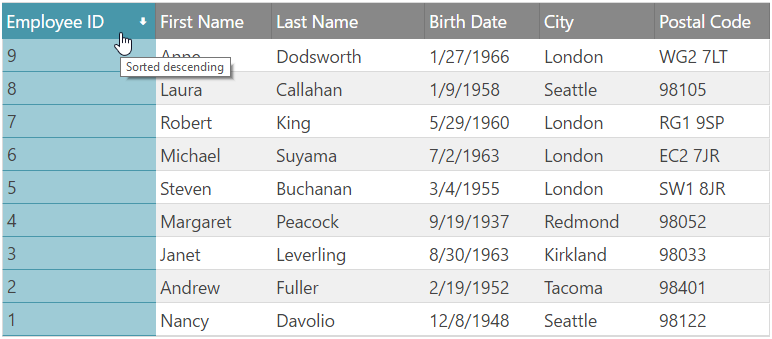

<!--
|metadata|
{
    "fileName": "iggrid-sorting-overview",
    "controlName": "igGrid",
    "tags": ["Sorting"]
}
|metadata|
-->

# Sorting Overview (igGrid)

## Overview
The igGrid control sorting feature enables single or multiple column sorting in an ascending or descending order.

### In this topic

This topic contains the following sections:

-   [Sorting Persistence](#persistence)
-   [Sorting Modes](#modes)
-   [Configuration Considerations](#considerations)
-   [Enabling Sorting](#enable)
-   [Column Settings](#column-settings)
-   [Remote Sorting](#remote)
-   [API Usage](#api)
-   [Client-Side events](#client-side-events)
-   [Sorting options](#properties)
-   [List of Sorting CSS classes](#css)
-   [Related Content](#related-content)


## <a id="persistence"></a> Sorting Persistence

Persisting Sorting between `igGrid` re-bindings is made easy in version 14.1 and in fact replaces the previous default behavior.

> **Note:** Sorting persistence is `true` by default. This is a breaking change.

When you enable `igGridSorting` you are already using it in a [`persist`](%%jQueryApiUrl%%/ui.iggridsorting#options:persist) mode. This means that after explicitly calls of `dataBind()`, that persistence is applied for UI and data source view (the sorting indicators and the CSS classes are applied, the data source remains sorted)

Sorting persistence is implemented for `igHierarchicalGrid` too.

If you would like to retain the previous behavior of sorting being cleared after user re-binds the `igGrid`, you can do this by disabling the feature through the [`persist`](%%jQueryApiUrl%%/ui.iggridsorting#options:persist) option as shown in the code snippet below:

**In JavaScript:**

```js
features: [
  { 
     name: "Sorting", 
     persist: false 
  }
] 
```

## <a id="modes"></a> Sorting Modes
Sorting can be configured to operate either locally or remotely. In the first case, sorting is done entirely on the client, without the need of any server requests. In the case of remote sorting, the grid encodes the necessary URL parameters so the server can retrieve information about which columns must be sorted.

## <a id="considerations"></a> Configuration Considerations
-   Sorting may be configured to support single or multiple column sorting. Sorting modes are controlled by changing the mode option to single or multiple.
-   Multiple Sorting allows you to remove sorting.
-   You can unsort a column, by pressing SHIFT + click on the header of the `igGrid` column you want to unsort.
-   The [Multiple Sorting Dialog](igGrid-Multiple-Sorting-Dialog.html) shows the sorting order of the columns. The column, by which the most recent sorting has been performed, is displayed at the top of the Sorting Dialog list thus moving the previous sort columns down. This way, the “history” of the performed sortings is retained in the list indicating at the same time the second, third and so on sort order columns. For more information about the Sorting-Dialog-specific properties and events refer to the [Multiple Sorting Dialog](igGrid-Multiple-Sorting-Dialog.html) topic.
-   You can control sorting on a column-level by modifying the `columnSettings` object. For example you can disable sorting for a particular column, or specify that you would like it to be sorted in an ascending order by default.
-   Sorting can also be case sensitive, which can be turned on by setting the `caseSensitive` option to true. This options works only for local sorting.
-   Once the sorting widget is instantiated, it modifies the column header by injecting markup that allows for the various active, focus and sorted styles to be applied, including the sort indicator.
-   Sorting is implemented as a jQuery UI widget, which follows the lifecycle of any jQuery UI widget.
-   The grid framework is responsible of creating and destroying the sorting widget.
-   All sortable columns can be sorted and navigated through the keyboard using the TAB and Shift+TAB keys. 
    

Figure 1: The igGrid control sorting UI

## <a id="enable"></a> Enabling Sorting

The sample below demonstrates how to enable the Sorting feature:

<div class="embed-sample">
   [Sorting](%%SamplesEmbedUrl%%/grid/sorting-local)
</div>

The following code snippet shows how to enable Sorting in ASPX (MVC)

**In ASPX (MVC):**

```csharp
<%= Html.Infragistics().Grid(Model).ID("grid1").Columns(column =>
    {
        column.For(x => x.EmployeeID).HeaderText("Employee ID").Width("15%");
        column.For(x => x.FirstName).HeaderText("First Name").Width("20%");
        column.For(x => x.LastName).HeaderText("Last Name").Width("20%");
        column.For(x => x.BirthDate).HeaderText("Birth Date").Width("15%");
        column.For(x => x.City).HeaderText("City").Width("15%");
        column.For(x => x.PostalCode).HeaderText("Postal Code").Width("15%");
    }).Features(features => {
        features.Sorting().Type(OpType.Local).CaseSensitive(true);
    })
	.Height("500")
	.DataSourceUrl(Url.Action("PagingGetData"))
	.DataBind()
	.Render()%>
```

If you would like to provide a custom sorting function, please refer to the `customSortFunction` option.

## <a id="column-settings"></a> Column Settings

Each column is configurable with the columnSettings options as listed in Table 1.

**Table 1**: The columnSettings object

Property name (default values in parenthesis) | Description
---|---
`columnKey`( string col name) | Data key of the column
`allowSorting` (true) | Specifies if this column is allowed to participate in sorting
`firstSortDirection` (undefined) | Sorting direction when the column is first clicked
`currentSortDirection` (undefined) | Initial (default) sorting direction. When invoked at runtime, gives the current direction of sorting for the particular column.


**In JavaScript:**

```js
$("#grid1").igGrid({
    columns: [
        { headerText: "Product ID", key: "ProductID", dataType: "number" },
        { headerText: "Product Name", key: "Name", dataType: "string" },
        { headerText: "Product Number", key: "ProductNumber", dataType: "string" },
    ],
    width: '500px',
    dataSource: products,
    features: [
        {
            name: 'Sorting',
            columnSettings: [
                    {columnKey: 'ProductID', allowSorting: false}
               ]   
        }
    ]
});
```

## <a id="remote"></a> Remote Sorting

You can control how the URL is encoded when sorting is performed by setting the `sortUrlKey` option. The `sortUrlKey` is null by default, therefore the encoding follows oData standards for URI format, as described here:

[**http://www.odata.org/documentation/odata-version-2-0/uri-conventions/**](http://www.odata.org/documentation/odata-version-2-0/uri-conventions/)

## <a id="api"></a> API Usage

In order to sort a column programmatically, you can do this in the following way:

Listing 5: Programatically sorting a column

**In JavaScript:**

```js
$('#grid1').igGridSorting('sortColumn', 'ProductID', 'asc');
```

The applied sorting expressions can be retrieved from the data source of the grid. In order to get them programmatically, you can use the following:

Listing 6: Retrieving the applied sorting expressions

**In JavaScript:**

```js
var expressions = $('#grid1').data('igGrid').dataSource.settings.sorting.expressions;
```

Listing 7: Retrieving the `columnSettings` object


**In JavaScript:**

```js
var sorting = $('#grid1').data('igGridSorting');
var settings = sorting.options.columnSettings; 
```

## <a id="client-side-events"></a> Client-Side events

You can bind to client-side events to the Sorting feature in two ways, which are described in Listing 8 and Listing 9, respectively.

Listing 8: Binding to client-side events from anywhere in your application

**In JavaScript:**

```js
$("#grid1").bind("iggridsortingcolumnsorted", handler);
```

> **Note:** If you would like to bind using the approach described in Listing 8, you must use the jQuery `delegate` method instead of bind if Sorting is not yet instantiated.

Listing 9: Binding to client-side events by specifying the event name as an option when you initialize the Sorting feature (case sensitive)


**In JavaScript:**

```js
$("#grid1").igGrid({
    columns: [
        { headerText: "Product ID", key: "ProductID", dataType: "number" },
        { headerText: "Product Name", key: "Name", dataType: "string" },
        { headerText: "Product Number", key: "ProductNumber", dataType: "string" },
    ],
    width: '500px',
    dataSource: products,
    features: [
        {
            name: 'Sorting',
            columnSorted: handler
        }
    ]
});

//Handler code
function handler(event, args) {

}
```

> **Note:** All "ing" events are cancellable. In order to cancel an "ing" event, its respective event handler must return false.

The grid Sorting feature exposes the client-side events as detailed in Table 2.

> **Note:** In the following Table 2, the events specific to the Multiple Sorting Dialog are not listed. They are available in the [Multiple Sorting Dialog](igGrid-Multiple-Sorting-Dialog.html) topic.

**Table 2**: Argument object definitions for the Sorting feature events

Event Name | Args
---|---
`columnSorting` | columnKey: Column key <br /> owner: Reference to the instance of `igGridSorting` widget  <br /> direction: New sorting direction
`columnSorted` | Same as columnSorting


## <a id="properties"></a> Sorting options

The table in Listing 3 summarizes all sorting options available to instantiate the Sorting widget.

> **Note:** In the following Table 3, the properties specific to the Multiple Sorting Dialog are not listed. They are available in the [Multiple Sorting Dialog](igGrid-Multiple-Sorting-Dialog.html) topic.

**Table 3**: Sorting widget options

<table class="table table-striped">
	<thead>
		<tr>
            <th>
Option name and default value
			</th>

            <th>
Description
			</th>
        </tr>
	</thead>
	<tbody>
        

        <tr>
            <td>
type ("remote")
			</td>

            <td>
Type of the sorting with respect to where data comes from – either client or server. This setting delegates directly to the `igDataSource` instance used by the grid. You can have binding to a remote service, with local sorting, for example.
                Values are remote or local.
			</td>
        </tr>

        <tr>
            <td>
applySortedColumnCss (true)
			</td>

            <td>
If false, the sort will not apply a special "sorted" style to all TD cells of the sorted column.
			</td>
        </tr>

        <tr>
            <td>
caseSensitive (false)
			</td>

            <td>
Enables/disables case sensitive sorting support. This option works only for local sorting.
			</td>
        </tr>

        <tr>
            <td>
sortUrlKey (null)
			</td>

            <td>
The key to encode in the url, which delegates to the data source control. If no URL is set, the oData conventions are used.
			</td>
        </tr>

        <tr>
            <td>
sortUrlKeyAscValue (null)
			</td>

            <td>
Delegates to the `igDataSource` control – states how the URL value for "ascending" state is encoded
			</td>
        </tr>

        <tr>
            <td>
sortUrlKeyDescValue (null)
			</td>

            <td>
Same as sortUrlKeyAscValue
			</td>
        </tr>

        <tr>
            <td>
mode ("single")
			</td>

            <td>
Sorting can be multiple or single (default). When it is single, all previous sorting states are cleared.
			</td>
        </tr>

        <tr>
            <td>
firstSortDirection ("ascending")
			</td>

            <td>
Direction – asc or desc – when the column is clicked for the first time, and hasn’t been sorted before.
			</td>
        </tr>

        <tr>
            <td>
sortedColumnTooltip ('sorted ${direction}')
			</td>

            <td>
Format of the tooltip "title" attribute applied on the TH
			</td>
        </tr>

        <tr>
            <td>
unsortedColumnTooltip ('click to sort column')
			</td>

            <td>
Same as unsortedColumnTooltip but when the column is unsorted
			</td>
        </tr>

        <tr>
            <td>
columnSettings ([])
			</td>

            <td>
A list of column specific sorting settings, see Table 4
			</td>
        </tr>

        <tr>
            <td>
customSortFunction (null)
			</td>

            <td>
                Custom sorting function that accepts as parameters the following:
                <ul>
                    <li>
1. The data array to sort
					</li>

                    <li>
2. An array of fields definitions to sort by, and
					</li>

                    <li>
3. The sorting direction, "asc" or "desc".
					</li>
                </ul>
                Should return the sorted data array.

                Example:

                function myCustomSortFunction (data, [{fieldName: “ProductID”,dir: “asc” }], “asc”) {
                // …
                	return sortedData;
                }

                (The third parameter if optional if every passed field definition already contains the “dir” property.
            </td>
        </tr>
    </tbody>
</table>

## <a id="css"></a> List of Sorting CSS classes

Table 4 specifies all CSS classes applied to various parts of the Sorting UI. Note that `ui-state-default`, `ui-state-active`, `ui-state-hover`, `ui-state-focus` are classes defined by the jQuery UI CSS framework.

**Table 4**: CSS classes applied to the Sorting UI

UI AREA | Overview of the rendered UI area | List of CSS classes applied to this area
---|---|---
sortableColumnHeader | Applied to the column’s TH | ui-iggrid-sortableheader <br /> ui-state-default
sortableColumnHeaderActive | Applied to the column’s TH when keyboard navigation is used to TAB through the headers , and ENTER or SPACE key is used, or when the header is simply clicked with the mouse | ui-iggrid-sortableheaderactive <br /> ui-state-active
sortableColumnHeaderHover | Applied to the sortable column’s TH on mouse over | ui-iggrid-sortableheaderhover <br /> ui-state-hover
sortableColumnHeaderFocus | Applied when keyboard navigation is used (just TAB through the headers), without pressing ENTER or SPACE – that is’ this corresponds exactly to the browser’s focus. | ui-iggrid-sortableheaderfocus <br /> ui-state-focus
ascendingColumnHeader | Applied in addition to the other classes to the column header TH when the column is sorted ascending | ui-iggrid-colheaderasc
descendingColumnHeader | Applied in addition to the other classes to the header TH when the column is sorted descending | ui-iggrid-colheaderdesc
ascendingColumn | Applied to all the column TD’s , when the column is sorted ascending | ui-iggrid-colasc
descendingColumn | Applied to all the column TD’s when the column is sorted descending | ui-iggrid-coldesc
sortIndicator | Applied to the indicator icon SPAN element (background image and background position determines the exact portion of the sprite) | ui-iggrid-colindicator
sortIndicatorAscending | Applied to the icon SPAN when the indicator is ascending. This span is a child element of the TH and is wrapped in an A tag. | ui-iggrid-colindicator-asc <br /> ui-icon <br /> ui-icon-arrowthick-1-n
sortIndicatorDescending | Same as sortIndicatorAscending but when descending | ui-iggrid-colindicator-desc <br /> ui-icon <br /> ui-icon-arrowthick-1-s


## <a id="related-content"></a> Related Content

### <a id="topics"></a> Topics

-   [igGrid Overview](igGrid-Overview.html)
