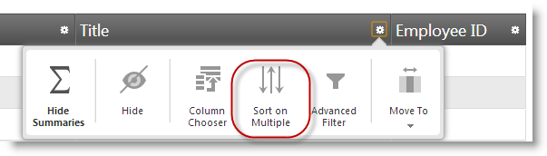
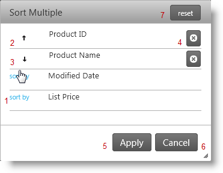
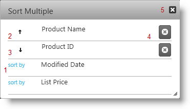

<!--
|metadata|
{
    "fileName": "iggrid-multiple-sorting-dialog",
    "controlName": "igGrid",
    "tags": []
}
|metadata|
-->

# Multiple Sorting Dialog (igGrid)

## Topic Overview

### Purpose

This topic demonstrates how to use the `igGrid`™ control’s Multiple Sorting Dialog Window.

### Required background

The following table lists the topics required as a prerequisite to understanding this topic.

- [Touch Support for %%ProductName%% Controls](Touch-Support-for-NetAdvantage-for-jQuery-Controls.html): This topic introduces the updates to %%ProductName%%™ controls for touch-support interactions.

- [igGrid Feature Chooser](igGrid-Feature-Chooser.html): This topic explains the `igGrid`™ Feature Chooser menu and its sections.

- [igGrid Sorting Overview](igGrid-Sorting-Overview.html): This sample shows you how to enable and use `igGrid` Sorting feature.

### In this topic

This topic contains the following sections:

-   [**Introduction**](#introduction)
-   [**Dialog Window States**](#window-states)
	-   [Modal Window](#modal-window)
    -   [Sort by Multiple Columns at Once](#multiple)
    -   [Sort by Column on click](#on-click)
-   [**Property Reference**](#property-reference)
-   [**Method Reference**](#method-reference)
-   [**Event Reference**](#event-reference)
-   [**Related Content**](#related-content)
    -   [Topics](#topics)
    -   [Samples](#samples)

##  Introduction

This topic demonstrates how to work with the `igGrid` control’s Multiple Sorting modal dialog. You can activate the Multiple Sorting Modal Dialog by selecting Sort on Multiple list item from the `igGrid` Feature Chooser advanced section. Using the Multiple Sorting dialog window and the Sorting API are the two ways to sort multiple columns in `igGrid`.

The sorting dialog displays the order of the multiple sorted columns in the grid. Additionally you may remove a column from the sort criteria.

##  Dialog Window States

###  Modal Window

The following table summarizes the states of the Multiple Sorting Modal Dialog window. The window has two states, defined by the value of the [`modalDialogSortOnClick`](%%jQueryApiUrl%%/ui.iggridsorting#options:modalDialogSortOnClick) property (default false)*.* In the default state the user must make changes in the dialog and then apply the changes. If the property is set to true then the sort takes effect immediately.

Additional details are available after the summary table.

State | modalDialogSortOnClick | Description
---|---|---
[Sort by column on click](#on-click)) | true | Columns are immediately sorted by selecting a column from the column chooser window.
[Sort by multiple columns at once](#multiple) | false | Multiple columns are selected from the column chooser window and columns are sorted when changes are applied to the window.

###  Sort by Multiple Columns at Once

By default the [`modalDialogSortOnClick`](%%jQueryApiUrl%%/ui.iggridsorting#options:modalDialogSortOnClick) property is set to false. This means that you must select, which columns to sort by and then apply the changes to the grid.

Use the following buttons:

1.  Sort by – to sort by the current column in ascending order (the whole row is clickable)
2.  Up arrow – the columns is sorted ascending. Press the button to sort it descending (the whole row is clickable)
3.  Down arrow – the columns is sorted descending. Press the button to sort it ascending (the whole row is clickable)
4.  Unsort by – to unsort by the current column. You can achieve that outside the Modal Dialog context, by pressing **SHIFT** and the header of the `igGird` column you want to ungroup
5.  Apply – to apply the sorted columns, you want to sort by and their order
6.  Cancel – to close the Modal Dialog and don’t apply any changes
7.  Reset – to return the default state of all the columns, like they are defined when the Modal Dialog was opened
8.  ESC (key) - close the modal dialog

###  Sort by Column on click

When the [`modalDialogSortOnClick`](%%jQueryApiUrl%%/ui.iggridsorting#options:modalDialogSortOnClick) property is set to true, when you click on a column name the sorting executes immediately on the grid.

Use the following buttons:

1.  Sort by – to sort by the current column ( the whole row is clickable)
2.  Up arrow – the columns is sorted ascending. Press the button to sort it descending (the whole row is clickable)
3.  Down arrow – the columns is sorted descending. Press the button to sort it ascending (the whole row is clickable)
4.  Unsort by – to unsort by the current column. You can achieve that outside the Modal Dialog context, by pressing **SHIFT** plus the header of the `igGrid` control’s column you want to unsort.
5.  Close button - close the modal dialog
6.  ESC (key) - close the modal dialog

##  Property Reference

This section explains `igGrid` control’s Sorting properties that affect the Modal Dialog.

The following table shows the `igGrid` Sorting properties that are responsible for the configuration of the Modal Dialog

Property | Description
---|---
[modalDialogSortOnClick](%%jQueryApiUrl%%/ui.iggridsorting#options:modalDialogSortOnClick) | Specifies whether sorting is applied immediately when users click sort/unsort columns in multiple sorting dialog.
[featureChooserText](%%jQueryApiUrl%%/ui.iggridsorting#options:featureChooserText) | Specifies the text in feature chooser.
[modalDialogWidth](%%jQueryApiUrl%%/ui.iggridsorting#options:modalDialogWidth) | Specifies the width of multiple sorting dialog
[modalDialogHeight](%%jQueryApiUrl%%/ui.iggridsorting#options:modalDialogHeight) | Specifies the width of the multiple sorting dialog
[modalDialogAnimationDuration](%%jQueryApiUrl%%/ui.iggridsorting#options:modalDialogAnimationDuration) | Specifies the time in milliseconds for the animation duration to show/hide modal dialog
[modalDialogSortByButtonText](%%jQueryApiUrl%%/ui.iggridsorting#options:modalDialogSortByButtonText) | Specifies the Sort By button text for each unsorted column in the multiple sorting dialog window.
[modalDialogResetButtonLabel](%%jQueryApiUrl%%/ui.iggridsorting#options:modalDialogResetButtonLabel) | Specifies Sort By button label for each unsorted column in multiple sorting dialog.
[modalDialogCaptionButtonDesc](%%jQueryApiUrl%%/ui.iggridsorting#options:modalDialogCaptionButtonDesc) | Specifies caption for each descending sorted column in multiple sorting dialog.
[modalDialogCaptionButtonAsc](%%jQueryApiUrl%%/ui.iggridsorting#options:modalDialogCaptionButtonAsc) | Specifies the caption for each ascending sorted column in the multiple sorting dialog.
[modalDialogCaptionButtonUnsort](%%jQueryApiUrl%%/ui.iggridsorting#options:modalDialogCaptionButtonUnsort) | Specifies caption for unsort button in multiple sorting dialog.
[unsortedColumnTooltip](%%jQueryApiUrl%%/ui.iggridsorting#options:unsortedColumnTooltip) | Custom unsorted column tooltip in %%ProductName%% templating format.
[modalDialogCaptionText](%%jQueryApiUrl%%/ui.iggridsorting#options:modalDialogCaptionText) | Specifies caption text for multiple sorting dialog.
[modalDialogButtonApplyText](%%jQueryApiUrl%%/ui.iggridsorting#options:modalDialogButtonApplyText) | Specifies the text of the button which applies changes in modal dialog.
[modalDialogButtonCancelText](%%jQueryApiUrl%%/ui.iggridsorting#options:modalDialogButtonCancelText) | Specifies the text of the button which cancels changes in modal dialog.

##  Method Reference

This section explains `igGrid` Sorting methods that affect modal dialog.

The following table shows the `igGrid` control’s Sorting methods, which allows using Modal Dialog API.

Method | Description
---|---
[openMultipleSortingDialog](%%jQueryApiUrl%%/ui.iggridsorting#methods:openMultipleSortingDialog) | Shows the Modal Dialog. If it is visible the method does nothing.
[closeMultipleSortingDialog](%%jQueryApiUrl%%/ui.iggridsorting#methods:closeMultipleSortingDialog) | Hides the Modal Dialog. If it is not visible the method does nothing.
[renderMultipleSortingDialogContent](%%jQueryApiUrl%%/ui.iggridsorting#methods:renderMultipleSortingDialogContent) | Renders content of multiple sorting dialog for sorted and unsorted columns
[removeDialogClearButton](%%jQueryApiUrl%%/ui.iggridsorting#methods:removeDialogClearButton) | Removes the clear button for the multiple sorting dialog

##  Event Reference

This section explains `igGrid` control’s Sorting events, responsible for the Modal Windows.

The following table shows the `igGrid` Sorting events that are fired during interacting with the Modal Dialog.

Event | Description
---|---
[modalDialogOpening](%%jQueryApiUrl%%/ui.iggridsorting#events:modalDialogOpening) | Event fired before the modal dialog is opened
[modalDialogOpened](%%jQueryApiUrl%%/ui.iggridsorting#events:modalDialogOpened) | Event fired after the modal dialog is opened
[modalDialogMoving](%%jQueryApiUrl%%/ui.iggridsorting#events:modalDialogMoving) | Event fired every time the modal dialog changes its position
[modalDialogClosing](%%jQueryApiUrl%%/ui.iggridsorting#events:modalDialogClosing) | Event fired before the modal dialog is closed
[modalDialogClosed](%%jQueryApiUrl%%/ui.iggridsorting#events:modalDialogClosed) | Event fired after the modal dialog is closed
[modalDialogContentsRendering](%%jQueryApiUrl%%/ui.iggridsorting#events:modalDialogContentsRendering) | Event fired before the contents of the modal dialog are rendered
[modalDialogContentsRendered](%%jQueryApiUrl%%/ui.iggridsorting#events:modalDialogContentsRendered) | Event fired after the contents of the modal dialog are rendered
[modalDialogSortingChanged](%%jQueryApiUrl%%/ui.iggridsorting#events:modalDialogSortingChanged) | Event fired when sorting of column is changed in modal dialog
[modalDialogButtonUnsortClick](%%jQueryApiUrl%%/ui.iggridsorting#events:modalDialogButtonUnsortClick) | Event fired when button to unsort column is clicked in modal dialog
[modalDialogSortClick](%%jQueryApiUrl%%/ui.iggridsorting#events:modalDialogSortClick) | Event fired when column(which is not sorted) is clicked to be sorted in the modal dialog
[modalDialogButtonApplyClick](%%jQueryApiUrl%%/ui.iggridsorting#events:modalDialogButtonApplyClick) | Event fired when Apply button in the modal dialog is clicked
[modalDialogButtonResetClick](%%jQueryApiUrl%%/ui.iggridsorting#events:modalDialogButtonResetClick) | Event fired when the button to reset sorting is clicked

##  Related Content

###  Topics

The following topics provide additional information related to this topic.

- [Touch Support for %%ProductName%% Controls](Touch-Support-for-NetAdvantage-for-jQuery-Controls.html): This topic introduces the updates to %%ProductName%%™ controls for touch-support interactions.

- [igGrid Feature Chooser](igGrid-Feature-Chooser.html): This topic explains the `igGrid`™ Feature Chooser menu and its sections.

- [igGrid Sorting Overview](igGrid-Sorting-Overview.html): This sample shows you how to enable and use `igGrid` Sorting feature.

###  Samples

The following samples provide additional information related to this topic.

- [Feature Chooser](%%SamplesUrl%%/grid/feature-chooser): Sample that demonstrates the Feature Chooser.

 

 

