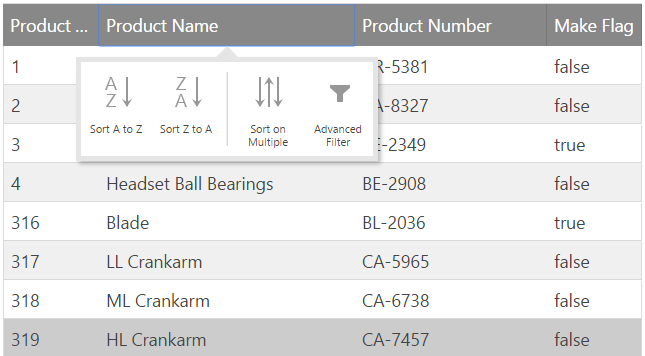

<!--
|metadata|
{
    "fileName": "iggrid-feature-chooser",
    "controlName": "igGrid",
    "tags": []
}
|metadata|
-->

# Feature Chooser (igGrid)

## Introduction
The Feature Chooser makes it easy for users to interact with the grid's features in either a touch or desktop context. The purpose of the Feature Chooser is to provide touch-friendly access to grid features when more than one feature is enabled on the grid at a time. Users can access the feature chooser by clicking (or tapping) on the gear icon or the column header (depending on the context of the grid).

The following sample demonstrates Feature Chooser.

    [Feature Chooser](%%SamplesEmbedUrl%%/grid/feature-chooser)

 
## Touch vs. Non-Touch Oriented Contexts
The igGrid uses Modernizer ([`Modernizr.touch`](http://modernizr.com/docs/#touch)) to detect if the grid is running in a touch-oriented context. Touch contexts are generally found on mobile devices and modern desktop browsers running on a touch screen monitor. Non-touch contexts are generally found in desktop browsers without touch screen monitors or running in old web browsers.

The context of where the grid is running affects how the how column headers are rendered. For instance, when running in a touch context with multiple features enabled on the grid (ex: sorting and filtering), tapping on the column header exposes the Feature Chooser giving the user the ability to sort or filter data in the grid. The following image depicts how the Feature Chooser looks in touch context with no gear icon.
 
Alternatively, when the grid is rendered in a non-touch context, the Feature Chooser is available via a gear icon rendered in the column header.

> **Note**: If you are viewing the grid on a desktop or laptop and the gear icon is not in the column header then you most likely have a touch screen monitor as one of your peripherals.

## Gear Icon
The purpose of the gear icon is to toggle the visibility of the Feature Chooser. In certain circumstances instead of just the gear icon being responsible for toggle, the entire column header is used.

The default setting of the gear icon's visibility changes depending on the context in which the grid is running. When the grid is rendered in non-touch contexts, the icon appears in the column header. When the grid is rendered in a touch enabled context, the gear icon is not rendered in the column header and the full column header is responsible for toggling the Feature Chooser instead.

The visibility behavior of the gear icon is controlled by the grid's [`featureChooserIconDisplay`](http://help.infragistics.com/jQuery/2014.2/ui.iggrid#options:featureChooserIconDisplay) option. The default value for this option is `desktopOnly` and behaves as described above. Should you want to make the gear icon available in all contexts, then set `featureChooserIconDisplay` equal to always.

> **Note**: The primary need to have control over the `featureChooserIconDisplay` option is to give you the opportunity to implement your own logic to determine if the application is running in a touch-oriented context which may be different than what `Modernizr` returns.

## Controlling Feature Icon Visibility

There may be times when you want to prevent a feature from displaying in the Feature Chooser. You do have the ability customize which icons show up in the Feature Chooser by controlling the value of the `renderInFeatureChooser` property.

Each grid feature includes the `renderInFeatureChooser` property available off the prototype of the object. For instance, if you wanted to disable the sorting button from rendering in the Feature Chooser, then you include the following statement in your code:

    $.ui.igGridSorting.prototype.renderInFeatureChooser = false;

> **Note**: To make changes to other features beyond sorting, you need to replace `igGridSorting` with the feature's object name you are looking to affect.
Be aware that the change made to the feature is applied to the prototype of the object. This means all grids on the page will reflect any changes made to the `renderInFeatureChooser` property.

## Keyboard Interactions

The following keyboard interactions are available for the Feature Chooser.

### Applying Focus
Keyboard Command | Description
--- | ---
TAB | Moves focus between the focus-able elements

### When the Gear Icon is in Focus
Keyboard Command | Description
--- | ---
ENTER/SPACE | Opens/Closes the Feature Chooser for the related column.

### While the Feature Chooser is Open
Keyboard Command | Description
--- | ---
TAB | Moves the focus inside the buttons of the Feature Chooser. They can then be navigated using the LEFT/RIGHT keys.

### When Focus is on Feature Chooser Buttons
Keyboard Command | Description
--- | ---
LEFT/RIGHT | Allows to navigate between the buttons in the Feature Chooser.

### While a Specific Button is Focused
Keyboard Command | Description
--- | ---
ENTER/SPACE | Applies the related action (opens/closes additional drop-downs, opens dialog windows related to the specific feature, etc.)

### Navigating Column Moving
The `ColumnMoving` button can display a drop-down using ENTER/SPACE or DOWN keys. 
When the drop-down is open you can navigate between the items using UP/DOWN keys. When an item is focuses you can select it using the ENTER/SPACE buttons.

## Related Content
### Topics
The following topics provide additional information related to this topic.

- [Configuring the Column Chooser (igGrid)](igGrid-Hiding-Column-Chooser.html)
- [igGrid Multiple Sorting Modal](igGrid-Multiple-Sorting-Dialog.html)
- [igGrid Filtering](igGrid-Filtering.html)
- [Touch Support for Ignite UI Controls](Touch-Support-for-NetAdvantage-for-jQuery-Controls.html)
