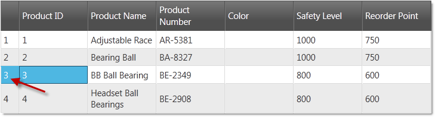

<!--
|metadata|
{
    "fileName": "iggrid-enabling-row-selectors",
    "controlName": "igGrid",
    "tags": ["Getting Started","Grids","Selection"]
}
|metadata|
-->

# Enabling Row Selectors (igGrid)


## Topic Overview

### Purpose

This demonstrates how to enable the `rowSelectors` widget of the `igGrid`™ control.

### In This Topic
-   [**Introduction**](#intro)
-   [**Preview**](#preview)
-   [**Requirements**](#requirements)
    -   [General requirements](#general-requirements)
    -   [Script requirements](#script-requirements)
    -   [Database requirements](#database-requirements)
-   [**Enable RowSelectors in JQuery**](#jQuery)
-   [**Enable RowSelectors in MVC**](#mvc)
-   [**Related Content**](#related-content)
    -   [Topics](#topics)
    -   [Samples](#samples)

## <a id="intro"></a> Introduction 

The `rowSelectors` widget provides the user with the functionality to select cell(s), or entire row(s) by clicking the row selector column placed on the left of the first column of the grid. In addition to that, the widget provides row numbering functionality and checkboxes for row selection.

The row selecting functionality of the `igGrid` control is not enabled by default, so you need to enable it explicitly.

The example below configures a grid with the RowSelectors feature enabled.

## <a id="preview"></a> Preview

Following is a preview of the final result



## <a id="requirements"></a> Requirements

### <a id="general-requirements"></a> General requirements 
-   jQuery-specific requirements
    -   An HTML web page with a grid connected to a data source
    -   A table tag in the body of the HTML page to serve as a container for the grid

 

**In HTML:**

```html
<table id="grid">
</table>
```

-   MVC-specific requirements
    -   An MVC 2 or above project in MS Visual Studio® with a grid connected to a data source
    -   A reference to the Infragistics MVC dll (stores the MVC IG wrappers)

### <a id="script-requirements"></a> Script Requirements 

The required scripts for both jQuery and MVC sample are the same because the MVC wrappers just render a jQuery widget.

The following scripts are required to run the grid and its grouping functionality:

-   The jQuery library script
-   The jQuery User Interface (UI) library
-   The IG library script (This is obfuscated code for the controls)

The following code sample demonstrates the scripts as added to the header code of the HTML file.

**In HTML:**

```html
<script type="text/javascript" src="jquery.min.js"></script>
<script type="text/javascript" src="jquery-ui.min.js"></script>
<script type="text/javascript" src="infragistics.core.js"></script>
<script type="text/javascript" src="infragistics.lob.js"></script>
```

### <a id="database-requirements"></a> Database requirements 

For the purpose of this example only:

-   MVC – Adventure Works database


## <a id="jQuery"></a> Enable RowSelectors in JQuery
 
1.  **Set up the data source**.

    The data source used in the following code snipped is for the purpose of this example.

    **In HTML:**

    ```html
    <script type="text/javascript">
    source = [
             { "ProductID": 1, "Name": "Adjustable Race", "SafetyStockLevel": 1000, "ReorderPoint": 750, "StandardCost": 0.0000 }, 
             { "ProductID": 2, "Name": "Bearing Ball", "SafetyStockLevel": 1000, "ReorderPoint": 750, "StandardCost": 0.0000 }, 
             { "ProductID": 3, "Name": "BB Ball Bearing", "SafetyStockLevel": 800, "ReorderPoint": 600, "StandardCost": 0.0000 },
             { "ProductID": 4, "Name": "Headset Ball Bearings", "SafetyStockLevel": 800, "ReorderPoint": 600, "StandardCost": 0.0000 }]

    </script>
    ```

2.  **Create an igGrid with RowSelectors feature.**

    Inside the `$(document).ready()` event handler, you create an `igGrid` with RowSelectors feature configuration. It’s recommended to also enable the Selection feature on the igGrid, when enabling the RowSelectors feature, in order to have selection.

    > **Note**
	>  Keep in mind that without selection enabled RowSelectors can be still used, i.e. for their row numbering feature. With this configuration, the `requiredSelection` option should be set to false in order to prevent an exception from being thrown.

    **In Javascript:**

    ```js
    $("#grid").igGrid({
        autoGenerateColumns: true,
           dataSource: source,
           features: [
                {
                    name: 'RowSelectors'
                },
                {
                    name: 'Selection'                
                }
            ]
    });
    ```

3.  **Save the file.**
4.  (Optional) **Verify the result.**

    To verify the result, open the file. The result should look as shown in the Preview above.

## <a id="mvc"></a> Enable RowSelectors in MVC 

1.  **Create an MVC Controller method.**

    Create an MVC Controller method to get data from the Model and will call the View.

    **In C#:**

    ```csharp
    public ActionResult Default()
    {
        var ds = this.DataRepository.GetDataContext().Products.Take(4);
        return View(ds);
    }
    ```

2.  **Instantiate the igGrid.**

    Instantiate the `igGrid` with the RowSelectors feature enabled.

    > **Note**
    > Keep in mind that without selection enabled, RowSelectors can be still used, i.e. for their row numbering feature. Wth this configuration, the `requiredSelection` option should be set to false in order to prevent an exception from being thrown

    **In ASPX:**

    ```csharp
    <%= Html.Infragistics().Grid(Model)
        .AutoGenerateColumns(true)
        .Features(feature =>{
            feature.Selection();
            feature.RowSelectors();
            }).DataBind()
        .Render()
    %>
    ```

    **In CSHTML:**

    ```csharp
    @( Html.Infragistics().Grid(Model)
        .AutoGenerateColumns(true)
        .Features(feature =>{
            feature.Selection();
            feature.RowSelectors();
            }).DataBind()
        .Render()
    )
    ```

3.  **Save the file.**
4.  (Optional) **Verify the result.**

    To verify the result, run the MVC project and open the file. The result should look as shown in the Preview above.


## <a id="related-content"></a> Related Content

### <a id="topics"></a> Topics

Following are some other topics you may find useful.

- [Configuring Row Selectors](igGrid-Configuring-Row-Selectors.html)

- [Using JavaScript Resources in Ignite UI](Deployment-Guide-JavaScript-Resources.html)

- [Styling and Theming in Ignite UI](Deployment-Guide-Styling-and-Theming.html)

### <a id="samples"></a> Samples

-   [Row Selectors](%%SamplesUrl%%/grid/selection)

 

 


