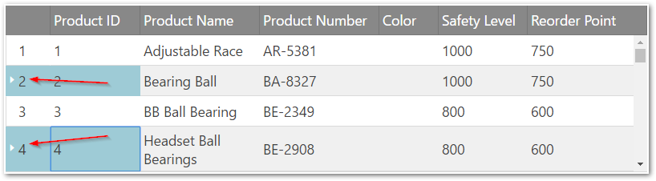
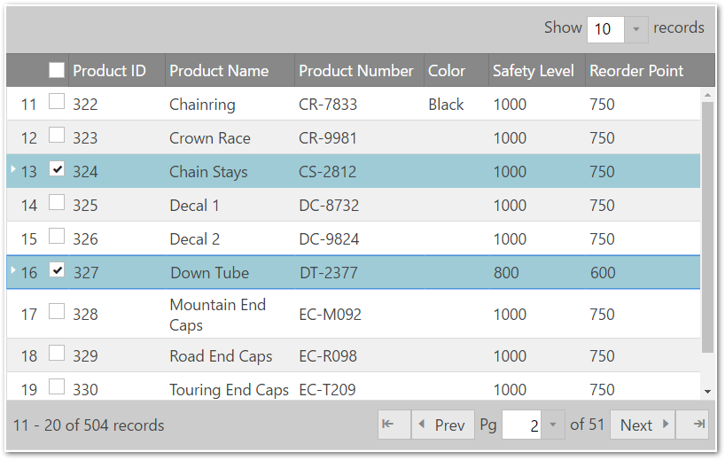
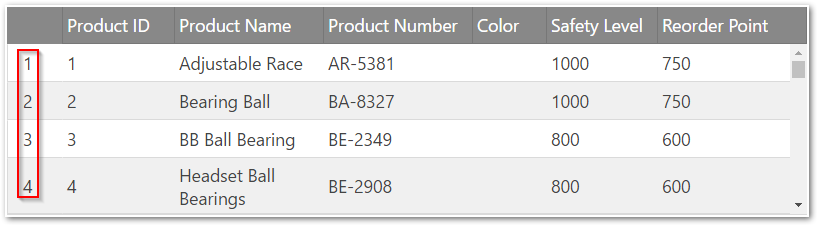

<!--
|metadata|
{
    "fileName": "iggrid-configuring-row-selectors",
    "controlName": "igGrid",
    "tags": ["Getting Started","Grids","Selection"]
}
|metadata|
-->

# Configuring Row Selectors (igGrid)


## Topic Overview

### Purpose
This topic discusses how to configure row selection in the igGrid.

### In this topic
This topic contains the following sections:

-   [**RowSelectors Configuration Overview**](#overview)
-   [**Enabling Multiple Rows Selection**](#multiple-row-selection)
    -   [Preview](#multiple-preview)
    -   [Code](#multiple-code)
-   [**Enabling Selection across all pages**](#select-all-pages)
    -   [Preview](#selectall-preview)
    -   [Property settings for enabling Select All functionality](#selectall-enabling)
    -   [Code](#selectall-code)
-   [**Adding Selection Checkboxes**](#adding-selection-checkboxes)
    -   [Preview](#checkboxes-preview)
    -   [Property settings for enabling checkboxes](#checkboxes-enabling)
    -   [Code](#checkboxes-code)
-   [**Enabling Row Numbering**](#row-numbering)
    -   [Preview](#row-numbering-preview)
    -   [Property settings for enabling row numbering](#row-numbering-enabling)
    -   [Code](#row-numbering-code)
-   [**Canceling the Check Box State Changing Event**](#cancel-checkbox)
    -   [Steps](#cancel-checkbox-steps)
-   [**Related Topics**](#topics)

### Required Background 

The table below lists the required background you need for fully understanding the information in this topic.

- Topics
	- You need to first read the [Enabling Row Selectors](igGrid-Enabling-Row-Selectors.html) topic.
- External Resources 
	- You need to first read the [jQuery on() API](http://api.jquery.com/on/) article.


## <a id="overview"></a> RowSelectors Configuration Overview 

The `rowSelectors` widget of the `igGrid`™ control exposes a lot of configurable options. The table below lists the configurable screen elements and behaviors manageable through the widget. For some of the behaviors/features, detailed explanations and examples are provided in the blocks following the chart.


Configurable behavior / feature | Configuration details | Configuration properties
---|---|---
Multiple rows selection | By default, the RowSelectors widget has row numbering enabled. | –
Selection checkboxes | Determines whether the row selectors column should contain checkboxes | [enableCheckBoxes](%%jQueryApiUrl%%/ui.iggridrowselectors#options:enableCheckBoxes)
Row numbering | The row selectors column can contain row numbers if a property is enabled. | [enableRowNumbering](%%jQueryApiUrl%%/ui.iggridrowselectors#options:enableRowNumbering)
Canceling the check box state changing event | Hook to `checkBoxStateChanging` event and cancel it on some condition. | –
Row numbering seed | The seed is added to the default numbering. | [rowNumberingSeed](%%jQueryApiUrl%%/ui.iggridrowselectors#options:rowNumberingSeed)
Width of the row selectors column. | The width of row selectors column is configurable by setting a property. | [rowSelectorColumnWidth](%%jQueryApiUrl%%/ui.iggridrowselectors#options:rowSelectorColumnWidth)
Configurable events | For information about these events, refer to their listing in the property reference section: [igGridRowSelectors Events](igGrid-RowSelectors-Events.html) | 
Require Selection | Requires the selection feature to be enabled. If selection is not enabled, an exception is thrown | [requireSelection](%%jQueryApiUrl%%/ui.iggridrowselectors#options:requireSelection)


## <a id="multiple-row-selection"></a> Enabling Multiple Rows Selection

Selecting cells or rows with RowSelectors requires initializing the Selection feature for the grid. RowSelectors do not initialize the Selection feature automatically and expects you to enable it if needed. Without the Selection feature, RowSelectors can still be used, for example, for their row numbering functionality. In the example below, multiple-selection is enabled. Red arrows show row selectors column.

### <a id="multiple-preview"></a> Preview 
In the picture below, RowSelectors and multiple Selection features are enabled.



### <a id="multiple-code"></a> Code 
**In HTML:**

```html
<script type="text/javascript">
    $(function () {
        $("#grid").igGrid({
            autoGenerateColumns: true,
            dataSource: source,
            features: [
                {
                    name: 'RowSelectors'
                },
                {
                    name: 'Selection',
                    mode: "cell",
                    multipleSelection: true
                }
            ]
        });    
    });
</script>
```

**In Razor:**

```csharp
@(Html.Infragistics().Grid(Model)
    .AutoGenerateColumns(true)
    .Features(feature =>        {       
        feature.Selection().MultipleSelection(true);
        feature.RowSelectors();
    })
    .DataBind()
    .Render()
)
```

## <a id="select-all-pages"></a> Enabling Selection across all pages

By default the header checkbox, available in multiple selection mode, checks all rows from the current data view. Now the grid Row Selectors along with Paging feature provides the ability to select all records across all pages using the option "enableSelectAllForPaging" (set to true by default).
In case of local Paging when header checkbox is clicked an overlay is displayed suggesting the end user to select/deselect the rows from all pages (see the screenshot below).

> **Note:** "Select All" functionality does not work for remote Paging. Clicking on the header checkbox will only select the rows from the current page.

### <a id="selectall-preview"></a> Preview 
The picture below demonstrates the "Select All" functionality.


### <a id="selectall-enabling"></a> Property settings for enabling "Select All" functionality 

The table below maps the desired configurations to property settings. The properties are accessed through the igGridRowSelectors options.

Property | Setting
---|---
[enableSelectAllForPaging](%%jQueryApiUrl%%/ui.iggridrowselectors#options:enableSelectAllForPaging) | true
[enableCheckBoxes](%%jQueryApiUrl%%/ui.iggridrowselectors#options:enableCheckBoxes) | true
[multipleSelection](%%jQueryApiUrl%%/ui.iggridselection#options:multipleSelection) | true

### <a id="selectall-code"></a> Code 
**In HTML:**

```html
<script type="text/javascript">
    $(function () {
        $("#grid").igGrid({
            autoGenerateColumns: true,
            dataSource: source,
            features: [
                {
                    name: 'RowSelectors',
                    enableCheckBoxes: true,
                    enableSelectAllForPaging: true
                },
                {
                    name: 'Selection',
                    multipleSelection: true
                },
                {
                    name: 'Paging',
                    type: "local",
                    pageSize: 10
                }
            ]
        });
    });
</script>
```

**In Razor:**

```csharp
@(Html.Infragistics().Grid(Model)
    .AutoGenerateColumns(true)
    .Features(feature =>        {       
        feature.Selection().MultipleSelection(true);
      	feature.RowSelectors()
        	.EnableCheckBoxes(true)
            .EnableSelectAllForPaging(true);
        feature.Paging().PageSize(10);
    })
	.DataBind()
	.Render()
)
```

## <a id="adding-selection-checkboxes"></a> Adding Selection Checkboxes 

Selection checkboxes are added by setting the `enableCheckBoxes` property to true. It is recommended, if enabling the checkboxes feature, to use multiple-selection so the user won’t need to hold Ctrl key when selecting multiple rows.
When multiple-selection is enabled a checkbox will display in the row selectors column header. This checkbox enables selection/deselection of all the rows at once (in case when Paging feature is enabled selects/deselects only the rows from the current page).

> **Note:** Enabling checkboxes forces `igGridSelection` to use "row" selection mode.

### <a id="checkboxes-preview"></a> Preview 

In the picture below demonstrates a grid with both checkboxes and Paging enabled.



### <a id="checkboxes-enabling"></a> Property settings for enabling checkboxes 

The table below maps the desired configurations to property settings. The properties are accessed through the igGridRowSelectors options.

Property | Setting
---|---
[enableCheckBoxes](%%jQueryApiUrl%%/ui.iggridrowselectors#options:enableCheckBoxes) | true

### <a id="checkboxes-code"></a> Code 

**In HTML:**

```html
<script type="text/javascript">
    $(function () {
        $("#grid").igGrid({
            autoGenerateColumns: true,
            dataSource: source,
            features: [
                {
                    name: 'RowSelectors', 
                    enableCheckBoxes: true
                },
                {
                    name: 'Selection',
                    multipleSelection: true
                }
            ]
        });
    });
</script>
```

**In Razor:**

```csharp
@(Html.Infragistics().Grid(Model)
    .AutoGenerateColumns(true)
    .Features(feature =>         { 
        feature.Selection().MultipleSelection(true);
        feature.RowSelectors().EnableCheckBoxes(true);
     })
    .DataBind()
    .Render()
)
```

## <a id="row-numbering"></a> Enabling Row Numbering 

The row selector column in the grid can be used to display the sequential numbers of the rows. This is managed through the `enableRowNumbering` option of the `RowSelectors` feature.

### <a id="row-numbering-preview"></a> Preview 

In the picture demonstrates a grid with, row numbering enabled.



### <a id="row-numbering-enabling"></a> Property settings for enabling row numbering 

The table below maps the desired configurations to property settings. The properties are accessed through the `igGridRowSelectors` options.
To set a start value different from 0 use the `rowNumberingSeed` option.  

Property | Setting
---|---
enableRowNumbering | true
rowNumberingSeed| 0

### <a id="row-numbering-code"></a> Code 

**In HTML:**

```html
<script type="text/javascript">
    $(function () {
        $("#grid").igGrid({
            autoGenerateColumns: true,
            dataSource: source,
            features: [
                {
                    name: 'RowSelectors', 
                    enableRowNumbering: true
                }
            ]
        });
    });
</script>
```
 

**In Razor:**

```csharp
@(Html.Infragistics().Grid(Model)
    .AutoGenerateColumns(true)
    .Features(feature =>        {
        feature.Selection().MultipleSelection(true);
        feature.RowSelectors().EnableRowNumbering(true);
    })
    .DataBind()
    .Render()
)
```

## <a id="cancel-checkbox"></a> Canceling the Check Box State Changing Event 

By handling the `checkBoxStateChanging` event, a checkbox selection can be canceled.

Following is a conceptual overview of the process:

1.  Handling the `checkBoxStateChanging` event
2.  Canceling the event

### <a id="cancel-checkbox-steps"></a> Steps 
1.  Handle the `checkBoxStateChanging` event.
    1.  Define a function that will be called when the `checkBoxStateChanging` event fires.

        **In Javascript:**

        ```js
        function gridcheckboxStateChanging (evt, ui) {
        
        };
        ```

    2.  Set the handler to the `rowSelectorClicked` event of the `igGrid`.

		Once you have a handler defined, it needs to be set as the handler for the gridcheckboxStateChanging event.
		
		In jQuery, this can be done when the widget is instantiated.
		
		In ASP.NET MVC, the event should be attached using the jQuery delegate() or bind() API. The type for this event is ‘iggridrowselectorscheckboxstatechanging'. 
		
		**In Javascript:**
		
        ```js
        $(function () {
            $("#grid1").igGrid({
                autoGenerateColumns: true,
                dataSource: adventureWorks,
                responseDataKey: 'Records',
                features: [
                    {
                        name: 'RowSelectors',
                        enableCheckBoxes: true,
                        checkBoxStateChanging: "gridcheckboxStateChanging"
                    },
                    {
                        name: 'Selection'
                    }
                ]
            });
        });
        ```

2. Cancel the event.

	Cancel the event by returning false.
	
	**In Javascript:**
	
	```js
    function gridcheckboxStateChanging (evt, ui) {
        if (conditionNotMet)
            return false;
    };
	```

##  <a id="topics"></a> Related Topics 

Following are some other topics you may find useful.

-   [Enabling Row Selectors](igGrid-Enabling-Row-Selectors.html)
-   [Row Selectors Events](igGrid-RowSelectors-Events.html)

### <a id="samples"></a> Samples

This sample shows how to configure a Row Selectors in the `igGrid`.

<div class="embed-sample">
   [Configuring Row Selectors](%%SamplesEmbedUrl%%/grid/row-selectors)
</div>

 

 


