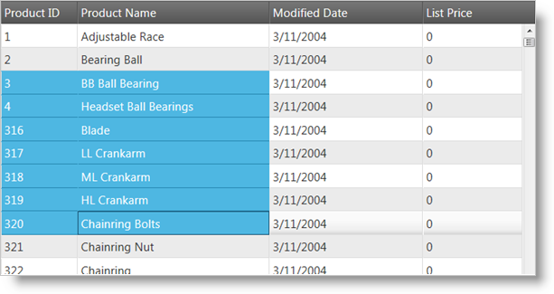

<!--
|metadata|
{
    "fileName": "iggrid-selection-overview",
    "controlName": "igGrid",
    "tags": ["Getting Started","Grids","Selection"]
}
|metadata|
-->

# Selection Overview (igGrid)

## Topic Overview

### Purpose
This topic explains the selection functionality of the `igGrid`™ control.

The selection feature enables the selection of the rows and cells of the `igGrid`™ control. Its functionality closely follows the Microsoft® Windows Explorer™ and Microsoft® Excel™ selection and activation behaviors.

Grid selection comes with robust client-side-event support, providing the necessary tools for managing the control’s behavior at run time.

### In this topic

This topic contains the following sections:

-   [**Overview**](#overview)
-   [**Selection persistence**](#selection-persistence)
-   [**Enabling Selection**](#enabling-selection)
-   [**Select/Unselect a Cell/Row**](#select-unselect)
    -   [Select a Row](#select-row)
    -   [Unselect a Row](#unselect-row)
    -   [Get Selected Rows](#get-rows)
    -   [Select a Cell](#select-cell)
    -   [Unselect a Cell](#unselect-cell)
    -   [Get Selected Cells](#get-cells)
    -   [Clear Selection](#clear-selection)
-   [**Selection Modes**](#selection-modes)
    -   [Single Selection](#single-selection)
    -   [Multiple Selection](#multiple-selection)
    -   [Row Selection](#row-selection)
    -   [Cell Selection](#cell-selection)
-   [**Selection Events**](#selection-events)
-   [**Selection Properties**](#selection-properties)
-   [**Selection CSS Classes**](#selection-classes)
-	[**Keyboard interactions**](#keyboard-interaction)
-   [**Related Content**](#related-content)
    -   [Topics](#topics)
    -   [Samples](#samples)

 

## <a id="overview"></a> Overview
Selection is implemented as a jQuery UI widget and as such follows the lifecycle of any jQuery UI widget.

The selection feature of the `igGrid` control is responsible for both selection and activation. Grid “activation” can mean several things. On one hand, activation refers to keyboard navigation. If activation is turned off, keyboard activation is disabled. On the other hand, the specific active style is applied on cells and rows (without being accompanied by selection style) when **CTRL** is held down and the arrow keys are pressed, similar to Windows Explorer navigation.

Cells may also be selected in a more traditional sense. Cells can be selected either with the mouse or with the keyboard. When cells are selected with the mouse, multiple selections are available. For instance, while holding the **CTRL** key is down, multiple non-continuous files are selected. While holding the SHIFT key, multiple continuous files are selected. Other variations of mouse-based selection include:

-   Arbitrary selections are possible by dragging the mouse to form rectangles around selected files as well.

**Figure 1: The igGrid control with continuous selection by dragging with the mouse**



**Figure 2: The igGrid control with multiple cell selection enabled**


## <a id="selection-persistence"></a> Selection Persistence 

Persisting Selection between `igGrid` states is made easy in version 14.1 and in fact replaces the previous default behavior.

> **Note**
> Selection persistence is true by default. This is a breaking change.

When you enable `igGridSelection` you are already using it in a [`persist`](%%jQueryApiUrl%%/ui.iggridselection#options:persist) mode which means that any rows or cells being selected will remain selected after you interact with other features of the grid (such as sorting or filtering a column) or simply data binding.

Selection persistence is implemented for `igHierarchicalGrid` too.

The following sample demonstrates the persistance capabilities of the Selection feature.

<div class="embed-sample">
   [Feature Persistence](%%SamplesEmbedUrl%%/grid/feature-persistence)
</div>

Persisting depends on the feature’s ability to unambiguously distinguish rows and columns from one another.

As row indexes are not stable and therefore unusable for this purpose, `igGridSelection` will use either the user-defined primary key of the grid or will generate pseudo-unique identifiers for each row based on the corresponding record’s property values.

These internal identifiers take a small portion of the grid rendering time to generate and there is a small chance that two records in a large data set can produce the same identifier.

> **Note**
> It’s advisable that applications which have selection persistence enabled provide an explicit, unique primary key.

If you would like to retain the current behavior of selection being cleared after user interacts with the grid, you can do this by disabling the feature through the [`persist`](%%jQueryApiUrl%%/ui.iggridselection#options:persist) option as shown in the code snippet below:

**In JavaScript:**

```js
features: [
  { 
     name: “Selection”, 
     persist: false 
  }
] 
```


## <a id="enabling-selection"></a> Enabling Selection 

In order to get started with Selection, you first need to include the necessary JavaScript and CSS dependencies. The easiest way to do this is to use the combined/minified version of the scripts and styles:

**In HTML:**

```html
<link type="text/css" href="infragistics.theme.css" rel="stylesheet" />
<link type="text/css" href="infragistics.css" rel="stylesheet" />
<script type="text/javascript" src="jquery.min.js"></script>
<script type="text/javascript" src="jquery-ui.min.js"></script>
<script type="text/javascript" src="infragistics.core.js"></script>
<script type="text/javascript" src="infragistics.lob.js"></script>
```

If you would like to include only the minimal Infragistics scripts necessary for selection, you can do so by referencing:

**In HTML:**

```html
<script type="text/javascript" src="infragistics.util.js"></script>
<script type="text/javascript" src="infragistics.dataSource.js"></script>
<script type="text/javascript" src="infragistics.ui.shared.js"></script>
<script type="text/javascript" src="infragistics.ui.grid.framework.js"></script>
<script type="text/javascript" src="infragistics.ui.grid.selection.js"></script>
```

After including the necessary scripts, enabling the selection feature of the `igGrid` is as simple as adding an object with the name Selection to the Features array of the control. By default, the selection mode is set to Row, allowing row selection. Activation is also enabled by default.

The following code snippets demonstrate enabling the functionality:

**In Javascript:**

```js
$("#grid1").igGrid({
   dataSource: products,
   responseDataKey: 'Records',
   tabIndex: 1,
   features: [{
      name: 'Selection',
      mode: 'row',
      multipleSelection: true,
      activation: true
   }]
});
```

**In ASPX:**

```csharp
<%=
   Html.
   Infragistics().
   Grid(Model).
   ID("grid1").
   PrimaryKey("ProductID").
   Features(features => {
      features.
      Selection().
      Mode(SelectionMode.Row).
      MultipleSelection(true).
      Activation(true);
   }).
   Virtualization(false).
   DataSourceUrl(Url.Action("SelectionApiGetData")).
   DataBind().
   Render()%>
```

**In Razor:**

```csharp
@{
   Html.
   Infragistics().
   Grid(Model).
   ID("grid1").
   PrimaryKey("ProductID").
   Features(features => {
      features.
      Selection().
      Mode(SelectionMode.Row).
      MultipleSelection(true).
      Activation(true);
   }).
   Virtualization(false).
   DataSourceUrl(Url.Action("SelectionApiGetData")).
   DataBind().
   Render()
}
```

## <a id="select-unselect"></a> Select/Unselect a Cell/Row 

Users may select cells/rows by using the mouse or keyboard. To select cells/rows in code, you can use the exposed properties and methods of the `igGridSelection` component of the `igGrid` control. A few of the possible actions are listed in the following examples:

### <a id="select-row"></a> Select a Row 

**In Javascript:**

```js
$('#grid1').igGridSelection('selectRow', indexOfRowToSelect);
```

### <a id="unselect-row"></a> Unselect a Row 

**In Javascript:**

```js
$('#grid1').igGridSelection('deselectRow', indexOfRowToDeselect);
```

### <a id="get-rows"></a> Get Selected Rows 

This variation of the method returns a JSON array with the available properties that include `element` and `index`.

**In Javascript:**

```js
var rows = $('#grid1').igGridSelection('selectedRows');
```

### <a id="select-cell"></a> Select a Cell 

**In Javascript:**

```js
$('#grid1').igGridSelection('selectCell', rowIndex, columnIndex);
```

### <a id="unselect-cell"></a> Unselect a Cell 

**In Javascript:**

```js
$('#grid1').igGridSelection('deselectCell', rowIndex, columnIndex);
```

### <a id="get-cells"></a> Get Selected Cells 
This variation of the method returns a JSON array with the available properties that include `element`, `row`, `index`, `rowIndex` and `columnKey`.

**In Javascript:**

```js
var cells = $('#grid1').igGridSelection('selectedCells');
```

### <a id="clear-selection"></a> Clear Selection 

**In Javascript:**

```js
$('#grid1').igGridSelection('clearSelection');
```


## <a id="selection-modes"></a> Selection Modes
 
The `igGrid` control’s selection features allow for single and multiple selection of cells on the grid.

### <a id="single-selection"></a> Single Selection 

With single selection enabled, you can click a cell or a row to select it.

### <a id="multiple-selection"></a> Multiple Selection 

With multiple selection enabled, you can do the following:

-   Click for single selection
-   Click and drag for multiple, continuous selection
-   Shift-click for multiple, continuous selection
-   Ctrl-click for multiple discontinuous selection

### <a id="row-selection"></a> Row Selection 

To enable row selection, you must enable the selection feature by setting the mode to “row,” or by leaving it unset (row selection is the default behavior) to select rows in the grid.

After enabling row selection, users can select a row by clicking on any of the row’s cells. You can also select rows in code by using the exposed methods as demonstrated in the Cell Selection examples previously listed in this document.

### <a id="cell-selection"></a> Cell Selection 

To enable cell selection, you must set the selection mode set to “cell” when initializing the selection behavior.

There are several ways to select a cell after enabling cell selection. First, users can select a cell by clicking on it or by navigating to it with the keyboard. You can also select and unselect cells in code by using the methods demonstrated in the Cell Selection examples previously listed in this document.


## <a id="selection-events"></a>Selection Events 

The `igGrid` control supports the most common and expected events for the selection feature. You can bind to the control’s row and cell selection changing and changed events (with the former being cancellable). Events are raised when active cell or roll changes are available, making every selection action manageable in code.

You can bind to client-side events in two different ways:

-   From anywhere in your application:

    **In Javascript:**

    ```js
    $("#grid1").bind("iggridselectionrowselectionchanged", handler);
    ```

For more information regarding handling events please refer to the topic :

[Using Events in Ignite UI](Using-Events-in-NetAdvantage-for-jQuery.html)

-   By specifying the event name as an option when you initialize the Selection feature (this is not case sensitive, as opposed to the first way of binding events):

    **In Javascript:**

    ```js
    {
       name: 'Selection',
       mode: 'cell',
       multipleSelection: true,
       cellSelectionChanging: handler,
       <other Selection options>
    }
    ```

Then your “handler,” assuming it is called like this, should be defined the following way:

**In Javascript:**

```js
function handler(event, args) {

}
```

The `args` is an object that is explained in detail below, respectively, for each event.

**Grid row object:**

```js
{
	element:<element of the grid row TR> ,	
	id:<primaryKey value or null if undefined>,	
	index: <index of the grid row TR>
}
```
 

**Grid cell object:**

```js
{
	element: <cell TD>,
	row: <parent of the cell, that is the row TR>,
	rowId: <primaryKey value or null if undefined>,
	index: <col index>,
	rowIndex: <the row index>,
	columnKey: <column key>
}
```

 

The Selection feature exposes the following client-side events:

<table class="table table-bordered">
	<thead>
		<tr>
            <th>
Event Name
			</th>
            <th>
Argument (args) Parameters
			</th>
        </tr>
	</thead>
	<tbody>
        

        <tr>
            <td>
rowSelectionChanging
			</td>
            <td>
**row:** Current selected grid row <br />

**selectedRows:** Array of currently selected rows <br />

**selectedFixedRows:** Array of fixed rows if any <br />

**owner:** Reference to the selection widget object <br />

**startIndex:** Index of start row (multiple selection) – optional. <br />

**endIndex:** Index of end row (multiple selection) – optional
            </td>
        </tr>

        <tr>
            <td>
rowSelectionChanged
			</td>
            <td>
Same as `rowSelectionChanging` except that now “selectedRows” contains the new rows added to the selection.
				<blockquote>
**Note:** This event does not have the `startIndex` and `endIndex` properties.
                </blockquote>
			</td>
        </tr>

        <tr>
            <td>
cellSelectionChanging
			</td>
            <td>
**cell:** Current selected cell <br />

**firstRowIndex:** Index of first selected row <br />

**lastRowIndex:** Index of last selected row <br />

**firstColumnIndex:** Index of first selected column <br />

**lastColumnIndex:** Index of last selected column <br />

				<blockquote>
**Note:** The last four properties are only used with continuous multiple selection.
                </blockquote>

**selectedCells:** Array of currently selected cells <br />

**owner:** Reference to the Selection widget object
			</td>
        </tr>

        <tr>
            <td>
cellSelectionChanged
			</td>

            <td>
Same as the above except that `firstRowIndex`, `lastRowIndex`, `firstColumnIndex`, and `lastColumnIndex` are not present any more and `selectedCells` now contains the new selection as well.
			</td>
        </tr>

        <tr>
            <td>
activeCellChanging
			</td>

            <td>
**cell:** Reference to the cell that is about to become active <br />

This event is cancelable.
			</td>
        </tr>

        <tr>
            <td>
activeCellChanged
			</td>

            <td>
**cell:** Reference to the new active cell
			</td>
        </tr>

        <tr>
            <td>
activeRowChanging
			</td>

            <td>
**row:** Reference to the row that is about to become active <br />

This event is cancelable.
			</td>
        </tr>

        <tr>
            <td>
activeRowChanged
			</td>

            <td>
**row:** the new active row.
			</td>
        </tr>
    </tbody>
</table>

> **Note:** When continuous selection is performed by pressing the SHIFT key, events are fired only once for the whole batch.

## <a id="selection-properties"></a> Selection Properties 

The following table contains more information about the supported properties for the Selection feature.

Property Name | Type and Default Value | Description
---|---|---
multipleSelection | Boolean (default: False) | Enables/disables multiple selection
mouseDragSelect | Boolean (default: True) | Allows continuous selection by dragging with the mouse
mode | String (default: ‘row’) | Can be either **row** or **cell**
wrapAround | Boolean (default: True) | When the first or last rows or cells are reached, continue from the opposite direction
activation | Boolean (default: True) | Enables/disables cell and row activation – active style
touchDragSelect | Boolean (default: True) | Enables / disables selection via continuous touch event - only applicable for cell selection and touch-supported environments.
multipleCellSelectOnClick | Boolean (default: False) | If true multiple selection of cells is done as if CTRL is being held. the option is disregarded if mode is set to row. this option is useful for enabling multiple discountinued selection on touch environments.


## <a id="selection-classes"></a> Selection CSS Classes 
You can use the following table should you wish to customize the look of the Selection feature.

CSS classes | Description
---|---
ui-iggrid-selectedcell <br /> ui-state-active | Classes applied on every selected cell.
ui-iggrid-selectedrow <br /> ui-state-active | Classes applied on every selected row.
ui-iggrid-activecell <br /> ui-state-focus | Classes applied on every active cell.
ui-iggrid-activerow <br /> ui-state-focus | Classes applied on every active row.

## <a id="keyboard-interaction"></a> Keyboard interactions
When a specific row is selected, the following key interactions are available:

-	UP: Moves selection to the row above the currently selected row. If selection is on the first row then the selection will move to the last row.
-	DOWN: Moves selection to the row below the currently selected row. If selection is on the last row then the selection will move to the first row.
-	SPACE/ENTER: Selects/Deselects the active row.

When multiple selection is enabled:

-	SHIFT+UP/DOWN: Allows selection of multiple rows while holding shift.
-	CTRL+ UP/DOWN: Moves the active row without changing selection. Allows selection of multiple rows via the keyboard by moving the active row and using SPACE to select/deselect the currently active row.

When a specific cell is selected, the following key interactions are available:

-	UP: Moves selection to the cell above the currently selected cell. If selection is on a cell from the first row then selection moves to the cell from the in the same column on the last row.
-	DOWN: Moves selection to the row below the currently selected row. If selection is on the last row then the selection will move to the first row.
-	LEFT: Moves selection to the cell left of the current cell. If selection is on the first cell of the row then selection moves to the last cell of the previous row. If selection is on the first cell of the first row then selection moves to the last cell of the last row of the grid.
-	RIGHT: Moves selection to the cell right of the current cell. If selection is on the last cell of the row then selection moves to the first cell of the next row. If selection is on the last cell of the last row then it moves to the first cell of the first row.
-	SPACE/ENTER: Selects/Deselects the current cell. Also in igHierarchicalGrid scenario, if the currently selected active cell is the one containing the expand/collapse buttons this will also expand/collapse the child grid of the row.

In igHierarchicalGrid scenario selection skips going into the child grids with the UP/DOWN/LEFT/RIGHT arrow keys by default (see the [skipChildren](%%jQueryApiUrl%%/ui.iggridselection#options:skipChildren) option).

## <a id="related-content"></a> Related Content

### <a id="topics"></a> Topics

-   [igGrid Overview](igGrid-Overview.html)
-   [Paging (igGrid)](igGrid-Paging.html)
-   [Filtering (igGrid)](igGrid-Filtering.html)
-   [Sorting Overview (igGrid)](igGrid-Sorting-Overview.html)

### <a id="samples"></a> Samples

-   [Selection](%%SamplesUrl%%/grid/selection)

