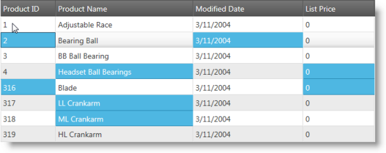

<!--
|metadata|
{
    "fileName": "iggrid-multiple-cell-selection",
    "controlName": "igGrid",
    "tags": []
}
|metadata|
-->

# Multiple Cell Selection (igGrid)

## Topic Overview

### Purpose

This topic demonstrates how to configure Multiple Cell Selection for both Desktop and Touch environments for the `igGrid`™ control.

### Required background

The following table lists the topics required as a prerequisite to understanding this topic.

- [Touch Support for Ignite UI Control](Touch-Support-for-NetAdvantage-for-jQuery-Controls.html): This topic introduces to user to the new updates that Ignite UI controls has to support touch interactions.

- [igGrid Selection](igGrid-Selection-Overview.html): This topic shows you how to enable and use `igGrid` Selection.

### In this topic

This topic contains the following sections:

-   [**Introduction**](#introduction)
-   **Multiple Cell Selection**
-   -   [Multiple Cell Selection Overview](#overview)
    -   [Multiple Cell Selection by dragging](#dragging)
    -   [Multiple Cell Selection by multiple clicks/taps](#clicks-taps)
-   [**Property Reference**](#property-reference)
-   [**Related Content**](#related-content)
    -   [Topics](#topics)
    -   [Samples](#samples)

##  Introduction

The `igGrid` selection feature enables single and multiple cell selection in the grid. Single cell selection is achieved by clicking on a cell (Desktop) or tapping a cell (Touch) Multiple selection is available for both Desktop and Touch environments with the appropriate configuration of the grid.

The `igHierarchicalGrid`™ internally uses the `igGrid` control and is designed to use all the `igGrid` features. The Selection feature is not inheritable in an `igHierarchicalGrid` instance, which means that when the Selection is configured once in the parent grid widget. Once enabled on the parent grid then the Selection feature is available for the whole grid, including the child layouts.

## Multiple Cell Selection

###  Multiple Cell Selection Overview

The following summarizes the different approaches of how to select multiple cells in the `igGrid` control. Additional details are available after the summary table.

- [Multiple Cell Selection by dragging](#dragging): Details the properties requiring configuration to enable selection of a region of cells.

- [Cell Selection by multiple clicks/taps](#clicks-taps): Details the properties requiring configuration to enable selection of non-contiguous cells.

> **Note:** To enable multiple selection you need to set the `multipleSelection` property to true, because the default value is false.

###  Multiple Cell Selection by dragging

The `igGrid` Selection property that allows users to drag and select multiple cells under Desktop platforms is called [`mouseDragSelect`](%%jQueryApiUrl%%/ui.iggridselection#options:mouseDragSelect) and must be set to `true`.

The corresponding property for multiple cell selection via touch is [`touchDragSelect`](%%jQueryApiUrl%%/ui.iggridselection#options:touchDragSelect) and must also be set to `true`.

> **Note:** By default the both properties are set to `true`, therefore even without explicit configuration users are able to select multiple cells.

Additional implementation details are available in the related sample.

#### Related Sample:

-   [igGrid Selection](%%SamplesUrl%%/grid/selection)

###  Multiple Cell Selection by multiple clicks/taps

Achieving selection of non-contiguous cells (random locations) is done by holding **CTRL** + cell click when selecting cells in a Desktop environment. Enabling the same functionality for touch environments requires the [`multipleCellSelectOnClick`](%%jQueryApiUrl%%/ui.iggridselection#options:multipleCellSelectOnClick) property to be set to `true`. The effect of setting this property is that it ensures anytime a user clicks a new cell the existing selection preserved as if **CTRL** is being pressed on the keyboard. Touch-enabled environments take advantage of this behavior in order to achieve non-contiguous selection.

Additional implementation details are available in the related sample.

##  Property Reference

This section explains the `igGrid` Multiple Cell Selection properties.

The following table summarizes the relevant properties for enabling multiple selection for the igGrid control.

Property | Default Value | Description
---|---|---
[multipleSelection](%%jQueryApiUrl%%/ui.iggridselection#options:multipleSelection) | false | Enables/disables multiple selection.
[multipleCellSelectOnClick](%%jQueryApiUrl%%/ui.iggridselection#options:multipleCellSelectOnClick) | false | Enable/disables multiple cell selection as if the CTRL key is being held down when a cell is clicked or tapped.
[mouseDragSelect](%%jQueryApiUrl%%/ui.iggridselection#options:mouseDragSelect) | true | Enables/disables selection by dragging the mouse.
[touchDragSelect](%%jQueryApiUrl%%/ui.iggridselection#options:touchDragSelect) | true | Enables/disables selection by drag gesture.

##  Related Content

###  Topics

The following topics provide additional information related to this topic.

- [Touch Support for Ignite UI Control](Touch-Support-for-NetAdvantage-for-jQuery-Controls.html): This topic introduces to user to the new updates that Ignite UI controls has to support touch interactions.

- [igGrid Selection](igGrid-Selection-Overview.html): This topic shows you how to enable and use `igGrid` Selection.

- [Enabling igHierarchicalGrid Selection](jQuery-igHierarchical-Grid-Selection-Overview.html): Describes how to configure Selection on the `igHierarchicalGrid` control.

###  Samples

The following samples provide additional information related to this topic.

- [Selection](%%SamplesUrl%%/grid/selection): This sample demonstrates configuration of cell selection in the `igGrid` control.

 

 

