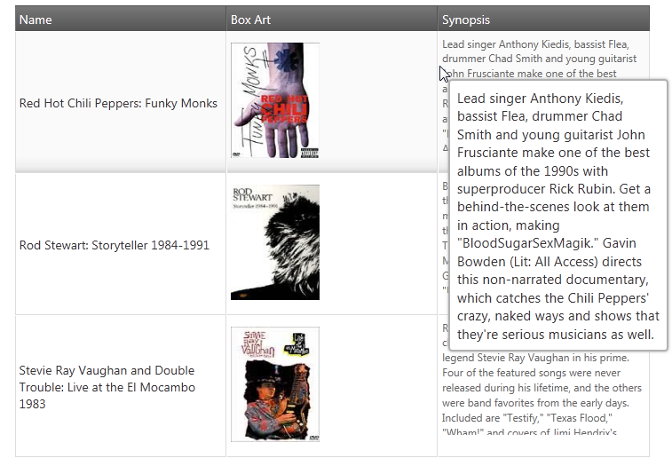

<!--
|metadata|
{
    "fileName": "iggrid-tooltips-overview",
    "controlName": "igGrid",
    "tags": ["Getting Started","Grids"]
}
|metadata|
-->

# Tooltips Overview (igGrid)

## Topic Overview

### Purpose
This topic introduces the Tooltips widget of the `igGrid`™ and its main features.

### In this topic
This topic contains the following sections:

- [Introduction](#introduction)
- [Main Features](#features)
- [Related Topics](#topics)

##  Introduction 

In the `igGrid`, the main purpose of tooltips is to make the entire cell content visible and also to enable the user to select and copy the text that is inside the tooltip container (very useful when the text is too long to fit in a grid cell, see the picture below). Tooltips are displayed when the user hovers the mouse pointer over `igGrid` cells.

The tooltip functionality of the `igGrid` is provided through the Tooltips widget. Its features are listed in the [Main Features](#features) block below.

##  Main Features 

The table below briefly explains the main features of the Tooltips widget and the properties that manage them.
<table class="table">
	<thead>
		<tr>
            <th>
Feature
			</th>
            <th>
Description
			</th>
            <th>
jQuery Property
			</th>
            <th>
MVC Property
			</th>
        </tr>
	</thead>
	<tbody>
        <tr>
            <td>
Visibility management
			</td>
            <td>
Operational mode of the Tooltips widget (i.e. whether the tooltips show or not).
			</td>
            <td>
[visibility](%%jQueryApiUrl%%/ui.iggridtooltips#options:visibility)  
                
[style](%%jQueryApiUrl%%/ui.iggridtooltips#options:style)
			</td>
            <td>
[Visibility](Infragistics.Web.Mvc~Infragistics.Web.Mvc.GridTooltips~Visibility.html)  
                
[Style](Infragistics.Web.Mvc~Infragistics.Web.Mvc.GridTooltips~Style.html)
			</td>
        </tr>

        <tr>
            <td>
Configurable columns
			</td>
            <td>
Enables configuring the visibility of the tooltips on per-column basis (i.e. whether the cells of a column should display tooltips or not).
			</td>
            <td>
[columnSettings](%%jQueryApiUrl%%/ui.iggridtooltips#options:columnSettings) 
			</td>
            <td>
[ColumnSettings](Infragistics.Web.Mvc~Infragistics.Web.Mvc.GridTooltips~ColumnSettings.html)
			</td>
        </tr>

        <tr>
            <td>
Animation timing management
			</td>

            <td>
Configurable show and delay times (in milliseconds) for the tooltips and duration of the animation that displays and hides them.
			</td>
            <td>
[showDelay](%%jQueryApiUrl%%/ui.iggridtooltips#options:showDelay)  
                
[hideDelay](%%jQueryApiUrl%%/ui.iggridtooltips#options:hideDelay)  
                
[fadeTimespan](%%jQueryApiUrl%%/ui.iggridtooltips#options:fadeTimespan)
			</td>
            <td>
[ShowDelay](Infragistics.Web.Mvc~Infragistics.Web.Mvc.GridTooltips~ShowDelay.html)  
                
[HideDelay](Infragistics.Web.Mvc~Infragistics.Web.Mvc.GridTooltips~HideDelay.html)  
                
[FadeTimespan](Infragistics.Web.Mvc~Infragistics.Web.Mvc.GridTooltips~FadeTimespan.html)
			</td>
        </tr>

        <tr>
            <td>
Custom positioning
			</td>
            <td>
Configurable tooltip position specified as an offset from the mouse pointer.
			</td>
            <td>
[cursorLeftOffset](%%jQueryApiUrl%%/ui.iggridtooltips#options:cursorLeftOffset)  

[cursorTopOffset](%%jQueryApiUrl%%/ui.iggridtooltips#options:cursorTopOffset)
                
            </td>
            <td>
[CursorLeftOffset](Infragistics.Web.Mvc~Infragistics.Web.Mvc.GridTooltips~CursorLeftOffset.html)  
                
[CursorTopOffset](Infragistics.Web.Mvc~Infragistics.Web.Mvc.GridTooltips~CursorTopOffset.html)
			</td>
        </tr>

        <tr>
            <td>
Client events
			</td>
            <td>
Special events that can be handled during the lifecycle of the Tooltips widget.

There are events for every state of the tooltip:   

showing   

shown   

hiding   

hidden   
			</td>
            <td>
[tooltipShowing](%%jQueryApiUrl%%/ui.iggridtooltips#events:tooltipShowing)  
                

[tooltipShown](%%jQueryApiUrl%%/ui.iggridtooltips#events:tooltipShown)  

[tooltipHiding](%%jQueryApiUrl%%/ui.iggridtooltips#events:tooltipHiding)  

[tooltipHidden](%%jQueryApiUrl%%/ui.iggridtooltips#events:tooltipHidden)
			</td>
            <td>

			</td>
        </tr>

        <tr>
            <td>
Appearance
			</td>
            <td>
Configures how the tooltips are styled and positioned. There are two modes: "tooltip" and "popover".
                 
The "tooltip" style will position the tooltip according to the mouse cursor (it will display next to the mouse cursor). The tooltip content will be rendered as plain text.
                 
The "popover" style initializes an instance of the igPopover control. It will position the tooltip according to the target TD element with an arrow pointing to it. The tooltip content will be rendered as HTML.
                 
Appearance can be customized additionally by changing the jQuery UI CSS Framework classes.
			</td>
            <td>
[style](%%jQueryApiUrl%%/ui.iggridtooltips#options:style)
			</td>
            <td>
[Style](Infragistics.Web.Mvc~Infragistics.Web.Mvc.GridTooltips~Style.html)
			</td>
        </tr>
    </tbody>
</table>

For the descriptions of the Tooltip widget’s properties, refer to the [jQuery](%%jQueryApiUrl%%/ui.iggridtooltips#options) and [MVC](Infragistics.Web.Mvc~Infragistics.Web.Mvc.GridTooltips_members.html) API documentations.

##  Related Topics 

Following are some other topics you may find useful.

- [Enabling igGrid Tooltips](igGrid-Enabling-Tooltips.html)

- [Using igGrid Tooltips](igGrid-Using-Tooltips.html)

- [igGrid Known Issues and Breaking Changes](igGrid-Known-Issues.html)

 

 

