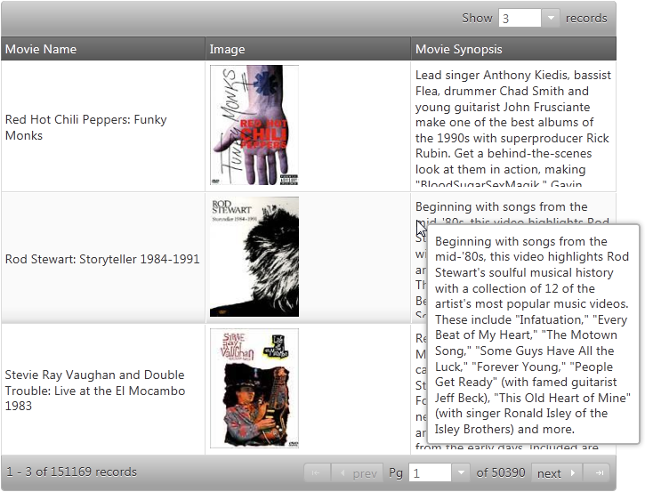

<!--
|metadata|
{
    "fileName": "iggrid-enabling-tooltips",
    "controlName": "igGrid",
    "tags": ["Getting Started","Grids"]
}
|metadata|
-->

# Enabling Tooltips (igGrid)

## Topic Overview

### Purpose

This topic demonstrates how to add the Tooltip widget to an `igGrid`™ for both jQuery and MVC patterns. This will enable tooltips to appear over the grid cells upon mouse hover.

### In this topic

This topic contains the following sections:

-   [**Introduction**](#intro)
-   [**Preview**](#preview)
-   [**Requirements**](#requirements)
    -   [General Requirements](#general-requirements)
    -   [Script Requirements](#script-requirements)
-   [**Adding jQuery igGrid Tooltips**](#adding-jquery)
-   [**Adding MVC igGrid Tooltips**](#adding-mvc)
-   [**Related Topics**](#related-content)

## <a id="intro"></a>Introduction 
To enable tooltips, you set the name of the Tooltip widget. You can configure the tooltips individually for every column using the `columnSettings` property. In the example that follows, all the columns are configured to display tooltips except one of the columns because contains pictures. Had the individual tooltip for the second column been omitted, the tooltip would have been displayed, because by default tooltips are always visible (that is, visibility: "always" if the visibility property has not been set explicitly, this would be equivalent to visibility: "always").

## <a id="preview"></a>Preview

Following is a preview of the final result of the example procedure. The end result is the same in both the jQuery and MVC technologies.



## <a id="requirements"></a>Requirements

### <a id="general-requirements"></a>General Requirements 
-   jQuery-specific requirements
    -   An HTML web page with an [`igGrid`](igGrid-Overview.html) connected to a data source.
-   MVC-specific requirements
    -   An MVC 2 or above project in MS Visual Studio® with a [MVC igGrid](igGrid-Overview.html) connected to a data source
    -   A reference to the Infragistics MVC dll (stores the MVC IG wrappers)

### <a id="script-requirements"></a>Script Requirements 
The required scripts for both jQuery and MVC sample are the same because the MVC wrappers just render a jQuery widget.

The following scripts are required to run the grid and its grouping functionality:

-   The jQuery library script
-   The jQuery User Interface (UI) library
-   The IG library script (This is obfuscated code for the controls)

The following code sample demonstrates the scripts as added to the header code of the HTML file.

**In HTML:**

```html
<script type="text/javascript" src="jquery.min.js"></script>
<script type="text/javascript" src="jquery-ui.min.js"></script>
<script type="text/javascript" src="infragistics.core.js"></script>
<script type="text/javascript" src="infragistics.lob.js"></script>
```

## <a id="adding-jquery"></a>Adding jQuery igGrid Tooltips 

Inside the `$(document).ready()` event handler you can create an `igGrid` and configure the tooltips. In the sample below, tooltips are enabled for the Movie Name and Movie Synopsis columns (columnKeys Name and Synopsis) and disabled for the Image column (columnKey BoxArt).

**In Javascript:**

```js
$("#grid1").igGrid({
    
    features: [
        {
            name: "Tooltips",
            columnSettings: [
                { columnKey: "Name", allowTooltips: true },
                { columnKey: "BoxArt", allowTooltips: false },
                { columnKey: "Synopsis", allowTooltips: true }
            ],
            visibility: "always",
            showDelay: 1000,
            hideDelay: 500
        }
    ]
});
```

To verify the result, open the HTML file in your browser. A tooltip should appear every time you hover with the mouse over a cell of the first and third columns of the grid as shown in the Preview above.

## <a id="adding-mvc"></a>Adding MVC igGrid Tooltips 

Define the igGrid itself along with the Tooltip feature and all his configurations:

**In C#:**

```csharp
<%= Html.Infragistics().Grid(Model)
.ID("grid1")
.Features(features => {
    features.Tooltips()
    .Visibility(TooltipsVisibility.Always)
    .ColumnSettings(settings =>
    {
        settings.ColumnSetting().ColumnKey("Name").AllowTooltips(true);
        settings.ColumnSetting().ColumnKey("BoxArt").AllowTooltips(false);
        settings.ColumnSetting().ColumnKey("Synopsis").AllowTooltips(true);
     })
    .ShowDelay(100);
})
.DataBind()
.Render()%>
```

To verify the result, run your application. A tooltip should appear every time you hover with the mouse over a cell of the first and third columns of the grid as shown in the Preview above.

## <a id="related-content"></a>Related Topics 

Following are some other topics you may find useful.

- [igGrid Overview](igGrid-Overview.html)

- [igGrid Tooltips Overview](igGrid-Tooltips-Overview.html)

- [igGrid Known Issues](igGrid-Known-Issues.html)

 

 


