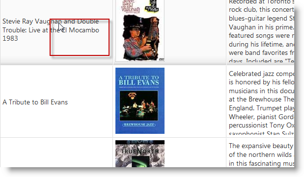

<!--
|metadata|
{
    "fileName": "iggrid-using-tooltips",
    "controlName": "igGrid",
    "tags": ["Getting Started","Grids"]
}
|metadata|
-->

# Configuring Tooltips (igGrid)

## Topic Overview

### Purpose

This topic demonstrates, with code examples, how to configure the jQuery `igGrid`™ tooltips for the most common usage scenarios.

### In this topic

This topic contains the following sections:

-   [**Tooltips Configuration Chart**](#configuration-chart)
-   [**Displaying the Tooltips with Their Default Settings**](#default-settings)
    -   [Default tooltip behavior overview](#default-overview)
    -   [Default tooltip behavior property settings](#default-property-settings)
    -   [Code example](#default-code)
-   [**Disabling the Tooltips for a Column**](#disable)
    -   [Property settings](#disable-properties)
    -   [Code example](#disable-code)
-   [**Configuring a Custom Tooltip Position**](#custom)
    -   [Property settings](#custom-settings)
    -   [Code example](#custom-code)
-   [**Running sample**](#demo)
-   [**Related Topics**](#topics)


## <a id="configuration-chart"></a> Tooltips Configuration Chart 

The table below lists the most common use cases of jQuery `igGrid` tooltips together with the properties that configure them. Each of these use cases is explained in greater detail in the text blocks following the table.

Use case | Configuration details | Configuration property
---|---|---
[Displaying the tooltips with their default settings](#default-settings) | To display tooltips with their default settings, just call the Tooltips feature. | [name](%%jQueryApiUrl%%/ui.iggridtooltips#options:name)
[Configuring cell columns without tooltips](#disable) | Disabling the tooltips for a column is useful when, for example, the cells in column contain images. In this case, you configure the tooltip behavior individually per each column. | [visibility](%%jQueryApiUrl%%/ui.iggridtooltips#options:visibility) [columnSettings](%%jQueryApiUrl%%/ui.iggridtooltips#options:columnSettings)
[Configuring a custom tooltip position](#custom) | Specifying the position at which the tooltip to appear. You configure this by specifying offset of the tooltip from the mouse pointer. | [cursorLeftOffset](%%jQueryApiUrl%%/ui.iggridtooltips#options:cursorLeftOffset) [cursorTopOffset](%%jQueryApiUrl%%/ui.iggridtooltips#options:cursorTopOffset)


## <a id="default-settings"></a> Displaying the Tooltips with Their Default Settings 

### <a id="default-overview"></a> Default tooltip behavior overview 

By default, tooltips display only if the text in a cell is too long to fit in it and appears truncated. The two pictures below demonstrate this behavior:

-   Left – the text is fully visible in the grid cell so no tooltip is displayed
-   Right – the text is too long for the cell and appears truncated, therefore a tooltip is displayed

   


### <a id="default-property-settings"></a> Default tooltip behavior property settings 

The following table lists the default property settings of the jQuery Tooltip widget.

Property | Setting
---|---
[visibility](%%jQueryApiUrl%%/ui.iggridtooltips#options:visibility) | “overflow”
[showDelay](%%jQueryApiUrl%%/ui.iggridtooltips#options:showDelay) | 500
[hideDelay](%%jQueryApiUrl%%/ui.iggridtooltips#options:hideDelay) | 300
[fadeTimespan](%%jQueryApiUrl%%/ui.iggridtooltips#options:fadeTimespan) | 150
[cursorLeftOffset](%%jQueryApiUrl%%/ui.iggridtooltips#options:cursorLeftOffset) | 10
[cursorTopOffset](%%jQueryApiUrl%%/ui.iggridtooltips#options:cursorTopOffset) | 15
[style](%%jQueryApiUrl%%/ui.iggridtooltips#options:style) | "tooltip"

### <a id="default-code"></a> Code example 
To enable the tooltips with their default settings, just set the name property to “Tooltips”.

The following code enables the default behavior of the `igGrid` Tooltips.

**In Javascript:**

```js
$("#grid1").igGrid({
    features: [
        {
            name: "Tooltips"
        }
    ]
});
```

> **Note:** For information on how to do the same with MVC, see the Adding Tooltips to an `igGrid` topic.

## <a id="disable"></a> Disabling the Tooltips for a Column 

In this example, the tooltips are configured to display over every column that contains text and not over the columns that store images.

The two pictures below demonstrate this behavior:

-   Left – the cells in the column contain text, so the tooltips are displayed
-   Right – the cells in the column contain images, so no tooltips are displayed

To configure this behavior, you need to define the properties individually for every column.

### <a id="disable-properties"></a> Property settings 
The table below demonstrates the required property settings for hiding the tooltips for one column while always displaying the tooltips for the rest. For details about the properties, refer to the API documentation.

Property | Setting
---|---
[name](%%jQueryApiUrl%%/ui.iggridtooltips#options:name) | “Tooltips”
[visibility](%%jQueryApiUrl%%/ui.iggridtooltips#options:visibility) | “always”
[columnSettings](%%jQueryApiUrl%%/ui.iggridtooltips#options:columnSettings) | [{ columnKey: "col1", allowTooltips: true }, { columnKey: "col2", allowTooltips: false }, { columnKey: "col3", allowTooltips: true }]


### <a id="disable-code"></a> Code example 
The following code disables the tooltips for the second column.

**In Javascript:**

```js
$("#grid1").igGrid({
    features: [
        {
            name: "Tooltips",
            columnSettings: [
                { columnKey: "Name", allowTooltips: true },
                { columnKey: "BoxArt", allowTooltips: false },
                { columnKey: "Synopsis", allowTooltips: true }
            ]
        }    
    ]
});
```

> **Note:** For information on how to do the same with MVC, see the Adding Tooltips to a jQuery `igGrid` topic.

## <a id="custom"></a> Configuring a Custom Tooltip Position 

To configure the position of the tooltip, you specify the offset of the tooltip from the mouse pointer in the jQuery `igGrid` Tooltip API.

   


### <a id="custom-settings"></a> Property settings 
The tooltip positioning is managed by the `cursorLeftOffset` and `cursorTopOffset` properties. The table below demonstrates the required property settings for achieving the offset shown in the picture above. For details about the properties, refer to the API documentation.

Property | Setting
---|---
[name](%%jQueryApiUrl%%/ui.iggridtooltips#options:name) | “Tooltips”
[cursorLeftOffset](%%jQueryApiUrl%%/ui.iggridtooltips#options:cursorLeftOffset) | 50
[cursorTopOffset](%%jQueryApiUrl%%/ui.iggridtooltips#options:cursorTopOffset) | 50


### <a id="custom-code"></a> Code example 
The following code configures the offset shown in the picture above.

**In Javascript:**

```js
$("#grid1").igGrid({    
    features: [
        {
            name: "Tooltips",
            cursorLeftOffset: 50,
            cursorTopOffset: 50          
        }    
    ]
});
```

> **Note:** For information on how to do the same with MVC, see the [Enable Tooltips for an igGrid](igGrid-Enabling-Tooltips.html) topic.

## <a id="demo"></a> Running sample
<div class="embed-sample">
   [igGrid Tooltips](%%SamplesEmbedUrl%%/grid/tooltips)
</div>

## <a id="topics"></a> Related Topics 
Following are some other topics you may find useful.

- [igGrid Tooltips Overview](igGrid-Tooltips-Overview.html)

- [Enable Tooltips for an igGrid](igGrid-Enabling-Tooltips.html)

- [igGrid Known Issues and Breaking Changes](igGrid-Known-Issues.html)

 

 


