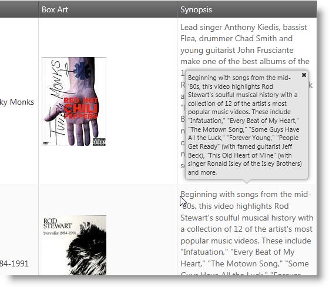

<!--
|metadata|
{
    "fileName": "iggrid-popover-style-for-tooltips",
    "controlName": "igGrid",
    "tags": []
}
|metadata|
-->

# Styling the Grid Tooltips (igGrid)

## Topic Overview

### Purpose

This topic demonstrates how to configure the Tooltips Popover style.

### Required background

The following table lists the topics required as a prerequisite to understanding this topic.

- [Touch Support for %%ProductName%% Controls](Touch-Support-for-NetAdvantage-for-jQuery-Controls.html): This topic introduces to user to the new updates that jQuery controls has to support touch interactions.

- [igGrid™ Tooltips Overview](igGrid-Tooltips-Overview.html): This topic shows how to enable and use `igGrid` tooltips.

### In this topic

This topic contains the following sections:

-   [**igGrid Tooltips Popover Style**](#summary)
-   [**Set Popover Style**](#popover)
-   -   [Overview](#popover-overview)
    -   [Property settings](#popover-property)
    -   [Example](#popover-example)
-   [**Style Property**](#style)
-   [**Related Content**](#related-content)
    -   [Topics](#topics)

##  igGrid Tooltips Popover Style

The following table lists the configurable aspects of the `igGrid` Tooltips Style property. Additional details are available after the summary table.

Configurable aspects | Details | Properties
---|---|---
Configure tooltip style for touch devices | The `igGrid` Tooltip is configured to show as popover and to be compatible for touch devices | [style](%%jQueryApiUrl%%/ui.iggridtooltips#options:style)

##  Set Popover Style

###  Overview

The normal tooltip appears when a cell is hovered and it appears at the bottom right corner of the cursor. But under touch platforms there is no hover state. Further, tooltips appear partially hidden by a user’s finger and there is no way to hide the tooltip unless another tooltips is shown. Therefore in touch environments, a more natural tooltip state is added called “popover”. If the popover style is activated it shows on a click or tap and the popover displays on the top of the cell and has touch optimized layout. If there is not enough space at the top, then the popover appears in another position (by priority: bottom, left, right). If there is no space around the touched cell, the popover exceeds the screen dimensions. The popover itself has a Close button that allows the user to hide the popover. Another difference compared to the "toolip" style (which content is rendered as plain text) is that the popover content is rendered as HTML. Finally, by tapping and holding users can select the text inside the popover.

###  Property settings

The following table shows which property you need to set so that have the popover enabled

In order to: | Use this property: | And set it to:
---|---|---
Show popover tooltip on click/tap | [style](%%jQueryApiUrl%%/ui.iggridtooltips#options:style) | popover

###  Example

The screenshot below demonstrates how the `igGrid` Tooltips looks as a result of the following settings:

Property | Value
---|---
[name](%%jQueryApiUrl%%/ui.iggridtooltips#options:name) | `Tooltips`
[style](%%jQueryApiUrl%%/ui.iggridtooltips#options:style) | `popover`
[visibility](%%jQueryApiUrl%%/ui.iggridtooltips#options:visibility) | `always`

> **Note:** The table below lists the tooltip properties, which are ignored when the [style](%%jQueryApiUrl%%/ui.iggridtooltips#options:style) is set to popover. This is because they are Desktop specific and don’t work in touch browsers.

Property | State when popover style is enabled
---|---
[hideDelay](%%jQueryApiUrl%%/ui.iggridtooltips#options:hideDelay) | ignored
[showDelay](%%jQueryApiUrl%%/ui.iggridtooltips#options:showDelay) | ignored
[cursorLeftOffset](%%jQueryApiUrl%%/ui.iggridtooltips#options:cursorLeftOffset) | ignored
[cursorTopOffset](%%jQueryApiUrl%%/ui.iggridtooltips#options:cursorTopOffset) | ignored

##  Style Property

The following table explains the style property of the Tooltip feature and lists the default and recommended values.

<table class="table">
	<thead>
		<tr>
            <th>
Property
			</th>
            <th>
Type
			</th>
            <th>
Description
			</th>
            <th>
Default Value
			</th>
        </tr>
	</thead>
	<tbody>
        <tr>
            <td>
[style](%%jQueryApiUrl%%/ui.iggridtooltips#options:style)
			</td>
            <td>
string
			</td>
            <td>
This property allows you to change the look and behavior of the `igGrid` tooltip feature.  
            
Recommended Value:  
            
`popover`
                
            </td>
            <td>
tooltip
			</td>
        </tr>
    </tbody>
</table>

##  Related Content

###  Topics

The following topics provide additional information related to this topic.

- [igGrid Tooltips Overview](igGrid-Tooltips-Overview.html): Topic describing the properties and behavior of the `igGrid` Tooltips.

- [Touch Support for %%ProductName%% Controls](Touch-Support-for-NetAdvantage-for-jQuery-Controls.html): This topic introduces to user to the new updates that jQuery controls has to support touch interactions.

 

 

