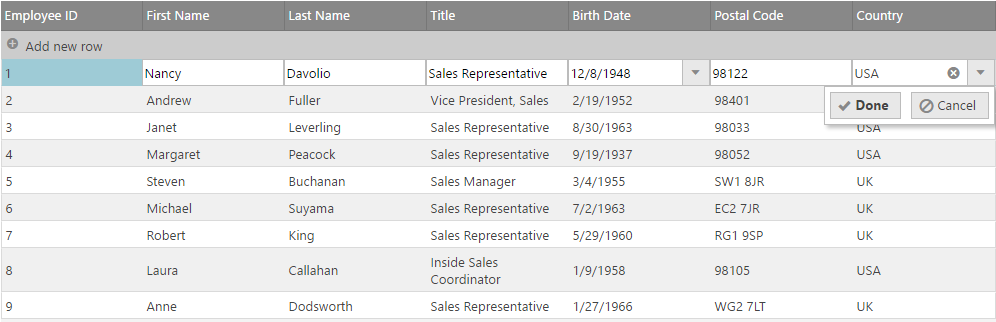

<!--
|metadata|
{
    "fileName": "iggrid-updating",
    "controlName": "igGrid",
    "tags": ["Editing","Getting Started","Grids"]
}
|metadata|
-->

# Updating Overview (igGrid)

## Topic Overview

### Purpose
This topic explains how to use the Updating feature of the `igGrid`™ control.

### In this topic
This topic contains the following sections:

-   [**Overview**](#overview)
    -   [User interactions chart](#user-interactions)
    -   [Configuration Considerations](#configuration-considerations)
-   [**Enabling Updating**](#enable)
    -   [Adding Required CSS and JavaScript references using igLoader in JavaScript](#required)
    -   [Loading CSS and JavaScript references statically – needed only for updating](#minimal-required)
-   [**Disabling row adding, row updating and row deleting**](#disable-row-add-delete)
-   [**Column Settings and Editors**](#column-settings-editors)
    -   [Retrieving the columnSettings object](#retrieving-columnsettings)
    -   [Example usage of columnSettings and adding editors](#columnsettings-example)
-   [**Adding a PrimaryKey for the AddNewRow**](#adding-primarykey)
-   [**Batch Updates**](#batch)
    -   [Persisting the changes to the server](#persist-changes)
    -   [Handling the dataDirty event](#datadirty-event)
    -   [Example: committing data in the dataDirty event](#example-committing-data)
-   [**Updating UI**](#ui)
    -   [Programmatically start edit a cell(via the updating UI)](#programmatically-start-edit)
-   [**Localization support**](#localization)
-   [**Updating API**](#api)
    -   [Adding a row programmatically](#api-add-row)
    -   [Deleting a row programmatically](#api-delete-row)
    -   [Updating a row programmatically](#api-update-row)
-   [**Client-Side Events**](#client-events)
-   [**Updating Customization**](#customization)
    -   [Setting the updating feature option after initialization](#setting-option)
-   [**Keyboard Interactions**](#keyboard-interaction)
-   [**Related Topics**](#topics)
-   [**Related Samples**](#samples)

## <a id="overview"></a> Overview
The `igGrid`™ control Updating feature includes three different interactions: updating, adding new rows, and deleting rows. By default all these features are enabled.

The Updating feature can be turned on either for an individual cell (Cell Edit Mode) or an entire row (Row Edit Mode). In Row Edit Mode, all cells in a row allow updating.

### <a id="user-interactions"></a> User interactions chart 
The table below briefly explains the user interaction capabilities of the Updating feature.

The user can… | Using… | Interaction details
---|---|---
Cancel Updates | Click ‘Cancel’ button, press ESC key | Cancelling updates discards all edits and reverts to the previously committed value.
Commit updates | Click ‘Done’ button, press ENTER key | Committing updates replaces the previously committed values in the grid and ends editing mode.
Commit updates and edit next cell | press TAB key | Commits updates to the current cell and places the next editable cell into edit mode. The next cell is the one directly to the right in the same row or if committing a value to the last column, the first editable cell in the row below. This interaction is only supported when `editMode` is set to cell.


**Figure 1: The igGrid control row updating user interface**  


If `autoCommit` is enabled, the edit row actions trigger updates in the data source. If `autoCommit` is not enabled, the data source needs to be updated upon operations that rebind the grid such as paging, sorting or filtering. Change detection in the grid is managed through the `dataDirty` event which allows you to control when to commit data to the data source.

The `autoCommit` option value also affects `aggregateTransactions` option functionality. The `aggregateTransactions` option works on pending transactions (pending transactions are temporary transactions which are not yet committed to the underlying data source), which are available only when `autoCommit` is set to false.

> **Note:** The grid’s Updating feature is implemented as a jQuery UI widget and therefore follows the standard lifecycle typical for a jQuery UI widget.


### <a id="configuration-considerations"></a> Configuration Considerations 

-   The following editors are supported:
    -   basic input editor – string
    -   numeric editor
    -   date/time editor
    -   date picker
    -   mask-editor
    -   boolean
    -   percentage
    -   currency
    -   combo
    -   rating
-   Built-in validation
-   Support for configuring edit actions – on click, on double click, on F2, on ENTER key down
-   Batch updating – meaning that changes are committed to the data source on several different occasions that are configurable:
    -   immediately when the cell loses focus
    -   when the row is changed
    -   when the column is changed
    -   manually – when the user specifies updating is complete by pressing a button

> **Note:**
> 
> When combo editor is configured in the Updating feature the `igCombo` script file (infragistics.ui.combo.js) should also be referenced on the page.
> 
> When date picker editor is configured in the Updating feature the jQuery UI Datepicker control (and its localization file) should also be referenced on the page.


## <a id="enable"></a> Enabling Updating 
By enabling the Updating feature, you enable adding, removing or updating the data in the grid.


### <a id="required"></a> Adding Required CSS and JavaScript references using igLoader in JavaScript 

The `igLoader` control is the recommended way to load JavaScript and CSS resources required by the Ignite UI library controls. First the `igLoader` script must be included in the page:

**In HTML:**
```js
<script type="text/javascript" src="ig_ui/js/infragistics.loader.js"></script>
```

For HTML views the `igLoader` must be instantiated this way:

**In JavaScript:**

```js
<script  type="text/javascript">
$.ig.loader({  
	scriptPath: "/ig_ui/js/",
	cssPath: "/ig_ui/css/",
	resources: "igGrid.Updating"
});
</script>
```

### <a id="minimal-required"></a> Loading CSS and JavaScript references statically – needed only for updating 

**In HTML:**

```html
<script src="scripts/jquery.min.js" type="text/javascript"></script>
<script src="scripts/ig_ui/js/modules/infragistics.ui.grid.updating.js" type="text/javascript"></script>
<script src="scripts/ig_ui/js/modules/infragistics.ui.grid.shared.js" type="text/javascript"></script>
<script src="scripts/ig_ui/js/modules/infragistics.ui.editors.js" type="text/javascript"></script>
```

The snippet below demonstrates how to configure the `igGrid` to support updating.

**In Javascript:**

```js
$("#grid1").igGrid({
	primaryKey: "ProductID",
    columns: [
        { headerText: "Product ID", key: "ProductID", dataType: "number" },
        { headerText: "Product Name", key: "Name", dataType: "string" },
        { headerText: "ProductNumber", key: "ProductNumber", dataType: "string" }
    ],
    dataSource: “adventureWorks.php”,
    responseDataKey: 'Records',
    features: [
        {
            name : 'Updating'
        }
	]
});
```

> **Note:** Updating requires `primaryKey` option to be set and also `dataType` property for the primary key column, otherwise underlying data source may not work as expected.

**In Razor:**

```csharp
<%= Html.Infragistics().Grid(Model)
.ID("grid1")
.PrimaryKey("ProductID")
.UpdateUrl(Url.Action("UpdatingSaveChanges"))
.Columns(column =>
    {
        column.For(x => x.ProductID).HeaderText("Product ID").Width("100px");
        column.For(x => x.Name).HeaderText("Product Name").Width("200px");
        column.For(x => x.ProductNumber).HeaderText("Product Number").Width("200px");
    })
.Features(features => {
        features.Updating();
    })
.Height("500")
.DataSourceUrl(Url.Action("UpdatingGetData"))
.DataBind()
.Render()%>
```

## <a id="disable-row-add-delete"></a> Disabling row adding, row updating and row deleting 

**In Javascript:**

```js
$("#grid1").igGrid({
    columns: [
        { headerText: "Product ID", key: "ProductID", dataType: "number" },
        { headerText: "Product Name", key: "Name", dataType: "string" },
        { headerText: "ProductNumber", key: "ProductNumber", dataType: "string" }
    ],
	dataSource: “adventureWorks.php”,
    responseDataKey: 'Records',
    features: [
        {
            name : 'Updating',
            enableAddRow: true,
            enableDeleteRow: true,
            editMode: 'none'
        }
    ]
});
```

**In Razor:**

```csharp
<%=Html.Infragistics().Grid(Model).ID("grid1").PrimaryKey("ProductID").UpdateUrl(Url.Action("UpdatingSaveChanges")).Columns(column =>
    {
        column.For(x => x.ProductID).HeaderText("Product ID").Width("100px");
        column.For(x => x.Name).HeaderText("Product Name").Width("200px");
        column.For(x => x.ProductNumber).HeaderText("Product Number").Width("200px");
    }).Features(features => {
        features.Updating()
            .EnableDeleteRow(true)
            .EnableAddRow(true)
            .EditMode(GridEditMode.None);            
	}).Height("500").DataSourceUrl(Url.Action("UpdatingGetData"))
	.DataBind().Render()%>
```

## <a id="column-settings-editors"></a> Column Settings and Editors 
Each column is configurable with the `columnSettings` options as listed in the table below.

Property name (default values in parenthesis) | Description
---|---
[columnKey](%%jQueryApiUrl%%/ui.igGridUpdating#options:columnSettings.columnKey) (null) | Key of the column for which this column setting applies
[editorProvider](%%jQueryApiUrl%%/ui.igGridUpdating#options:columnSettings.editorProvider) | Custom editor provider which should extend $.ig.EditorProvider or $.ig.EditorProviderBase and implement its member methods.
[editorType](%%jQueryApiUrl%%/ui.igGridUpdating#options:columnSettings.editorType) (null) | Custom type of igEditor (‘text’, ‘numeric’, ‘datepicker’, ‘combo’,’rating’ etc.)
[editorOptions](%%jQueryApiUrl%%/ui.igGridUpdating#options:columnSettings.editorOptions) (null) | Custom options supported by a specific igEditor or in case of combo and rating, it should provide options available for igCombo or igRating.
[required](%%jQueryApiUrl%%/ui.igGridUpdating#options:columnSettings.required) (false) | Enables validation for required entry
[readOnly](%%jQueryApiUrl%%/ui.igGridUpdating#options:columnSettings.readOnly) (false) | Makes cell in column not editable
[validation](%%jQueryApiUrl%%/ui.igGridUpdating#options:columnSettings.validation) (false) | Enables validation for value in igEditor
[defaultValue](%%jQueryApiUrl%%/ui.igGridUpdating#options:columnSettings.defaultValue) (null) | Default value for cell in column for Add-New-Row


### <a id="retrieving-columnsettings"></a> Updating columnSettings 

**In Javascript:**

```js
$("#grid").igGrid({
    features: [
        {
            name: "Updating",
            columnSettings: [
                {
                    columnKey : "Name",
                    defaultValue: "Infragistics",
                    editorType: "text",
                    editorOptions: {
                        buttonType: "dropdown",
                        listItems: names,
                        readOnly: true
                    },
                    required: true,
                    validation: true
                }
            ]
        }
    ]
});
```

### <a id="columnsettings-example"></a> Example usage of columnSettings and adding editors 

**In Javascript:**

```js
$("#grid1").igGrid({
    columns: [
	    { headerText:"Product ID", key:"ProductID", width: "100px" , dataType:"number" },
	    { headerText:"Product Name", key:"Name", width: "180px" , dataType:"string" },
	    { headerText:"ProductNumber", key:"ProductNumber", width: "100px", dataType:"string" },
	    { headerText:"Color", key:"Color", width: "100px", dataType:"string" },
	    { headerText:"SafetyStockLevel", key:"SafetyStockLevel", width: "100px", dataType:"string" },
	    { headerText:"ReorderPoint", key:"ReorderPoint", width: "100px", dataType:"number" },
	    { headerText:"ListPrice", key:"ListPrice", width: "100px", dataType:"number" },
	],
	dataSource: adventureWorks,
    features: [
        {
            name: 'Updating',
            columnSettings: [ 
            {
                columnKey: "ProductID",
                editorOptions: {
                    readOnly: true
                }
            }, 
            {
                columnKey: "Name",
                editorType: 'string',
                validation: true,
                editorOptions: {
                    required: true
                }
            },
            {
                columnKey: "ProductNumber",
                editorType: 'string',
                validation: true,
                editorOptions: {
                    required: true
                }
             },
            {
                columnKey: "Color",
                editorType: 'string',
                validation: false,
                editorOptions: {
                    required: false
                }
            },
            {
                columnKey: "SafetyStockLevel",
                editorType: 'numeric',
                validation: true,
                editorOptions: {
                    required: true
                }
            }, 
            {
                columnKey: "ReorderPoint",
                editorType: 'numeric',
                validation: true,
                editorOptions: {
                    required: true
                }
            },
            {
                columnKey: "ListPrice",
                editorType: 'numeric',
                validation: true,
                editorOptions: {
                    button: 'spin', 
                    minValue: 0, 
                    maxValue: 99, 
                    required: true
                }
            }, 
            {
                columnKey: "StandardCost",
                editorType: 'currency',
                validation: true,
                editorOptions: {
                    button: 'spin', 
                    required: true
                }
            } 
            ]
          
        }
    ]
});
```

**In Razor:**

```csharp
<%= Html.Infragistics().Grid(Model).ID("grid1").PrimaryKey("ProductID").UpdateUrl(Url.Action("UpdatingSaveChanges")).Columns(column =>
	{
	    column.For(x => x.ProductID).HeaderText("Product ID").Width("100px");
	    column.For(x => x.Name).HeaderText("Product Name").Width("200px");
	    column.For(x => x.ModifiedDate).HeaderText("Modified Date").Width("200px");
	    column.For(x => x.ListPrice).HeaderText("List Price").Width("200px");
    }).Features(features => {
	    features.Updating()
			.ColumnSettings(settings =>
             {
                 settings.ColumnSetting().ColumnKey("ProductID").ReadOnly();
                 settings.ColumnSetting().ColumnKey("Name").EditorType(ColumnEditorType.Text).Required().Validation();
                 settings.ColumnSetting().ColumnKey("ModifiedDate").EditorType(ColumnEditorType.DatePicker);
                 settings.ColumnSetting().ColumnKey("ListPrice").EditorType(ColumnEditorType.Currency);
             });
	}).Height("500").DataSourceUrl(Url.Action("UpdatingGetData"))
	.DataBind().Render()%>
```

## <a id="adding-primarykey"></a> Adding a PrimaryKey for the AddNewRow 
When you initialize a new row on the grid for a data source that includes a primary key, the `generatePrimaryKeyValue` event of `igGrid` Updating feature is raised to provide a primary key value to the new row. The second parameter of the event handler includes the value member which is used to return the new primary key value back up to the grid. By default, the value is initialized with a value that is equal to the number of rows in the data source. The following code listing is an example of how to implement generating a new primary key value to a new row of the grid.

**In Javascript:**

```js
function getTempKey(){
    var key;
    //This function gets the appropriate temporary key for a new row from the server
    return key;
}

$("#grid1").igGrid({
    columns: [
      { headerText:"Product ID", key:"ProductID", width: "100px" , dataType:"number" },
      { headerText:"Product Name", key:"Name", width: "180px" , dataType:"string" }
    ],
    dataSource: adventureWorks,        
    primaryKey: 'ProductID',
    features: [ 
        {
            name: 'Updating',
            generatePrimaryKeyValue: function (evt, ui) {
                // setting a temporary key for the new row          
                ui.value = getTempKey();
            },
            columnSettings: [ 
                {
                    columnKey: "ProductID",
                    editorOptions: {
                        readOnly: true
                    }
                } 
            ]
        } 
    ]
});
```

## <a id="batch"></a> Batch Updates 

When save changes to the data in the grid to the server, the `saveChanges` is called to send persistence messages to the server. The `saveChanges` method invokes an AJAX request posting to the updateUrl option (if specified) to the server. During the post, the grid passes the serialized transaction log as a JSON string as part of the POST.

### <a id="persist-changes"></a> Persisting the changes to the server 
Adding batch updates to an instantiated grid requires that you use the live method instead of bind in order to add batch updates to an existing grid.

**In JavaScript:**

```js
<script type="text/javascript">  $("#saveChanges").bind({
            click: function (e) {
                $("#grid1").igGrid("saveChanges");
            }    
        });
</script> 
```
**In Razor:**
```
	<%= Html.Infragistics().Grid(Model).ID("grid1").PrimaryKey("ProductID").UpdateUrl(Url.Action("UpdatingSaveChanges")).Columns(column =>
	{
		column.For(x => x.ProductID).HeaderText("Product ID").Width("100px");
		column.For(x => x.Name).HeaderText("Product Name").Width("200px");
		column.For(x => x.ModifiedDate).HeaderText("Modified Date").Width("200px");            
		column.For(x => x.ListPrice).HeaderText("List Price").Width("200px");
	}).Features(features => {
	    features.Updating()
	        .ColumnSettings(settings =>
	             {
	                 settings.ColumnSetting().ColumnKey("ProductID").ReadOnly();
	                 settings.ColumnSetting().ColumnKey("Name").EditorType(ColumnEditorType.Text).Required().Validation();
	                 settings.ColumnSetting().ColumnKey("ModifiedDate").EditorType(ColumnEditorType.DatePicker);
	                 settings.ColumnSetting().ColumnKey("ListPrice").EditorType(ColumnEditorType.Currency);
	             });
	}).Height("500").DataSourceUrl(Url.Action("UpdatingGetData"))
	.DataBind().Render()%>
```

```
<input type="button" id="saveChanges" value="Save Changes" />
```

The action methods implemented below demonstrate how to accept an Ajax post to persist data changes from the grid. Grid transactions are available in the form field labeled `ig_transactions` for processing against your data layer. They are processed differently depending on the edit mode (row or cell).

#### Persisting row transactions

Use the [GridModel.LoadTransactions](Infragistics.Web.Mvc~Infragistics.Web.Mvc.GridModel~LoadTransactions.html) method to convert the post data to [Transaction](Infragistics.Web.Mvc~Infragistics.Web.Mvc.Transaction`1.html) objects. Row data is saved in [Transaction.row](Infragistics.Web.Mvc~Infragistics.Web.Mvc.Transaction`1~row.html) field.

**In C#:**

```csharp
public ActionResult UpdatingSaveChanges()
{
	var ctx = new AdventureWorksDataContext();
	var ds = ctx.MyComplexProducts;
	ViewData["GenerateCompactJSONResponse"] = false;
	GridModel m = new GridModel();
	List<Transaction<MyComplexProduct>> transactions = m.LoadTransactions<MyComplexProduct>(HttpContext.Request.Form["ig_transactions"]);

    foreach (Transaction<MyComplexProduct> t in transactions)
    {
        var product = (from p in ctx.MyComplexProducts where p.ProductID == Int32.Parse(t.rowId) select p).Single();
        if(t.row.Name != null)
        {
            product.Name = t.row.Name;
        }
        if (t.row.ListPrice != null)
        {
            product.ListPrice = t.row.ListPrice;
        }
        if (t.row.ModifiedDate != null)
        {

            product.ModifiedDate = t.row.ModifiedDate;
        }
    }

    JsonResult result = new JsonResult();
    Dictionary<string, bool> response = new Dictionary<string, bool>();
    response.Add("Success", true);
    result.Data = response;
    return result;
}
```

#### Persisting cell transactions

Use the [GridModel.LoadTransactions](Infragistics.Web.Mvc~Infragistics.Web.Mvc.GridModel~LoadTransactions.html) method to convert the post data to [Transaction](Infragistics.Web.Mvc~Infragistics.Web.Mvc.Transaction`1.html) objects. Cell data is saved in the Transaction object itself. Use [Transaction.col](Infragistics.Web.Mvc~Infragistics.Web.Mvc.Transaction`1~col.html) field to retrieve the column which is updated. Use [Transaction.rowId](Infragistics.Web.Mvc~Infragistics.Web.Mvc.Transaction`1~rowId.html) to retrive the primary key value. Use [Transaction.value](Infragistics.Web.Mvc~Infragistics.Web.Mvc.Transaction`1~value.html) to retrieve the new cell value.

> **Note:** The cell values of DateTime fields should be parsed using the [GridModel.JsonStringToDateTime](Infragistics.Web.Mvc~Infragistics.Web.Mvc.GridModel~JsonStringToDateTime.html) method, because they are serialized using Microsoft format for serializing dates (Example: /Date(1356991200000)/).

**In C#**

```csharp
public ActionResult UpdatingSaveChanges()
{
    var ctx = new AdventureWorksDataContext();
    var ds = ctx.MyComplexProducts;
    ViewData["GenerateCompactJSONResponse"] = false;
    GridModel m = new GridModel();
    List<Transaction<MyComplexProduct>> transactions = m.LoadTransactions<MyComplexProduct>(HttpContext.Request.Form["ig_transactions"]);

    foreach (Transaction<MyComplexProduct> t in transactions)
    {
        var product = (from p in ctx.MyComplexProducts where p.ProductID == Int32.Parse(t.rowId) select p).Single();
        switch(t.col)
        {
            case "Name":
                product.Name = t.value;
                break;
            case "ListPrice":
                product.ListPrice = t.value;
                break;
            case "ModifiedDate":
                product.ModifiedDate = GridModel.JsonStringToDateTime(t.value);
                break;
        }
    }

    JsonResult result = new JsonResult();
    Dictionary<string, bool> response = new Dictionary<string, bool>();
    response.Add("Success", true);
    result.Data = response;
    return result;
}
```

### <a id="datadirty-event"></a> Handling the dataDirty event

If `autoCommit` is not enabled (batch mode), the data source needs to be updated upon operations that rebind the grid such as paging, sorting or filtering. Change detection in the grid is managed through the `dataDirty` event which allows you to control when to commit data to the data source.

If there are pending changes when one of these operations executes and the `dataDirty` event is not handled properly, an exception is thrown notifying you that you must handle the `dataDirty` event. The `dataDirty` event must be cancelled by returning false in order to avoid the exception. You can commit any unsaved changes to the grid by calling the `igGrid`’s `commit` method prior to cancelling the event. After cancelling this event, data binding executes regardless of whether the transactions are committed or not and any transactions not committed are discarded.

### <a id="example-committing-data"></a> Example: committing data in the dataDirty event 

**In Javascript:**

```js
$("#grid1").live("iggridupdatingdatadirty", function (event, ui) {            
    $("#grid1").igGrid("commit");
    return false;
});
```


## <a id="ui"></a> Updating UI 

The updating UI encompasses the built-in adding, updating, and deleting functionality of the grid including the add new button, add new row, editors, and edit and delete buttons.

### <a id="programmatically-start-edit"></a> Programmatically start edit a cell (via the updating UI) 

The `startEdit` method is used to put the grid into edit mode. The `startEdit` method requires the row index as the first parameter and column index as the second parameter. These indexes correspond to the row and column identifying the location of a cell to be placed into edit mode when the `startEdit` method is called.

**In Javascript:**

```js
$('#grid1').igGridUpdating('startEdit', 1, 1);
```


## <a id="localization"></a> Localization support 
The *-en.js files contain localized strings for various parts of the user interface (UI). To localize the feature in a different language, replace the updating file ending with “-en.js” with your localized version. You only need to change the values in the file; the keys must remain the same.


## <a id="api"></a> Updating API 
In addition to the updating UI, there is a rich API for adding, updating, and deleting rows programmatically.

When adding a row programmatically, a primary key value is not required. If you do not specify a primary key, a value is provided for you based off of the number of rows in the grid. This can later be processed on the server and replaced with a valid primary key as required by your persistence medium.

### <a id="api-add-row"></a> Adding a row programmatically
**In Javascript:**

```js
$('#grid1').igGridUpdating('addRow', { 'Code': 'ABC', 'Name': 'Alex' });
```

### <a id="api-delete-row"></a> Deleting a row programmatically 
When deleting a row programmatically, a primary key value is required. You can pass as an optional parameter the reference to the TR element which represents the row

**In Javascript:**

```js
$('#grid1').igGridUpdating('deleteRow', "AFG");  
$('#grid1').igGridUpdating('deleteRow', 1, $('#grid1').igGrid("rowAt", 0));
```

### <a id="api-update-row"></a> Updating a row programmatically 
**In Javascript:**

```js
$('#grid1').igGridUpdating('updateRow', 1, { 'FirstName': 'Alex' });
```
The sample below demonstrates the Updating API and events.
<div class="embed-sample">
   [igGrid Editing API and Events](%%SamplesEmbedUrl%%/grid/editing-api-events)
</div>


## <a id="client-events"></a> Client-Side Events 
You can handle client-side events to the Updating feature in two ways, both of which are described below.

**Binding to client-side events from anywhere in the application**

**In Javascript:**

```js
$("#grid1").bind("iggridupdatingeditcellstarted", handler);
```

 

**Binding to client-side events by specifying the event name as an option during initialization.**

Also, all events with the **-ing** suffix are cancelable and the action can be terminated when in the handler is set to return false.

**In Javascript:**

```js
$("#grid1").igGrid({
    columns: [
        { headerText: "Product ID", key: "ProductID", dataType: "number" },
        { headerText: "Product Name", key: "Name", dataType: "string" },
        { headerText: "Product Number", key: "ProductNumber", dataType: "string" },
    ],
    width: '500px',
    dataSource: products,
    features: [
        {
            name: 'Updating',
            editCellStarted: onEdCellStarted
        }
    ]
});

function onEditCellStarted(event, args) {
 // Implement logic to handle the cell started event 

}
```


## <a id="customization"></a> Updating Customization 

The Updating feature is configured through `igGrid` control’s features array during instantiation. When calling the updating API at runtime, the `igGridUpdating` API is called directly.

The `igGridUpdating` widget supports setting options after initialization by setting the option value. Please see the `igGridUpdating` API Documentation for more details.

### <a id="setting-option"></a> Setting the updating feature option after initialization 
**In Javascript:**

```js
$('#grid1').igGridUpdating('option', 'editMode', 'cell');
```

## <a id="keyboard-interaction"></a> Keyboard Interactions

###### When Editing the following keyboard interactions are available:
 > Note: The current section describes the keyboard interactions with the default property settings. The related options that may change these behaviors are:
 >
-	[horizontalMoveOnEnter](%%jQueryApiUrl%%/ui.igGridUpdating#options:horizontalMoveOnEnter) -  Default: false
-	[startEditTriggers](%%jQueryApiUrl%%/ui.igGridUpdating#options:startEditTriggers) - Default: click,F2,enter
- 	[excelNavigationMode](%%jQueryApiUrl%%/ui.igGridUpdating#options:excelNavigationMode) - Default: false

 When a cell/row is selected (Selection feature is enabled):
 
 -	ENTER/F2 – Enters edit mode for the selected cell/row. (See  [startEditTriggers](%%jQueryApiUrl%%/ui.igGridUpdating#options:startEditTriggers))

When editMode is row and a row is in edit mode, the following key interactions are available:

-	TAB: Moves focus to the next editor in the row. When the last editor is reached the focus would move to the Done/Cancel buttons (if they are available).
-	ENTER: Changes are accepted and the next row enters edit mode. The focus is in the same column. If the current row is the last row in the grid then the first row will enter edit mode.
-   SHIFT + ENTER: Changes are accepted and the previous row enters edit mode. The focus is in the same column. If the current row is the first row in the grid then the last row will enter edit mode.
-	ESCAPE: If any changes were made they are reverted. If there are no pending changes then the row exits edit mode.

When editMode is cell and a cell is in edit mode, the following key interactions are available:

-	TAB: The next cell from the row enters edit mode. If the current cell is the last from the row then the first cell from the next row will enter edit mode. If the current cell is the last from the last row in the grid then the first cell from the first row will enter edit mode.
-	ENTER: Changes are accepted and the cell from the same column on the next row enters edit mode. If the current cell is on the last row of the grid then the related cell from the first row enters edit mode. (See [horizontalMoveOnEnter](%%jQueryApiUrl%%/ui.igGridUpdating#options:horizontalMoveOnEnter)).
-	ESCAPE: If any changes were made they are reverted. If there are no pending changes then the cell exits edit mode.
-	UP/DOWN/LEFT/RIGHT: Arrows will navigate the cursor inside the edited cell (See [excelNavigationMode](%%jQueryApiUrl%%/ui.igGridUpdating#options:excelNavigationMode)).

When editMode is rowEditTemplate and a cell is in edit mode, the following key interactions are available:
When the row edit template dialog is open:

-	ESCAPE: Changes are discarded and the dialog is closed. 

When in edit mode and there is multiline text editor, the following key interaction is available:

-	ALT + ENTER: Enters new line in the editor.

###### When row adding is enabled the following keyboard interactions are available:
When the adding row is in edit mode:

-	ENTER: Add the row with the current values to the grid.
-	TAB: Moves focus to the next editor in the row. When the last editor is reached the focus would move to the Done/Cancel buttons (if they are available).

###### When row deleting is enabled the following keyboard interactions are available:
When a row is selected (the Selection feature is enabled and its mode is row):

-	DELETE: Deletes the selected row.

## <a id="topics"></a> Related Topics 
Following are some other topics you may find useful.

-   [igGridUpdating API documentation](%%jQueryApiUrl%%/ui.igGridUpdating)
-   [Row Edit Dialog Overview (igGrid)](igGrid-Updating-RowEditDialog.html)
-   [Implementing Custom Editor Provider](Implementing-Custom-Editor-Provider.html)

## <a id="samples"></a> Related Samples 

Following are some samples you may find useful.
-   [Editing](%%SamplesUrl%%/grid/basic-editing)
-   [Live Updates](%%SamplesUrl%%/grid/binding-real-time-data)
 

 


