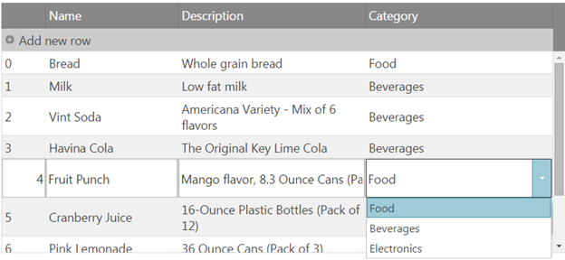
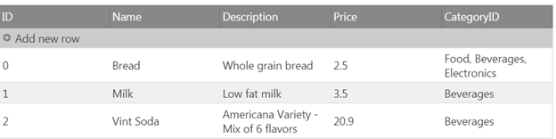
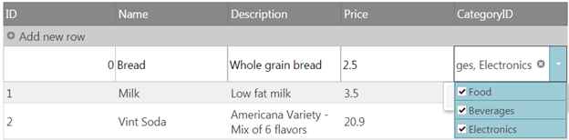

<!--
|metadata|
{
    "fileName": "working-with-combo-editor-provider",
    "controlName": "igGrid",
    "tags": ["Editing","Grids","Migration"]
}
|metadata|
-->

# Working with igCombo editor provider

## Topic Overview

### Purpose
This topic includes information on the basic settings of the combo as an editor provider for the igGrid and explanation on how the basic options, that determine the display text and value, will affect the data that will be saved in the grid as the result of updating via the combo editor provider.
 It also includes information on how to create a custom provider that extends the combo editor provider in order to implement functionalities, which are not supported out of the box.

### In this topic
This topic contains the following sections:

- 	[**Configuring the Combo editor provider in JavaScript**](#config)
	- [**Basic Configuration**](#basicConfig)
	- [**Configuring igCombo editor with multiple selection**](#multiSelectionConfig)

## <a id="config"></a> Configuring the Combo editor provider in JavaScript

### <a id="basicConfig"></a> Basic Configuration
This procedure guides you through the process of configuring an igCombo editor in the igGrid.

1. Instantiate the igGrid and define a igCombo editor in the igGrid Updating’s column settings for a specific column.

	**In JavaScript**

	```
	$("#gridProducts").igGrid({
		dataSource: northwindProductsJSON,
		autoGenerateColumns: false,
		primaryKey: "ID",
		autoCommit: true,
		width: "100%",
		height: "360px",
		columns: [
			{ headerText: "", key: "ID", dataType: "number", width: "8%" },
			{ headerText: "Name", key: "Name", dataType: "string", width: "24%" },
			{ headerText: "Description", key: "Description", dataType: "string", width: "34%" },
			{ headerText: "Category", key: "CategoryID", dataType: "number", width: "34%", formatter: formatCategoryCombo }
			],
			features: [
					{
						name: 'Updating',
						columnSettings: [{
						//The combo is defined as an editor provider. Combo options are defined under 'editorOptions'.
						columnKey: "CategoryID",
						editorType: 'combo',
						required: true,
						editorOptions: {
						mode: "dropdown",
						dataSource: northWindCategoriesJSON
						}
						}]	
					}
			]            
	});
	```

	> **Note:** A single instance of the igCombo will be created for the specified column and that instance will be reused when editing the different cells of that column.

2. Define additional editorOptions for the igCombo in the related column settings.

	**In JavaScript**:

	```
	columnSettings: [{
		columnKey: "CategoryID",
		editorType: 'combo',
		required: true,
		editorOptions: {
			mode: "dropdown",
			dataSource: northWindCategoriesJSON,
			textKey: "Name",
			valueKey: "ID"
		}
	}]
	```

	The basic options that need to be defined for the combo are the following:
	-	[datasource](%%jQueryApiUrl%%/ui.igCombo#options:datasource) – the data source which the combo will use to create the items in the drop-down list.
	-	[valueKey](%%jQueryApiUrl%%/ui.igCombo#options:valueKey) – the field in the data source, which will be used as the actual value of the drop-down item.
	-	[textKey](%%jQueryApiUrl%%/ui.igCombo#options:textKey) (optional – if not set will be the same the valueKey) - the field in the data source, which will be used as the display value of the drop-down item.
	-	[mode](%%jQueryApiUrl%%/ui.igCombo#options:mode) (optional – if not set defaults to “editable”)

	The **textKey** and **valueKey** options correspond to the displayed and actual value of the items of the combo list. When both are set to use the same data field the displayed and actual value that will be saved in the grid data source will be the same.

	However if the **textKey** points to a different field than the **valueKey** it’s important to note that the actual value saved in the data source after editing will be the value of the selected item. The text will be disregarded as it serves only a display purpose. 

	If you’d like the text of the associated drop-down items to be displayed in the grid cells instead of the value an additional formatter function will need to be defined for the column in order for the value to be associated with the corresponding display text. A similar example can be found in the following related sample: [Grid with Combo Editor](%%NewSamplesUrl%%/combo/grid-with-combo-editor)

	**In JavaScript**
	```
	function formatCategoryCombo(val) {
		var i, category;
		for (i = 0; i < northWindCategoriesJSON.length; i++) {
			category = northWindCategoriesJSON[i];		
			if (category.ID == val) {
				val = category.Name;
			}
		}
		return val;
	}
	```
3. Observe the result.

	

### <a id="multiSelectionConfig"></a> Custom configuring for igCombo editor to support multiple selection

> **Note:** This scenario is not supported out of the box since the grid does not allow saving of complex values in the data source. To support such scenarios a custom implementation will need to be applied for the getValue/setValue methods of the igCombo provider to handle the scenarios where complex data (in the form of an array) is passed from the combo’s multiple selection to the grid and vice versa.
If the textKey and valueKey are different and the value is of type that can’t easily store multiple values ( for example numeric type) additional custom implementation will need to be applied for the storing and setting of the values as well as additional logic for features that operate on the values in the data source ( sorting, filtering etc.).

The following proceedure guides you through the process of creating a custom provider that extends the combo editor in order to support multiple selection for a column of type string, in which the value saved in the data source will be a coma separated list of the selected items.

1. Instantiate the igGrid and define a custom editor in the igGrid Updating’s column settings for a specific column.

	**In JavaScript**

	```
	var northwindProductsJSON = [
		{ "ID": 0, "Name": "Bread", "Description": "Whole grain bread", "Price": "2.5", "CategoryID": "Food" },
		{ "ID": 1, "Name": "Milk", "Description": "Low fat milk", "Price": "3.5", "CategoryID": "Beverages" },
		{ "ID": 2, "Name": "Vint Soda", "Description": "Americana Variety - Mix of 6 flavors", "Price": "20.9", "CategoryID": "Beverages"  },
		{ "ID": 3, "Name": "Havina Cola", "Description": "The Original Key Lime Cola",  "Price": "19.9", "CategoryID": "Beverages"  },
		{ "ID": 4, "Name": "Fruit Punch", "Description": "Mango flavor, 8.3 Ounce Cans (Pack of 24)",  "Price": "22.99", "CategoryID": "Beverages"  },
		{ "ID": 5, "Name": "Cranberry Juice", "Description": "16-Ounce Plastic Bottles (Pack of 12)",  "Price": "22.8", "CategoryID": "Beverages"  },
		{ "ID": 6, "Name": "Pink Lemonade", "Description": "36 Ounce Cans (Pack of 3)", "Price": "18.8", "CategoryID": "Beverages"  },
		{ "ID": 7, "Name": "DVD Player", "Description": "1080P Upconversion DVD Player", "Price": "35.88", "CategoryID": "Electronics" },
		{ "ID": 8, "Name": "LCD HDTV", "Description": "42 inch 1080p LCD with Built-in Blu-ray Disc Player", "Price": "1088.8", "CategoryID": "Electronics" }
		],
	northWindCategoriesJSON = [
		{ "ID": 0, "Name": "Food" },
		{ "ID": 1, "Name": "Beverages" },
		{ "ID": 2, "Name": "Electronics" }
	];  
	$("#gridProducts").igGrid({
		dataSource: northwindProductsJSON,
		autoGenerateColumns: true,
		primaryKey: "ID",
		autoCommit: true,               
		features: [
		{
			name: 'Updating',
			columnSettings: [{
				//The combo is defined as a custom editor provider. Combo options are defined under 'editorOptions'.
				columnKey: "CategoryID",
				editorProvider: new $.ig.ComboEditorProviderCustom(),
				editorOptions: {
					mode: "dropdown",
					dataSource: northWindCategoriesJSON,
					textKey: "Name",
					valueKey: "Name",
					allowCustomValue: true,
					multiSelection: {
						enabled: true,
						showCheckboxes: true,
						itemSeparator: ', '						
					}
				}
			}]				
		}]
	});
	```

	In the above configuration the textKey and valueKey are set to use the same field and therefore there’s no need for specifying a formatter function.
	Also note that multiselection with checkboxes is enabled.

2. Create a custom editor provider that extends the default EditorProviderCombo and overwrite its default getValue and setValue methods.

	**In JavaScript**
	```
	$.ig.ComboEditorProviderCustom = $.ig.EditorProviderCombo.extend({
		getValue: function () {			
		var val = this.editor.value();
		var text= this.editor.text();
		if ($.type(val) === "array" && val.length) {		
			//When the passed value is of complex type return the text instead. 
			//This will be the value saved in the grid data source after editing ends.
			return text;
		}				
		return val;
		},
		setValue: function (val, fire) {					
			var array = [];
			this.editor.deselectAll();					
			if (this.options.multiSelection.enabled && val.contains(this.options.multiSelection.itemSeparator)) {
				//if multiSelection is enabled and the value passed from the grid cell to the edito contains the specified itemSeparator
				//Then split the value by the separator and set a complex value back to the editor so that the matching items will get selected.
				array = val.split(this.options.multiSelection.itemSeparator);
				return this.editor.value(array, null, fire);
			}	
			this.editor.value(val, null, fire);
		}				
	});
	```

3. Observe the result.

	You can select multiple values from the combo, which are applied as string to the grid.

	

	When you enter edit mode of the cell, the related values from the coma separated list will be marked as selected in the drop-down.

	


## <a id="topics"></a> Related Topics 
Following are some other topics you may find useful.

-	[Configuring igCombo](igCombo-Configuring.html)
- 	[Updating Overview (igGrid)](igGrid-Updating.html)
-   [igGridUpdating API documentation](%%jQueryApiUrl%%/ui.igGridUpdating)
-   [igCombo API documentation](%%jQueryApiUrl%%/ui.igCombo)
 

 


