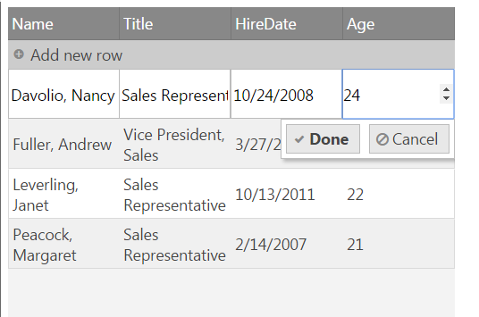

<!--
|metadata|
{
    "fileName": "implementing-custom-editor-provider",
    "controlName": "igGrid",
    "tags": ["Editing","Grids", "Editor Provider"]
}
|metadata|
-->

# Implementing Custom Editor Provider

## Topic Overview

### Purpose
This topic will guide you through the process of implementing a custom editor provider that extends the igEditorProvider class.
Implementing your own editor provider allows you to fully customize the editing experience, from the type of editor used to the visualization and validation logic for the editor.


### In this topic
This topic contains the following sections:

-   [**Overview**](#overview)
-   [**Built-in Editor types**](#editors)
- 	[**Implementing custom editor providers**](#customProviders)
	- [**Example on how to wrap HTML 5 number INPUT into an editor provider**](#example)
- 	[**Related Topics**](#topics)
- 	[**Related Samples**](#samples)

## <a id="overview"></a>Overview

The Updating feature when in edit mode displays editors for the row or cell being edited. Those editors are implemented by an editor providers abstraction which provides a common editing communication interface with the Updating feature.

Updating comes with a set of editor providers that wrap the [%%ProductName%% Editors](igEditors-LandingPage.html) to provide feature rich experience for the end user.

## <a id="editors"></a> Built-in editor types

The following types of the editor providers are supported out of the box: text, numeric, date/time, date picker, mask-editor, boolean, percentage, currency, combo and rating.

> **Note**: All editor providers are defined in the infragistics.ui.grid.shared.js file.

All editor types inherit from one of the following common classes "$.ig.EditorProvider" or "$.ig.EditorProviderBase" (which in turn inherits from the $.ig.EditorProvider class).
The EditorProvider class inherits from a base Class implementation where the "extend" method allows creating a new Classes that inherits from this class.
The prototypes of the two main classes look as follows:

**In JavaScript**
```
$.ig.EditorProvider = $.ig.EditorProvider || Class.extend({
		createEditor: function (callbacks, key, editorOptions, tabIndex, format, element) { ... },
		keyDown: function (evt, ui) { ... }, 
		attachErrorEvents: function (errorShowing, errorShown, errorHidden) { ... }, 
		getEditor: function () { ... }, 
		refreshValue: function () { ... },
		getValue: function () { ... },
		setValue: function (val) { ... }, 
		setFocus: function (toggle)  { ... }, 
		setSize: function (width, height) { ... }, 
		removeFromParent: function () { ... }, 
		destroy: function () { ... },
		validator: function () { ... }, 
		validate: function () { ... }, 
		requestValidate: function (evt) { ... },
		isValid: function () { ... }
		});
		
$.ig.EditorProviderBase = $.ig.EditorProviderBase || $.ig.EditorProvider.extend({		
		createEditor: function (callbacks, key, editorOptions, tabIndex, format, element) { ... },
		destroy: function () { ... },
		isValid: function () { ... },
		refreshValue: function () { ... },
		removeFromParent: function () { ... }, 
		setFocus: function (toggle)  { ... }, 
		setSize: function (width, height) { ... },
		textChanged: function(evt, ui) { ... },
		validator: function () { ... }
	});
```

Each of the specific editor types inherits from one of the base class and add new specific methods or overwrite existing ones as neccessary.
You can find the full list of editor types, their classes and what they inherit from below:

Editor type | Class Name | Inherits from
------------|------------|--------------
Text editor provider | $.ig.EditorProviderText |  $.ig.EditorProviderBase
Numeric editor provider | $.ig.EditorProviderNumeric | $.ig.EditorProviderBase
Currency editor provider | $.ig.EditorProviderCurrency | $.ig.EditorProviderBase
Percent editor provider | $.ig.EditorProviderPercent | $.ig.EditorProviderBase
Mask editor provider | $.ig.EditorProviderMask | $.ig.EditorProviderBase
Date editor provider | $.ig.EditorProviderDate | $.ig.EditorProviderBase
Datepicker editor provider | $.ig.EditorProviderDatePicker | $.ig.EditorProviderBase
Boolean editor provider |  $.ig.EditorProviderBoolean |  $.ig.EditorProviderBase
Combo editor provider | $.ig.EditorProviderCombo | $.ig.EditorProvider
Rating editor provider | $.ig.EditorProviderRating | $.ig.EditorProvider

> **Note**: Notice that the  $.ig.EditorProviderBase class defines an additional method textChanges, which is mainly applicable to editors which display text. It's not applicable in some cases like the rating editor provider.
	Hence editors that don't display text should inherit the $.ig.EditorProvider class instead.

## <a id="customProviders"></a> Implementing custom editor providers


The custom editor provider instance should either extend $.ig.EditorProvider/$.ig.EditorProviderBase or it should have definitions for the following public methods:

**In JavaScript**

```
createEditor: function (callbacks, key, editorOptions, tabIndex, format, element) {
	//Used to initialize the editor
	
	//Arguments:
	//callbacks - list of callback methods - keyDown and textChanged
	//key - the key of the column to which this editor belongs
	//editorOptions - the editorOptions defined in the Updating feature's columnSettings for this column
	//tabIndex - the tabIndex of the editor
	//format - the format applied to the column
	//element - the editor's main DOM element. When creating a custom editor a new DOM element should be assigned to this argument and the element should be returned as the result of the method.
},
attachErrorEvents: function (errorShowing, errorShown, errorHidden) {
	//used to attach igvalidator error events
},
getEditor: function () {
	//gets editor instance
},
refreshValue: function () {
	//refreshes value - used in cases like MaskEditors where the value needs to be proccessed before being applied.
},
getValue: function () {
	//gets value from editor. Updating uses this method to pass the current editor value as the new value for the cell when you exit edit mode for the cell.
},
setValue: function (val) {
	//sets value to the editor. Updating uses this method to set the current cell value from the cell to the editor when you enter edit mode for a cell.
},
setSize: function (width, height) {
	//sets current size(width and height) for the editor
},
setFocus: function () {
	//sets focus to the editor
},
removeFromParent: function () {
	//used to detach the editor from the current parent cell element. 
},
destroy: function () {
	//destroys the editor.
	//If there are any additional DOM elements or event handles associated with the editor they should also be removed.
},
validator: function () {
	//If a validator (igValitor) should be used to validate the editor value, this method should return it. Otherwise return null.
},
validate: function (noLabel) {
	//Triggered when validation is required. Should return the result from isValid method for the validator (if there is a validator), otherwise return true.
},
isValid: function () 
	//returns if the validation is successful or not. If value is valid it should return true, otherwise it should return false.
},
keyDown: function(evt) {
	//keydown handler is required for every editor
	//Should notify Updating that a key has been pressed, so that DOM elements (like the Done/Cancel buttons) can be updated accordingly.
}
```
When extending the existing igEditorProvider or the igEditorProviderBase the following methods should be override on the prototype object by specifying a method with the same name for the custom editor provider:

```
createEditor: function (callbacks, key, editorOptions, tabIndex, format, element) {},
getValue: function () {},
setValue: function (val) {},
keyDown: function(evt) {},
destroy: function() {}
```
    
The createEditor method	allows you to create a new DOM element and assign it as the element to be used as an editor for the specific column. 
The getValue and setValue methods allow you to specify how the value should be retrieved from the cell and applied to the editor and vice versa.
The keyDown event should be used to notify the Updating feature that a change has been applied - this would allow the Updating feature's UI (like the Done/Cancel buttons) to update their state.
The related callbacks should be invoked in order to notify the Updating feature for the change, for example:

```
keyDown: function(evt) {
	var ui = {};
	ui.owner = this.editor.element;
	ui.owner.element = this.editor.element;
	this.callbacks.keyDown(evt, ui, this.columnKey);
	//if value is valid trigger textChanged
	this.callbacks.textChanged(evt, ui, this.columnKey);
}
```


### <a id="example"></a> Example on how to wrap HTML 5 number INPUT into an editor provider

This procedure demonstrates how to wrap a simple HTML 5 number INPUT into an editor provider.

1.  Instantiate an igGrid and define a custom editor in the igGrid Updating’s column settings for a specific column.

	**In JavaScript**

	```
	var northwindEmployees = [
        { "ID": 1, "Name": "Davolio, Nancy", "Title": "Sales Representative", "HireDate": "\/Date(1224795600000)\/", "Country": "USA", "Age": 22 },
        { "ID": 2, "Name": "Fuller, Andrew", "Title": "Vice President, Sales", "HireDate": "\/Date(1269640800000)\/", "Country": "USA", "Age": 22},
        { "ID": 3, "Name": "Leverling, Janet", "Title": "Sales Representative", "HireDate": "\/Date(1318453200000)\/", "Country": "USA", "Age": 22 },
        { "ID": 4, "Name": "Peacock, Margaret", "Title": "Sales Representative", "HireDate": "\/Date(1171404000000)\/", "Country": "USA", "Age": 21 }
    ]
	$("#grid1").igGrid({
    dataSource: northwindEmployees,
    primaryKey: "ID",
    width: "500px",
    height: "600px",
    autoCommit: true,
    autoGenerateColumns: false,
    columns: [
        { headerText: "Employee ID", key: "ID", dataType: "number", hidden: true },
        { headerText: "Name", key: "Name", dataType: "string" },
        { headerText: "Title", key: "Title", dataType: "string" },                   
        { headerText: "HireDate", key: "HireDate", dataType: "date" },
		{ headerText: "Age", key: "Age", dataType: "number" }
    ],
    features: [
        {
            name: "Updating",
            enableAddRow: true,
            enableDeleteRow: false,
            editMode: "row",
            columnSettings: [
                {
                    columnKey: "Age",
                    editorProvider: new $.ig.EditorProviderInput()
                }												
            ]
        }
    ]
    
	```

2. Create a custom editor provider that extends the default EditorProvider and overwrite its default methods.

	**In JavaScript**
	```
    $.ig.EditorProviderInput = $.ig.EditorProviderInput || $.ig.EditorProvider.extend({
		createEditor: function (callbacks, key, editorOptions, tabIndex, format, element) {
			element = element || $('<input/>');
			element.attr("type", "number");
			  
			// call parent createEditor
			this._super(callbacks, key, editorOptions, tabIndex, format, element);
			
			element.on("keydown", $.proxy(this.keyDown, this));
	 
			this.editor = {};
			this.editor.element = element;
			return element;
		},
		keyDown: function(evt) {
			var ui = {};
			ui.owner = this.editor.element;
			ui.owner.element = this.editor.element;
			this.callbacks.keyDown(evt, ui, this.columnKey);
			
			//// enable "Done" button only for numeric character
			if ((evt.keyCode >= 48 && evt.keyCode <= 57) || (evt.keyCode >= 96 && evt.keyCode <= 105)) {
				this.callbacks.textChanged(evt, ui, this.columnKey);
			}
		},			
		setSize: function (width, height) {
			this.editor.element.css({
			width: width - 2,
			height: height - 2,
			borderWidth: "1px"
		});
		},
		attachErrorEvents: function (errorShowing, errorShown, errorHidden) { },
		getValue: function () {
			return this.editor.element.val();
		},
		setValue: function (val) {
			this.editor.element.val(val);
		},
		destroy: function () {
			this.editor.remove();
		}
    });
	```

3. Observe the result.

	
	
	The displayed editor is HTML 5 number INPUT which gets and sets the value to and from the cell.
	
## <a id="topics"></a> Related Topics 
Following are some other topics you may find useful.

- 	[Updating Overview (igGrid)](igGrid-Updating.html)
- 	[igEditors](igEditors-LandingPage.html)
-   [igGridUpdating API documentation](%%jQueryApiUrl%%/ui.igGridUpdating)
 
## <a id="samples"></a> Related Samples 

-	[Basic Editing](%%NewSamplesUrl%%/grid/basic-editing)
-	[Editing: Custom Editor Provider](%%NewSamplesUrl%%/grid/editing-custom-editor-provider)