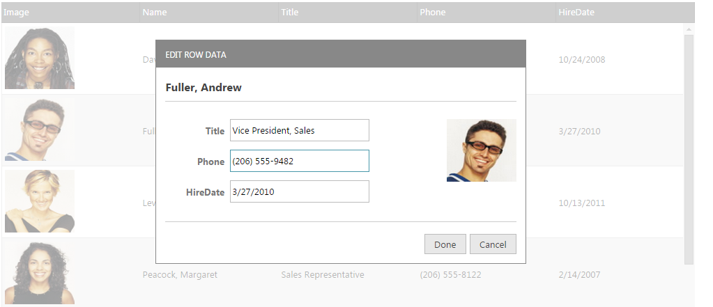

<!--
|metadata|
{
    "fileName": "iggrid-updating-roweditdialog",
    "controlName": "igGrid",
    "tags": ["Editing","Grids","Templating"]
}
|metadata|
-->

# Row Edit Dialog Overview (igGrid)

## Topic Overview

### Purpose

This document explains the specific properties and methods when using the row edit dialog.

### Required background

The following lists the topics and articles required as a prerequisite to understanding this topic.

- [igGrid Overview](igGrid-Overview.html): The `igGrid` is a jQuery-based client-side grid that is responsible for presenting and manipulating tabular data. Its whole lifecycle is on the client-side, which makes it independent from server-side technology.

- [Updating Overview (igGrid)](igGrid-Updating.html): This topic explains how to use the updating feature of the `igGrid`™ control.

- [igTemplating](Infragistics-Templating-Engine.html): This topic covers the use the Infragistics® Templating Engine.


### In this topic

This topic contains the following sections:

-   [Introduction](#introduction)
-   [Row Edit Dialog definition](#definition)
-   [Row Edit Dialog Property Reference](#property-reference)
-   [Row Edit Dialog Events Reference](#events-reference)
-   [Related Content](#related-content)


## <a id="introduction"></a> Introduction

Starting with version 12.2, the updating feature of `igGrid` provides a row edit dialog and allows the end user to edit records in a pop up dialog as compared to inline editing.

The feature is implemented as part of grid updating. The `editMode` property has a new value added: “dialog”, apart from the “row” and “cell” which exist currently.

<table class="table">
	<thead>
		<tr>
            <th>
Property
			</th>
            <th>
Type
			</th>
            <th>
Description
			</th>
            <th>
Default Value
			</th>
        </tr>
	</thead>
	<tbody>
        <tr>
            <td>
[editMode](%%jQueryApiUrl%%/ui.iggridupdating#options:editMode)
			</td>
            <td>
“row|cell|**dialog**|none|null”
			</td>
            <td>
The `editMode` property has a new value added, **dialog**
			</td>
            <td>
                row
            </td>
        </tr>
    </tbody>
</table>

The row dialog is rendered as a dialog window. An example is shown below.



Clicking Done and Cancel performs the same action as when using `editMode`: “row”.

The row edit dialog is opened using the same triggers that are specified in the `startEditTriggers` Updating property (*click*, *dblClick*, *enter*, *F2*, etc.)

When the row edit dialog is automatically generated, it is based on the data types of the columns. It reads the `columnSettings` for the updating feature in order to determine what kind of editor will be rendered.

The rendering of disabled editors (marked with `readOnly`: true) is controlled by the `showReadonlyEditors` property. If `showReadonlyEditors` is *true* then the disabled columns are rendered in the row edit dialog window but they are disabled. When `showReadonlyEditors` is *false* the `readOnly` columns are not rendered in the editors of the row edit dialog window.

There is validation integration in the row edit dialog. The validation is performed by reading the `validation` property for column settings. Validation messages are rendered inline in the row edit dialog when the end user types something which isn’t allowed.

You can use the public API methods [startEdit](%%jQueryApiUrl%%/ui.igGridUpdating#methods:startEdit) and [endEdit](%%jQueryApiUrl%%/ui.igGridUpdating#methods:endEdit) in order to open/close the row edit dialog.


## <a id="definition"></a> Row Edit Dialog definition

This section describes the various ways to define a Row Edit Dialog.

The row dialog can be defined in the ways listed below:

1.  Automatically generated row edit dialog

	When neither of the template settings are used the widget generates a default dialog containing a table with two columns. The left column displays the header texts for each column in the grid while the right column contains editors the type of which is based on the `columnSettings` for that column and its data type.

	**In JavaScript:**
	
	```js
	{
		name: "Updating",
		enableAddRow: true,
		editMode: "dialog",
		enableDeleteRow: true,
		columnSettings: [
			{
				columnKey: "OrderID",
				readOnly: true
			},
			{
				columnKey: "ShipName",
				defaultValue: names[1],
				editorOptions: {
					button: "dropdown",
					listItems: names,
					readOnly: true,
					dropDownOnReadOnly: true
				}
			}
		]
	}
	```

2.  Specified as a template string using the `dialogTemplate` and `editorsTemplate` properties.

	If one or both of these options is set the widget will create the dialog using the templating engine of choice. 
	
	2.1. `dialogTemplate` is a template rendered against the record currently being edited. Users can utilize any of the properties native to the elements in the grid's data source in this template.
	After the template renders the widget searches for elements marked with the following special attributes

	- `data-editor-for-<columnKey>` - where `<columnKey>` is the key of one of the grid's columns. An editor is created for each of these elements as long as only one element passes the criteria per column.
	
	- `data-render-tmpl` - the element marked with this attribute is used as a container for the template specified in the `editorsTemplate` option. If no element with this attribute is found, the template specified by the `editorsTemplate` will not be executed.

	2.2. `editorsTemplate` is a template rendered against the collection of columns that can be modified internally by the options `showReadonlyEditors` and `showEditorsForHiddenColumns`. These two options control which columns will be included in the collection passed to the templating engine. Additionally, columns that have editors specified in the `dialogTemplate` are excluded. All of the properties native to the grid's column collection objects can be used in this template. Editors are still expected to have the `data-editor-for-<columnKey>` attribute, however, its application should be left to the templating engine using a `${key}` template tag (e.g. `data-editor-for-${key}`) or similar based on the templating engine of choice.
	
	**In ASPX:**
	
	```csharp
	<%= (Html.Infragistics().Grid(Model).ID("grid1").Height("400px").Width("100%")
		// Grid Definition
		.Features(features => {
			features.Updating()                
				.EditMode(GridEditMode.Dialog)
				.ShowReadonlyEditors(true)
				.StartEditTriggers(GridStartEditTriggers.Click)
				.RowEditDialogOptions(options => {
		           		options.Containment("owner")
		           		.DialogTemplate("<table><colgroup><col></col><col></col></colgroup><tbody data-render-tmpl></tbody></table>")
		           		.EditorsTemplate("<tr><td>${headerText}</td><td><input data-editor-for-${key} /></td></tr>")
		           		.Width("400px");
			});
		})
		.DataBind()
		.Render()
	%>
	```
	
	**In JavaScript:**
	
	```js
	features: [
		{ 
			name: "Updating",
			startEditTriggers: 'enter,dblclick',    
			editMode: 'dialog',      
			showReadonlyEditors: false,      
		  	rowEditDialogOptions: {
				editorsColumnWidth: 100,
				dialogTemplate: "<table><colgroup><col></col><col></col></colgroup><tbody data-render-tmpl></tbody></table>",
				editorsTemplate: "<tr><td>${headerText}</td><td><input data-editor-for-${key} /></td></tr>"
			}
		}
	]
	```

3.  Referencing a template element using the `dialogTemplateSelector` and the `editorsTemplateSelector` properties.

	Every rule from 2. applies here as well. The selector properties should be used when it is more convenient for the template to be added to the page html instead of passed as a string to the control.
	
	If both `editorsTemplateSelector` and `editorsTemplate` are specified, then `editorsTemplateSelector` is used. Same applies to the `dialogTemplateSelector` and the `dialogTemplate` options.
	
	**In JavaScript:**
	
	```js
	<script id="dialogTemplate" type="text/html">	
		<div style="float: left;">
			<strong>${Name}</strong><br />
			<table style="width: 100%;">
				<colgroup>
					<col style="width: 30%;" />
					<col style="width: 70%;" />
				</colgroup>
				<tbody data-render-tmpl="true">
				</tbody>
			</table>
		</div>
	</script>

	<script id="editorsTemplate" type="text/html">
		<tr>
			<td><strong>${headerText}</strong></td>
			<td><input data-editor-for-${key}="true"/></td>
		</tr>
	</script>
	//Inside the grid Definition
	..    
	features: [      
		{
			name: 'Updating',
			startEditTriggers: 'enter,dblclick',
			editMode: 'dialog',	    
			showReadonlyEditors: false,
			rowEditDialogOptions: {
				dialogTemplateSelector: "#dialogTemplate",
				editorsTemplateSelector: "#editorsTemplate"
			},
			columnSettings: [
				{
					columnKey: "ProductID",
					editorType: 'numeric',
					readOnly: true
				},
				{
					columnKey: "ProductDescription",
					editorOptions: { readOnly: true }
				},
				{
					columnKey: "DateCol",
					editorType: 'datepicker',
					validation: true,
					editorOptions: { required: true }
				},
				{
					columnKey: "UnitPrice",
					editorType: 'currency',
					validation: true,
					editorOptions: { button: 'spin', required: true }
				}
			]
		}
	]
	…
	```


## <a id="property-reference"></a> Row Edit Dialog Property Reference

This section describes the various properties related to the Row Edit Dialog when using the Updating feature in the `igGrid` control.

The following summarizes the purpose and functionality of the unbound columns’ properties.

- [showReadonlyEditors](%%jQueryApiUrl%%/ui.iggridupdating#options:showReadonlyEditors)

	This property is used when editing is disabled for a particular column (`readOnly: true`).

	By default it is TRUE. Then the disabled columns are rendered in the Row Edit Dialog Window but they are disabled.

	When FALSE the disabled columns are not rendered in the editors.

- [containment](%%jQueryApiUrl%%/ui.iggridupdating#options:rowEditDialogOptions.containment)

	This property sets the dialog’s parent container. Its default value is “owner” and the row edit dialog is drag-able only in the grid area.

	If it set to be “window”, the dialog is drag-able in the whole window area.

- [dialogTemplate](%%jQueryApiUrl%%/ui.iggridupdating#options:rowEditDialogOptions.dialogTemplate:"")

	Specifies a template to be rendered against the currently edited record (or default key-value pairs in the case of not yet created records). 
	It may contain an element decorated with the 'data-render-tmpl' attribute to specify where the control should render the editors template specified in the editorsTemplate option. For custom dialogs, the elements can be decorated with 'data-editor-for-<columnKey>'
	attributes where columnKey is the key of the column that editor or input will be used to edit.
	If both dialogTemplate and dialogTemplateSelector are specified, dialogTemplateSelector will be used.
	The default template is `<table><colgroup><col></col><col></col></colgroup><tbody data-render-tmpl></tbody></table>`.
	
	**In JavaScript:**
	
	```js
	features: [
		{ 
			name: "Updating",
			startEditTriggers: 'enter,dblclick',    
			editMode: 'dialog',      
			showReadonlyEditors: false,      
			rowEditDialogOptions: {
	        		dialogTemplate:"<table><colgroup><col></col><col></col></colgroup><tbody data-render-tmpl></tbody></table>"
			}
		}
	]
	```
    
- [editorsTemplate](%%jQueryApiUrl%%/ui.iggridupdating#options:rowEditDialogOptions.editorsTemplate:"")

	Specifies a template to be executed for each column in the grid's column collection.Decorate the element to be used as an editor with 'data-editor-for-${key}'. The ${key} template tag should
	be replaced with the chosen templating engine's syntax for rendering values. If any editors for columns are specified in the dialog markup
	they will be exluded from the data the template will be rendered for.
	This property is ignored if the dialog template does not include an element with the 'data-render-tmpl' attribute. 
	
	**In JavaScript:**
	
	```js
	features: [
		{ 
			name: "Updating",
			startEditTriggers: 'enter,dblclick',    
			editMode: 'dialog',      
			showReadonlyEditors: false,      
			rowEditDialogOptions: {
				dialogTemplate:"<table><colgroup><col></col><col></col></colgroup><tbody data-render-tmpl></tbody></table>"
			}
		}
	]
	``` 

- [dialogTemplateSelector](%%jQueryApiUrl%%/ui.iggridupdating#options:rowEditDialogOptions.dialogTemplateSelector)

	Specifies a selector to a template rendered against the currently edited record (or default key-value pairs in the case of not yet created records). It may contain an element decorated with the 'data-render-tmpl' attribute to specify where the control should render the editors template specified in the editorsTemplate option. For custom dialogs, the elements can be decorated with 'data-editor-for-<columnKey>'	attributes where columnKey is the key of the column that editor or input will be used to edit. If both editorsTemplate and editorsTemplateSelector are specified, editorsTemplateSelector will be used.	The default template is `<table><colgroup><col></col><col></col></colgroup><tbody data-render-tmpl></tbody></table>`.
	
**In JavaScript:**
	
```js
	
	<script id="dialogTemplate" type="text/html">
		<div style="float: left;">
			<strong>${Name}</strong><br />
			<table style="width: 100%;">
				<colgroup>
					<col style="width: 30%;" />
					<col style="width: 70%;" />
				</colgroup>
				<tbody data-render-tmpl="true">
				</tbody>
			</table>
		</div>
	</script>
```
    
- [editorsTemplateSelector](%%jQueryApiUrl%%/ui.iggridupdating#options:rowEditDialogOptions.editorsTemplateSelector)
 
Specifies a selector to a template to be executed for each column in the grid's column collection. Decorate the element to be used as an editor with 'data-editor-for-${key}'. The ${key} template tag should be replaced with the chosen templating engine's syntax for rendering values. If any editors for columns are				specified in the dialog markup they will be exluded from the data the template will be rendered for. This property is ignored if the dialog markup does not include an element with the 'data-render-tmpl' attribute. If both editorsTemplate and editorsTemplateSelector are specified, editorsTemplateSelector will be used.The default template is `<tr><td>${headerText}</td><td><input data-editor /></td></tr>`
	
**In JavaScript:**
	
```js	
	<script id="editorsTemplate" type="text/html">
		<tr>
			<td><strong>${headerText}</strong></td>
			<td><input data-editor-for-${key}="true"/></td>
		</tr>
	</script>
```

- [height](%%jQueryApiUrl%%/ui.iggridupdating#options:rowEditDialogOptions.height)

	This property controls the height of the row edit dialog in pixels.
	
	Its default value is 350 and can be either a string (“350px”) or a number (350).


- [width](%%jQueryApiUrl%%/ui.iggridupdating#options:rowEditDialogOptions.width)

	This property controls the width of the row edit dialog in pixels.
	
	Its default value is 370 and can be either a string (“370px”) or a number (370).
	

- [namesColumnWidth](%%jQueryApiUrl%%/ui.iggridupdating#options:rowEditDialogOptions.namesColumnWidth)

	Controls the width of the column containing the column names in the default row edit dialog. It’s a number and the default value is 150.
	
	

- [startEditTriggers](%%jQueryApiUrl%%/ui.iggridupdating#options:startEditTriggers)

	The row edit dialog is opened by the same triggers that are specified in the `startEditTriggers`  updating property (*click*, *dblClick*, *enter*, *F2*, etc.)

- [doneLabel](%%jQueryApiUrl%%/ui.iggridupdating#options:doneLabel)

	This property controls the text for the *Done* button in the row edit dialog.

- [cancelLabel](%%jQueryApiUrl%%/ui.iggridupdating#options:cancelLabel)

	This property controls the text for the *Cancel* button in the row edit dialog.


## <a id="events-reference"></a> Row Edit Dialog Events Reference

This section describes the various properties related to the Row Edit Dialog when using the Updating feature in the `igGrid` control.

The following table explains the events fired when the row edit dialog is enabled.

The events are fired when the template is shown or hidden.

When template contents are rendering, the arguments for the event include the current data row to be edited. Thus, the developer can completely control the rendering.

Each handler function takes arguments `evt` and `ui`. You can use `ui.owner` to get a reference to `igGridUpdating` and `ui.dialogElement` to get reference to the row edit dialog DOM element.

To get a reference to the current data row you should use `ui.dialogElement.data('tr')`.

|Event|Description|
|---|---|
|[rowEditDialogBeforeOpen](%%jQueryApiUrl%%/ui.iggridupdating#events:rowEditDialogBeforeOpen)|This event is fired before the row edit dialog is opened. It is not cancelable.|
|[rowEditDialogAfterOpen](%%jQueryApiUrl%%/ui.iggridupdating#events:rowEditDialogAfterOpen)|This event is fired after the row edit dialog is opened.|
|[rowEditDialogContentsRendered](%%jQueryApiUrl%%/ui.iggridupdating#events:rowEditDialogContentsRendered)|This event is fired after the contents of the row edit dialog are rendered.|
|[rowEditDialogBeforeClose](%%jQueryApiUrl%%/ui.iggridupdating#events:rowEditDialogBeforeClose)|This event is fired before the row edit dialog is closed. It is not cancelable.|
|[rowEditDialogAfterClose](%%jQueryApiUrl%%/ui.iggridupdating#events:rowEditDialogAfterClose)|This event is fired after the row edit dialog is closed.|

## <a id="related-content"></a> Related Content

### Topics

The following topics provide additional information related to this topic.

- [Configuring Row Dialog Template](igGrid-Updating-RowEditDialog-Configuring.html): This topic explains how to use the Updating feature of the `igGrid`™ control in combination with a Row Edit Dialog.

### Samples

The following samples provide additional information related to this topic.

<div class="embed-sample">
   [Row Edit Dialog](%%SamplesEmbedUrl%%/grid/row-edit-dialog)
</div>