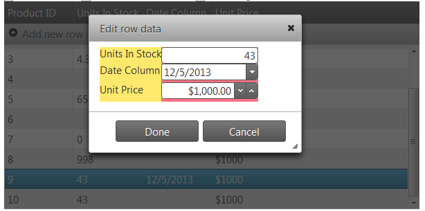
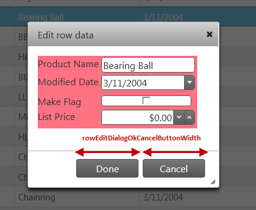
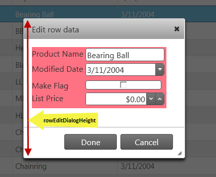
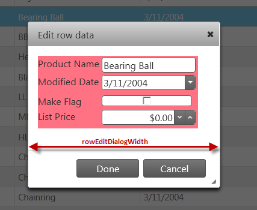
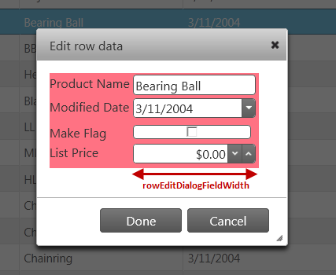

<!--
|metadata|
{
    "fileName": "iggrid-updating-rowedittemplate",
    "controlName": "igGrid",
    "tags": ["Editing","Grids","Templating"]
}
|metadata|
-->

# Row Edit Template Overview (igGrid)

## Topic Overview

### Purpose

This document explains the specific properties and methods when using the row edit template.

### Required background

The following lists the topics and articles required as a prerequisite to understanding this topic.

- [igGrid Overview](igGrid-Overview.html): The `igGrid` is a jQuery-based client-side grid that is responsible for presenting and manipulating tabular data. Its whole lifecycle is on the client-side, which makes it independent from server-side technology.

- [Updating Overview (igGrid)](igGrid-Updating.html): This topic explains how to use the updating feature of the `igGrid`™ control.

- [igTemplating](Infragistics-Templating-Engine.html): This topic covers the use the Infragistics® Templating Engine.


### In this topic

This topic contains the following sections:

-   [Introduction](#introduction)
-   [Row Edit Template definition](#definition)
-   [Row Edit Template Property Reference](#property-reference)
-   [Row Edit Template Events Reference](#events-reference)
-   [Related Content](#related-content)


## <a id="introduction"></a> Introduction

Starting with version 12.2, the updating feature of `igGrid` provides a row edit template and allows the end user to edit records in a pop up dialog as compared to inline editing.

The feature is implemented as part of grid updating. The `editMode` property has a new value added: “rowEditTemplate”, apart from the “row” and “cell” which exist currently.

<table class="table">
	<thead>
		<tr>
            <th>
Property
			</th>
            <th>
Type
			</th>
            <th>
Description
			</th>
            <th>
Default Value
			</th>
        </tr>
	</thead>
	<tbody>
        <tr>
            <td>
[editMode](%%jQueryApiUrl%%/ui.iggridupdating#options:editMode)
			</td>
            <td>
“row|cell|**rowEditTemplate**|none|null”
			</td>
            <td>
The `editMode` property has a new value added, “rowEditTemplate”
			</td>

            <td>
                <ul>row</ul>
            </td>
        </tr>
    </tbody>
</table>


The row template is rendered as a dialog window. An example is shown below.



Clicking Done and Cancel performs the same action as when using `editMode`: “row”.

The row edit template is opened using the same triggers that are specified in the `startEditTriggers` Updating property (*click*, *dblClick*, *enter*, *F2*, etc.)

When the row edit template is automatically generated, it is based on the data types of the columns. It reads the `columnSettings` for the updating feature in order to determine what kind of editor will be rendered.

The rendering of disabled editors (marked with `readOnly`: true) is controlled by the `showReadonlyEditors` property. If `showReadonlyEditors` is *true* then the disabled columns are rendered in the row edit dialog window but they are disabled. When `showReadonlyEditors` is *false* the `readOnly` columns are not rendered in the editors of the row edit dialog window.

There is validation integration in the row edit template. The validation is performed by reading the `validation` property for column settings. Validation messages are rendered inline in the row edit template when the end user types something which isn’t allowed.

You can use the public API methods `startEdit` and `closeEdit` in order to open/close the row edit template.


## <a id="definition"></a> Row Edit Template definition

This section describes the various ways to define a Row Edit Template.

The row template can be defined in the ways listed below:

1.  Automatically generated row edit template

	The row edit template is automatically generated, based on the data types of the columns. In this case, the row edit template uses the `columnSettings` of the updating feature in order to determine what kind of editor will be rendered.

	**In JavaScript:**
	
	```js
	{
	    name: "Updating",
	    enableAddRow: true,
	    editMode: "rowedittemplate",
	    enableDeleteRow: true,
	    rowEditDialogRowTemplateID: "rowEditDialogRowTemplate1",
	    columnSettings:
	    [
	        {
	            columnKey: "OrderID",
	            readOnly: true
	        },
	        {
	            columnKey: "ShipName",
	            defaultValue: names[1],
	            editorOptions: {
	                button: "dropdown",
	                listItems: names,
	                readOnly: true,
	                dropDownOnReadOnly: true
	            }
	        }
	    ]
	}
	```

2.  Specified as a template string using the `rowEditDialogRowTemplate` property

	If the `rowEditDialogRowTemplate` is specified, then the custom template is used for the row edit dialog.
	
	Inside the template, `${headerText}` references the header text of the column and `${dataKey}` references the column key.
	
	The property can be used to format and style the row edit dialog.
	
	**In ASPX:**
	
	```csharp
	<%= (Html.Infragistics().Grid(Model).ID("grid1").Height("400px").Width("100%")”
		// Grid Definition
		.Features(features =>
		{features.Updating()                
		.EditMode(GridEditMode.rowEditTemplate)
		.ShowReadonlyEditors(true)
		.StartEditTriggers(GridStartEditTriggers.Click)
		.RowEditDialogContainment("owner")
		.RowEditDialogRowTemplate("<tr><td>${headerText}</td><td data-key='${dataKey}'> {{if ${headerText} =='On Site'}} <input type='checkbox' />{{else}}<input />{{/if}}</td></tr>")
		.RowEditDialogWidth("400px");
		})
		.DataBind()
		.Render()%>
	```
	
	**In JavaScript:**
	
	```js
	features: [
	{ 
		name: "Updating",
		startEditTriggers: 'enter dblclick',    
		editMode: 'rowedittemplate',      
		showReadonlyEditors: false,      
		rowEditDialogRowTemplate:'<tr><td>${headerText}</td> 
			<td data-key='${dataKey}'> 
				{{if /${headerText} =='OnSite'}} 
					<input type='checkbox' />
				{{else}}
					<input />
				{{/if}} 
			</td>
			</tr>'
	},
	```

3.  Referencing a template element using the `RowEditDialogRowTemplateID` property

	The `RowEditDialogRowTemplateID` property points to the ID of the `x-jquery-tmpl` template.
	
	Inside the template `${headerText}` references the header text of the column and `${dataKey}` references the column key.
	
	The property can be used to format and style the row edit dialog.
	
	If both `rowEditDialogRowTemplate` and `rowEditDialogRowTemplateID` are specified, then `rowEditDialogRowTemplateID` is used.
	
	**In JavaScript:**
	
	```js
	<style type="text/css">
	        .tableBackGround
	        {
	            background-color: #FF7283;
	        }
	        .labelBackGround
	        {
	            background-color: #FFE96D;
	        }
	    </style>
	    <script id="rowEditDialogRowTemplate1" type="text/x-jquery-tmpl">      
	          <tr class="tableBackGround">                  
	                <td class="labelBackGround"> ${headerText}
	                </td>
	                <td data-key='${dataKey}'>
	                      <input /> 
	                </td>
	          </tr>
	    </script>
	//Inside the grid Definition
	..    
	features: [      
	{
	    name: 'Updating',
	    startEditTriggers: 'enter dblclick',
	    editMode: 'rowedittemplate',
	       rowEditDialogContainment: "owner",
	    showReadonlyEditors: false,
	    rowEditDialogRowTemplateID:'rowEditDialogRowTemplate1',
	    columnSettings: [{
	          columnKey: "ProductID",
	          editorType: 'numeric',
	          readOnly: true
	    }, {
	          columnKey: "ProductDescription",
	          editorOptions: { readOnly: true }
	    }, {
	          columnKey: "DateCol",
	          editorType: 'datepicker',
	          validation: true,
	          editorOptions: { required: true }
	    }, {
	          columnKey: "UnitPrice",
	          editorType: 'currency',
	          validation: true,
	          editorOptions: { button: 'spin', required: true }
	    }]
	}]
	…
	```


## <a id="property-reference"></a> Row Edit Template Property Reference

This section describes the various properties related to the Row Edit Template when using the Updating feature in the `igGrid` control.

The following summarizes the purpose and functionality of the unbound columns’ properties.

- [showReadonlyEditors](%%jQueryApiUrl%%/ui.iggridupdating#options:showReadonlyEditors)

	This property is used when editing is disabled for a particular column (`readOnly: true`).

	By default it is TRUE. Then the disabled columns are rendered in the Row Edit Dialog Window but they are disabled.

	When FALSE the disabled columns are not rendered in the editors.

- [rowEditDialogContainment](%%jQueryApiUrl%%/ui.iggridupdating#options:rowEditDialogContainment)

	This property sets the dialog’s parent container. Its default value is “owner” and the row edit dialog is drag-able only in the grid area.

	If it set to be “window”, the dialog is drag-able in the whole window area.

- [rowEditDialogRowTemplate](%%jQueryApiUrl%%/ui.iggridupdating#options:rowEditDialogRowTemplate)

	This property is a string value containing a custom template for rows in the row edit dialog. Inside the template `${headerText}` references the header text of the column and the `${dataKey}` references the column key. The property can be used to format and style the row edit dialog.

	**In JavaScript:**
	
	```js
	<tr>
	    <td>${headerText}</td>
	    <td data-key='${dataKey}'><input /></td>
	</tr>
	```
	
	**In JavaScript:**
	
	```js
	features: [
	{ 
		name: "Updating",
		startEditTriggers: 'enter dblclick',    
		editMode: 'rowedittemplate',      
		showReadonlyEditors: false,      
		rowEditDialogRowTemplate: 
		'<tr><td>${headerText}</td>
			<td data-key='${dataKey}'> 
			{{if /${headerText} =='OnSite'}} 
				<input type='checkbox' />
			{{else}}
				<input />
			{{/if}} 
		</td></tr>'
	},
	```

- [rowEditDialogRowTemplateID](%%jQueryApiUrl%%/ui.iggridupdating#options:rowEditDialogRowTemplateID)

	This property points to the ID of the x-jquery-tmpl template. If both `rowEditDialogRowTemplate` and `rowEditDialogRowTemplateID` are specified, then `rowEditDialogRowTemplateID` is used. The property can be used to format and style the row edit dialog.
	
	**In JavaScript:**
	
	```js
	<style type="text/css">
        .tableBackGround
        {
            background-color: #FF7283;
        }
        .labelBackGround
        {
            background-color: #FFE96D;
        }
	</style>
	<script id="rowEditDialogRowTemplate1" type="text/x-jquery-tmpl">      
		<tr class="tableBackGround">                  
		    <td class="labelBackGround"> 
		             ${headerText}
		    </td>
		    <td data-key='${dataKey}'>
		          <input /> 
		    </td>
		</tr>
	</script>
	```

- [rowEditDialogOkCancelButtonWidth](%%jQueryApiUrl%%/ui.iggridupdating#options:rowEditDialogOkCancelButtonWidth)

	This property controls the width in pixels of the “Done” and “Cancel” buttons in the row edit dialog. It specifies the width of each of the buttons.
	
	Its default value is 100 and can be either a string (“100px”) or a number (100)
	
	

- [rowEditDialogHeight](%%jQueryApiUrl%%/ui.iggridupdating#options:rowEditDialogHeight)

	This property controls the height of the row edit dialog in pixels.
	
	Its default value is 350 and can be either a string (“350px”) or a number (350).
	
	

- [rowEditDialogWidth](%%jQueryApiUrl%%/ui.iggridupdating#options:rowEditDialogWidth)

	This property controls the width of the row edit dialog in pixels.
	
	Its default value is 370 and can be either a string (“370px”) or a number (370).
	
	

- [rowEditDialogFieldWidth](%%jQueryApiUrl%%/ui.iggridupdating#options:rowEditDialogFieldWidth)

	This property controls the width of the row edit dialog fields in pixels.
	
	It’s a number and the default value is 140.
	
	

- [startEditTriggers](%%jQueryApiUrl%%/ui.iggridupdating#options:startEditTriggers)

	The row edit template is opened by the same triggers that are specified in the `startEditTriggers`  updating property (*click*, *dblClick*, *enter*, *F2*, etc.)

- [doneLabel](%%jQueryApiUrl%%/ui.iggridupdating#options:doneLabel)

	This property controls the text for the *Done* button in the row edit dialog.

- [cancelLabel](%%jQueryApiUrl%%/ui.iggridupdating#options:cancelLabel)

	This property controls the text for the *Cancel* button in the row edit dialog.


## <a id="events-reference"></a> Row Edit Template Events Reference

This section describes the various properties related to the Row Edit Template when using the Updating feature in the `igGrid` control.

The following table explains the events fired when the row edit template is enabled.

The events are fired when the template is shown or hidden.

When template contents are rendering, the arguments for the event include the current data row to be edited. Thus, the developer can completely control the rendering.

Each handler function takes arguments `evt` and `ui`. You can use `ui.owner` to get a reference to `igGridUpdating` and `ui.dialogElement` to get reference to the row edit dialog DOM element.

To get a reference to the current data row you should use `ui.dialogElement.data('tr')`.

<table class="table table-bordered">
	<thead>
		<tr>
            <th>
Event
			</th>
            <th>
Description
			</th>
        </tr>
	</thead>
	<tbody>
        <tr>
            <td>
[rowEditDialogOpening](%%jQueryApiUrl%%/ui.iggridupdating#events:rowEditDialogOpening)
			</td>
            <td>
This event is fired before the row edit dialog is opened. It is cancelable. <br />
                
**In JavaScript:**
<pre>
	<code>
	$("#grid1").live("iggridupdatingrowEditDialogOpening ", function (event, ui) {
		var gridUpdating = ui.owner;
		var gridID = ui.owner.element.context.id;
		var dialogWindow = ui.dialogElement;
		var currDataRow = ui.dialogElement.data('tr');
	});
	</code>
</pre>
			</td>
        </tr>

        <tr>
            <td>
[rowEditDialogOpened](%%jQueryApiUrl%%/ui.iggridupdating#events:rowEditDialogOpened)
			</td>
            <td>
This event is fired after the row edit dialog is opened.
			</td>
        </tr>

        <tr>
            <td>
[rowEditDialogContentsRendering](%%jQueryApiUrl%%/ui.iggridupdating#events:rowEditDialogContentsRendering)
			</td>
            <td>
This event is fired before the contents of the row edit dialog are rendered. It is cancelable.
			</td>
        </tr>

        <tr>
            <td>
[rowEditDialogContentsRendered](%%jQueryApiUrl%%/ui.iggridupdating#events:rowEditDialogContentsRendered)
			</td>
            <td>
This event is fired after the contents of the row edit dialog are rendered.
			</td>
        </tr>

        <tr>
            <td>
[rowEditDialogClosing](%%jQueryApiUrl%%/ui.iggridupdating#events:rowEditDialogClosing)
			</td>
            <td>
This event is fired before the row edit dialog is closed. It is cancelable.
			</td>
        </tr>

        <tr>
            <td>
[rowEditDialogClosed](%%jQueryApiUrl%%/ui.iggridupdating#events:rowEditDialogClosed)
			</td>
            <td>
                <ul>This event is fired after the row edit dialog is closed.</ul>
            </td>
        </tr>
    </tbody>
</table>


## <a id="related-content"></a> Related Content

### Topics

The following topics provide additional information related to this topic.

- [Configuring Row Edit Template](igGrid-Updating-RowEditTemplate-Configuring.html): This topic explains how to use the Updating feature of the `igGrid`™ control in combination with a Row Edit Template.

### Samples

The following samples provide additional information related to this topic.

- [Row Edit Template](%%SamplesUrl%%/grid/row-edit-template): This sample shows how to configure a Row Edit Template in the `igGrid`

- [HierarchicalGrid Row Edit Template](%%SamplesUrl%%/hierarchical-grid/row-edit-template): This sample shows how to configure a Row Edit Template in the `igHierarchicalGrid`


 

 


