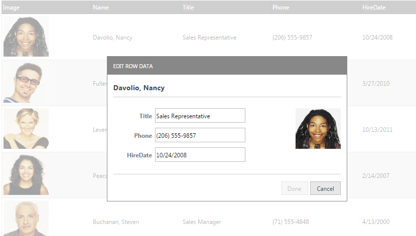

<!--
|metadata|
{
    "fileName": "iggrid-updating-rowedittemplate-configuring",
    "controlName": "igGrid",
    "tags": ["Editing","Grids","How Do I","Templating"]
}
|metadata|
-->

# Configuring the Row Edit Dialog (igGrid)

## Topic Overview

### Purpose

This topic explains how to use the updating feature of the `igGrid`™ control in combination with the Row Edit Dialog.
By design editorsTemplate is executed for each column in the grid`s column collection, while the dialogTemplate is rendered against the currently edited record.


### Required background

The following table lists the topics and articles required as a prerequisite to understanding this topic.

- [igGrid Overview](igGrid-Overview.html): The `igGrid` is a jQuery-based client-side grid that is responsible for presenting and manipulating tabular data. Its whole lifecycle is on the client-side, which makes it independent from server-side technology.

- [Updating Overview (igGrid)](igGrid-Updating.html): This topic explains how to use the updating feature of the `igGrid`™ control.

- [igTemplating](igTemplating-Overview.html): This topic explains how to use the Infragistics® Templating Engine.


### In this topic

This topic contains the following sections:

- [**Introduction**](#introduction)
- [**Configuring Row Edit Dialog in JavaScript**](#javascript)
	- [Overview](#js-overview)
	- [Steps](#js-steps)
- [**Configuring Row Edit Dialog in ASP.NET MVC**](#mvc)
	- [Requirements](#mvc-requirements)
	- [Overview](#mvc-overview)
	- [Steps](#mvc-steps)
- [**Related Content**](#related-content)


## <a id="introduction"></a> Introduction

The Row Edit Dialog allows users to edit records in a pop up dialog, as compared to inline editing.

The feature is implemented as part of the `igGridUpdating` widget. The `editMode` option has a new value: “dialog”, to enable the row edit dialog. The new dialog uses a different templating structure and allows building complex custom editing dialog.




The row template itself can be defined by setting different properties in the newly added `rowEditDialogOptions` option. These options are listed in the following table:

Options|Description
---|---
animationDuration|Specifies the animation duration for the opening and closing operations.
dialogTemplate|Specifies a template to be rendered against the currently edited record.
dialogTemplateSelector|Specifies a selector to a template rendered against the currently edited record.
editorsTemplate|Specifies a template to be executed for each column in the grid's column collection (or just the read-write columns if showReadonlyEditors is false). Decorate the element to be used as an editor with 'data-editor-for-${key}'.The ${key} template tag should be replaced with the chosen templating engine's syntax for rendering values. If any editors for columns are specified in the dialog markup they will be exluded from the data the template will be rendered for.This property is ignored if the dialog template does not include an element with the "data-render-tmpl" attribute. If both editorsTemplate and editorsTemplateSelector are specified, editorsTemplateSelector will be used.
editorsTemplateSelector|Specifies a selector to a template to be executed for each column in the grid's column collection. Decorate the element to be used as an editor with 'data-editor-for-${key}'. The ${key} template tag should be replaced with the chosen templating engine's syntax for rendering values. If any editors for columns are specified in the dialog markup they will be exluded from the data the template will be rendered for. This property is ignored if the dialog markup does not include an element with the 'data-render-tmpl' attribute. If both editorsTemplate and editorsTemplateSelector are specified, editorsTemplateSelector will be used.
namesColumnWidth|Controls the width of the column containing the column names in the default row edit dialog.
showEditorsForHiddenColumns|Controls if editors should be rendered for hidden columns.
width| Controls the default row edit dialog width.
height| Controls the default row edit dialog height.
showDoneCancelButtons|Controls the visibility of the done and cancel buttons for the dialog. If disabled the end-user will be able to stop editing only with the ENTER and ESC keys.
captionLabel| Specifies the caption of the dialog. If not set $.ig.GridUpdating.locale.rowEditDialogCaptionLabel is used.


## <a id="javascript"></a> Configuring Row Edit Dialog in JavaScript
This procedure guides you through the process of configuring row edit template in the `igGrid`.

### <a id="js-overview"></a> Overview

Following is a conceptual overview of the process:

1.  [Referencing the required JavaScript and CSS files](#js-reference-resources)
2.  [Defining sample data](#js-define-data)
3.  [Define a template element for the Row Edit Dialog Row Template.](#js-define-template)
4.  [Define the HTML placeholder.](#js-define-html)
5.  [Instantiate the igGrid](#js-instantiate-grid)
6.  [Handle the rowEditDialogBeforeOpen client side event](#js-handle-event)

### <a id="js-steps"></a> Steps

The following steps demonstrate how to configure Row Edit Template in the `igGrid`.

1. Reference the required JavaScript and CSS files. <a id="js-reference-resources"></a>

	The following code snippet is using the Infragistics loader to reference the updating feature of `igGrid`
	
	**In HTML:**
	
	```html
	<script src="jquery.min.js" type="text/javascript"></script>
	<script src="jquery-ui.min.js" type="text/javascript"></script> 
	<script src="infragistics.loader.js"></script>
	<script type="text/javascript">
	    $.ig.loader({
	        scriptPath: "http://localhost/ig_ui/js/",
	        cssPath: "http://localhost/ig_ui/css/",
	        resources: "igGrid.Selection,igGrid.Updating"
	    });
	</script>
	```

2. Define the data to bind to. <a id="js-define-data"></a>	

	The following code defines a JavaScript array of objects.
	
	This data is used as the `igGrid`’s data source.
	
	**In JavaScript:**
	
	```js
	var namedData = new Array();
	namedData[0] = { "ProductID": 1, "UnitsInStock": 100, "ProductDescription": "Laptop", "UnitPrice": "$1000", "DateCol": "24/7/2012" };
	namedData[1] = { "ProductID": 2, "UnitsInStock": 15, "ProductDescription": "Hamburger" };
	namedData[2] = { "ProductID": 3, "UnitsInStock": 4.356, "ProductDescription": "Beer", "UnitPrice": "$1000" };
	namedData[3] = { "ProductID": 4, "UnitsInStock": null, "ProductDescription": null, "UnitPrice": null };
	namedData[4] = { "ProductID": 5, "UnitsInStock": "65", "ProductDescription": "trainers", "UnitPrice": "$1000", "DateCol": "24/6/2012" };
	```

3. Define a template element for the Row Edit Dialog Template <a id="js-define-template"></a>

	The following code defines a template element which is used as a row template for the row edit template to specify custom formatting and styling.
	
	**In HTML:**
	
	```html
	<script id="dialogTemplate" type="text/html">
	<div style="float: left;">
			<table style="width: 100%;">
				<colgroup>
					<col style="width: 30%;" />
					<col style="width: 70%;" />
				</colgroup>
				<tbody data-render-tmpl="true">
				</tbody>
			</table>
		</div>
	<script>
	<script id="editorsTemplate" type="text/html">
        <tr>
           <td style="text-align:right;color:#777;"><strong${headerText}</strong></td>
            <td><input data-editor-for-${key}="true" /></td>
        </tr>
    </script>
	```

4. Define the HTML placeholder. <a id="js-define-html"></a>

	**In HTML:**
	
	```html
	<table id="grid1"></table>
	```

5. Instantiate the `igGrid`. <a id="js-instantiate-grid"></a>
	
	The following code enables the updating feature and `editMode` is set to be “dialog”.
	
	As container of the row edit dialog is set as “owner” with the `containment` property. Thus, the row edit dialog is draggable only in the grid area.
	
	Column settings are defined and the “ProductID” column is set to be `ReadOnly`. As the option `showReadonlyEditors` is *false*, the disabled columns won’t be rendered as editors in the dialog window (in this case: ProductID).
	
	The property `dialogTemplateSelector` points to the of the template defined in Step 3
	
	**In JavaScript:**
	
	```js
	$.ig.loader(function () {
	$("#grid1").igGrid({
	    height: "300px",
	    width: "600px",
	    columns: [
	            { headerText: "Product ID", key: "ProductID", width: "100px", dataType: "number" },
	            { headerText: "Units In Stock", key: "UnitsInStock", width: "100px", dataType: "number", format: 'double' },
	            { headerText: "Product Description", key: "ProductDescription", width: "150px", dataType: "string" },
	            { headerText: "Date Column", key: "DateCol", width: "100px", dataType: "date" },
	            { headerText: "Unit Price", key: "UnitPrice", width: "100px", dataType: "integer" }
	            ],
	    autoGenerateColumns: false,
	    dataSource: namedData,
	    primaryKey: "ProductID",
	    features: [
	      {
	            name: "Selection",
	            mode: "row",
	            multipleSelection: true
	      },
	      {
	            name: 'Updating',
	            startEditTriggers: 'enter dblclick',
	            editMode: 'dialog',
				rowEditDialogOptions:{
					dialogTemplateSelector: "#dialogTemplate",
					editorsTemplateSelector: "#editorsTemplate",
	               	containment: "owner",
	            	showReadonlyEditors: false,

				}
	            
	      }]
	});
	```

6. Handle the `rowEditDialogBeforeOpen` client side event. <a id="js-handle-event"></a>

	The following code handles the `rowEditDialogBeforeOpen` client side event. It provides references to the `igGridUpdating` widget and to the row edit dialog DOM element.
	**In JavaScript:**
	
	```js
	 $(document).delegate(".selector", "iggridupdatingroweditdialogbeforeopen", function (evt, ui) { 
	           var gridUpdating = ui.owner;
	           var gridID = ui.owner.element.context.id;
	           var dialogWindow = ui.dialogElement;
	  });
	```


## <a id="mvc"></a> Configuring a Row Edit Template in ASP.NET MVC

This procedure guides you through the process of configuring a Row Edit Dialog in the `igGrid`.

### <a id="mvc-requirements"></a> Requirements

To complete the procedure, you need the following:

-   Microsoft ® Visual Studio 2010 or newer installed
-   ASP.NET MVC 3 or newer Framework installed
-   The AdventureWorks Database installed
-   A reference to the Infragistics.Web.Mvc.dll assembly
-   Required Ignite UI JavaScript and theme resources

### <a id="mvc-overview"></a> Overview

Following is a conceptual overview of the process:

1.  [Referencing the required JavaScript and CSS files](#mvc-reference-resources)
2.  [Defining the model](#mvc-define-model)
3.  [Defining a template element for the Row Edit Dialog Row Template.](#mvc-template)
4.  [Defining the view](#mvc-define-view)
5.  [Defining the controller](#mvc-define-controller)
6.  [Handle the rowEditDialogOpening client side event](#mvc-event)

### <a id="mvc-steps"></a> Steps

The following steps demonstrate how to configure a Row Edit Template in `igGrid`.


1. Reference the required JavaScript and CSS files <a id="mvc-reference-resources"></a>

	In the Index.cshtml View, add the required JavaScript references and instantiate the Infragistics loader.
	
	The following code snippet uses the Infragistics loader to reference `igGrid` resources
	
	**In HTML:**
	
	```html
	<script src="jquery.min.js" type="text/javascript"></script>
	<script src="jquery-ui.min.js" type="text/javascript"></script> 
	<script src="infragistics.loader.js"></script>
	```
	
	**In ASPX:**
	
	```csharp
	<%= Html.Infragistics().Loader()
	        .ScriptPath("http://localhost/ig_ui/js/")
	        .CssPath("http://localhost/ig_ui/css/")
	        .Render()
	    %>
	```

2. Define the model <a id="mvc-define-model"></a>

	Add an ADO.NET Entity Data Model for the Product table of the AdventureWorks Database.
	

3. Defining dialogTemplate and editorTemplate for the Row Edit Dialog. <a id="mvc-template"></a>

	The following code defines a template for the Row Edit Dialog.You can use it to specify custom formatting and styling.
	
	**In HTML:**
	
	```html
	 <script id="dialogTemplate" type="text/html">

		<div style="float: left;">
			<table style="width: 100%;">
				<colgroup>
					<col style="width: 30%;" />
					<col style="width: 70%;" />
				</colgroup>
				<tbody data-render-tmpl="true">
				</tbody>
			</table>
		</div>
	</script>
    <script id="editorsTemplate" type="text/html">
        <tr>
           <td style="text-align:right;color:#777;"><strong${headerText}</strong></td>
            <td><input data-editor-for-${key}="true" /></td>
        </tr>
    </script>
	```

4. Define the view <a id="mvc-define-view"></a>

	Open the Index.cshtml View and add the code below.
	
	The following code enables the updating feature and `EditMode` is set to be “Dialog”.
	
	The `containment` oprion of teh row edit dialog is set to be “owner”. Thus the row edit dialog is draggable only in the grid area.
	
	In the code snippet below, the `EditorType` of ModifiedDate is specified to be `DatePicker` and is marked as required. Thus the `DatePicker` editor will be rendered and a validation error message is shown if no value is entered in the field.
	
	The “ProductID” column is set to be `ReadOnly`. As the option `showReadonlyEditors` is false, the disabled column won’t be rendered as editors in the dialog window.
	
	The option `DialogTemplateSelector` points to ID the defined `x-jquery-tmpl` template above.
	
	**In ASPX:**
	
	```csharp
	 <%= Html.Infragistics().Grid(Model).ID("grid1")
	        .PrimaryKey("ProductID")
	        .AutoGenerateColumns(false)
	        .AutoGenerateLayouts(false)
	        .Virtualization(false)
	        .LocalSchemaTransform(true)
	        .RenderCheckboxes(true)
	        .Columns(column =>
	        {
	            column.For(x => x.ProductID).HeaderText(“Product ID”).Width("150px"); 
	            column.For(x => x.Name).HeaderText(“Name”).Width("200px");
	            column.For(x => x.ModifiedDate).HeaderText(“Modified Date”).Width("200px");           
	            column.For(x => x.MakeFlag).DataType("bool").HeaderText(“Make Flag”).Width("150px");
	            column.For(x => x.ListPrice).HeaderText(“List Price”).Width("150px");
	        })
	        .Features(features => {
	        features.Sorting().Type(OpType.Local);
	        features.Paging().PageSize(30).Type(OpType.Local);
	        features.Selection().Mode(SelectionMode.Row);
	        features.Updating().EnableAddRow(false).EnableDeleteRow(true)                
	            .EditMode(GridEditMode.RowEditTemplate)
                RowEditDialogOptions(opt =>
            	{
                	opt.Containment("owner");
                	opt.DialogTemplateSelector("#dialogTemplate");
					opt.EditorsTemplateSelector("#editorsTemplate");
                    opt.ShowReadonlyEditors(false);
                	opt.Width("300px");
                	opt.Height("400px");
            })
	           .ColumnSettings(settings =>
	            {
	                settings.ColumnSetting().ColumnKey("ProductID").ReadOnly(true);
	                settings.ColumnSetting().ColumnKey("Name").EditorType(ColumnEditorType.Mask);
	                settings.ColumnSetting().ColumnKey("ModifiedDate").EditorType(ColumnEditorType.DatePicker).EditorOptions("minValue: new Date(1955, 1, 19), maxValue: new Date(), required: true");                      
	                settings.ColumnSetting().ColumnKey("ListPrice").EditorType(ColumnEditorType.Currency).EditorOptions("button: 'spin', minValue: 0, maxValue: 100000, validatorOptions: {}");                   
	            });            
			})  
	        .DataBind()
	        .Height("500px")
	        .Width("100%")
	        .Render()%>
	```

5. Define the controller <a id="mvc-define-controller"></a>

	In the Home controller’s Index action method, extract the Products data from the AdventureWorks database and return it with the view:
	
	**In C#:**
	
	```csharp
	  public ActionResult Editing()
	        {
	            var ctx = new AdventureWorksDataContext(this.DataRepository.GetDataContext().Connection);
	            var ds = ctx.ProductAllDatas.Take(40);      
	            return View("RowEditTemplate", ds);
	        }
	```
​
6. Handle the `rowEditDialogOpening` client side event <a id="mvc-event"></a>

	The following code handles the `rowEditDialoBeforeOpen` client side event and provides references to the `igGridUpdating` widget and to the row edit dialog DOM element.
	
	**In JavaScript:**
	
	```js
	$("#grid1").live("iggridupdatingroweditdialogbeforeopen ", function (event, ui) {
	           var gridUpdating = ui.owner;
	           var gridID = ui.owner.element.context.id;
	           var dialogWindow = ui.dialogElement;
	   });
	```


## <a id="related-content"></a> Related Content

### Topics

The following topics provide additional information related to this topic.

- [Row Edit Dialog](igGrid-Updating-RowEditDialog.html): This document explains the specific properties and methods used with Row Edit Templates


### Samples

The following samples provide additional information related to this topic.

- [Row Edit Dialog](%%SamplesUrl%%/grid/row-edit-dialog): This sample shows how to configure a Row Edit Template in the `igGrid`

- [HierarchicalGrid Row Edit Dialog](%%SamplesUrl%%/hierarchical-grid/row-edit-dialog): This sample shows how to configure a Row Edit Dialog in the `igHierarchicalGrid`


 

 


