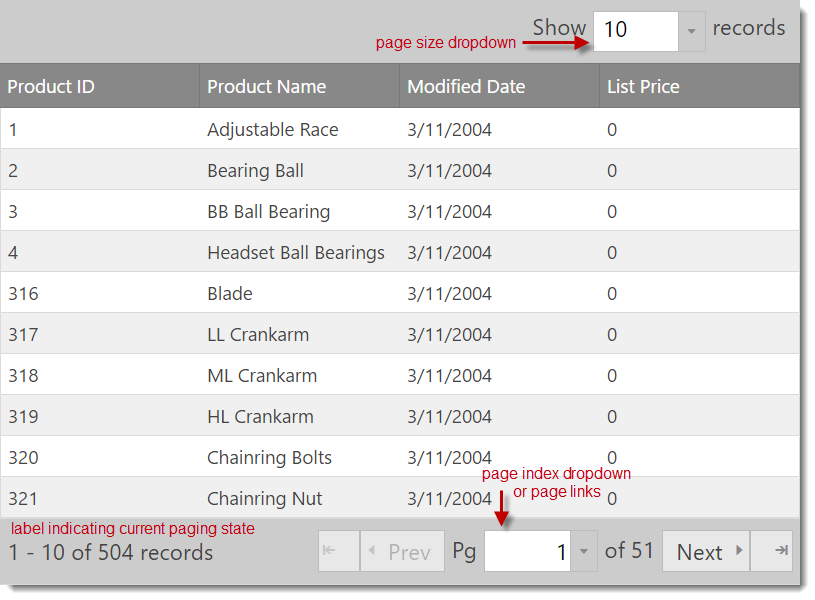

<!--
|metadata|
{
    "fileName": "iggrid-paging",
    "controlName": "igGrid",
    "tags": ["Getting Started","Grids","Paging"]
}
|metadata|
-->

# Paging (igGrid)

## In this topic

This topic contains the following sections:

-   [Overview](#overview)
-   [Data Formats](#data-formats)
-   [Enabling Paging](#enabling-paging)
-   [ASP.NET MVC Code](#mvc)
-   [Remote Paging](#remote)
-   [API Usage](#api)
-   [Client-Side Events](#client-events)
-   [Location of Paging UI Elements](#ui-elements)
-   [Known Issues and Limitations](#limitations)
-   [Paging Properties](#properties)
-   [Paging CSS Classes](#css)
-   [Keyboard Interactions](#keyboard-interaction)
-   [Related Content](#related-content)

## <a id="overview"></a> Overview

The %%ProductName%%™ grid, or `igGrid`, Paging feature allows you to divide your data in pages so that you can achieve better performance by fetching only a predefined number of records from your original data source.

**Figure 1: Typical grid paging UI**


**Figure 2: Paging with a dropdown selector**


> **Note:** The grid’s Paging feature is implemented as a jQuery UI widget, and therefore follows the standard lifecycle typical of a jQuery UI widget.

Paging may be setup for local or remote execution. In the first case, the paging operations are performed on the client. This means that all your data is present in the browser, but only the number of records as specified by the `pageSize` property is rendered to the user.

In the case of the “remote” scenario, for every page change, the grid initiates a request to the `dataSource` specified in the grid, by automatically calculating and appending all necessary parameters to the request, such as `pageIndex` and `pageSize`.

The Paging feature allows the user to change the `pageSize` through the UI, which is available either in the grid header (above the grid column headers), or as part of the pager area.

> **Note:** All parts of the paging UI can be navigated with keyboard using TAB and Shift-TAB.


## <a id="data-formats"></a> Data Formats

The Paging feature supports binding to oData services out-of-the-box. When binding to oData, the required parameters are automatically determined and set in the service request. You only need to point the `dataSource` option of the grid to your service URL.

When using Paging from the MVC wrapper for the `igGrid` control, all paging-related data binding logic is performed automatically by translating the paging URL parameters to LINQ expressions.

Depending on the value of the `pageCountLimit` property, the UI automatically switches from page links to rendering a page index dropdown.

> **Note:** The dropdown & editors used in the grid’s Paging feature are instances of the `igEditor` control.


## <a id="enabling-paging"></a> Enabling Paging

In order to enable Paging, you first need to include the necessary JavaScript and CSS dependencies. The easiest way to include the necessary dependencies is to use the combined/minified version of the scripts and styles as shown in Listing 1.

- **Listing 1: Required script and CSS files for grid paging**

	**In HTML:**
	
	```html
	<link type="text/css" href="infragistics.theme.css" rel="stylesheet" />
	<link type="text/css" href="infragistics.css" rel="stylesheet" />
	<script type="text/javascript" src="jquery.min.js"></script>
	<script type="text/javascript" src="jquery-ui.min.js"></script>
	<script type="text/javascript" src="infragistics.core.js"></script><script type="text/javascript" src="infragistics.lob.js"></script>
	```
	
	If you would like to include only the minimal %%ProductName%%™ scripts necessary for paging, you can do so by referencing the scripts as depicted in Listing 2.

- **Listing 2: Minimum scripts and styles to enable grid paging**

	**In HTML:**
	
	```html
	<script type="text/javascript" src="infragistics.util.js"></script>
	<script type="text/javascript" src="infragistics.util.jquery.js"></script>
	<script type="text/javascript" src="infragistics.dataSource.js"></script>
	<script type="text/javascript" src="infragistics.ui.shared.js"></script>
	<script type="text/javascript" src="infragistics.ui.popover.js"></script>
	<script type="text/javascript" src="infragistics.ui.editors.js"></script>
	<script type="text/javascript" src="infragistics.ui.grid.framework.js"></script>
	<script type="text/javascript" src="infragistics.ui.grid.paging.js"></script>
	```

- **Listing 3: Initializing the igGrid control with paging enabled**

	**In Javascript:**
	
	```js
	$("#grid1").igGrid({
	    columns: [
	        { headerText: "Product ID", key: "ProductID", dataType: "number" },
	        { headerText: "Product Name", key: "Name", dataType: "string" },
	        { headerText: "ProductNumber", key: "ProductNumber", dataType: "string" }
	    ],
	    dataSource: adventureWorks,
	    responseDataKey: 'Records',
	    features: [
	        {
	            name : 'Paging',
	            type: "local",
	            pageSize : 7
	        }
	    ]
	});
	```

- **Listing 4: HTML container used to instantiate the grid**

	**In HTML:**
	
	```html
	<table id="grid1"></table>
	```

- **Listing 5: Example JSON data**

	**Response:**
	
	```js
	var adventureWorks = { "Records" : [ 
	      { "Name" : "Adjustable Race",
	        "ProductID" : 1,
	        "ProductNumber" : "AR-5381"
	      },
	      { "Name" : "Bearing Ball",
	        "ProductID" : 2,
	        "ProductNumber" : "BA-8327"
	      }
	      /*the full JSON output is omitted*/
	    ]
	}
	```

- **Running sample** 

<div class="embed-sample">
   [igGrid Paging](%%SamplesEmbedUrl%%/grid/paging)
</div>


## <a id="mvc"></a> ASP.NET MVC Code

**Listing 6** demonstrates how to initialize the grid with paging enabled in an ASP.NET MVC view and controller by using the Infragistics Grid MVC wrapper.

- **Listing 6: Initializing the grid with paging enabled in ASP.NET MVC**

	**In ASPX:**
	
	```csharp
	<%= Html.Infragistics().Grid(Model).ID("grid1").Columns(column =>
	   {
	      column.For(x => x.ProductID).HeaderText("Product ID").Width("100px");
	      column.For(x => x.Name).HeaderText("Product Name").Width("200px");
	      column.For(x => x.ProductNumber).HeaderText("Product Number").Width("200px");
	   }).
	   Features(features => 
	   {
	      features.Paging().PageSize(20);
	   }).
	   Height("500").
	   DataSourceUrl(Url.Action("PagingGetData")).
	   DataBind().
	   Render() %>
	```
	
	**In C#:**
	
	```csharp
	public class HomeController : Controller
	{
	    public ActionResult Index()
	    {
	        return View();
	    }
	    [GridDataSourceAction]
	    public ActionResult PagingGetData()
	    {
	        return View(this.GetCustomers().AsQueryable());
	    }
	    private List<Product> GetProducts()
	    {
	        List<Product> products = new List<Product>()
	        {
	            new Product() { ProductID = 1, Name = "Adjustable Race", ProductNumber = "AR-5381" },
	            new Product() { ProductID = 1, Name = "Bearing Ball", ProductNumber = "BA-8327" }
	        };
	        return products;
	    }
	}
	```


## <a id="remote"></a> Remote Paging

When you're using Infragistics ASP.NET MVC wrapper it will handle remote paging automatically for you. You are required to create action method decorated with `GridDataSourceActionAttribute` attribute which returns `ActionResult` (**Listing 6**). In the action method just pass the data as instance of `IQueryable`. The `GridDataSourceActionAttribute` class (which implements `IActionFilter` interface) will transform the data according the request parameters and will return it as `JsonResult`.

If you are implementing your own remote service (for example in ASP.NET or PHP), in order to properly initialize and render the pager, your service must specify both the `responseDataKey` (grid option) and the `recordCountKey` (paging option). The `recordCountKey` member tells the Paging widget how many records in total are in the backend. The `responseDataKey` specifies which property in the response contains the resulting data.

Therefore, when remote paging is used, the grid automatically generates the proper request parameters in the following way:

```
http://<server>/grid/PagingGetData?page=2&pageSize=25
```

> **Note:** You may change the key names, by setting the `pageSizeUrlKey` / `pageIndexUrlKey` in the Paging options, respectively.


## <a id="api"></a> API Usage

You can change the page index or the page size programmatically, in the following ways:

- **Listing 7: Retrieve the page size**

	**In Javascript:**
	
	```js
	$(“#grid1”).igGridPaging("option", "pageSize");
	```

- **Listing 8: Retrieve the current page index**
	
	**In Javascript:**
	
	```js
	$(“#grid1”).igGridPaging("option", "currentPageIndex");
	```

- **Listing 9: Change the current page index so that the third page is loaded**

	**In Javascript:**
	
	```js
	$(“#grid1”).igGridPaging(“pageIndex”, 2);
	```

You can easily achieve a “Quick Pages” effect in your grid, by changing the `visiblePageCount` option. This means that the grid only renders as many page links as defined by `visiblePageCount`. Therefore, if `visiblePageCount` is 5, and you are on page 3, page links “1” and “2” are rendered to the left, and page links “4” and “5” to the right.

> **Note:** The Paging widget still renders a dropdown to choose the current page, if the actual page count exceeds the value of the `pageCountLimit` option.

You can also customize the page size list by setting the `pageSizeList` (array) option in the paging options. Each value in the array specifies the size of the page, added in order of page index. For instance:

```
pageSizeList: [10, 44, 123, 5]
```

The array above specifies a size for page 1 equal to 10 rows, 44 for page 2 and so on.


## <a id="client-events"></a> Client-Side Events

You can bind to client-side events either during initialization or after the widget is instantiated. The first approach allows you to existing instances of the grid:

- **Listing 10: Associating event handlers to page indexed changed event on the client**
	
	**In Javascript:**
	
	```js
	$("#grid1").bind("iggridpagingpageindexchanged", handler);
	```

> **Note:** Use “live” instead of “bind” if paging is not yet instantiated.

The second approach allows you to define event handlers during initialization by specifying the event name as an option when you initialize the paging feature.

> **Note:** This binding syntax is case sensitive as opposed to attaching with the bind or live jQuery functions.

- **Listing 11: Associating event handler to page index changing during initialization**

	**In Javascript:**
	
	```js
	{
	    Name: “Paging”,
	    pageIndexChanging: handler,
	    < other paging options>
	}
	```

Then your “handler” function would resemble the code in Listing 12.

- **Listing 12: Blank event handler called by paging feature**

	**In Javascript:**
	
	```js
	function handler(event, args) {
	
	}
	```

> **Note:** The `args` is explained in detail below, for every event, respectively.

### Client Side Events
Table 1: List of Client-side Events

Event Name | Description | Event Args Definition
---|---|---
pageIndexChanging | Fired before the page index is changed and the data is data bound, can be cancellable. To cancel it just return false in the handler | `newPageIndex`: Index of new page <br/> `currentPageIndex`: Index of current page <br/> `owner`: Reference to the igGridPaging object
pageIndexChanged | Fired after the page index is changed. | `pageIndex`: Index of new page index <br/> `owner`: Reference to igGridPaging object
pageSizeChanging | Fired when the page size is changed from the DropDown on the UI. Not fired when the page size is changed manually using the API. | `currentPageSize`: Current page size <br/> `newPageSize`: New page size <br/> `owner`: Reference to the igGridPaging object
pageSizeChanged | Fired after the page size is changed. | `pageSize`: New page size <br/> `owner`: Reference igGridPaging object
pagerRendering | Fired before the pager starts rendering its elements. Can be cancelled and overridden, for more custom paging scenarios. | `dataSource`: Reference to the data source object <br/> `owner`: Reference to the igGridPaging object
pagerRendered | Fired after the pager renders its elements. | Same as the `pagerRendering` event


## <a id="ui-elements"></a> Location of Paging UI Elements

**Figure 1: Location of paging UI elements**




## <a id="limitations"></a> Known Issues and Limitations
-   Selected cells and rows are not preserved across pages.


## <a id="properties"></a> Paging Properties
**Table 2** details the list of initialization options and descriptions available for the Paging feature.

> **Note:** The value in parenthesis denotes the default option value.

**Table 2: Available grid Paging initialization options**

Paging Option | Description
---|---
currentPageIndex (0) | The current page index. Can be set manually or invoked through the API by calling pageIndex(index).
pageSize (25) | The number of records to display on one page. Default is 25.
recordCountKey (null) | The property in the response which points to the total number of records. So if the response is a JSON object, this is the object property holding the total number of records on the backend.
pageSizeUrlKey (null) | The URL param name in which the page size is encoded. (ex: ?psize=20)
pageIndexUrlKey (null) | Same as the above, but for index. If values are left empty (null), oData syntax is assumed.The value is delegated to the igDataSource™ control after setting it for the grid.
type (“remote”) | The type of paging – local or remote. There can still be a Service URL as the data source, and have local paging at the same time.
showPageSizeDropDown (true) | Defines whether the dropdown allowing the user to change the page size is rendered or not.
pageSizeDropDownLabel (“Show “) | The label text that is rendered before the page size dropdown label.
pageSizeDropDownTrailingLabel (“records”) | The trailing label text that is rendered after the page size dropdown is rendered.
pageSizeDropDownLocation (“above”) | The value of this option is either “above” or “inpager”. The “inpager” option renders the page size dropdown as the last part of the pager UI located inside the footer area of the grid. The “above” option renders the drop down above the grid header. Depending on styling the drop down can be displayed to the left, right or in the middle. Default is right.
showPagerRecordsLabel (true) | This is the label that specifies which records are shown from the total of XXX records. Typical values are usually something like: “100 - 125 of 239 records”.
pagerRecordsLabelTemplate ("$startRecord$ - $endRecord$ of $recordCount$ records") | Template for the pager records label that is available for customization.
nextPageLabelText (“next”) | The label text rendered before the next page image / icon.
prevPageLabelText (“prev”) | The label text rendered after the prev page image / icon.
firstPageLabelText | Same as above
lastPageLabelText | Same as above
showFirstLastPages (true) | Defines whether to render the previous page image / button or not.
showPrevNextPages (true) | Same for the next page.
currentPageDropDownLeadingLabel (“Pg”) | The leading label text in the span element in front of the dropdown used to choose a specific page index.
currentPageDropDownTrailingLabel ("of $count$") | Same as the above but for the trailing label span.
currentPageDropDownTooltip | Custom localized tooltip for the page index dropdown.
pageSizeDropDownTooltip | Custom localized tooltip for the page size dropdown.
pagerRecordsLabelTooltip | Custom localized tooltip for the pager records label.
pageSizeList [5, 10, 20, 25, 50, 75, 100] | A list of options for the page size dropdown.
pageCountLimit (10) | After this value is exceeded (default is 10), rendering switches from page links/numbers to dropdown to facilitate paging.
visiblePageCount (5) | Visible number of page links rendered. The active/current one is always in the middle and has an equal number rendered to the left or to the right (if the number is odd). Others can be reached by using PREV and NEXT buttons.
defaultDropDownWidth (70) | Default width of page index and page size dropdowns.
firstPageLabelText (“”) | The text to display for the first page label.
lastPageLabelText (“”) | The text to display for the last page label.
showFirstLastPages (true) | Specifies if the first and the last pages buttons are rendered.
pageSizeDropDownTooltip (Choose number of records per page) | Specifies a custom localized tooltip for the page size dropdown.
pagerRecordsLabelTooltip (Current records range) | Specifies a custom localized tooltip for the pager records label.
prevPageTooltip (go to the previous page) | Tooltip for the previous page button.
nextPageTooltip (go to the next page) | Tooltip for the next page button.
firstPageTooltip (go to the first page) | Tooltip for the first page button.
lastPageTooltip (go to the last page) | Tooltip for the last page button.
pageTooltipFormat (page $index$) | Custom localized tooltip for a page link/button.


## <a id="css"></a> Paging CSS Classes
As you work with the grid Paging feature, you may want to customize the look of the pager for any given UI element. Table 3 details the available classes applied to the grid pager UI.

**Table 3: Available classes for the Paging widget**

UI Area | Overview of the rendered UI area | List of CSS classes applied to this area
---|---|---
pagerClass | The whole pager, this is a div rendered after the grid table or scrolling div. | ui-widget ui-iggrid-pager ui-helper-clearfix
pageLink | Classes applied to the `<a>` tag inside every `<li>` for every page number. | ui-iggrid-pagelink ui-helper-reset
page | Classes applied to every `<li>` in the `<UL>` that holds page numbers. | ui-iggrid-page ui-state-default ui-corner-all
pageHover | Class applied to a page list item when it’s hovered. | ui-iggrid-page-hover ui-state-hover
pageList | Classes applied to the `<UL>` which holds the list of page numbers (links). | ui-helper-reset ui-iggrid-pagelist
pageLinkCurrent | Classes applied to the current page index’s Li’s `<a>` tag. | ui-iggrid-pagelinkcurrent
pageCurrent | Classes applied to the `<li>` tag corresponding to the current page index. | ui-iggrid-pagecurrent ui-state-active ui-corner-all
pageFocused | Classes applied to the current page that has focus (when keyboard anvigation is used). | ui-iggrid-pagefocused ui-state-focus
prevPage | Classes applied to the DIV holding the prev icon image and the prev label. | ui-iggrid-prevpage
nextPage | Classes applied to the DIV holding the next icon image and the next label. | ui-iggrid-nextpage
nextPageLabel | Applied to the SPAN label for the next page text. | ui-iggrid-nextpagelabel
prevPageLabel | Applied to the SPAN label for the prev page text. | ui-iggrid-prevpagelabel
nextPageLabelDisabled | Applied to the SPAN label for prev page text, when it is disabled (i.e. when we are at page index 0). | ui-iggrid-nextpagelabeldisabled
prevPageLabelDisabled | Same but for the prev label disabled. | ui-iggrid-prevpagelabeldisabled
nextPageImage | Applied to the span which will show the next page image (as background image). | ui-iggrid-nextpageimg ui-icon ui-icon-triangle-1-e
prevPageImage | Same for previous image. | ui-iggrid-prevpageimg ui-icon ui-icon-triangle-1-w
nextPageImageDisabled | Same, when the image is disabled (there are no next records). | ui-iggrid-nextpageimgdisabled ui-icon-disabled ui-icon-triangle-1-e
prevPageImageDisabled | Same, but when the image is disabled (the current index is 0). | ui-iggrid-prevpageimgdisabled ui-icon-disabled ui-icon-triangle-1-w
pagerRecordsLabel | Applied to the span holding the label showing from/to records out of total number of records – usually rendered in the left area of the pager footer. | ui-iggrid-pagerrecordslabel
pageSizeLabel | Applied to the span rendered in front of the page size dropdown. (above the grid in the screenshots above). | ui-iggrid-pagesizelabel
pageSizeDropDown | Applied to the span holding the igEditor dropdown control. | ui-iggrid-pagesizedropdown
pageSizeDropDownContainer | Applied to the three spans holding the front label, the dropdown, and the trailing label of the page size dropdown. This set of classes is applied when the page size dropdown is rendered inside of the pager footer, to the right. | ui-helper-clearfix ui-iggrid-pagesizedropdowncontainer
pageSizeDropDownContainerAbove | Same as above, but applied when the page size dropdown is rendered above the grid. | ui-widget ui-helper-clearfix ui-iggrid-pagesizedropdowncontainerabove
pageDropDownContainer | The dropdown container for spans for labels/editor for the dropdown from which an end user may select the current page index. | ui-iggrid-pagedropdowncontainer
pageDropDownLabels | Applied to the leading and trailing SPANs holding the labels before and after the dropdown where one selects a page index: “Pg &lt;index&gt; Out of XXX”. | ui-iggrid-pagedropdownlabels
pageDropDown | Applied to the SPAN in which the igEditor dropdown is instantiated. | ui-iggrid-pagedropdown

## <a id="keyboard-interaction"></a> Keyboard Interactions

The following keyboard interactions are available.

When focus is on the grid:

-	TAB: Can move focus between the focusable elements of the pager UI: buttons, page links and drop-downs.
When focus is on the page size drop-down the list of available page sizes will be displayed and the following interactions are available:
-	UP/DOWN: To move between the available list items.
-	SPACE/ENTER: To select the currently highlighted item.  When a new item is selected the new page size is applied to the grid and the page size drop down closes.

When focus is on one of the pager buttons:

-	ENTER/SPACE: Selects the active pager button and the current page index changes accordingly.
When focus is on the page index drop down the list of available page indexes will be displayed and the same interactions as the page size drop-down apply for it.

## <a id="related-content"></a> Related Content

### <a id="topics"></a> Topics

-   [igGrid Overview](igGrid-Overview.html)
-   [Selection Overview (igGrid)](igGrid-Selection-Overview.html)
-   [Filtering (igGrid)](igGrid-Filtering.html)
-   [Sorting Overview (igGrid)](igGrid-Sorting-Overview.html)


 

 


