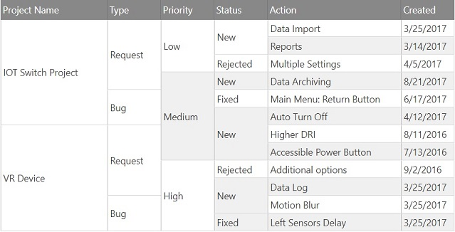
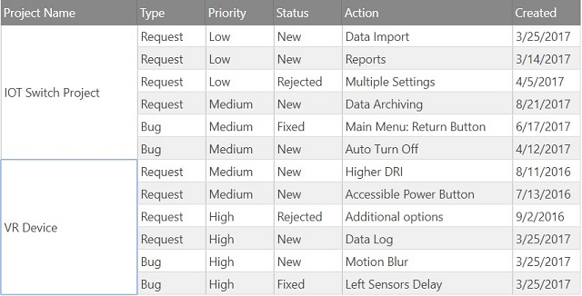
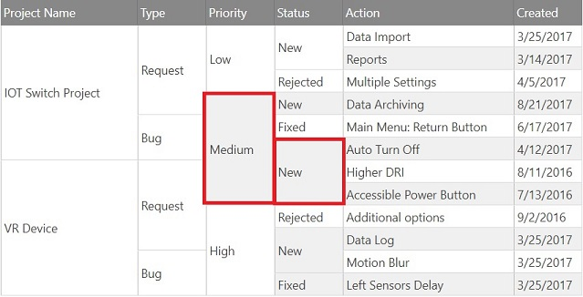
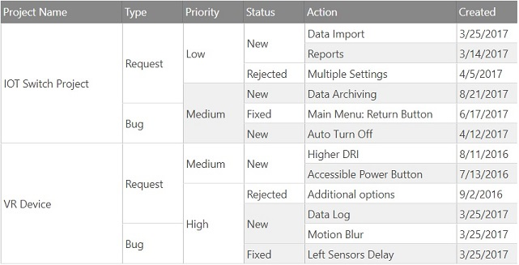

<!--
|metadata|
{
    "fileName": "iggrid-cellmerging-advanced",
    "controlName": "igGrid",
    "tags": ["Grids","CellMerging", "Advanced", "Customization"]
}
|metadata|
-->

# Cell Merging Advanced Customization (igGrid)

## Topic Overview

### Purpose

This topic shows advanced customization for the `igGrid`™ control’s Cells Merging feature focusing on how users can implement various merging strategies, as well as explaining the predefined ones.

### Required background

The following lists the topic required as a prerequisite to understanding this topic.

- [igGrid Cell Merging Overview](igGrid-CellMerging-Overview.html): This topic shows you how to enable the Cell Merging feature to be used inside `igGrid`.

### In this topic

This topic contains the following sections:

-   [**Introduction**](#introduction)
-   [**Pre-defined Merge Strategies**](#merge-predefined)
    -   [Duplicate strategy](#merge-duplicate)
    -   [Null strategy](#merge-null)
-   [**Custom Merge Strategies**](#merge-custom)
    -   [Example](#merge-custom-example)
    -   [Live Sample](#merge-custom-sample)
-   [**Related Content**](#related-content)
    -   [Topics](#topics)


## <a id="introduction"></a> Introduction

Cell Merging provides two predefined merging strategies. The first one checks for duplicate cell values. The second one merges subsequent *null* values. In addition to the predefined methods, the [*mergeStrategy*](%%jQueryApiUrl%%/ui.iggridcellmerging#options:mergeStrategy) option can be used to define a custom strategy.

In the next sections we will go in detail showing both predefined methods of merging as well as give an example of how to define a custom one to be used in a more complex scenario. We will focus mainly on *"physical"* cell merging. *"Visual"* cell merging is similar to it in terms of configuration, but it can have slight differences in the visible result.

## <a id="merge-predefined"></a> Pre-defined Merge Strategies

In order to specify which predefined method is used for cell merging, the [*mergeStrategy*](%%jQueryApiUrl%%/ui.iggridcellmerging#options:mergeStrategy) property needs to be set to either `"duplicate"` or `"null"` (defaults to `"duplicate"`).

### <a id="merge-duplicate"></a> Duplicate strategy

When the `mergeStrategy` option is set to *"duplicate"*, the way it determines if two cells should be merged is by comparing their values. If they pass a *`===`* check (which means they have both equal value and equal type), the two cells will be eligible for merging. After that depending on the [*mergeType*](%%jQueryApiUrl%%/ui.iggridcellmerging#options:mergeType) option cells will be merged accordingly. 

Let's take the following data structure as an example:

```json
var productData1 = [
    { ActionID: "1", ProjectName: "IOT Switch Project", ActionName: "Data Import", /*...*/ },
    { ActionID: "2", ProjectName: "IOT Switch Project", ActionName: "Reports", /*...*/ },
    { ActionID: "4", ProjectName: "IOT Switch Project", ActionName: "Multiple Settings", /*...*/},
    { ActionID: "3", ProjectName: "IOT Switch Project", ActionName: "Data Archiving", /*...*/ },
    { ActionID: "5", ProjectName: "IOT Switch Project", ActionName: "Main Menu: Return Button", /*...*/ },
    { ActionID: "6", ProjectName: "IOT Switch Project", ActionName: "Auto Turn Off", /*...*/ },
    { ActionID: "7", ProjectName: "VR Device", ActionName: "Higher DRI", /*...*/ },
    { ActionID: "8", ProjectName: "VR Device", ActionName: "Accessible Power Button", /*...*/ },
    { ActionID: "9", ProjectName: "VR Device", ActionName: "Additional options", /*...*/ },
    { ActionID: "10", ProjectName: "VR Device", ActionName: "Data Log", Type: "Request", /*...*/ },
    { ActionID: "12", ProjectName: "VR Device", ActionName: "Motion Blur", Type: "Bug", /*...*/ },
    { ActionID: "11", ProjectName: "VR Device", ActionName: "Left Sensors Delay", /*...*/ },
]
```

In order to initialize physical Cell Merging with *"duplicate"* strategy we can use the defaults to our advantage and not set the mergeStrategy option:

**In JavaScript:**

```js
$("#grid1").igGrid({
    dataSource: productData1,
    primaryKey: "ActionID",
    autoGenerateColumns: false,
    columns: [
        { headerText: "Product ID", key: "ActionID", dataType: "number", hidden: true },
        { headerText: "Project Name", key: "ProjectName", dataType: "string", width: 200 },
        //...
    ],
    features: [
        {
            name: "CellMerging",
            mergeOn: "always",
            mergeType: "physical"
        }
    ]
});
```

**In Razor:**

```csharp
@(Html.Infragistics().Grid(Model)
    .ID("grid1")
    .AutoGenerateColumns(false)
    .PrimaryKey("ActionID")
    .Columns(col =>
    {
        col.For(c => c.ActionID).HeaderText("ActionID");
        col.For(c => c.ProjectName).HeaderText("ProjectName");
        //...
    })
    .Features(f =>
    {
        f.CellMerging().MergeOn(CellMergingMergeOn.Always).MergeType(CellMergingMergeType.Physical)
    })
    .DataBind()
    .Render()
)
```

If `mergeType` is *"physical"* only one cell is rendered when representing a merge group. The result of the configuration above would be the screenshot bellow:



When using cell updating to update the value of a merged cell, only the value of first cell of the group is modified. That cell will lose its merged state. The rest of the cells will remain merged.

### <a id="merge-null"></a> Null strategy

Cell Merging also provides the ability to merge based on `null` cell values. This scenario differs from the "duplicate" method, because in order the merge two cell, the second cell needs to have a `null` value. The first cell can have any value, even `null` as well.

Let's have the following data:

```json
var productData2 = [
    { ActionID: "1", ProjectName: "IOT Switch Project", ActionName: "Data Import", /*...*/ },
    { ActionID: "2", ProjectName: null, ActionName: "Reports", /*...*/ },
    { ActionID: "4", ProjectName: null, ActionName: "Multiple Settings", /*...*/},
    { ActionID: "3", ProjectName: null, ActionName: "Data Archiving", /*...*/ },
    { ActionID: "5", ProjectName: null, ActionName: "Main Menu: Return Button", /*...*/ },
    { ActionID: "6", ProjectName: null, ActionName: "Auto Turn Off", /*...*/ },
    { ActionID: "7", ProjectName: "VR Device", ActionName: "Higher DRI", /*...*/ },
    { ActionID: "8", ProjectName: null, ActionName: "Accessible Power Button", /*...*/ },
    { ActionID: "9", ProjectName: null, ActionName: "Additional options", /*...*/ },
    { ActionID: "10", ProjectName: null, ActionName: "Data Log", Type: "Request", /*...*/ },
    { ActionID: "12", ProjectName: null, ActionName: "Motion Blur", Type: "Bug", /*...*/ },
    { ActionID: "11", ProjectName: null, ActionName: "Left Sensors Delay", /*...*/ },
]
```

Only one cell for the column needs to carry the "Project Name" information while the rest of the cells may have a value of `null`. To ensure they remain `null` in the grid's data source, they should be of a "nullable" type, which for igDataSource is either `number`, `object` or `Date`. For this example the [*dataType*](%%jQueryApiUrl%%/ui.iggrid#options:columns.dataType) of the column is set to `"object"` so the `null` values are retained. You could also set [*localSchemaTransform*](%%jQueryApiUrl%%/ui.iggrid#options:localSchemaTransform) to false.

**In JavaScript:**

```js
$("#grid1").igGrid({
    dataSource: productData2,
    primaryKey: "ActionID",
    autoGenerateColumns: false,
    columns: [
        //...
        { headerText: "Project Name", key: "ProjectName", dataType: "object", width: 200 },
        //...
    ],
    features: [
        {
            name: "CellMerging",
            mergeOn: "always",
            mergeType: "physical",
            mergeStrategy: "null"
        }
    ]
});
```

**In Razor:**

```csharp
@(Html.Infragistics().Grid(Model)
    .ID("grid1")
    .PrimaryKey("ActionID")
    .AutoGenerateColumns(false)
    .Columns(col =>
    {
        col.For(c => c.ActionID).HeaderText("ActionID");
        col.For(c => c.ProjectName).HeaderText("ProjectName");
        //...
    })
    .Features(f =>
    {
        f.CellMerging()
            .MergeOn(CellMergingMergeOn.Always)
            .MergeType(CellMergingMergeType.Physical)
            .MergeStrategy(CellMergingMergeStrategy.Null)
    })
    .DataBind()
    .Render()
)
```

When `mergeType` is *"physical"* the results are almost the same as when using the *"duplicate"* merging strategy. The difference is the structure of the data that is being used: 



This is useful when combining Cell Merging with Cell Updating. In this case updating the merged cell would update the whole merge group visually. Regarding the data, it will still update only the first cell value inside the group, the other cells remain *`null`*.

**Note:** Only the "Project Name" column receives merging because it is the only one containing `null` values.

## <a id="merge-custom"></a> Custom Merge Strategies

Cell Merging provides an extensible way of using custom merge strategies to better suit different scenarios.

### <a id="merge-custom-example"></a> Example

You may have noticed in our first example that despite Cell Merging performing as expected, we have something that in a real world application could be not desired. As you can see on the next screenshot, Cell Merging merges cells with the same values between two projects. 



In this case Cell Merging cannot know initially what the data would be and how it should be displayed. In order to customize the conditions under which cell values are merged for the specific application scenario a custom mergeStrategy can be set. Users may assign a function that receives the previous record, the current record and the key of the column which is being merged. Using such a function, the aforementioned custom requirement may be implemented in the following way:

**In JavaScript:**

```js
$("#grid1").igGrid({
    dataSource: productData1,
    primaryKey: "ActionID",
    autoGenerateColumns: false,
    columns: [
        { headerText: "Product ID", key: "ActionID", dataType: "number", hidden: true },
        { headerText: "Project Name", key: "ProjectName", dataType: "string", width: 200 },
        //...
    ],
    features: [
        {
            name: "CellMerging",
            mergeOn: "always",
            mergeType: "physical",
            mergeStrategy: function (prevRec, curRec, columnKey) {
                if ($.type(prevRec[ columnKey ]) === "string" &&
                    $.type(curRec[ columnKey ]) === "string" &&
                        prevRec["ProjectName"] === curRec["ProjectName"]) {
                    //We have cells with string values and matching Project Name
                    return prevRec[ columnKey ].toLowerCase() === curRec[ columnKey ].toLowerCase();
                } else if ( prevRec["ProjectName"] === curRec["ProjectName"]) {
                    //We have other types of cell values and matching Project Name
                    return prevRec[ columnKey ] === curRec[ columnKey ];
                }
                
                //We do not have matching Project Name
                return false;
            }
        }
    ]
});
```

**In Razor:**

```csharp
<script>
    window.mergeCellsProject = function (prevRec, curRec, columnKey) {
        //.
    }
</script>

@(Html.Infragistics().Grid(Model)
    .ID("grid1")
    .PrimaryKey("ActionID")
    .AutoGenerateColumns(false)
    .Columns(col =>
    {
        col.For(c => c.ActionID).HeaderText("ActionID");
        col.For(c => c.ProjectName).HeaderText("ProjectName");
        //...
    })
    .Features(f =>
    {
        f.CellMerging()
            .MergeOn(CellMergingMergeOn.Always)
            .MergeType(CellMergingMergeType.Physical)
            .MergeStrategy("mergeCellsProject")
    })
    .DataBind()
    .Render()
)
```

The result of the custom implementation can be seen below:



Merged groups are split based on projects which makes it easier to distinguish project boundaries.

Utilizing the `mergeStrategy` property in this way may improve the overall user experience greatly.

### <a id="merge-custom-sample"></a> Live Sample

The following sample implements the custom strategy that was demonstrated in the previous chapter.

**In JavaScript:**

<div class="embed-sample">
   [Cell Merging](%%SamplesEmbedUrl%%/grid/cell-merging-custom)
</div>

## <a id="related-content"></a> Related Content

### <a id="topics"></a> Topics

The following topics provide additional information related to this topic.

- [igGrid Cell Merging - Overview](igGrid-CellMerging-Overview.html)
- [igGrid Overview](igGrid-Overview.html)
- [igGrid Sorting](igGrid-Sorting-Overview.html)