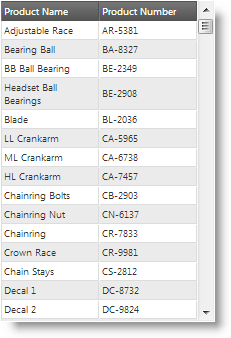
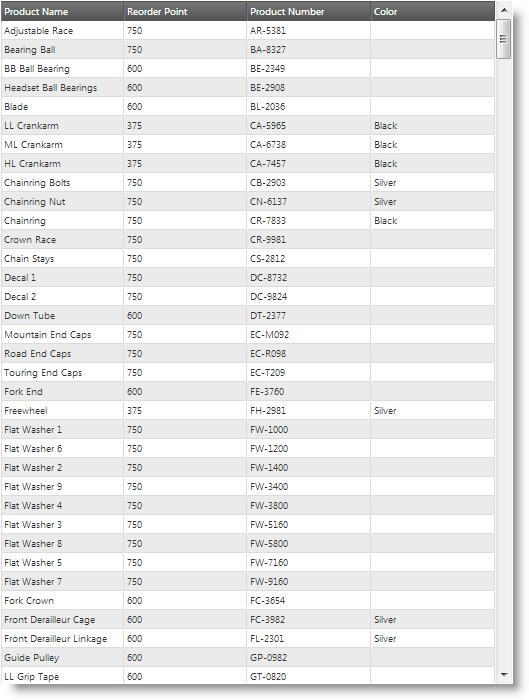
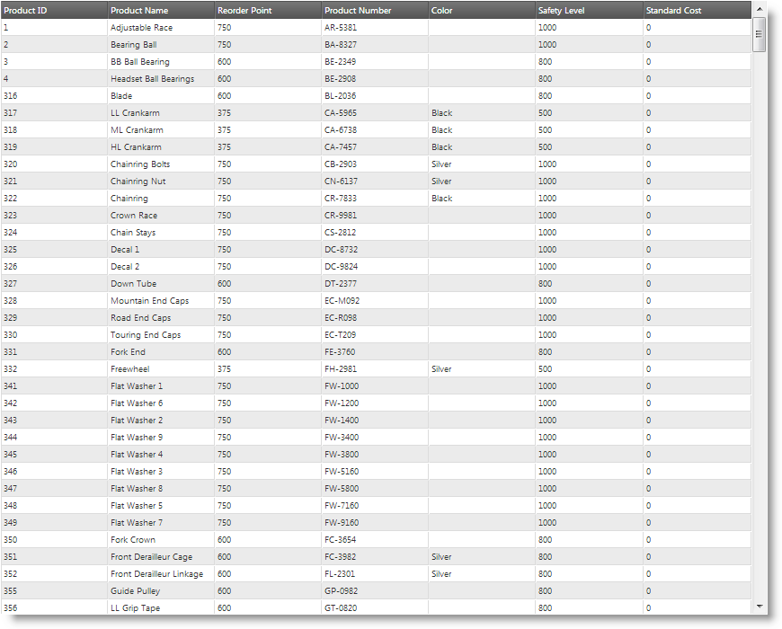
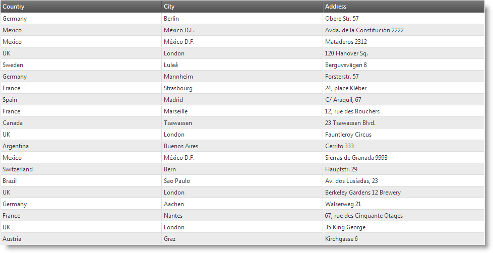
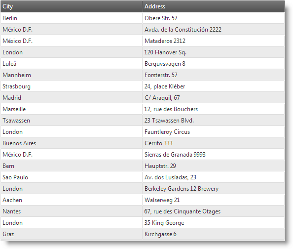
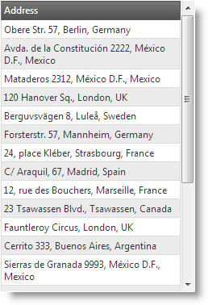

<!--
|metadata|
{
    "fileName": "iggrid-responsive-web-design-mode-overview",
    "controlName": "igGrid",
    "tags": ["Grids","Layouts"]
}
|metadata|
-->

# Responsive Web Design (RWD) Mode Overview (igGrid)

## Topic Overview

### Purpose

This topic explains conceptually the Responsive Web Design (RWD) Mode feature of the `igGrid`™ control and the functionalities this feature provides.

### Required background

The following lists the topics and articles required as a prerequisite to understanding this topic.

- Concept
    - Responsive Web Design
    - Responsive Frameworks
    - CSS Media Queries
- Topics
    - [igGrid Overview](igGrid-Overview.html): This topic provides a conceptual overview of the `igGrid` control and its features explains, with code examples, how to add it to an HTML page.
    - [igGrid/igDataSource Architecture Overview](igGrid-igDataSource-Architecture-Overview.html): This topic explains the inner workings of the `igGrid` control and its interaction with the data source component (igDataSource™).
    - [igGrid Features](igGrid-Features-Landing-Page.html): This is a group of topics explaining the features of the `igGrid` control.
- External Resources
    -   [A List Apart: Responsive Web Design](http://alistapart.com/article/responsive-web-design)
    -   [Twitter Bootstrap](http://twitter.github.com/bootstrap/)
    -   [Wikipedia: Responsive Web Design](http://en.wikipedia.org/wiki/Responsive_web_design)
    -   [CSS 3 Media Queries](http://www.w3.org/TR/css3-mediaqueries/)

### In this topic

This topic contains the following sections:

-   [**Introduction**](#introduction)
    -   [RWD mode summary](#summary)
    -   [RWD mode profiles](#profiles)
    -   [Column hiding in RWD mode](#column-hiding)
    -   [RWD mode profile templates](#profile-templates)
    -   [Custom RWD mode profiles](#custom-profiles)
    -   [Twitter Bootstrap support](#bootstrap)
-   [**Configuring RWD Mode Overview**](#configuring)
    -   [RWD Mode configuration summary chart](#configuring-summary)
    -   [RWD mode default profiles configuration](#profiles-configuration)
-   [**Related Content**](#related-content)
    -   [Topics](#topics)

##  Introduction

###  RWD mode summary

The Responsive Web Design (RWD) Mode feature of the `igGrid` control adopts the concepts of [Responsive Web Design](http://alistapart.com/article/responsive-web-design) in order to improve user experience on different devices. Responsive Web Design mode allows you to support multiple screen sizes and form factors with single code base and design.

The RWD Mode feature of `igGrid` is based on the concept of design modes. The design mode defines the ability of the grid to adapt to different screen sizes for optimal content display. The `igGrid` control supports the following design modes:

-   (Default) **Standard**

In this mode, the grid is not adapted to the device’s screens size. The Standard mode targets web sites/applications designed to be used on desktops.

-   **Responsive Web Design (RWD)**

In this mode, the grid is adapted to the device’s screens size. The adaptation can be based on the screen’s width, screen’s height or both. The RWD mode targets web sites/applications specifically designed to be used on multiple devices with different form factors.

In RWD mode, the grid’s adaptation to the devices’ screen can be configured to be either:

-   Auto-hiding of columns

This is configured through the RWD mode feature’s column hiding functionality.

-   Any structural and formatting change that can be implemented through a grid template

To this end, the RWD Mode feature supports a set of pre-defined grid templates which replace the `igGrid` template once the RWD mode sets in. Using templates allows for a wide scope of adaptations, including row hiding, using different fonts and font sizes, merging several rows/columns in one row/column, and many others.

Only one mode can be active at a time.

The `igGrid` control switches to RWD mode when the RWD Mode feature is activated; otherwise the control operates in Standard mode.

###  RWD mode profiles

The RWD mode supports having different grid adaptations for different device screen sizes. A set of pre-defined adaptations to which a unique name is assigned is called “RWD mode profile”. A RWD mode profile is an object in which only one function, named `isActive`, is required. This function is called by the Responsive Web Design Mode feature when a change in the size of the browser’s window is detected. If the `isActive` function returns true, the profile gets activated.

Each profile has a range of screen sizes for which it is activated. Because different screen sizes are, in practice, associated with different types of devices, the RWD mode profiles are essentially associated with device types.

The igGrid control comes with the following pre-defined RWD mode profiles based on the device’s screen width. Those profiles are activated using CSS 3 media queries:

-   **Phone** – for screen widths up to 767 pixels. By default, the following CSS classes are available in this profile: `ui-visible-phone` and `ui-hidden-phone`.
-   **Tablet** – for screen widths between 768 pixels and 979 pixels. By default, the following CSS classes are available in this profile: `ui-visible-tablet` and `ui-hidden-tablet`.
-   **Desktop** –for screen widths larger than 980 pixels. By default, the following CSS classes are available in this profile: `ui-visible-desktop` and `ui-hidden-desktop`.

Each profile is recognized separately through mode-detecting JavaScript classes. For mode recognition, the RWD mode feature implements two classes based on CSS media queries and one class based on direct comparison between the set and the current window dimensions:

-   The `$.ig.InfragisticsMode` class is used by default. It chooses modes based on the visibility of a test element which is decided upon through the application of specific CSS classes decorated with media queries.
-   The `$.ig.BootstrapMode` class is similar to `$.ig.InfragisticsMode` but uses classes defined in the CSS of the Twitter Bootstrap framework.
-   The `$.ig.ResponsiveMode` is the base class that uses the browser window dimensions and compares them to user-set values.

The RWD profile is activated automatically (there is no API to set active profile). The media queries and the `$.ig.ResponsiveMode` class, both recognize the profiles based on the width of the browser window and not that of the grid container. However because the grid container has its width set in percentages (this is a requirement for the RWD mode to work), the width of the browser window and the width of the container are related to each other. When the grid container width changes, the RWD Mode feature inspects each profile and sets the first profile for which the `isActive` function returns true as active.

###  Column hiding in RWD mode

The RWD mode has the functionality to hide/show columns based on the RWD profile. Column hiding can be configured in the following alternative ways:

-   **On [CSS Media Queries](http://www.w3.org/TR/css3-mediaqueries/) basis** using CSS classes – by default, CSS classes use [CCS 3 media queries](http://www.w3.org/TR/css3-mediaqueries/)
-   **On a per-column basis** in which you specify, for each column, whether to be hidden or shown for each individual profile.

The following screenshots compare column hiding in the Phone and Tablet RWD mode profiles of the same grid:

Phone profile (320 x 480 px) | Tablet profile (768 x 1024 px)
-----------------------------|--------------------------------
 | 

In the Desktop profile, more columns are visible. The following picture demonstrates the same grid visualized in Desktop profile.

**Desktop profile (1280 x 1024 px)**

**Related topics**

-   [Configuring Column Templates](igGrid-Responsive-Web-Design-Mode-Configuring-Row-and-Column-Templates.html)

###  RWD mode profile templates

RWD mode templates are `igGrid` templates configured per profile. As in the igGrid control, the RWD mode has column type of template. For example, using templates, in the Desktop profile, you may have `City`, `Country`, and `Address` as separate columns and, in the Tablet profile, you can merge them into a single column.

The following screenshots demonstrate how the `igGrid` looks in the different RWD profiles. In the Desktop profile, the grid has 3 columns: `Country`, `City`, and `Address`. In the Tablet profile, the `Country` column is hidden. In the Phone profile, the `Country` and `City` columns are hidden, but their data is appended to the `Address` column.

Desktop profile (1280 x 1024 px)

Tablet profile (768 x 1024 px) | Phone profile (320 x 480 px)
-----------------------------|--------------------------------
 | 

When there are RWD profile templates configured, the templates switch automatically together with profile activation.

**Related topics**

-   [Configuring Templates for the Individual RWD Mode Profiles](igGrid-Responsive-Web-Design-Mode-Configuring-Row-and-Column-Templates.html)

###  Custom RWD mode profiles

If you are targeting a specific device, chances are that the default configuration of RWD mode profiles may not suit your needs. In this case, you will want to define custom RWD mode profiles.

Custom profiles can be defined either in the `responsiveModes` property inline or by extending `$.ig.ResponsiveMode `class. Former approach is easier to configure, but is restricted on the `$.ig.ResponsiveMode` class implementation on switching the modes. Latter approach gives you the chance to implement yourself the mode switching logic.

**Related topics**

-   [Creating Custom Responsive Web Design (RWD) Mode Profiles](igGrid-Responsive-Web-Design-Mode-Creating-Custom-Profile.html)

###  Twitter Bootstrap support

You can configure Twitter Bootstrap to be used for the RWD Mode profiles. RWD Mode feature (*infragistics.ui.grid.responsive.js*) has a class which supports Twitter-Bootstrap-framework-responsive CSS classes. This class is named `$.ig.BootstrapMode` and is activated in the `responsiveModes` option.

> **Note:** You need to include Twitter bootstrap CSS file in order to use the CSS class names.

**Related topics**

-   [Configuring Bootstrap Support](igGrid-Responsive-Web-Design-Mode-Configuring-Bootstrap-Support.html)

##  Configuring RWD Mode Overview

###  RWD Mode configuration summary chart

The following table lists the configurable aspects of `igGrid` Responsive Web Design (RWD) mode feature. Additional details are available in separate topics.

<table class="table table-striped">
    <thead>
        <tr>
            <th>
Configurable aspect
            </th>
            <th>
Details
            </th>
            <th>
Properties/classes
            </th>
        </tr>
    </thead>
    <tbody>
        <tr>
            <td>
Column hiding
            </td>
            <td>
You can specify which columns to be visible and which – hidden in each respective RWD mode profile.

**Related topics**
                <ul>
                    <li>
[Configuring Column Hiding](igGrid-Responsive-Web-Design-Mode-Configuring-Column-Hiding.html)
                    </li>
                </ul>
            </td>
            <td>
When configuring on CSS Media Queries basis (using CSS classes):

                <ul>
                    <li>
[columnSettings](%%jQueryApiUrl%%/ui.iggridresponsive#options:columnSettings)
                    </li>
                    <li>
[columnSettings.columnKey](%%jQueryApiUrl%%/ui.iggridresponsive#options:columnSettings.columnKey)
                    </li>
                    <li>
[columnSettings.classes](%%jQueryApiUrl%%/ui.iggridresponsive#options:columnSettings.classes)
                    </li>
                </ul>

                When configuring on a per-column basis(using configuration settings):

                <ul>
                    <li>
[columnSettings](%%jQueryApiUrl%%/ui.iggridresponsive#options:columnSettings)
                    </li>
                    <li>
[columnSettings.configuration.desktop.hidden](%%jQueryApiUrl%%/ui.iggridresponsive#options:columnSettings.configuration)
                    </li>
                    <li>
[columnSettings.configuration.tablet.hidden](%%jQueryApiUrl%%/ui.iggridresponsive#options:columnSettings.configuration)
                    </li>
                    <li>
[columnSettings.configuration.phone.hidden](%%jQueryApiUrl%%/ui.iggridresponsive#options:columnSettings.configuration)
                    </li>
                    <li>
columnSettings.configuration.&lt;custom_mode&gt;.hidden
                    </li>
                </ul>                
            </td>
        </tr>

        <tr>
            <td>
Column template
            </td>
            <td>
You can specify an individual column template for each RWD mode profile. Column templates are defined individually for each column.

**Related topics**

                <ul>
                    <li>
[Configuring Column Templates](igGrid-Responsive-Web-Design-Mode-Configuring-Row-and-Column-Templates.html)
                    </li>
                </ul>
            </td>
            <td>
                <ul>
                    <li>
[columnSettings](%%jQueryApiUrl%%/ui.iggridresponsive#options:columnSettings)
                    </li>
                    <li>
[columnSettings.columnKey](%%jQueryApiUrl%%/ui.iggridresponsive#options:columnSettings.columnKey)
                    </li>
                    <li>
[columnSettings.configuration.desktop.template](%%jQueryApiUrl%%/ui.iggridresponsive#options:columnSettings.configuration.desktop.template)
                    </li>
                    <li>
[columnSettings.configuration.tablet.template](%%jQueryApiUrl%%/ui.iggridresponsive#options:columnSettings.configuration.tablet.template)
                    </li>
                    <li>
[columnSettings.configuration.phone.template](%%jQueryApiUrl%%/ui.iggridresponsive#options:columnSettings.configuration.phone.template)
                    </li>
                    <li>
columnSettings.configuration.&lt;custom_mode&gt;.template
                    </li>
                </ul>
            </td>
        </tr>

        <tr>
            <td>
RWD mode profiles
            </td>
            <td>
You can specify custom RWD mode profiles in addition to the pre-defined profiles.

**Related topics**

                <ul>
                    <li>
[Creating Custom Responsive Web Design (RWD) Mode Profiles](igGrid-Responsive-Web-Design-Mode-Creating-Custom-Profile.html)
                    </li>
                </ul>
            </td>

            <td>
                <ul>
                    <li>
[responsiveModes](%%jQueryApiUrl%%/ui.iggridresponsive#options:responsiveModes)
                    </li>
                    <li>
responsiveModes.&lt;custom_mode&gt;
                    </li>
                </ul>
            </td>
        </tr>

        <tr>
            <td>
Bootstrap support
            </td>
            <td>
You can configure RWD mode using Twitter Bootstrap’s RWD classes.

**Related topics**

                <ul>
                    <li>
[Configuring Bootstrap Support](igGrid-Responsive-Web-Design-Mode-Configuring-Bootstrap-Support.html)
                    </li>
                </ul>
            </td>
            <td>
                <ul>
                    <li>
`.visible-phone`
                    </li>
                    <li>
`.visible-tablet`
                    </li>
                    <li>
`.visible-desktop`
                    </li>
                    <li>
`.hidden-phone`
                    </li>
                    <li>
`.hidden-tablet`
                    </li>
                    <li>
`.hidden-desktop`
                    </li>
                </ul>
            </td>
        </tr>
    </tbody>
</table>

###  RWD mode default profiles configuration

By default, RWD mode is configured to use `$.ig.InfragisticsMode` class as a provider for the RWD mode configuration. This is done in the [`responsiveModes`](%%jQueryApiUrl%%/ui.iggridresponsive#options:responsiveModes) option, which contains the RWD mode profiles where each profile is a string containing the name of the class which implements the logic of profile switching. The following table lists the default settings of the respective properties.

Property | Type | Default Value | Description
---|---|---|---
[responsiveModes.desktop](%%jQueryApiUrl%%/ui.iggridresponsive#options:responsiveModes.desktop) | string | “infragistics” | The desktop profile is provided by `$.ig.InfragisticsMode` class.
[responsiveModes.tablet](%%jQueryApiUrl%%/ui.iggridresponsive#options:responsiveModes.tablet) | string | “infragistics” | The tablet profile is provided by `$.ig.InfragisticsMode` class.
[responsiveModes.phone](%%jQueryApiUrl%%/ui.iggridresponsive#options:responsiveModes.phone) | string | “infragistics” | The phone profile is provided by `$.ig.InfragisticsMode` class.

##  Related Content

###  Topics

The following topics provide additional information related to this topic.

- [Enabling Responsive Web Design (RWD) Mode (igGrid)](igGrid-Enabling-Responsive-Web-Design-Mode.html): This topic explains, with code examples, how to enable the Responsive Web Design (RWD) mode in the `igGrid` control.

- [Configuring Responsive Web Design (RWD) Mode (igGrid)](igGrid-Configuring-Responsive-Web-Design-Mode-LandingPage.html): This is a group of topics explaining the various configuration tasks related to the Responsive Web Design (RWD) mode in the `igGrid` control, like configuring column hiding, creating custom row and column templates, creating custom RWD configurations, and configuring RWD mode for use with Twitter Bootstrap.

 

 

