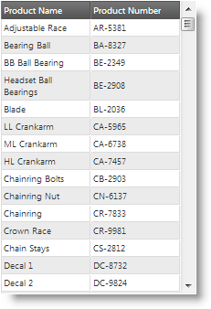
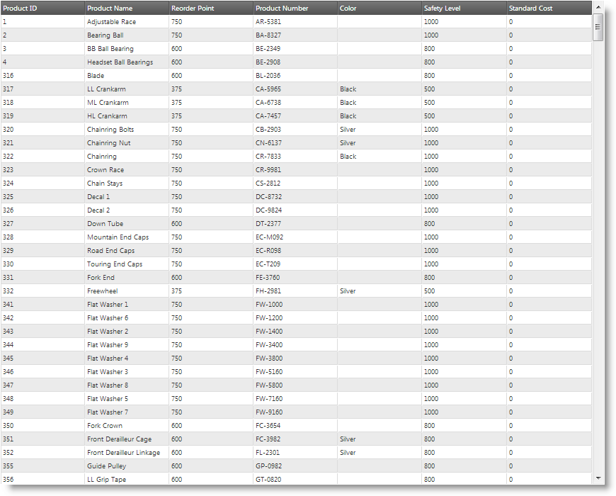

<!--
|metadata|
{
    "fileName": "iggrid-responsive-web-design-mode-configuring-column-hiding",
    "controlName": "igGrid",
    "tags": []
}
|metadata|
-->

# Configuring Column Hiding (igGrid, RWD Mode)

## Topic Overview

### Purpose

This topic explains, with code examples, how to configure column hiding for the `igGrid`™ control in Responsive Web Design (RWD) mode.

### Required background

The following lists the concepts, topics, and articles required as a prerequisite to understanding this topic.

- Concept
    - Responsive Web Design
    - Responsive Frameworks
    - CSS Media Queries
- Topics
	- [Configuring Responsive Web Design (RWD) Mode Overview (igGrid)](igGrid-Configuring-Responsive-Web-Design-Mode-Overview.html): This topic explains conceptually the elements of which configuring Responsive Web Design (RWD) mode consists – configuring column hiding and configuring the templates – and how these elements relate to each other.
    - [Responsive Web Design Mode Overview (igGrid)](igGrid-Responsive-Web-Design-Mode-Overview.html): This topic explains conceptually the RWD Mode feature of the `igGrid` control and the functionalities this feature provides.
    - [Enabling Responsive Web Design (RWD) Mode (igGrid)](igGrid-Enabling-Responsive-Web-Design-Mode.html): This topic explains, with code examples, how to enable the Responsive Web Design (RWD) mode in the `igGrid` control.
- External Resources
    -   [A List Apart: Responsive Web Design](http://alistapart.com/article/responsive-web-design)
    -   [Twitter Bootstrap](http://twitter.github.com/bootstrap/)
    -   [Wikipedia: Responsive Web Design](http://en.wikipedia.org/wiki/Responsive_web_design)
    -   [CSS 3 Media Queries](http://www.w3.org/TR/css3-mediaqueries/)


### In this topic

This topic contains the following sections:

-   [**Column Hiding Configuration Overview**](#overview)
    -   [Column hiding configuration summary chart](#summary-chart)
-   [**Configuring Column Hiding Using CSS Classes**](#css)
    -   [Property settings](#css-property-settings)
    -   [Example](#css-example)
-   [**Configuring Column Hiding Using the Profile Objects**](#profile-objects)
    -   [Property settings](#profile-objects-property-settings)
    -   [Example](#profile-objects-example)
-   [**Related Content**](#related-content)
    -   [Topics](#topics)


## <a id="overview"></a> Column Hiding Configuration Overview

The RWD mode has the functionality to hide/show columns based on the RWD profile. The following screenshots compare column hiding in the Phone and Tablet RWD mode profiles of the same grid:

Phone profile (320 x 480 px) | Tablet profile (768 x 1024 px)
-----------------------------|--------------------------------
 | 


In the Desktop profile, more columns are visible. The following picture demonstrates the same grid visualized in Desktop profile.

**Desktop profile (1280 x 1024 px)**




Column hiding can be configured in the following alternative ways:

-   **On [CSS Media Queries](http://www.w3.org/TR/css3-mediaqueries/) basis** using CSS classes – by default, CSS classes use [**CCS 3 media queries**](http://www.w3.org/TR/css3-mediaqueries/)
-   **On a per-column basis** in which you specify, for each column, whether to be hidden or shown for each individual profile.

Configuration on a per-column basis is the only available way for configuring column hiding if you have defined [inline custom RWD mode](igGrid-Responsive-Web-Design-Mode-Creating-Custom-Profile.html) or if you have implemented a custom RWD mode configuration which do not depend on CSS media queries.

### <a id="summary-chart"></a> Column hiding configuration summary chart

The following table briefly explains the available approaches for configuring RWD mode column hiding. Additional details are available after the table.

<table class="table table-striped">
	<thead>
		<tr>
            <th>
Configuration task
			</th>
            <th>
Details
			</th>
            <th>
Properties
			</th>
        </tr>
	</thead>
	<tbody>
        <tr>
            <td>
[Configuring Column Hiding Using CSS Classes](#css)
			</td>
            <td>
Column hiding defined with CSS classes uses CSS 3 Media Queries.
			</td>
            <td>
                <ul>
                    <li>
[columnSettings](%%jQueryApiUrl%%/ui.iggridresponsive#options:columnSettings)
					</li>
                    <li>
[columnSettings.columnKey](%%jQueryApiUrl%%/ui.iggridresponsive#options:columnSettings.columnKey)
					</li>
                    <li>
[columnSettings.classes](%%jQueryApiUrl%%/ui.iggridresponsive#options:columnSettings.classes)
					</li>
                </ul>
            </td>
        </tr>

        <tr>
            <td>
[Configuring Column Hiding Using the Profile Objects](#profile-objects)
			</td>
            <td>
Column hiding defined in the individual column configurations is done using the `InfragisticsMode` class.
			</td>
            <td>
                <ul>
                    <li>
[columnSettings](%%jQueryApiUrl%%/ui.iggridresponsive#options:columnSettings)
					</li>
                    <li>
[columnSettings.columnKey](%%jQueryApiUrl%%/ui.iggridresponsive#options:columnSettings.columnKey)
					</li>
                    <li>
[columnSettings.configuration.desktop.hidden](%%jQueryApiUrl%%/ui.iggridresponsive#options:columnSettings.configuration)
					</li>
                    <li>
[columnSettings.configuration.tablet.hidden](%%jQueryApiUrl%%/ui.iggridresponsive#options:columnSettings.configuration)
					</li>
                    <li>
[columnSettings.configuration.phone.hidden](%%jQueryApiUrl%%/ui.iggridresponsive#options:columnSettings.configuration)
					</li>
                    <li>
columnSettings.configuration.&lt;custom_mode&gt;.hidden
					</li>
                </ul>
            </td>
        </tr>
    </tbody>
</table>


## <a id="css"></a> Configuring Column Hiding Using CSS Classes

Column hiding defined with CSS classes uses CSS 3 Media Queries. CSS classes are configured in the `columnSettings` property on a per column basis. The `columnSettings.classes` property follows the rules of setting the [HTML element’s class attribute](http://www.w3.org/TR/html401/struct/global.html#h-7.5.2). You can set single class or multiple classes without the dot. When you set multiple classes, separate them with space.

### <a id="css-property-settings"></a> Property settings

The following table maps the desired configuration to property settings.

<table class="table table-striped">
	<thead>
		<tr>
            <th>
In order to:
			</th>
            <th>
Use this property:
			</th>
            <th>
And set it to:
			</th>
        </tr>
	</thead>
	<tbody>
        <tr>
            <td>
Hide a column using CSS classes for the Desktop RWD mode profile
			</td>
            <td>
                <ul>
                    <li>
[columnSettings.columnKey](%%jQueryApiUrl%%/ui.iggridresponsive#options:columnSettings.columnKey)
					</li>
                    <li>
[columnSettings.classes](%%jQueryApiUrl%%/ui.iggridresponsive#options:columnSettings.classes)
					</li>
                </ul>
            </td>
            <td>
                <ul>
                    <li>
key of the column
					</li>
                    <li>
“ui-hidden-desktop”
					</li>
                </ul>
            </td>
        </tr>
        <tr>
            <td>
Show a column using CSS classes for the Desktop RWD mode profile
			</td>
            <td>
                <ul>
                    <li>
[columnSettings.columnKey](%%jQueryApiUrl%%/ui.iggridresponsive#options:columnSettings.columnKey)
					</li>
                    <li>
[columnSettings.classes](%%jQueryApiUrl%%/ui.iggridresponsive#options:columnSettings.classes)
					</li>
                </ul>
            </td>
            <td>
                <ul>
                    <li>
key of the column
					</li>
                    <li>
“ui-visible-desktop”
					</li>
                </ul>
            </td>
        </tr>
        <tr>
            <td>
Hide a column using CSS classes for the Tablet RWD mode profile
			</td>
            <td>
                <ul>
                    <li>
[columnSettings.columnKey](%%jQueryApiUrl%%/ui.iggridresponsive#options:columnSettings.columnKey)
					</li>
                    <li>
[columnSettings.classes](%%jQueryApiUrl%%/ui.iggridresponsive#options:columnSettings.classes)
					</li>
                </ul>
            </td>
            <td>
                <ul>
                    <li>
key of the column
					</li>
                    <li>
“ui-hidden-tablet”
					</li>
                </ul>
            </td>
        </tr>
        <tr>
            <td>
Show a column using CSS classes for the Tablet RWD mode profile
			</td>
            <td>
                <ul>
                    <li>
[columnSettings.columnKey](%%jQueryApiUrl%%/ui.iggridresponsive#options:columnSettings.columnKey)
					</li>
                    <li>
[columnSettings.classes](%%jQueryApiUrl%%/ui.iggridresponsive#options:columnSettings.classes)
					</li>
                </ul>
            </td>
            <td>
                <ul>
                    <li>
key of the column
					</li>
                    <li>
“ui-visible-tablet”
					</li>
                </ul>
            </td>
        </tr>
        <tr>
            <td>
Hide a column using CSS classes for the Phone RWD mode profile
			</td>
            <td>
                <ul>
                    <li>
[columnSettings.columnKey](%%jQueryApiUrl%%/ui.iggridresponsive#options:columnSettings.columnKey)
					</li>
                    <li>
[columnSettings.classes](%%jQueryApiUrl%%/ui.iggridresponsive#options:columnSettings.classes)
					</li>
                </ul>
            </td>
            <td>
                <ul>
                    <li>
key of the column
					</li>
                    <li>
“ui-hidden-phone”
					</li>
                </ul>
            </td>
        </tr>
        <tr>
            <td>
Show a column using CSS classes for the Phone RWD profile
			</td>
            <td>
                <ul>
                    <li>
[columnSettings.columnKey](%%jQueryApiUrl%%/ui.iggridresponsive#options:columnSettings.columnKey)
					</li>
                    <li>
[columnSettings.classes](%%jQueryApiUrl%%/ui.iggridresponsive#options:columnSettings.classes)
					</li>
                </ul>
            </td>
            <td>
                <ul>
                    <li>
key of the column
					</li>
                    <li>
“ui-visible-phone”
					</li>
                </ul>
            </td>
        </tr>
    </tbody>
</table>


### <a id="css-example"></a> Example

This example demonstrates how to set column hiding based on CSS classes.

The `ProductID` column is configured to use the `ui-hidden-tablet` and `ui-hidden-phone` classes at the same time (this is done by separating them with space), i.e. it will not be visible in the Tablet and Phone profiles.

The `ProductNumber` column is configured to use the `ui-hidden-phone` class, i.e. it will not be visible in the Phone profile.

**In JavaScript:**

```js
$("#grid1").igGrid({
    height: "100%",
    width: "100%",
    columns: [
        { headerText: "Product ID", key: "ProductID", dataType: "number"},
        { headerText: "Product Name", key: "Name", dataType: "string" },
        { headerText: "Product Number", key: "ProductNumber", dataType: "string" }
    ],
    autoGenerateColumns: false,
    dataSource: adventureWorks,
    responseDataKey: "Records",
    features: [
        {
            name: "Responsive",
            columnSettings: [
                {
                    columnKey: "ProductID",
                    classes: "ui-hidden-tablet ui-hidden-phone"
                },
                {
                    columnKey: "ProductNumber",
                    classes: "ui-hidden-phone"
                }
            ]
        }
    ]
});
```

**In C#:**

```csharp
@using Infragistics.Web.Mvc
@model IQueryable<GridDataBinding.Models.Product>
@(Html.Infragistics()
	.Grid(Model)
	.ID("grid1")
	.AutoGenerateColumns(false)
	.Columns(col =>
	{
	    col.For(c => c.ProductID).HeaderText("Product ID");
	    col.For(c => c.Name).HeaderText("Product Name");
	    col.For(c => c.ProductNumber).HeaderText("Product Number");
	})
	.Features(feature =>
	{
	    feature.Responsive().ColumnSettings(cs =>
	    {
	        cs.ColumnSetting().ColumnKey("ProductID").Classes("ui-hidden-tablet ui-hidden-phone");
	        cs.ColumnSetting().ColumnKey("ProductNumber").Classes("ui-hidden-phone");
	    });
	})
	.DataBind()
	.Render())
```


## <a id="profile-objects"></a> Configuring Column Hiding Using the Profile Objects

Column hiding defined in the individual column configurations is done with the `InfragisticsMode` class in the `columnSettings.configuration` property which is an object whose properties are the names of the RWD mode profiles and whose values are objects having the `hidden` Boolean property for configuring column visibility.

### <a id="profile-objects-property-settings"></a> Property settings

The following table maps the desired configuration to property settings.

<table class="table table-striped">
	<thead>
		<tr>
            <th>
In order to:
			</th>
            <th>
Use this property:
			</th>
            <th>
And set it to:
			</th>
        </tr>
	</thead>
	<tbody>
        <tr>
            <td>
Hide a column using column configuration for the Desktop RWD mode profile
			</td>
            <td>
                <ul>
                    <li>
[columnSettings.columnKey](%%jQueryApiUrl%%/ui.iggridresponsive#options:columnSettings.columnKey)
					</li>
                    <li>
[columnSettings.configuration.desktop.hidden](%%jQueryApiUrl%%/ui.iggridresponsive#options:columnSettings.configuration)
					</li>
                </ul>
            </td>
            <td>
                <ul>
                    <li>
key of the column
					</li>
                    <li>
true
					</li>
                </ul>
            </td>
        </tr>
        <tr>
            <td>
Show a column using column configuration for the Desktop RWD profile
			</td>
            <td>
                <ul>
                    <li>
[columnSettings.columnKey](%%jQueryApiUrl%%/ui.iggridresponsive#options:columnSettings.columnKey)
					</li>
                    <li>
[columnSettings.configuration.desktop.hidden](%%jQueryApiUrl%%/ui.iggridresponsive#options:columnSettings.configuration)
					</li>
                </ul>
            </td>
            <td>
                <ul>
                    <li>
key of the column
					</li>
                    <li>
false
					</li>
                </ul>
            </td>
        </tr>
        <tr>
            <td>
Hide a column using column configuration for the Tablet RWD mode profile
			</td>
            <td>
                <ul>
                    <li>
[columnSettings.columnKey](%%jQueryApiUrl%%/ui.iggridresponsive#options:columnSettings.columnKey)
					</li>
                    <li>
[columnSettings.configuration.tablet.hidden](%%jQueryApiUrl%%/ui.iggridresponsive#options:columnSettings.configuration)
					</li>
                </ul>
            </td>
            <td>
                <ul>
                    <li>
key of the column
					</li>
                    <li>
true
					</li>
                </ul>
            </td>
        </tr>
        <tr>
            <td>
Show a column using column configuration for the Tablet RWD mode profile
			</td>
            <td>
                <ul>
                    <li>
[columnSettings.columnKey](%%jQueryApiUrl%%/ui.iggridresponsive#options:columnSettings.columnKey)
					</li>
                    <li>
[columnSettings.configuration.tablet.hidden](%%jQueryApiUrl%%/ui.iggridresponsive#options:columnSettings.configuration)
					</li>
                </ul>
            </td>
            <td>
                <ul>
                    <li>
key of the column
					</li>
                    <li>
false
					</li>
                </ul>
            </td>
        </tr>
        <tr>
            <td>
Hide a column using column configuration for the Phone RWD mode profile
			</td>
            <td>
                <ul>
                    <li>
[columnSettings.columnKey](%%jQueryApiUrl%%/ui.iggridresponsive#options:columnSettings.columnKey)
					</li>
                    <li>
[columnSettings.configuration.tablet.hidden](%%jQueryApiUrl%%/ui.iggridresponsive#options:columnSettings.configuration)
					</li>
                </ul>
            </td>
            <td>
                <ul>
                    <li>
key of the column
					</li>
                    <li>
true
					</li>
                </ul>
            </td>
        </tr>
        <tr>
            <td>
Show a column using column configuration for the Phone RWD mode profile
			</td>
            <td>
                <ul>
                    <li>
[columnSettings.columnKey](%%jQueryApiUrl%%/ui.iggridresponsive#options:columnSettings.columnKey)
					</li>
                    <li>
[columnSettings.configuration.tablet.hidden](%%jQueryApiUrl%%/ui.iggridresponsive#options:columnSettings.configuration)
					</li>
                </ul>
            </td>
            <td>
                <ul>
                    <li>
key of the column
					</li>
                    <li>
false
					</li>
                </ul>
            </td>
        </tr>
    </tbody>
</table>


### <a id="profile-objects-example"></a> Example

This example demonstrates how to set column hiding based on column configuration.

The `ProductID` column is configured to be visible in the Desktop profile (which is the default) and hidden in Tablet and Phone profiles.

**In JavaScript:**

```js
$("#grid1").igGrid({
    height: "100%",
    width: "100%",
    columns: [
        { headerText: "Product ID", key: "ProductID", dataType: "number"},
        { headerText: "Product Name", key: "Name", dataType: "string" },
        { headerText: "Product Number", key: "ProductNumber", dataType: "string" }
    ],
    autoGenerateColumns: false,
    dataSource: adventureWorks,
    responseDataKey: "Records",
    features: [
        {
            name: "Responsive",
            columnSettings: [
                {
                    columnKey: "ProductID",
                    configuration: {
                        desktop: {
                            hidden: false
                        },
                        tablet: {
                            hidden: true
                        },
                        phone: {
                            hidden: true
                        }
                    }
                }
            ]
        }
    ]
});
```

**In C#:**

```csharp
@using Infragistics.Web.Mvc
@model IQueryable<GridDataBinding.Models.Product>
@(Html.Infragistics()
	.Grid(Model)
	.ID("grid1")
	.AutoGenerateColumns(false)
	.Columns(col =>
	{
	    col.For(c => c.ProductID).HeaderText("Product ID");
	    col.For(c => c.Name).HeaderText("Product Name");
	    col.For(c => c.ProductNumber).HeaderText("Product Number");
	})
	.Features(feature =>
	{
	    feature.Responsive().ColumnSettings(cs =>
	    {
	        cs.ColumnSetting().ColumnKey("ProductID").Configuration(conf => {
	            conf.AddColumnModeConfiguration("desktop", c => c.Hidden(false));
	            conf.AddColumnModeConfiguration("tablet", c => c.Hidden(true));
	            conf.AddColumnModeConfiguration("phone", c => c.Hidden(true));
	        });
	    });
	})
	.DataBind()
	.Render())
```


## <a id="related-content"></a> Related Content

### <a id="topics"></a> Topics

The following topics provide additional information related to this topic.

- [Configuring Row and Column Templates (igGrid, RWD Mode)](igGrid-Responsive-Web-Design-Mode-Configuring-Row-and-Column-Templates.html): This topic explains, with code examples, how to define row and column templates for the individual Responsive Web Design (RWD) mode profiles of the `igGrid` control and how to configure automatic change of template when switching the active RWD mode profile.

- [Creating Custom Responsive Web Design (RWD) Profiles (igGrid)](igGrid-Responsive-Web-Design-Mode-Creating-Custom-Profile.html): This topic explains, with code examples, how to create custom Responsive Web Design (RWD) mode profiles for the `igGrid` control.


 

 


