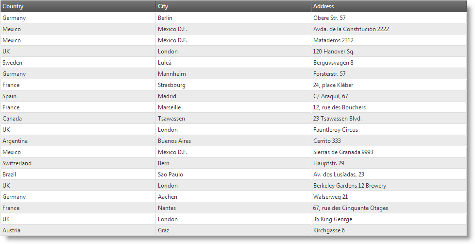
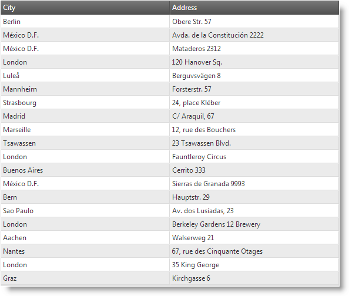
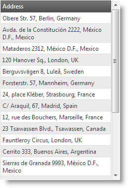

<!--
|metadata|
{
    "fileName": "iggrid-responsive-web-design-mode-configuring-row-and-column-templates",
    "controlName": "igGrid",
    "tags": []
}
|metadata|
-->

# Configuring Column Templates (igGrid, RWD Mode)

## Topic Overview

### Purpose

This topic explains, with code examples, how to define column templates for the individual Responsive Web Design (RWD) mode configurations of the `igGrid`™ control and how to configure automatic change of template when switching the active RWD mode configuration.

### Required background

The following lists the concepts, topics, and articles required as a prerequisite to understanding this topic.

- Concept
    - Responsive Web Design
    - Responsive Frameworks
    - CSS Media Queries
- Topics
    - [Responsive Web Design Mode Overview (igGrid)](igGrid-Responsive-Web-Design-Mode-Overview.html): This topic explains conceptually the RWD Mode feature of the `igGrid` control and the functionalities this feature provides.
    - [Enabling Responsive Web Design (RWD) Mode (igGrid)](igGrid-Enabling-Responsive-Web-Design-Mode.html): This topic explains, with code examples, how to enable the Responsive Web Design (RWD) mode in the `igGrid` control.
	- [Configuring Responsive Web Design (RWD) Mode Overview (igGrid)](igGrid-Configuring-Responsive-Web-Design-Mode-Overview.html): This topic explains conceptually the elements of which configuring Responsive Web Design (RWD) mode consists – configuring column hiding and configuring the templates – and how these elements relate to each other.
- External Resources
    -   [A List Apart: Responsive Web Design](http://alistapart.com/article/responsive-web-design)
    -   [Twitter Bootstrap](http://twitter.github.com/bootstrap/)
    -   [Wikipedia: Responsive Web Design](http://en.wikipedia.org/wiki/Responsive_web_design)
    -   [CSS 3 Media Queries](http://www.w3.org/TR/css3-mediaqueries/)

### In this topic

This topic contains the following sections:

-   [**Template Configuration Summary**](#summary)
    -   [Template configuration summary chart](#summary-chart)
-   [**Configuring Column Templates**](#column-template)
    -   [Property settings](#column-template-property-settings)
    -   [Example](#column-template-example)
-   [**Related Content**](#related-content)
    -   [Topics](#topics)


## <a id="summary"></a> Template Configuration Summary

RWD mode templates are `igGrid` templates configured per profile. For example, using templates, in the Desktop profile, you may have `City`, `Country`, and `Address` as separate columns and, in the Tablet profile, you can merge them into a single column.

The following screenshots demonstrate how the `igGrid` looks in the different RWD configurations. In the Desktop configuration, the grid has 3 columns: `Country`, `City`, and `Address`. In the Tablet configuration, the `Country` column is hidden. In the Phone configuration, the `Country` and `City` columns are hidden, but their data is appended to the `Address` column.

Desktop Configuration (1280 x 1024 px)



Tablet configuration (768 x 1024 px) | Phone configuration (320 x 480 px)
-------------------------------------|---------------------------------
 | 


When there RWD configuration templates configured, the templates switch automatically with profile activation.

### <a id="summary-chart"></a> Template configuration summary chart

The following table lists the configurable aspects of *RWD Mode template switching*. Additional details are available after the table.

<table class="table table-striped">
	<thead>
		<tr>
            <th>
Configurable aspect
			</th>
            <th>
Details
			</th>
            <th>
Properties
			</th>
        </tr>
	</thead>
	<tbody>
        <tr>
            <td>
[Column template](#column-template)
			</td>
            <td>
Column templates are defined individually for each column.
			</td>
            <td>
                <ul>
                    <li>
[columnSettings](%%jQueryApiUrl%%/ui.iggridresponsive#options:columnSettings)
					</li>
                    <li>
[columnSettings.columnKey](%%jQueryApiUrl%%/ui.iggridresponsive#options:columnSettings.columnKey)
					</li>
                    <li>
[columnSettings.configuration.desktop.template](%%jQueryApiUrl%%/ui.iggridresponsive#options:columnSettings.configuration)
					</li>
                    <li>
[columnSettings.configuration.tablet.template](%%jQueryApiUrl%%/ui.iggridresponsive#options:columnSettings.configuration)
					</li>
                    <li>
[columnSettings.configuration.phone.template](%%jQueryApiUrl%%/ui.iggridresponsive#options:columnSettings.configuration)
					</li>
                    <li>
columnSettings.configuration.&lt;custom_mode&gt;.template
					</li>
                </ul>
            </td>
        </tr>
    </tbody>
</table>


## <a id="column-template"></a> Configuring Column Templates

Column templates are defined on column level, i.e. individually for each column. Column template switching is configured in the RWD Mode [`columnSettings`](%%jQueryApiUrl%%/ui.iggridresponsive#options:columnSettings) property of the RWD Mode feature.

### <a id="column-template-property-settings"></a> Property settings

The following table maps the desired configuration the property settings related to it.

In order to: | Use this property: | And set it to:
-------------|--------------------|---------------
Configure column template for the Desktop RWD profile | [columnSettings.columnKey](%%jQueryApiUrl%%/ui.iggridresponsive#options) | the key of the column
 | [columnSettings.configuration.desktop.template](%%jQueryApiUrl%%/ui.iggridresponsive#options) | a template string
Configure column template for the Tablet RWD profile | [columnSettings.columnKey](%%jQueryApiUrl%%/ui.iggridresponsive#options) |the key of the column
 | [columnSettings.configuration.tablet.template](%%jQueryApiUrl%%/ui.iggridresponsive#options) | a template string
Configure column template switching for the Phone RWD profile | [columnSettings.columnKey](%%jQueryApiUrl%%/ui.iggridresponsive#options) | the key of the column
 | [columnSettings.configuration.phone.template](%%jQueryApiUrl%%/ui.iggridresponsive#options) | a template string


### <a id="column-template-example"></a> Example

The following code demonstrates how to define a column template for the `Name` column for each of the RWD mode default profiles. The templates set the font size of the cell.

**In JavaScript:**

```js
$("#grid1").igGrid({
    height: "100%",
    width: "100%",
    columns: [
        { headerText: "Product ID", key: "ProductID", dataType: "number"},
        { headerText: "Product Name", key: "Name", dataType: "string" },
        { headerText: "Product Number", key: "ProductNumber", dataType: "string" }
    ],
    autoGenerateColumns: false,
    dataSource: adventureWorks,
    responseDataKey: "Records",
    features: [
        {
            name: "Responsive",
            columnSettings: [
                {
                    columnKey: "Name",
                    configuration: {
                        desktop: {
                            template: "<span style='font-weight: bold; font-size: 1.2em;'>${Name}</span>"
                        },
                        tablet: {
                            template: "<span style='font-size: 1.1em;'>${Name}</span>"
                        },
                        phone: {
                            template: "<span style='font-size: 0.8em;'>${Name}</span>"
                        }
                    }
                }
            ]
        }
    ]
});
```

**In ASPX:**

```csharp
@using Infragistics.Web.Mvc
@model IQueryable<GridDataBinding.Models.Product>
@(Html.Infragistics()
	.Grid(Model)
	.ID("grid1")
	.AutoGenerateColumns(false)
	.Columns(col =>
	{
	    col.For(c => c.ProductID).HeaderText("Product ID");
	    col.For(c => c.Name).HeaderText("Product Name");
	    col.For(c => c.ProductNumber).HeaderText("Product Number");
	})
	.Features(feature =>
	{
	    feature.Responsive().ColumnSettings(cs =>
	    {
	        cs.ColumnSetting().ColumnKey("Name").Configuration(conf => {
	            conf.AddColumnModeConfiguration("desktop", c => c.Template("<span style='font-weight: bold; font-size: 1.2em;'>${Name}</span>"));
	            conf.AddColumnModeConfiguration("tablet", c => c.Template("<span style='font-size: 1.1em;'>${Name}</span>"));
	            conf.AddColumnModeConfiguration("phone", c => c.Template("<span style='font-size: 0.8em;'>${Name}</span>"));
	        });
	    });
	})
	.DataBind()
	.Render())
```

## <a id="related-content"></a> Related Content

### <a id="topics"></a> Topics

The following topics provide additional information related to this topic.

- [Configuring Column Hiding (igGrid, RWD Mode)](igGrid-Responsive-Web-Design-Mode-Configuring-Column-Hiding.html): This topic explains, with code examples, how to configure column hiding for the `igGrid` control in Responsive Web Design (RWD) mode.

- [Creating Custom Responsive Web Design (RWD) Profiles (igGrid)](igGrid-Responsive-Web-Design-Mode-Creating-Custom-Profile.html): This topic explains, with code examples, how to create custom Responsive Web Design (RWD) mode profiles for the `igGrid` control.


 

 


