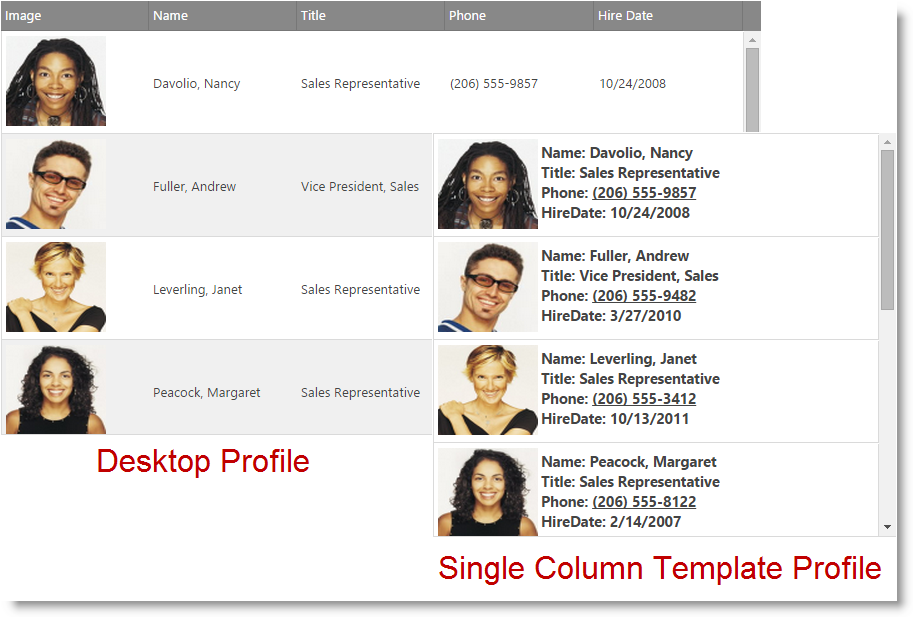

<!--
|metadata|
{
    "fileName": "iggrid-responsive-web-design-mode-configuring-single-column-template",
    "controlName": "",
    "tags": []
}
|metadata|
-->

# Configuring Single Column Template (igGrid, RWD Mode)

## Topic Overview

### Required background

The following table lists the concepts, topics, and articles required as a prerequisite to understanding this topic.

- Concept
    - Responsive Web Design
- Topics
    - [Responsive Web Design Mode Overview (igGrid)](igGrid-Responsive-Web-Design-Mode-Overview.html): This topic explains conceptually the RWD Mode feature of the `igGrid` control and the functionalities this feature provides.
    - [Enabling Responsive Web Design (RWD) Mode (igGrid)](igGrid-Enabling-Responsive-Web-Design-Mode.html): This topic explains, with code examples, how to enable the Responsive Web Design (RWD) mode in the `igGrid` control.
- External Resources
    -   [Wikipedia: Responsive Web Design](http://en.wikipedia.org/wiki/Responsive_web_design)

#### In this topic

This topic contains the following sections:

-   [**Single Column Template Overview**](#overview)
-   [**Single Column Template Configuration**](#configuring)
-   [**Related Content**](#related-content)

##  Single Column Template Overview

The responsive Single Column Template allows you to define a custom template that renders the data from a row into a single column based on the current layout mode (tablet or phone).

This allows you to create a specialized look for the data in the grid when it's rendered on small devices.

>**Note** The RWD Single Column Template feature is supported only with the Paging grid feature. All other grid features are currently not supported with this mode.

##  Single Column Template Configuration

The templates per specific profile are specified via the [`singleColumnTemplate`](%%jQueryApiUrl%%/ui.iggridresponsive#options:singleColumnTemplate) option of the Responsive Web Design Mode feature. 
Different templates can be specified based on the current layout mode (tablet or phone) in order to further customize the way the data is presented.

The below sample shows how this configuration affects the rendering of the data depending on the device size.
In order to see the different modes take effect please open this sample on a mobile device or resize the browser's window.

   [Responsive Single Column Template](%%SamplesEmbedUrl%%/grid/responsive-single-column-template)

##  Related Content

###  Topics

The following topics provide additional information related to this topic.

- [Responsive Web Design Mode Overview (igGrid)](igGrid-Responsive-Web-Design-Mode-Overview.html): This topic explains conceptually the RWD Mode feature of the `igGrid` control and the functionalities this feature provides.
