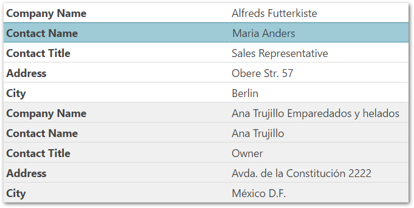

<!--
|metadata|
{
    "fileName": "iggrid-responsive-web-design-mode-configuring-vertical-column-rendering",
    "controlName": "",
    "tags": []
}
|metadata|
-->

# Configuring Vertical Column Rendering (igGrid, RWD Mode)

## Topic Overview

### Purpose

This topic provides an overview of the vertical column rendering in `igGrid`™; explaining its configuration and listing its limitations integrating with the other features.

### Required background

The following table lists the concepts, topics, and articles required as a prerequisite to understanding this topic.

- Concept
    - Responsive Web Design
- Topics
    - [Responsive Web Design Mode Overview (igGrid)](igGrid-Responsive-Web-Design-Mode-Overview.html): This topic explains conceptually the RWD Mode feature of the `igGrid` control and the functionalities this feature provides.
    - [Enabling Responsive Web Design (RWD) Mode (igGrid)](igGrid-Enabling-Responsive-Web-Design-Mode.html): This topic explains, with code examples, how to enable the Responsive Web Design (RWD) mode in the `igGrid` control.
- External Resources
    -   [Wikipedia: Responsive Web Design](http://en.wikipedia.org/wiki/Responsive_web_design)


#### In this topic

This topic contains the following sections:

-   [**Vertical column rendering Overview**](#overview)
    -   [Configuring vertical column rendering summary](#summary)
    -   [Configuring vertical column rendering chart](#chart)
	-   [Disabling Responsive Web Design Mode – Code Examples](#examples)
-   [**Code Example: Disabling vertical column rendering in JavaScript**](#js-example)
    -   [Code](#js-example-code)
-   [**Code Example: Disabling vertical column rendering in ASP.NET MVC**](#mvc-example)
    -   [Code](#mvc-code)
-   [**Integration with hiding, paging and responsive configuration templates**](#feature-integration)
-   [**Limitation when using grid’s features**](#limitation)
-   [**Property Reference**](#property-reference)
-   [**CSS Classes Reference**](#css-reference)
-   [**Related Content**](#related-content)
    -   [Topics](#topics)


## <a id="overview"></a> Vertical column rendering Overview

By default, enabling the Responsive feature renders the `igGrid` using vertical columns. This means that when the width of the browser is less than the width of the grid it renders the grid as a key/value pair list, similar to the screenshot below.



The `windowWidthToRenderVertically` option controls this behavior. The default value for the option is determined at runtime, calculating the grid’s width needed to accommodate columns of a certain size. By default, the width calculations occur in real-time.

Use the `allowedColumnWidthPerType` property members to configure column widths. For string columns the minimum setting size is 120 pixels, for number columns the minimal width is 50 pixels before forcing the vertical rendering. If the window is shrunk to a size less than the minimum column width, then the grid renders vertically. The user may configure these setting to a width that better suited to the user’s needs.

Set the `enableVerticalRendering` option to false in order to disable the vertical column rendering.

When rendering the grid vertically, the `ui-iggrid-responsive-vertical` class is added to the grid’s container. This allows you to determine the grid’s orientation, vertical or horizontal, simply by checking for the existence of this class.

There are no new events or parameters added to existing events for this feature.

The rows render as key/value pair lists, have the alternating row/record styles applied, if and only if, the `alternateRowStyles` option is set to true.

You can control the width of the headers and values columns with the `propertiesColumnWidth` and `valuesColumnWidth` properties.

The sample below demonstrates the `igGrid`’s Responsive Web Design feature in vertical mode. Responsive vertical rendering mode renders the grid data in two columns. The left column holds the columns captions and the right column holds the data.

<div class="embed-sample">
   [Responsive Vertical Rendering](%%SamplesEmbedUrl%%/grid/responsive-vertical-rendering)
</div>

### <a id="summary"></a> Configuring vertical column rendering summary

Enabling the Responsive feature causes, by default the `igGrid`™ control to use the vertical rendering mode if this setting is not wanted; explicitly configure the `windowWidthToRenderVertically` to prevent this behavior.

This is done differently in JavaScript and ASP.NET MVC.

### <a id="chart"></a> Configuring vertical column rendering chart

The following table briefly explains how to configure the `igGrid` control’s vertical rendering mode. For details, refer to the code examples following the table.

To configure the vertical rendering mode in… | Do this…
---|---
JavaScript | Configure the RWD mode (the feature name is `Responsive`) in the `igGrid`’s `features` array. <br /> Set the `windowWidthToRenderVertically` option value in pixels.
ASP.NET MVC | Instantiate the `Responsive` feature in the delegate passed to the `Features` method of the grid.  <br /> Set the `WindowWidthToRenderVertically` method’s parameter value in pixels.


### <a id="examples"></a> Disabling Responsive Web Design Mode – Code Examples

The following lists the code examples included in this topic.

- [Disabling vertical column rendering in JavaScript](#js-example): Demonstrates disabling `igGrid`’s responsive vertical column rendering in JavaScript.

- [Disabling vertical column rendering in ASP.NET MVC](#mvc-example): Demonstrates disabling `igGrid`’s responsive vertical column rendering in ASP.NET MVC.


## <a id="js-example"></a> Code Example: Disabling vertical column rendering in JavaScript

This example creates an `igGrid` instance bound to the Products table data from the AdventureWorks sample database.

-   Enable the responsive mode in the `igGrid`’s `features` array
-   Disable vertical column rendering by setting the `enableVerticalRendering` option to false

### <a id="js-example-code"></a> Code

Following is the code that implements this example.

**In JavaScript:**

```js
$("#grid1").igGrid({
    height: "100%",
    width: "100%",
    columns: [
        { headerText: "Product ID", key: "ProductID", dataType: "number"},
        { headerText: "Product Name", key: "Name", dataType: "string" },
        { headerText: "Product Number", key: "ProductNumber", dataType: "string" }
    ],
    autoGenerateColumns: false,
    dataSource: adventureWorks,
    responseDataKey: "Records",
    features: [
        {
            name: "Responsive",
            enableVerticalRendering: false
        }
    ]
});
```


## <a id="mvc-example"></a> Code Example: Disabling vertical column rendering in ASP.NET MVC

This example creates an `igGrid` instance bound to a custom Product object collection defined as a View model.

-   Instantiate the `Responsive` feature in the delegate passed to the grid’s `Features` method
-   Disabled the vertical column rendering by passing false to the `EnableVerticalRendering` method

### <a id="mvc-code"></a> Code

Following is the code that implements this example.

**In C#:**

```csharp
@using Infragistics.Web.Mvc
@model IQueryable<GridDataBinding.Models.Product>
@(Html.Infragistics()
	.Grid(Model)
	.ID("grid1")
	.AutoGenerateColumns(false)
	.Columns(col =>
	{
	    col.For(c => c.ProductID).HeaderText("Product ID");
	    col.For(c => c.Name).HeaderText("Product Name");
	    col.For(c => c.ProductNumber).HeaderText("Product Number");
	})
	.Features(feature =>
	{
	    features.Responsive().EnableVerticalRendering(false);
	})
	.DataBind().Render())
```


## <a id="feature-integration"></a> Integration with hiding, paging and responsive configuration templates

Although, no feature integration was planned for this mode: some features are supported.

-   Paging feature works out of the box
-   Hiding (configuration and API) works in the way that the hidden columns are not displayed for vertical rendering, i.e., it should hide the rows showing the said column data

> **Note:** It is not advisable to combine column hiding and vertical rendering because they achieve the same goal in different ways.

-   Templating, including the templates specified in the Responsive configuration; however, you can only template data cells (in the right column) in this mode


## <a id="limitation"></a> Limitations when using the grid’s features

When the vertical column rendering mode is turned on, the responsive grid supports the following API features (, but no UI is currently implemented to support them)

-   [Filtering](igGrid-Filtering.html)
-   [Sorting](igGrid-Sorting.html)
-   [Hiding](igGrid-Column-Hiding.html)

-   [Selection](igGrid-Selection.html) feature works through the UI but only if Selection uses indexes for row identifiers. For best results no [primaryKey](%%jQueryApiUrl%%/ui.iggrid#options:primaryKey) should be specified and selection persistence should be disabled. Event arguments, selectedCells / selectedRows properties and API will return erroneous result regardless.
-   [GroupBy](igGrid-GroupBy.html), [RowSelectors](igGrid-Row-Selectors.html), [Summaries](igGrid-Column-Summaries.html), [Updating](igGrid-Updating.html), [Virtualization](igGrid-Virtualization-Overview.html) features and [Hierarchical](igHierarchicalGrid-igHierarchicalGrid.html) mode are not supported when vertically rendering the grid


## <a id="property-reference"></a> Vertical Rendering Property Reference

This section describes the various properties related to the Vertical Rendering when using the `Responsive` feature in the `igGrid` control.

The following table summarizes the purpose and functionality of the unbound columns’ properties.

<table class="table table-striped">
	<thead>
		<tr>
            <th>
Property
			</th>
            <th>
Type
			</th>
            <th>
Description
			</th>
            <th>
Default Value
			</th>
        </tr>
	</thead>
	<tbody>
        <tr>
            <td>
[enableVerticalRendering](%%jQueryApiUrl%%/ui.iggridresponsive#options:enableVerticalRendering)
			</td>
            <td>
bool
			</td>
            <td>
Toggles responsive vertical rendering for the grid on or off.
			</td>
            <td>
true
			</td>
        </tr>        
        <tr>
            <td>
[windowWidthToRenderVertically](%%jQueryApiUrl%%/ui.iggridresponsive#options:windowWidthToRenderVertically)
			</td>
            <td>
"string|number|null"
			</td>
            <td>
The width of the window within which the grid renders its content vertically. The default value is null leaving the grid to automatically determine when to render this mode based on the `allowedColumnWidthPerType` settings.
			</td>
            <td>
null
			</td>
        </tr>
        <tr>
            <td>
[propertiesColumnWidth](%%jQueryApiUrl%%/ui.iggridresponsive#options:propertiesColumnWidth)
			</td>

            <td>
"string | number"
			</td>

            <td>
The width of the left properties column with vertical rendering enabled.
			</td>

            <td>
“50%”
			</td>
        </tr>
        <tr>
            <td>
[valuesColumnWidth](%%jQueryApiUrl%%/ui.iggridresponsive#options:valuesColumnWidth)
			</td>
            <td>
"string | number"
			</td>
            <td>
The width of the right values column with vertical rendering enabled.
			</td>
            <td>
“50%”
			</td>
        </tr>
        <tr>
            <td>
[allowedColumnWidthPerType](%%jQueryApiUrl%%/ui.iggridresponsive#options:allowedColumnWidthPerType)
			</td>
            <td>
"object"
			</td>
            <td>
The members of the property determine the minimal widths the columns can take, when `windowWidthToRenderVertically` is null, before forcing the grid to render vertically. For example, the minimal width in pixels that the bool columns can take, before forcing vertical rendering, is 50.
			</td>
            <td>
string: 120, <br />
number: 50, <br />
bool: 50, <br />
date: 80, <br />
object: 150
            </td>
        </tr>
    </tbody>
</table>


## <a id="css-reference"></a> CSS Classes Reference

This section describes the various CSS classes related to the Vertical Rendering when using the [Responsive](igGrid-Responsive-Web-Design-Mode-LandingPage.html) feature in the `igGrid` control.

The following explains the CSS class applied when Vertical Rendering is enabled.

- [ui-iggrid-responsive-vertical](%%jQueryApiUrl%%/ui.iggridresponsive#theming)

	Enabling vertical rendering applies classes to the grid table. When this class is added to the grid’s container then the grid renders vertically.
	
	Checking for the existence of the class allows you to determine if the grid renders vertically or horizontally.


## <a id="related-content"></a> Related Content

### <a id="topics"></a> Topics

The following topics provide additional information related to this topic.


- [Configuring Column Hiding (igGrid, RWD Mode)](igGrid-Responsive-Web-Design-Mode-Configuring-Column-Hiding.html): This topic explains, with code examples, how to configure column hiding for the `igGrid` control in Responsive Web Design (RWD) mode.

- [Configuring Column Templates (igGrid, RWD Mode)](igGrid-Responsive-Web-Design-Mode-Configuring-Row-and-Column-Templates.html): This topic explains, with code examples, how to define row and column templates for the individual Responsive Web Design (RWD) mode profiles of the `igGrid` control and how to configure automatic change of template when switching the active RWD mode profile.

- [Creating Custom Responsive Web Design (RWD) Profiles (igGrid)](igGrid-Responsive-Web-Design-Mode-Creating-Custom-Profile.html): This topic explains, with code examples, how to create custom Responsive Web Design (RWD) mode profiles for the `igGrid` control.

- [Configuring Bootstrap Support (igGrid, RWD Mode)](igGrid-Responsive-Web-Design-Mode-Configuring-Bootstrap-Support.html): This topic explains how to configure Responsive Web Design (RWD) mode for the `igGrid` control using Twitter Bootstrap’s RWD classes.
