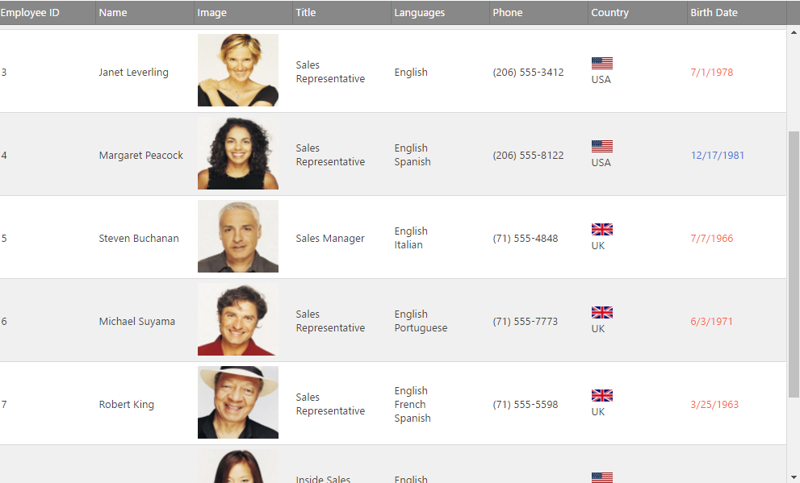
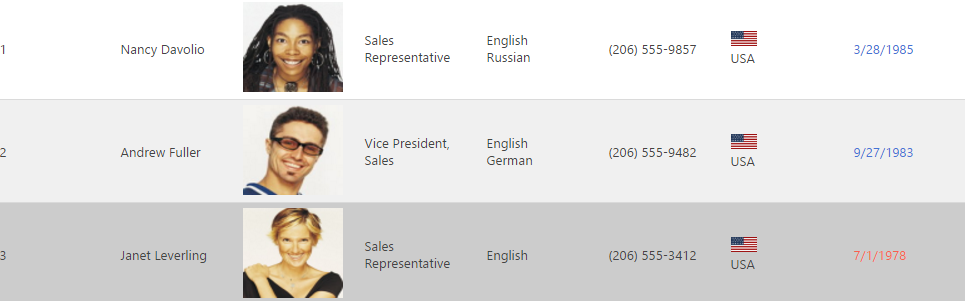

<!--
|metadata|
{
    "fileName": "iggrid-jsrender-integration",
    "controlName": "",
    "tags": []
}
|metadata|
-->

# jsRender Integration (igGrid)

## Topic Overview

### Purpose

This topic contains an overview of the jsRender integration, an explanation of its configuration and a code example for creating a custom column `template` using jsRender syntax.

### Required background

The following table lists the concepts, topics, and articles required as a prerequisite to understanding this topic.

- Topics
	- [Infragistics templating engine](Infragistics-Templating-Engine.html): This section contains topics covering the use the Infragistics® Templating Engine.
- External Resources
	- [jsRender templating engine](https://github.com/BorisMoore/jsrender)


### In this topic

This topic contains the following sections:

-   [**jsRender integration Overview**](#overview)
-   [**Configuring jsRender templating – Conceptual Overview**](#configuring-overview)
-   [**Code Example: Creating a custom column template using jsRender syntax in JavaScript**](#js-example)
	-   [Prerequisites](#js-prerequisites)
	-   [Overview](#js-overview)
	-   [Steps](#js-steps)
-   [**Integration with Row Edit Template and Advanced filter dialog**](#row-edit-filter)
-   [**Related Content**](#related-content)
    -   [Topics](#topics)
    -   [Samples](#samples)


## <a id="overview"></a> jsRender integration Overview

JsRender is a JavaScript library that allows you to define a boilerplate structure once and reuse it to generate HTML dynamically. JsRender brings a new templating library to HTML5 development that has a codeless tag syntax and high performance, has no dependency on jQuery nor on the Document Object Model (DOM), supports creating custom functions and uses pure string-based rendering.

Since v13.2 igGrid supports jsRender templating. It is controlled by the option [`templatingEngine`](%%jQueryApiUrl%%/ui.iggrid#options:templatingEngine). The default value of the option is “infragistics” and in this case the `igGrid` is using the Infragistics templating engine for rendering the templates in the control. You need to set the property to “jsRender” in order to use it as templating engine.

The screenshot below is of a grid rendered with jsRender . 




## <a id="configuring-overview"></a> Configuring jsRender templating – Conceptual Overview

By default, the igGrid control uses the Infragistics template engine. Consequently, in order to use jsRender you need to configure it explicitly using the [`templatingEngine`](%%jQueryApiUrl%%/ui.iggrid#options:templatingEngine) option. This is done differently in JavaScript and ASP.NET MVC.


The following table briefly explains how to configure jsRender templating for the igGrid control. For details, refer to the code example following the table.

To use jsRender as templating engine in… | Do this…
---|---
JavaScript | In the configuration of the `igGrid` set the `templatingEngine` option value to “jsRender”.
ASP.NET MVC | In the configuration of the `Grid` set the parameter’s value of the `TemplatingEngine` method to be `GridTemplatingEngine.JsRender`.


## <a id="js-example"></a> Code Example: Creating a custom column template using jsRender syntax in JavaScript

This procedure explains how to create a custom column [`template`](%%jQueryApiUrl%%/ui.iggrid#options:columns.template) in `igGrid` using the jsRender syntax, helper functions.

### Preview

The following screenshot previews of the result. In this example the rows the cells with Birth Date before 1950 use a blue colored font; otherwise, the font color is red. The country cell is templated with an image.



### <a id="js-prerequisites"></a> Prerequisites

To complete the procedure, you need the following:

1.  The required Ignite UI JavaScript and CSS files for version 13.2
2.  The jsRender library referenced on the page

**In JavaScript:**

```js
<script type="text/javascript" src="http://cdn.jsdelivr.net/jsrender/1.0pre35/jsrender.js"></script>
```

### <a id="js-overview"></a> Overview

Following is a conceptual overview of the process:

1.  Configuring the `igGrid` to use jsRender templating engine
2.  Creating a string column templates
3.  Declaring a helper function specific to the template
4.  Setting the column template values

### <a id="js-steps"></a> Steps

Following are the general conceptual steps for Binding `igGrid` to DataTable with manually created columns and enabled updating feature.

1. **Configure the `igGrid` to use the jsRender templating engine**

	Set the value of the `templatingEngine` option to be “jsRender”
	
	Defines the columns as an array for other functions for creating the column `template`.
	
	**In JavaScript:**
	
	```js
	 $("#grid12").igGrid({
                width: "100%",
                height: "600px",
                autoGenerateColumns: false,
                autoCommit:true,
                columns: [
                        { headerText: "Employee ID", key: "ID", dataType: "number" },
                        { headerText: "Name", key: "Name", dataType: "string" },
                        { headerText: "Image", key: "ImageUrl", dataType: "object" },
                        { headerText: "Title", key: "Title", dataType: "string" },
						{ headerText: "Languages", key: "Languages", dataType: "object" },
                        { headerText: "Phone", key: "Phone", dataType: "string" },
                        { headerText: "Country", key: "Country", dataType: "string" },
                        { headerText: "Birth Date", key: "BirthDate", dataType: "date" }
                    ],
                dataSource: northwindEmployees,
                primaryKey: "ID",
                templatingEngine: "jsrender"
        });
	```

2. **Declare a helper function specific to the template**

	Define a helper function for converting the string data to Date.
	
	Use this function for comparing dates stored as strings in the data source in the column template .
	
	**In JavaScript:**
	
	```js
	 $.views.helpers(
            {
                toDate: function (val) {
                    return new Date(val);
                }
           });

            $.views.helpers(
            {
                toFullName: function (val) {
                    var name = val.split(',').reverse().join(" ");
                    return name;
                }
            });
	```

3. **Create string column templates**
	
	Define a jsRender template for two columns  
	
	For the template of the column “BirthDate” is used the helper function “toDate” directly in the string context. The template of column Country is using an image.
	
	**In JavaScript:**
	
	```js
	ImageUrl}}></img>

	Country}}.gif'></img>{{>Country}}
	
	<span style='color:{{if #view.hlp('toDate')(BirthDate) > #view.hlp('toDate')('1950-01-01T00:00:00.000')}} blue {{else}} red {{/if}};'>{{>BirthDate}}</span>
	```

4. **Set the column template values**

	Defining the column template option to use the custom jsRender template
	
	**In JavaScript:**
	
	```js
	 $("#grid12").igGrid({
                width: "100%",
                height: "600px",
                autoGenerateColumns: false,
                autoCommit:true,
                columns: [
                        { headerText: "Employee ID", key: "ID", dataType: "number" },
                        { headerText: "Name", key: "Name", dataType: "string", template: "{{>#view.hlp('toFullName')(Name)}}" },
                        {
                            headerText: "Image", key: "ImageUrl", dataType: "object",
                            template: "ImageUrl}}></img>"
                        },
                        { headerText: "Title", key: "Title", dataType: "string" },
                        {
                            headerText: "Languages", key: "Languages", dataType: "object",
                            template: "{{for Languages}}<div>{{:name}}</div>{{/for}}"
                        },
                        { headerText: "Phone", key: "Phone", dataType: "string" },
                        {
                            headerText: "Country", key: "Country", dataType: "string",
                            template: "Country}}.gif'></img> <span style='display: table-cell;vertical-align: middle;'>{{>Country}}</span>"
                        },
                        {
                            headerText: "Birth Date", key: "BirthDate", dataType: "date",
                            template: "<span style='color:{{if #view.hlp('toDate')(BirthDate) > #view.hlp('toDate')('1980-01-01T00:00:00.000')}}#4573D6{{else}}#F75F4F{{/if}};'>{{>BirthDate}}</span>"
                        }
                    ],
                dataSource: northwindEmployees,
                primaryKey: "ID",
                templatingEngine: "jsrender"
        });

	```
5. **Working sample**
<div class="embed-sample">
   [igGrid JsRender Integration](%%SamplesEmbedUrl%%/grid/jsrender-integration)
</div>

## <a id="row-edit-filter"></a> Integration with Row Edit Template and advanced filtering

By default, the Row Edit Template and Advanced filter dialog use the Infragistics templating engine. Setting the `templatingEngine` property to “jsRender”, render both of them using it as a templating engine.

> The templates using the *Infragistics* templating engine are not compatible with the jsRender templating engine. In order to use the jsRender you should rewrite all the column templates, responsive configuration templates and your custom row edit templates in its syntax.


## <a id="related-content"></a> Related Content

### <a id="topics"></a> Topics

The following topics provide additional information related to this topic.

- [Creating a Basic Column Template](Creating-a-Basic-Column-Template-in-the-igGrid.html): This topic demonstrates how to create basic column template for the `igGrid`.

- [Configuring Column Templates (igGrid, RWD Mode)](igGrid-Responsive-Web-Design-Mode-Configuring-Row-and-Column-Templates.html): This topic explains, with code examples, how to define column templates for the individual Responsive Web Design (RWD) mode configurations of the `igGrid`™ control and how to configure automatic change of template when switching the active RWD mode configuration.


 

 


