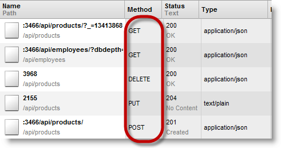

<!--
|metadata|
{
    "fileName": "iggrid-rest-updating",
    "controlName": "igGrid",
    "tags": ["API","Editing","Grids"]
}
|metadata|
-->

# REST Updating (igGrid)

## Topic Overview

### Purpose

This topic explains `igGrid`™ support for REST services.

### Required background

The following table lists the topics and articles required as a prerequisite to understanding this topic.

- Concepts
	-   REST
	-   OData
	-   HTTP
- Topics
	- [igGrid Overview](igGrid-Overview.html): The `igGrid` is a jQuery-based client-side grid that is responsible for presenting and manipulating tabular data. Its whole lifecycle is on the client-side making it independent of any specific server-side technology.
	- [igGrid/igDataSource Architecture Overview](igGrid-igDataSource-Architecture-Overview.html): This document explains the architecture of `igDataSource`.
	- [Binding to REST Services (igDataSource)](igDataSource-Binding-to-REST-Services.html): This document demonstrates how to bind REST services to the Ignite UI™ data source, or `igDataSource`, control.
- External Resources
	-   Representational State Transfer (REST)
	-   Open Data Protocol
	-   HTTP/1.1 RFC


#### In this topic

This topic contains the following sections:

-   [Introduction](#introduction)
-   [igGrid REST Properties](#properties)
-   [Control Configuration Summary](#configuration-summary)
-   [Send batch REST requests](#batch)
-   [Custom style Url](#custom-url)
-   [Creating custom REST serializer](#custom-serializer)
-   [Related Content](#related-content)


## <a id="introduction"></a>Introduction
#### igGrid REST summary

REST frameworks are created on top of the HTTP/1.1 protocol. One of their key features is that they leverage the HTTP/1.1 verbs GET, POST, PUT and DELETE to identify the type of operation in the request.

In order to provide REST support, the `$.ig.RESTDataSource` type was created. REST settings are configured through the [`restSettings`](%%jQueryApiUrl%%/ui.iggrid#options:restSettings) property. The `$.ig.RESTDataSource` collects the data using HTTP verbs. When the [`saveChanges`](%%jQueryApiUrl%%/ui.iggrid#methods:saveChanges) method is called, the `$.ig.RESTDataSource` serializes the request and sends it as a whole (if `batch` is set to true) or in individual entity chunks (if batch is set to false) grouped by verb type.

By default, the `$.ig.RESTDataSource` serializes the requests using the JSON format. Support for other formats can be accomplished by implementing the [`contentSerializer`](%%jQueryApiUrl%%/ui.iggrid#options:restSettings.contentSerializer) function.

The `igGrid` supports REST binding using the `$.ig.RESTDataSource` internally. It inherits all `$.ig.RESTDataSource` options, meaning these options can be set directly on the `igGrid`. In fact, you don’t need to directly configure the `$.ig.RESTDataSource` at all.

It is important to note that `restSettings` are used when the `igGridUpdating` feature is enabled. On calling `saveChanges`, all the inserted rows are sent in a POST request, all deleted rows are sent with a DELETE request and all updated rows are sent with a PUT request.

REST support is implemented on the client side. On the server side you can use any technology which can produce a REST service. For example you can use an ASP.NET MVC 4 WebAPI implementation or you can create your own in ASP.NET MVC2/3.

There are two modes of a REST request. One is batch mode and the other is non-batch mode. The modes differ by how they package the data and also how they construct the URL. In the following tables you can see the request specifics defined by each REST mode:

Non-batch default URL parameter table:

Http Method/Verb | Request body | URL parameter placeholder | Example
---|---|---|---
POST | Single object | /api/{controller} | /api/products
PUT | Single object | /api/{controller}/{id} | /api/products/1
DELETE | Empty | /api/{controller}/{id} | /api/products/1


Batch default URL parameter table:

Http Method/Verb | Request body | URL parameter placeholder | Example
---|---|---|---
POST | Array of objects | /api/{controller} | /api/products
PUT | Array of objects | /api/{controller}/?index={id0}&index={id1} | /api/products/?index=3070&index=815
DELETE | Empty | /api/{controller}/?index={id0}&index={id1} | /api/products/?index=3070&index=815


> **Note:** In the `igGrid`, `restSettings` can be set dynamically at runtime.

It is possible to set the `url` only for one verb in the rest settings and the `url` is used by the other verbs. This behavior is only valid for the `url` option. Batch and Template options are not re-used between the verb settings.

Example:

The following code:

**In JavaScript:**

```js
restSettings: {
    create: {
        url: "/api/products/"
    }
}
```

Is interpreted as:

**In JavaScript:**

```js
restSettings: {
    create: {
        url: "/api/products/"
    },
    update: {
        url: "/api/products/"
    },
    remove: {
        url: "/api/products/"
    }
}
```

In the following screenshot you can see the REST request made by the `igGrid` when the [`saveChanges`](%%jQueryApiUrl%%/ui.iggrid#methods:saveChanges) method is executed.




## <a id="properties"></a>igGrid REST Options

The following table explains the options of the `igGrid` REST settings and lists the default and recommended values.

<table class="table table-striped">
	<thead>
		<tr>
            <th>
Option
			</th>
            <th>
Type
			</th>
            <th>
Description
			</th>
            <th>
Default Value
			</th>
        </tr>
	</thead>
	<tbody>
        <tr>
            <td>
[restSettings](%%jQueryApiUrl%%/ui.iggrid#options:restSettings)
			</td>
            <td>
object
			</td>
            <td>
This is the object containing the REST settings. There are REST options for Create, Update and Delete requests.
			</td>
            <td>
-
			</td>
        </tr>

        <tr>
            <td>
[restSettings.create](%%jQueryApiUrl%%/ui.iggrid#options:restSettings.create)
			</td>
            <td>
object
			</td>
            <td>
This is the object which holds the create requests settings.
			</td>
            <td>
-
			</td>
        </tr>

        <tr>
            <td>
[restSettings.create.url](%%jQueryApiUrl%%/ui.iggrid#options:restSettings.create.url)
			</td>

            <td>
string
			</td>

            <td>
This option specifies a remote URL to which create requests are sent.
			</td>
            <td>
null
			</td>
        </tr>

        <tr>
            <td>
[restSettings.create.template](%%jQueryApiUrl%%/ui.iggrid#options:restSettings.create.template)
			</td>
            <td>
string
			</td>
            <td>
This option specifies a remote URL template. The ${id} placeholder is used in place of the resource id.
                <blockquote>
**Note:**: When you set the template option, the url option is not taken into account.
                </blockquote>
                <blockquote>
**Note:** This option is only valid in the context of non-batch requests.
                </blockquote>
            </td>
            <td>
null
			</td>
        </tr>
        <tr>
            <td>
[restSettings.create.batch](%%jQueryApiUrl%%/ui.iggrid#options:restSettings.create.batch)
			</td>
            <td>
false
			</td>
            <td>
This option specifies whether create requests are sent in batches.
			</td>
            <td>
false
			</td>
        </tr>

        <tr>
            <td>
[restSettings.update](%%jQueryApiUrl%%/ui.iggrid#options:restSettings.update)
			</td>
            <td>
object
			</td>
            <td>
This is the object which holds the update requests settings.
			</td>
            <td>
-
			</td>
        </tr>
        <tr>
            <td>
[restSettings.update.url](%%jQueryApiUrl%%/ui.iggrid#options:restSettings.update.url)
			</td>
            <td>
string
			</td>
            <td>
This option specifies a remote URL to which update requests are sent.
			</td>
            <td>
null
			</td>
        </tr>
        <tr>
            <td>
[restSettings.update.template](%%jQueryApiUrl%%/ui.iggrid#options:restSettings.update.template)
			</td>
            <td>
string
			</td>
            <td>
This option specifies a remote URL template. The ${id} placeholder is used in place of the resource id.
                <blockquote>
**Note:** When you set the template option, the url option is not taken into account.
                </blockquote>
                <blockquote>
**Note:** This option is only valid in the context of non-batch requests.
                </blockquote>
            </td>
            <td>
null
			</td>
        </tr>
        <tr>
            <td>
[restSettings.update.batch](%%jQueryApiUrl%%/ui.iggrid#options:restSettings.update.batch)
			</td>
            <td>
false
			</td>
            <td>
This option specifies whether update requests will be sent in batches.
			</td>
            <td>
false
			</td>
        </tr>

        <tr>
            <td>
[restSettings.remove](%%jQueryApiUrl%%/ui.iggrid#options:restSettings.remove)
			</td>
            <td>
object
			</td>
            <td>
This is the object which holds the remove requests settings.
			</td>
            <td>
-
			</td>
        </tr>
        <tr>
            <td>
[restSettings.remove.url](%%jQueryApiUrl%%/ui.iggrid#options:restSettings.remove.url)
			</td>
            <td>
string
			</td>
            <td>
This option specifies a remote URL to which remove requests are sent.
			</td>
            <td>
null
			</td>
        </tr>

        <tr>
            <td>
[restSettings.remove.template](%%jQueryApiUrl%%/ui.iggrid#options:restSettings.remove.template)
			</td>

            <td>
string
			</td>
            <td>
This option specifies a remote URL template. The ${id} placeholder is used in place of the resource id.
                <blockquote>
**Note:** When you set the template option, the url option is not taken into account.
                </blockquote>
                <blockquote>
**Note:** This option is only valid in the context of non-batch requests.
                </blockquote>
            </td>
            <td>
null
			</td>
        </tr>
        <tr>
            <td>
[restSettings.remove.batch](%%jQueryApiUrl%%/ui.iggrid#options:restSettings.remove.batch)
			</td>
            <td>
bool
			</td>
            <td>
This option specifies whether remove requests are sent in batches.
			</td>
            <td>
false
			</td>
        </tr>
        <tr>
            <td>
[restSettings.encodeRemoveInRequestUri](%%jQueryApiUrl%%/ui.iggrid#options:restSettings.encodeRemoveInRequestUri)
			</td>
            <td>
bool
			</td>
            <td>
This option specifies whether the ids of the deleted resources are sent through the request URI as a query string with keys index.
                <blockquote>
**Note:** This option is only valid in the context of batch requests.
                </blockquote>
            </td>
            <td>
true
			</td>
        </tr>
        <tr>
            <td>
[restSettings.contentSerializer](%%jQueryApiUrl%%/ui.iggrid#options:restSettings.contentSerializer)
			</td>
            <td>
function
			</td>
            <td>
Specifies a custom function to serialize content sent to the server.
			</td>
            <td>
null
			</td>
        </tr>
        <tr>
            <td>
[restSettings.contentType](%%jQueryApiUrl%%/ui.iggrid#options:restSettings.contentType)
			</td>
            <td>
string
			</td>
            <td>
Specifies the content type of the request
			</td>
            <td>
'application/json; charset=utf-8'
			</td>
        </tr>
    </tbody>
</table>


## <a id="configuration-summary"></a>Control Configuration Summary
<table class="table table-striped">
	<thead>
		<tr>
            <th> Configurable aspects </th>
            <th> Details </th>
            <th> Options </th>
        </tr>
	</thead>
	<tbody>
        <tr>
            <td>
[Send batch REST requests](#batch)
			</td>
            <td>
You can choose how data is sent to the server. One way is to make requests for each entity. The other is to wrap the entities and make one request.
			</td>
            <td>
                <ul>
                    <li>
[restSettings.create.batch](%%jQueryApiUrl%%/ui.iggrid#options:restSettings.create.batch)
					</li>
                    <li>
[restSettings.update.batch](%%jQueryApiUrl%%/ui.iggrid#options:restSettings.update.batch)
					</li>
                    <li>
[restSettings.remove.batch](%%jQueryApiUrl%%/ui.iggrid#options:restSettings.remove.batch)
					</li>
                </ul>
            </td>
        </tr>
        <tr>
            <td>
[Custom style URL](#custom-url)
			</td>
            <td>
Shows how to define a custom URL. You can use it to create OData-like URLs.
			</td>
            <td>
                <ul>
                    <li>
[restSettings.create.template](%%jQueryApiUrl%%/ui.iggrid#options:restSettings.create.template)
					</li>
                    <li>
[restSettings.update.template](%%jQueryApiUrl%%/ui.iggrid#options:restSettings.update.template)
					</li>
                    <li>
[restSettings.remove.template](%%jQueryApiUrl%%/ui.iggrid#options:restSettings.remove.template)
					</li>
                </ul>
            </td>
        </tr>
        <tr>
            <td>
[Creating a custom REST serializer](#custom-serializer)
			</td>
            <td>
The $.ig.RESTDataSource supports JSON serialization out of the box. However, you can implement a custom serializer.
			</td>
            <td>
                <ul>
                    <li>
[restSettings.contentType](%%jQueryApiUrl%%/ui.iggrid#options:restSettings.contentType)
					</li>
                    <li>
[restSettings.contentSerializer](%%jQueryApiUrl%%/ui.iggrid#options:restSettings.contentSerializer)
					</li>
                </ul>
            </td>
        </tr>
    </tbody>
</table>


## <a id="batch"></a>Send batch REST requests

The `$.ig.RESTDataSource` supports two types of requests:

-   Non-batch mode – in this mode, the data source sends each individual entity in a separate Ajax call to the server.
-   Batch mode – in this mode, the data source wraps all the entities by verb type and sends them with up to tree Ajax calls to the server.

### Option settings

The following table maps the desired configuration to option settings.


In order to: | Use this option: | And set it to:
---|---|---
Send batch REST requests for new entities | [restSettings.create.batch](%%jQueryApiUrl%%/ui.iggrid#options:restSettings.create.batch) | true
Send batch REST requests for updated entities | [restSettings.update.batch](%%jQueryApiUrl%%/ui.iggrid#options:restSettings.update.batch) | true
Send batch REST request for deleted entities | [restSettings.remove.batch](%%jQueryApiUrl%%/ui.iggrid#options:restSettings.remove.batch) | true


### Example

The screenshot below demonstrates how the `$.ig.RESTDataSource` behaves as a result of the following settings:

Option | Value
-------|-------
[restSettings.create.batch](%%jQueryApiUrl%%/ui.iggrid#options:restSettings.create.batch) | true


## <a id="custom-url"></a>Custom style URL

By default, the `$.ig.RESTDataSource` constructs the destination URL as explained earlier in the topic. If you have different routing logic on the server, then you can use a URL template to define your URLs. You can also use the URL template to construct OData-compatible URLs.

> **Note:** Currently, ${id} is the only supported placeholder in the template string.

### Option settings

The following table maps the desired configuration to option settings.

In order to: | Use this option: | And set it to:
---|---|---
Set custom URL template for PUT request | [restSettings.update.template](%%jQueryApiUrl%%/ui.iggrid#options:restSettings.update.template) | Custom URL template string. For example: “/api/products/Update(${id})”
Set custom URL template for DELETE request | [restSettings.remove.template](%%jQueryApiUrl%%/ui.iggrid#options:restSettings.remove.template) | Custom URL template string. For example: “/api/products/Remove(${id})”


### Example

The screenshot below demonstrates how the `$.ig.RESTDataSource` behaves
as a result of the following settings:

Option | Value
-------|-------
[restSettings.remove.template](%%jQueryApiUrl%%/ui.iggrid#options:restSettings.remove.template) | “/api/products/Remove(${id})”


## <a id="custom-serializer"></a>Creating custom REST serializer

The `$.ig.RESTDataSource` supports JSON serialization out of the box. However you can implement a custom serializer.

### Option settings

The following table maps the desired configuration to option settings.

In order to: | Use this option: | And set it to:
---|---|---
Serialize data as XML | [contentType](%%jQueryApiUrl%%/ui.iggrid#options:restSettings.contentType) | “application/xml; charset=utf-8”
 | [contentSerializer](%%jQueryApiUrl%%/ui.iggrid#options:restSettings.contentSerializer) | A function which accepts one argument and returns a string containing the serialized data. <br /> In case of a batch request this argument is an array of objects where the objects’ types match the type of the data source entity. <br /> In case of a non-batch request, this argument is an object –who’s type matches the type of the data source entity.


### Example

The screenshot below demonstrates how the `$.ig.RESTDataSource` behaves as a result of the following settings:

- `contentType`
	- “application/xml; charset=utf-8”
- `contentSerializer` 
	- **In JavaScript:**
		```js
		function (ds) {
		    // if ds contains JavaScript object literal like this: {"ID":9,"Name":"Product","Price":90.0,"Quantity":2 } then you can serialize it in XML like this
		    return "<Product><ID>" + ds.ID + "</ID><Name>" + ds.Name + "</Name><Price>" + ds.Price + "</Price><Quantity>" + ds.Quantity + "</Quantity></Product>";    
		}
		```


## <a id="related-content"></a> Related Content

### <a id="topics"></a> Topics

The following topics provide additional information related to this topic.

- [Binding to Web Services](igGrid-Binding-to-Web-Services.html): This document demonstrates how to bind the Ignite UI™ grid, or `igGrid`, to an OData protocol web-based data source.

- [Getting started with igGrid, OData and WCF Data Services](igGrid-Getting-Started-With-igGrid-oData-and-WCF-Data-Services.html): This topic demonstrates how to setup a client-side jQuery grid with remote paging, filtering, and sorting by setting up a WCF Data Service in an ASP.NET Web Application and setting two options on the `igGrid`.


 

 


