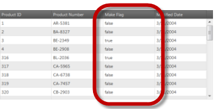
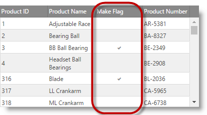

<!--
|metadata|
{
    "fileName": "iggrid-columns-and-layout",
    "controlName": "igGrid",
    "tags": ["Grids","Layouts"]
}
|metadata|
-->

# Columns and Layout (igGrid)


## Overview

This document will get you acquainted with `igGrid` Layout and Columns Settings.

### In this topic

This topic contains the following sections:

-   [Defining Widths and Height](#width-height)
-   [Defining Columns](#defining-columns)
-   [Column Formatting](#column-formatting)
-   [Cell Text Alignment](#cell-text-alignment)
-   [Defining Mapper function for Column](#defining-mapper)
-   [AutoGenerateColumns](#autoGenerateColumns)
-   [Styling](#styling)
-   [Rendering Checkboxes on a Column](#checkboxes)
-   [Related Content](#related-content)


## <a id="width-height"></a> Defining Widths and Height

You can control the way grid layout is handled by defining width and height of the control. The accepted values for width/height are defined as:

Table 1: Width and Height value formats

Value Format | Accepted Value(s)
---|---
Strings | Both “500” and “500px” are valid
Numbers | 500 (translates to 500px)
Percentage Strings | “50%”, “100%”, etc.


If width and height are defined, the grid is wrapped in a scrolling DIV element. When height is set, and `fixedHeaders` is set to true (default), the grid headers remain fixed while the user is scrolling.

> **Note:** You can also specify widths for individual columns, which can be seen at the sample.

There are several scenarios that affect the rendering of the grid when widths and height are set.

Table 2: Effects of enabling/disabling fixed headers and scrolling

Fixed Headers | Scrolling | Details
---|---|---
No | No | If column widths are defined, the grid stretches according to the widths. If no column widths are defined, the grid stretches according to the data.
Yes | Yes | Headers are rendered in a separate table, inside of a DIV (so that if there is width set on the grid and it has horizontal scrollbar, the headers table is in sync with the contents, while scrolling).
No | Yes | The header’s element is rendered inside of a single table – where the data is hosted. There is no separate TABLE or DIV.

The sample below demonstrates how to set up different layout properties of the `igGrid`. The following properties are exposed: 
- `caption` – caption text that will be shown above the grid header.
- `fixedHeaders` - the column headers can be fixed so they are visible while scrolling.
- `defaultColumnWidth` - when columns don’t have width assigned in the columns collection.
- `width` (columns) – the width that is applied to the column.
- `width` - the width of the grid. If a column’s width exceeds the grid’s width then a horizontal scroll bar appears.

<div class="embed-sample">
    [Grid Layout](%%SamplesEmbedUrl%%/grid/grid-layout)
</div>

## <a id="defining-columns"></a> Defining Columns

Grid columns are defined by adding objects to the columns grid option as shown in Listing 1.

Listing 1: Defining columns as an option to the grid

**In Javascript:**

```js
$("#grid1").igGrid({
       autoGenerateColumns: false, columns: [
            { 
                headerText: "Country Code", 
                key: "Code", 
                width: "100px", 
                dataType: "string", 
                formatter: <formatter function>, 
                format: "" 
            },
            { 
                headerText: "Date", 
                key: "Date", 
                width: "100px", 
                dataType: "date", 
                format: "dateLong"
            },
            { 
                headerText: "Country Name", 
                key: "Name", 
                width: "80px", 
                dataType: "string"
            }
        ],
    responseDataKey: 'records',
    dataSource: remoteService,
    height: '400px'
});
```


A column definition is a JavaScript object containing at least a key property. It may also contain:

-   Header Text: via the `headerText` option
-   Width: via the `width` option (number or string – px or % or "*")
-   Data Type: via the `dataType` option

Defining column width to "*" will auto-size the column when the grid is initialized. Auto-sizing applies the width of the widest cell content (including header and footer cells) that is currently visible. Auto-sizing doesn't work when virtualization is enabled.

The `format` and `dataType` options may be configured a number of different ways.

-   The `dataType` can be a string, number, date, bool or object
-   The `format` column property corresponding to dataType=”date” (Date objects) can be “date”, “dateLong” , “dateLong” , “dateTime” , “timeLong” or explicit pattern like “MM-dd-yyyy h:mm:ss tt”. See [Formatting Dates](Formatting-Dates-Numbers-and-Strings.html#formatting-dates) for details on the valid custom date format specifiers.
-   The `format` column property corresponding to dateType=”number” (number objects) or for dataType=”string” can be “number”, “double” , “int” , “currency” , “percent”. See [Formatting Numbers](Formatting-Dates-Numbers-and-Strings.html#formatting-numbers) for details on the valid custom number format specifiers.
-   The `format` column property corresponding to dateType=”bool” (bool objects) can be “checkbox”.
-   If `dataType`=”number”, then the corresponding format also can be set to something like “0.0###”, “#.##”, “0.000” etc. In this case number of zeros after the decimal point define minimum decimal places and overall number of characters after decimal point defines number of maximum decimal places. See [Formatting Numbers](Formatting-Dates-Numbers-and-Strings.html#formatting-numbers) for details on the valid custom number format specifiers.
-   If `dataType` is not “date” or “number”, then the corresponding format can contain “{0}” flag. In this case that flag is replaced by the value of cell.For example, if format=”Name: {0}” and value is cell is “Bob”, then cell will be rendered as “Name: Bob” (see [Formatting Strings](Formatting-Dates-Numbers-and-Strings.html#formatting-strings) for details).

## <a id="column-formatting"></a> Column Formatting

Column formatting defines how column cell values are displayed in the grid. Formatting operates at the grid rendering phase and doesn't affect the data in the underlying data source. This means that features that operate on the data like Sorting, Filtering, Group By will not consider the formatted cell values.

Column formatting (rendering) is affected by several `igGrid` options. These are column's [`formatter`](%%jQueryApiUrl%%/ui.iggrid#options:columns.formatter), [`format`](%%jQueryApiUrl%%/ui.iggrid#options:columns.format) and [`template`](%%jQueryApiUrl%%/ui.iggrid#options:columns.template). Additionally there's grid's [`autoFormat`](%%jQueryApiUrl%%/ui.iggrid#options:autoFormat) option which affects how the regional settings are applied to the grid.

-  [`autoFormat`](%%jQueryApiUrl%%/ui.iggrid#options:autoFormat) - is a string which identifies how the regional settings are applied globally on the grid for "date" and "number" columns. By default only "date" columns are formatted according the regional settings. This option is overridden by [`format`](%%jQueryApiUrl%%/ui.iggrid#options:columns.format) and [`formatter`](%%jQueryApiUrl%%/ui.iggrid#options:columns.formatter) options if available.

 > **Note:** Regional settings can be accessed with the following expression: 
 ```js
 $.ig.regional.defaults;
 ```
 
 Here is the flow of column rendering when no format decorators are used: 
 ```
 Raw Value -> autoFormat -> (template)* -> Cell Value
 * - optional setting
 ```

 > **Note:** By default when there are no column rendering decorators applied and the Raw Value is null, undefined or empty string ("") a non-breaking space (`&nbsp;`) is rendered instead in the cell.
 
-  [`formatter`](%%jQueryApiUrl%%/ui.iggrid#options:columns.formatter) - is a function or a string name of a function bound to the global window object. It gives you full control on rendering the data source value. When defining formatter function it's up to you to control the format and regional representation of the value. There is a utility function [`$.ig.formatter(rawValue, dataType, formatPattern)`](Formatting-Dates-Numbers-and-Strings.html) which can be used for formatting values either using the regional settings or using custom format pattern.

 **In Javascript:**
 ```js
 var formattedValue = $.ig.formatter(new Date()); //formats the date according to the current regional settings.
 var formattedValue = $.ig.formatter(1000000); //formats the number according to the current regional settings.
 ```

 [`formatter`](%%jQueryApiUrl%%/ui.iggrid#options:columns.formatter) and [`format`](%%jQueryApiUrl%%/ui.iggrid#options:columns.format) options do not operate at the same time. When defined, [`formatter`](%%jQueryApiUrl%%/ui.iggrid#options:columns.formatter) function is considered with priority and [`format`](%%jQueryApiUrl%%/ui.iggrid#options:columns.format) is not used. However value from the [`formatter`](%%jQueryApiUrl%%/ui.iggrid#options:columns.formatter) function is further decorated with a [`template`](%%jQueryApiUrl%%/ui.iggrid#options:columns.template).

 Here is the flow of column rendering when formatter is used:
 ```
 Raw Value -> formatter -> (template)* -> Cell Value
 * - optional setting
 ```

-  [`format`](%%jQueryApiUrl%%/ui.iggrid#options:columns.format) - is a string identifying a format patterns. Internally [`format`](%%jQueryApiUrl%%/ui.iggrid#options:columns.format) option uses the `$.ig.formatter(rawValue, dataType, formatPattern)` function. When set, [`format`](%%jQueryApiUrl%%/ui.iggrid#options:columns.format) overrides the setting of the [`autoFormat`](%%jQueryApiUrl%%/ui.iggrid#options:autoFormat) option and also the default regional settings.

 Here is the flow of column rendering when [`format`](%%jQueryApiUrl%%/ui.iggrid#options:columns.format) is used:

 ```
 Raw Value -> format -> (template)* -> Cell Value 
 * - optional setting
 ```

- [`template`](%%jQueryApiUrl%%/ui.iggrid#options:columns.template) - is a templated string (templating engine used is defined in the `templatingEngine` option). See [Templating Engine Overview](igTemplating-Overview.html) topic for details on template syntax. 
 
 Here is the flow of column rendering when [`template`](%%jQueryApiUrl%%/ui.iggrid#options:columns.template) is used:
 
 ```
 Raw Value -> (autoFormat|format|formatter)* -> template -> Cell Value 
 * - optional setting
 ```

- [`columnCssClass`](%%jQueryApiUrl%%/ui.iggrid#options:columns.columnCssClass) - is a space-separated list of CSS classes that are applied to the TD element of the cell.  
 When the [`template`](%%jQueryApiUrl%%/ui.iggrid#options:columns.template) option defines the rendering of the TD element the [`columnCssClass`](%%jQueryApiUrl%%/ui.iggrid#options:columns.columnCssClass) option is ignored (see the example below). 
 Here is the flow of column rendering when [`columnCssClass`](%%jQueryApiUrl%%/ui.iggrid#options:columns.columnCssClass) is used:
 
 ```
 Raw Value -> (autoFormat|format|formatter)* -> columnCssClass -> template* -> Cell Value 
 * - optional setting
 ```

Example:
```js
$("#grid1").igGrid({
    autoGenerateColumns: false,
    columns: [ {
            headerText: "Product Number", 
            key: "ProductNumber",
            dataType: "number",
            // NOTE: columnCssClass will be applied
            columnCssClass: "align-right",
            template: "<a href='/product/${ProductNumber}'>${ProductNumber}</a>"
        }, {
            headerText: "Modified Date",  
            key: "ModifiedDate",  
            dataType: "date",
            // NOTE: columnCssClass will NOT be applied
            columnCssClass: "align-center",
            template: "<td style='font-weight: bold'>${ModifiedDate}</td>"
        }
    ]
});
```

- [`headerCssClass`](%%jQueryApiUrl%%/ui.iggrid#options:columns.headerCssClass) - is a space-separated list of CSS classes that are applied to the TH element of the column header text configured by the [`headerText`](%%jQueryApiUrl%%/ui.iggrid#options:columns.headerText) option.   
 Here is the flow of column rendering when [`headerCssClass`](%%jQueryApiUrl%%/ui.iggrid#options:columns.headerCssClass) is used:
 
 ```
 Raw `headerText` Value -> headerCssClass -> Header Text Value 
 ```

## <a id="cell-text-alignment"></a> Cell Text Alignment

By default the cell text in igGrid is left aligned. To customize the cell text alignment use [`columnCssClass`](%%jQueryApiUrl%%/ui.iggrid#options:columns.columnCssClass) option. Just create custom CSS classes to align the text to the desired direction and then apply them to the column using the `columnCssClass`.

The sample below demonstrates how to customize the grid cell text alignment. The grid's "Product ID" and "Reorder Point" numeric columns text is aligned to the right. This is done by applying a custom CSS class to the column cells. The CSS class is configured in the grid column's `columnCssClass` property.

<div class="embed-sample">
   [igGrid Configure Text Alignment](%%SamplesEmbedUrl%%/grid/configure-text-alignment)
</div>

## <a id="defining-mapper"></a> Defining Mapper function for column

The mapper function can be used in scenarios where you have a complex data object and you need to extract specific property from it, which will define both the display value and the value used for data operations on that column.
For such scenarios the column dataType needs to be specified as "object" and a mapper function can be used to extract the desired data from the record. 
The mapping is done on a data source level and will allow all data operations to be executed based on the mapped values.
For instance if we have a complex object in each record in the data source as in the following example: 
```js
var data = [{ "ID": 0, "Name": "Bread", "Description": "Whole grain bread", "Category":  { "ID": 0, "Name": "Food", "Active": true }},
{ "ID": 1, "Name": "Milk", "Description": "Low fat milk",  "Category":   { "ID": 1, "Name": "Beverages", "Active": true } },
 ...
 ];
```
and would like to display a specific property, or computed value from multiple properties of the 'Category' object( for example we'd like to map the value to contain the ID and Name sub-field values in a single string), we can do so via the `mapper` function.

Example:

**In Javascript:**
```js
	mapper: function(record){
	//extracting data from complex object
	return record.Category.ID + " : " + record.Category.Name;
	}				

```
The function is defined via the [`mapper`](%%jQueryApiUrl%%/ui.iggrid#options:columns.mapper) column option as shown in Listing 2. It allows specifying values per data record to be used for all data operations related to the specific column. 
The function accepts a single parameter, which contains the whole data record and should return a single simple value per record. 

> **Note:** The function will be invoked each time the grid needs to extract data from the data source for this column. This includes any data rendering or data manupulation operations related to the column. Due to this note that if you have complex data extraction and/or calculation logic there will be a performance impact.

Listing 2: Defining mapper function for a column in igGrid

**In Javascript:**

```js
  $("#grid").igGrid({
  columns: [
                    { headerText: "", key: "ID", dataType: "number", width: "200px" },
                    { headerText: "Name", key: "Name", dataType: "string", width: "200px" },
                    { headerText: "Description", key: "Description", dataType: "string", width: "200px" },
                    { headerText: "Category", key: "Category", dataType: "object", width: "200px",
						mapper: function(record){
								//extracting data from complex object
								return record.Category.Name;
							}					
					}
                ],
                autoGenerateColumns: false,
                dataSource: northwindProductsJSON,         
               ...
});

```

## <a id="autoGenerateColumns"></a> AutoGenerateColumns

Whenever `autoGenerateColumns` is set to *false*, you are required to manually define columns in the columns array. When `autoGenerateColumns` is *true* (default), you are not required to specify columns. In that case the grid will infer columns automatically from the data source (assuming there is at least one row in it) and add them to the columns collection. Header texts are automatically generated as well, and are equivalent to the keys in the data source. Setting column widths for auto-generated columns is done with `defaultColumnWidth` option, which will apply one and the same column width for all generated columns. When remote data binding is used, header texts are automatically generated only when data is available from the backend on the client. However, in most real-world scenarios it’s best to explicitly define columns.

When `autoGenerateColumns` is set to true, and you have manually defined columns, there are a few possible scenarios for how the columns render to the user:

-   When your defined column count matches the count of columns found in the data source, the grid renders them in the order you have defined them in the columns collection. Also, the grid respects the header text, *dataType*, width, and format (if any) that you have specified.
-   When your defined column count does not match the count of columns found in the data source, your defined are rendered first, and then all remaining columns from the data source are automatically generated and appended to the grid after the defined columns.

> **Note:** Note that whenever `autoGenerateColumns` is true, all columns in the data source are rendered all the time. If you would not like to render specific column, you should set `autoGenerateColumns` to false, and then specify your columns in the columns array.

You can also specify widths for every individual column separately. If you have specified column widths, and the grid also has width defined, which happens to be less than the sum of all column widths that you have defined, a horizontal scrollbar is rendered for the grid.

> **Note:** It is not recommended to specify widths for only a few columns, and have a grid width defined at the same time, this results in some columns to appear arbitrary narrow. To help alleviate this problem you can set the `defaultColumnWidth` grid option.

> **Note:** Updating feature requires `dataType` property to be set when `autoGenerateColumns` is set to false. That's because Updating feature uses primary key to synchronize records between the grid and the underlying data source and the primary key is compared by value and type.

The sample below shows the auto-generate columns functionality of igGrid. When columns are auto-generated their header captions are taken from the data source field names. The `autoGenerateColumns` option is used in combination with `defaultColumnWidth` option.
<div class="embed-sample">
   [igGrid Auto-Generate Columns](%%SamplesEmbedUrl%%/grid/auto-generate-columns)
</div>

## <a id="styling"></a> Styling

The jQuery grid is fully jQuery UI Theme Roller compatible. Therefore, you can use the Theme Roller web application to generate a custom theme, or use any of the existing themes, to apply to the grid.

If you would like to use the minified and combined styles, which is preferred, you must include the CSS definitions found in Listing 2.

Listing 2: Required stylesheet definitions

**In Javascript:**

```js
<link type="text/css" href="infragistics.theme.css" rel="stylesheet" />
<link type="text/css" href="infragistics.css" rel="stylesheet" />
```

The first CSS, *jquery.ui.custom.css* represent the actual theme (that is, color-related styling), and you may replace it with any CSS file generated from Theme Roller.

The second CSS is custom to Infragistics Ignite UI and contains layout-related rules that are not available in Theme Roller / jQuery UI. Therefore it is required so the control is ensured to function properly.

If you would like to reference not-combined CSS (used in development scenarios), you can add the references as depicted by Listing 3.

Listing 3: Referencing non-combined or non-minified CSS files

**In Javascript:**

```js
<link type="text/css" href="css/themes/infragistics/infragistics.theme.css" rel="stylesheet" />
<link type="text/css" href="css/structure/modules/infragistics.ui.grid.css" rel="stylesheet" />    
<link type="text/css" href="css/structure/modules/infragistics.ui.shared.css" rel="stylesheet" />    
```

If you would like to change the appearance of any element, you can edit the custom.css file. Another alternative is to define custom CSS rules against the pre-defined class names.

The grid topmost container DIV is prefixed with the class `ui-iggrid`, so you can use this as a selector to target only the grid. Alternatively, you can use the ID of the grid as a selector if you want your custom CSS to be applied only to a specific grid.


## <a id="checkboxes"></a> Rendering Checkboxes on a Column

By default for a column which contains Boolean data types, the `igGrid` shows a string saying true or false. You have, however, the option to make `igGrid` columns display Boolean data as checked or unchecked checkboxes to indicate, respectively, the true and false states of the data items. You render checkboxes on a column by setting the `renderCheckboxes` property to true. Rendering checkboxes requires setting the `dataType` property of the column to bool.

Note that as of 16.1 an improvement in the visual styling of the checkbox is made. It's square box is not going to be rendered when the grid is in display mode. What would be provided is only a plain checkmark. This change is due to refinement of the experience for the end-users, who naturally perceived that this was an interactive element, which they can click to toggle. This is still the case when the `igGrid` enters in edit mode which means that the previous look and feel of checkboxes is preserved for this mode.
Currently the classes are abstracted into the util property `$.ig.checkboxMarkupClasses` which is empty by default. Previous layout of the checkbox can be adopted by the usage of the following classes -
`$.ig.checkboxMarkupClasses = "ui-state-default ui-corner-all ui-igcheckbox-small";`
The property allows custom classes, but any kind of modification should be handled properly so it won't break the layout of the checkbox.

Previous versions of igUpdating had two different behavioral cases for editing checkboxes. First one was when end-user clicks on the checkbox in the cell and the second one was when he clicks outside of the checkbox in the cell. The grid was entering in edit mode in both cases, but in the first one the checkbox value was changed.
Currently there are no differences in behavior for editing checkboxes. It is all consistent. The end-user should enter edit mode first and after that is going to able to change the value of the checkbox.

Here's a suggested workaround to achieve the previous behavior:

-   Specify the following classes before the initialization of the grid:

**In Javascript:**

```js
$.ig.checkboxMarkupClasses = "ui-state-default ui-corner-all ui-igcheckbox-small";
```

-   Add similar event handler for editCellStarted:

**In Javascript:**

```js
features: [
    {
        name: "Updating",
        editMode: "cell",
        editCellStarting: function (evt, ui) {
            if (ui.columnKey === "MakeFlag" && $(evt.originalEvent.target).hasClass("ui-icon-check")) {
                ui.value = !ui.value;
            }
        }
    }
]
```


The example code that follows renders a checkbox on the Make Flag column as shown in the illustration on the right.

<table class="table">
	<tbody>
        <tr>
            <td>

			</td>
            <td>

            </td>
        </tr>
    </tbody>
</table>

Figure 1: A column displaying Boolean values without (left) and with (right) rendered checkboxes

**In Javascript:**

```js
$("#grid1").igGrid({
    autoGenerateColumns: false,
    primaryKey: "ProductID",
    // enabling render checkboxes on a column
    renderCheckboxes: true,
    columns: [ {
            // note: if primaryKey is set and data in primary column contains numbers,
            // then the dataType: "number" is required, otherwise, dataSource may misbehave
            headerText: "Product Number", 
            key: "ProductNumber",
            dataType: "string"
        }, {
            headerText: "Modified Date", 
            key: "ModifiedDate",  
            dataType: "date"
        }
    ],
    dataSource: gridData,
    height: "300px"
});
```
The sample below demonstrates how to enable checkboxes in a boolean column instead of the true/false values.
<div class="embed-sample">
   [igGrid Checkbox Column](%%SamplesEmbedUrl%%/grid/checkbox-column)
</div>

**In ASPX:**

```csharp
<%= Html.Infragistics().Grid(Model).ID("grid1").AutoGenerateColumns(false).PrimaryKey("ProductID").RenderCheckboxes(true).Columns(column =>
    {
        column.For(x => x.ProductID).HeaderText("Product ID").DataType("number");
        column.For(x => x.ProductNumber).HeaderText("Product Number").DataType("string");
        column.For(x => x.MakeFlag).HeaderText("Make Flag").DataType("bool");
        column.For(x => x.ModifiedDate).HeaderText("Modified Date").DataType("date");
        })
        .DataBind().Height("300px").Render()
%>
```
## <a id="related-content"></a> Related Content

### Topic
-   [Ignite UI Overview](NetAdvantage-for-jQuery-Overview.html)
-   [Formatting Dates, Numbers and Strings](Formatting-Dates-Numbers-and-Strings.html)
-   [Templating Engine Overview](igTemplating-Overview.html)
