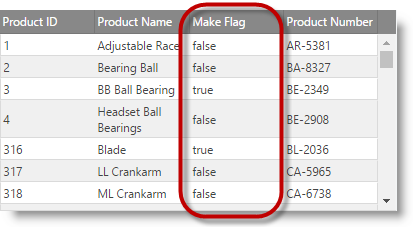

<!--
|metadata|
{
    "fileName": "iggrid-columns-and-layout",
    "controlName": "igGrid",
    "tags": ["Grids","Layouts"]
}
|metadata|
-->

# Columns and Layout (igGrid)


## Overview

This document will get you acquainted with `igGrid` Layout and Columns Settings.

### In this topic

This topic contains the following sections:

-   [Defining Widths and Height](#width-height)
-   [Defining Columns](#defining-columns)
-   [AutoGenerateColumns](#autoGenerateColumns)
-   [Styling](#styling)
-   [Rendering Checkboxes on a Column](#checkboxes)
-   [Related Content](#related-content)


## <a id="width-height"></a> Defining Widths and Height

You can control the way grid layout is handled by defining width and height of the control. The accepted values for width/height are defined as:

Table 1: Width and Height value formats

Value Format | Accepted Value(s)
---|---
Strings | Both “500” and “500px” are valid
Numbers | 500 (translates to 500px)
Percentage Strings | “50%”, “100%”, etc.


If width and height are defined, the grid is wrapped in a scrolling DIV element. When height is set, and `fixedHeaders` is set to true (default), the grid headers remain fixed while the user is scrolling.

> **Note:** You can also specify widths for individual columns, which can be seen at the sample.

There are several scenarios that affect the rendering of the grid when widths and height are set.

Table 2: Effects of enabling/disabling fixed headers and scrolling

Fixed Headers | Scrolling | Details
---|---|---
No | No | If column widths are defined, the grid stretches according to the widths. If no column widths are defined, the grid stretches according to the data.
Yes | Yes | Headers are rendered in a separate table, inside of a DIV (so that if there is width set on the grid and it has horizontal scrollbar, the headers table is in sync with the contents, while scrolling).
No | Yes | The header’s element is rendered inside of a single table – where the data is hosted. There is no separate TABLE or DIV.


## <a id="defining-columns"></a> Defining Columns

Grid columns are defined by adding objects to the columns grid option as shown in Listing 1.

Listing 1: Defining columns as an option to the grid

**In Javascript:**

```js
$("#grid1").igGrid({
       autoGenerateColumns: false, columns: [
            { 
                headerText: "Country Code", 
                key: "Code", 
                width: "100px", 
                dataType: "string", 
                formatter: <formatter function>, 
                format: "" 
            },
            { 
                headerText: "Date", 
                key: "Date", 
                width: "100px", 
                dataType: "date", 
                format: "dateLong"
            },
            { 
                headerText: "Country Name", 
                key: "Name", 
                width: "80px", 
                dataType: "string"
            }
        ],
    responseDataKey: 'records',
    dataSource: remoteService,
    height: '400px'
});
```


A column definition is a JavaScript object containing at least a key property. It may also contain:

-   Header Text: via the `headerText` option
-   Width: via the `width` option (number or string – px or %)
-   Data Type: via the `dataType` option

The format and `dataType` options may be configured a number of different ways.

-   The `dataType` can be a string, number, date or bool
-   The `format` column property corresponding to dataType=”date” (Date objects) can be “date”, “dateLong” , “dateLong” , “dateTime” , “timeLong” or explicit pattern like “MM-dd-yyyy h:mm:ss tt”.
-   The `format` column property corresponding to dateType=”number” (number objects) or for dataType=”string” can be “number”, “double” , “int” , “currency” , “percent”.
-   If `dataType`=”number”, then the corresponding format also can be set to something like “0.0###”, “#.##”, “0.000” etc. In this case number of zeros after the decimal point define minimum decimal places and overall number of characters after decimal point defines number of maximum decimal places.
-   If `dataType` is not “date” or “number”, then the corresponding format can contain “{0}” flag. In this case that flag is replaced by the value of cell.For example, if format=”Name: {0}” and value is cell is “Bob”, then cell will be rendered as “Name: Bob”.


## <a id="autoGenerateColumns"></a> AutoGenerateColumns

Whenever `autoGenerateColumns` is set to *false*, you are required to manually define columns in the columns array. When `autoGenerateColumns` is *true* (default), you are not required to specify columns. In that case the grid will infer columns automatically from the data source and add them to the columns collection. Header texts are automatically generated as well, and are equivalent to the keys in the data source. When remote data binding is used, header texts are automatically generated only when data is available from the backend on the client. However, in most real-world scenarios it’s best to explicitly define columns.

When `autoGenerateColumns` is set to true, and you have manually defined columns, there are a few possible scenarios for how the columns render to the user:

-   When your defined column count matches the count of columns found in the data source, the grid renders them in the order you have defined them in the columns collection. Also, the grid respects the header text, *dataType*, width, and format (if any) that you have specified.
-   When your defined column count does not match the count of columns found in the data source, your defined are rendered first, and then all remaining columns from the data source are automatically generated and appended to the grid after the defined columns.

> **Note:** Note that whenever `autoGenerateColumns` is true, all columns in the data source are rendered all the time. If you would not like to render specific column, you should set `autoGenerateColumns` to false, and then specify your columns in the columns array.

You can also specify widths for every individual column separately. If you have specified column widths, and the grid also has width defined, which happens to be less than the sum of all column widths that you have defined, a horizontal scrollbar is rendered for the grid.

> **Note:** It is not recommended to specify widths for only a few columns, and have a grid width defined at the same time, this results in some columns to appear arbitrary narrow. To help alleviate this problem you can set the `defaultColumnWidth` grid option.

> **Note:** Updating feature requires `dataType` property to be set when `autoGenerateColumns` is set to false. That's because Updating feature uses primary key to synchronize records between the grid and the underlying data source and the primary key is compared by value and type.


## <a id="styling"></a> Styling

The jQuery grid is fully jQuery UI Theme Roller compatible. Therefore, you can use the Theme Roller web application to generate a custom theme, or use any of the existing themes, to apply to the grid.

If you would like to use the minified and combined styles, which is preferred, you must include the CSS definitions found in Listing 2.

Listing 2: Required stylesheet definitions

**In Javascript:**

```js
<link type="text/css" href="infragistics.theme.css" rel="stylesheet" />
<link type="text/css" href="infragistics.css" rel="stylesheet" />
```

The first CSS, *jquery.ui.custom.css* represent the actual theme (that is, color-related styling), and you may replace it with any CSS file generated from Theme Roller.

The second CSS is custom to Infragistics Ignite UI and contains layout-related rules that are not available in Theme Roller / jQuery UI. Therefore it is required so the control is ensured to function properly.

If you would like to reference not-combined CSS (used in development scenarios), you can add the references as depicted by Listing 3.

Listing 3: Referencing non-combined or non-minified CSS files

**In Javascript:**

```js
<link type="text/css" href="css/themes/infragistics/infragistics.theme.css" rel="stylesheet" />
<link type="text/css" href="css/structure/modules/infragistics.ui.grid.css" rel="stylesheet" />    
<link type="text/css" href="css/structure/modules/infragistics.ui.shared.css" rel="stylesheet" />    
```

If you would like to change the appearance of any element, you can edit the custom.css file. Another alternative is to define custom CSS rules against the pre-defined class names.

The grid topmost container DIV is prefixed with the class `ui-iggrid`, so you can use this as a selector to target only the grid. Alternatively, you can use the ID of the grid as a selector if you want your custom CSS to be applied only to a specific grid.


## <a id="checkboxes"></a> Rendering Checkboxes on a Column

By default for a column which contains Boolean data types, the `igGrid` shows a string saying true or false. You have, however, the option to make `igGrid` columns display Boolean data as checked or unchecked checkboxes to indicate, respectively, the true and false states of the data items. You render checkboxes on a column by setting the `renderCheckboxes` property to true. Rendering checkboxes requires setting the `dataType` property of the column to bool.

The example code that follows renders a checkbox on the Make Flag column as shown in the illustration on the right.

<table class="table">
	<tbody>
        <tr>
            <td>

			</td>
            <td>

            </td>
        </tr>
    </tbody>
</table>

Figure 1: A column displaying Boolean values without (left) and with (right) rendered checkboxes

**In Javascript:**

```js
$("#grid1").igGrid({
    autoGenerateColumns: false,
    primaryKey: "ProductID",
    // enabling render checkboxes on a column
    renderCheckboxes: true,
    columns: [ {
            // note: if primaryKey is set and data in primary column contains numbers,
            // then the dataType: "number" is required, otherwise, dataSource may misbehave
            headerText: "(Grid_CheckboxColumn_ColumnHeader_ProductID)", 
            key(Grid_CheckboxColumn_ColumnHeader_ProductNumber)", 
            key: "ProductNumber",
            dataType: "string"
        }, {
            headerText: "(Grid_CheckboxColumn_ColumnHeader_MakeFlag)", 
            key(Grid_CheckboxColumn_ColumnHeader_ModifiedDate)", 
            key: "ModifiedDate",  
            dataType: "date"
        }
    ],
    features: [ {
        name: "Selection",
        mode: "row"
    }, {
        name: "Updating",
        enableAddRow: false,
        editMode: "row",
        // event raised after end row editing but before dataSource was updated
        editCellEnding: function (evt, ui) {
            // get cell’s checkbox value when it is changed
            if (ui.update) {
                if (ui.columnKey === 'MakeFlag' ) {
                    logEvent("editCellEnded (Grid_EventFired) (Grid_ColumnKey) = " + 
                    ui.columnKey + "; (Grid_RowIndex) = " + 
                    ui.rowID + "; (Grid_CellValue) = " + 
                    ui.value + "; $(Grid_Update) = " + 
                    ui.update);
                }
            }
        },
        enableDeleteRow: false,
        columnSettings: [ {
            columnKey: "ProductID",
            readOnly: true
        }, {
            columnKey: "ProductNumber"
        }, {
            columnKey: "MakeFlag"
        }, {
            columnKey: "OrderDate",
            editorType: "datepicker",
            validation: true
        } ]
    } ],
    dataSource: gridData,
    height: "300px"
});
```

**In ASPX:**

```csharp
<%= Html.Infragistics().Grid(Model).ID("grid1").AutoGenerateColumns(false).PrimaryKey("ProductID").RenderCheckboxes(true).Columns(column =>
    {
        column.For(x => x.ProductID).HeaderText(this.GetGlobalResourceObject("Grid", "PRODUCT_ID").ToString()).DataType("number");
        column.For(x => x.ProductNumber).HeaderText(this.GetGlobalResourceObject("Grid", "PRODUCT_NUMBER").ToString()).DataType("string");
        column.For(x => x.MakeFlag).HeaderText(this.GetGlobalResourceObject("Grid", "MAKE_FLAG").ToString()).DataType("bool");
        column.For(x => x.ModifiedDate).HeaderText(this.GetGlobalResourceObject("Grid", "MODIFIED_DATE").ToString()).DataType("date");
        }).Features(features => {
            features.Selection().Mode(SelectionMode.Row);
            features.Updating().EnableAddRow(false).EditMode(GridEditMode.Row).EnableDeleteRow(false).ColumnSettings(columnSettings => {
                columnSettings.ColumnSetting().ColumnKey("ProductID").ReadOnly(true);
                columnSettings.ColumnSetting().ColumnKey("ProductNumber");
                columnSettings.ColumnSetting().ColumnKey("MakeFlag");
                columnSettings.ColumnSetting().ColumnKey("ModifiedDate").EditorType(ColumnEditorType.DatePicker).Validation(true);
        });
    }).DataBind().Height("300px").Render()
%>
```


## <a id="related-content"></a> Related Content

### Samples

-   [Auto-Generate Columns](%%SamplesUrl%%/grid/auto-generate-columns)

### Topic
-   [Ignite UI Overview](NetAdvantage-for-jQuery-Overview.html)

 

 


