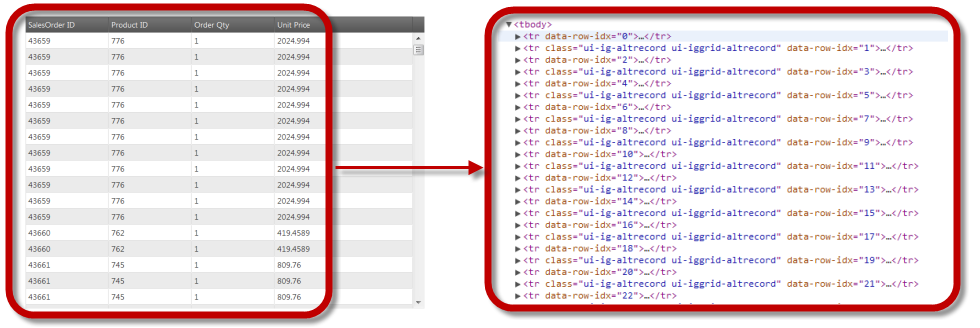
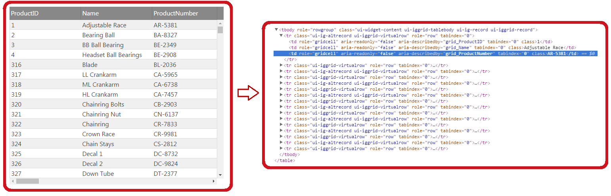
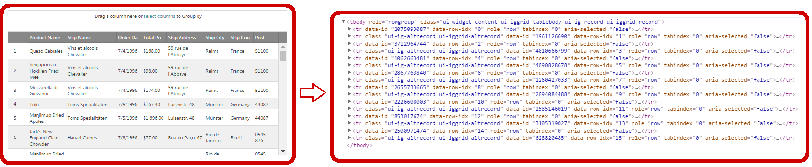

<!--
|metadata|
{
    "fileName": "iggrid-virtualization-overview",
    "controlName": "igGrid",
    "tags": []
}
|metadata|
-->

# Virtualization Overview (igGrid)

## In this topic

This topic contains the following sections:

-   [**Introduction**](#introduction)
-   [**Supported Virtualization Types**](#supported_virtualization_types)
	-   [Fixed Row Virtualization](#fixed-row)
	-   [Column Virtualization](#column)
	-   [Continuous Row Virtualization](#continuous)
-   [**Keyboard Interactions**](#keyboard-interactions)
-   [**Related Content**](#related-content)
    -   [Topics](#topics)
	-   [Samples](#samples)

##  Introduction

Virtualization is a feature of the `igGrid` that boosts performance when displaying large data sets containing thousands of records. It improves both rendering time and scrolling as well as memory footprint. It works by reducing the number of the DOM objects in-memory and reusing them while user scrolls and operates with the data. 

Virtualization is a local feature and requires all the data to be fetched on the client initially. This can affect network traffic so it's recommended that you consider enabling web server's Gzip compression for the web page that contains `igGrid` with Virtualization enabled. Virtualization is optimal for scenarios handling 1000 - 10000 records. If you prefer not to load the entire data set to the client at once use remote Paging instead.

Scrolling performance is affected by the grid `height` (and the number of the columns). Larger grid `height` means more visible records and more time to re-render them with new data. Re-rendering of the cells is blocking the browser UI and may result in scrolling performance degradation. It's recommended that you experiment with the grid `height` setting and try to find the balance that best suits your application.

Due to its nature Virtualization feature cannot and doesn't aim to achieve functional parity with the default non-virtualized grid. For example all APIs that accept or return DOM objects do not work the same way as with non-virtualized grid. This is because there are DOM objects only for the visible cells. 

> **Note**: Virtualization feature supports a subset of the functionality and features of a non-virtualized grid and should be considered only for very specific scenarios when performance is a must and other performance features like remote Paging are not suitable for the application.

The `igGrid` supports two virtualization types – row and column. Row Virtualization can be fixed and continuous. They are described in details in the following sections.

## Supported Virtualization Types

The following provides a brief explanation of the Virtualization types supported by the `igGrid` control.

- [Fixed Row Virtualization](#fixed-row): Only the visible rows are rendered in the grid.
- [Column Virtualization](#column): Only the visible columns are rendered in the grid.
- [Continuous Row Virtualization](#continuous): A pre-defined number of rows is rendered in the grid.

###  Fixed Row Virtualization 

With Fixed Row Virtualization, only the visible rows are rendered in the grid and these rendered rows are later reused (when user scrolls the grid) to display the subsequent data from the data source.

Compared to Continuous Row Virtualization the Fixed Row Virtualization does support Column Virtualization.

Checkout the [Feature Compatibility Matrix (igGrid)](Feature-Compatibility-Matrix(igGrid).html) for the list of the grid features that work in combination with Fixed Row Virtualization.

The picture on the left demonstrates a grid with 500 records. The picture on the right shows the actual HTML table elements that exist in the DOM to support the virtualized grid.

**Related Topics:**

-   [Enabling and Configuring Virtualization (Fixed)](igGrid-Enabling-and-Configuring-Virtualization.html#fixed-row)

###  Column Virtualization 

With Column Virtualization only the visible columns are rendereding in the grid.
As users start scrolling horizontally the grid the currently visible columns are updated and the related DOM elements are reused to display the column data of the new visible data.

Column Virtualization depends on Fixed Row Virtualization and will enable it implicitly if it is not enabled explicitly.

Setting different column widths have little to no effect, because the content is shifted between columns during horizontal scrolling, but the visible columns width stays intact.

Checkout the [Feature Compatibility Matrix (igGrid)](Feature-Compatibility-Matrix(igGrid).html) for the list of the grid features that work in combination with Column Virtualization.

The picture on the left demonstrates a grid with 25 columns and 500 records loaded on the client. The picture on the right shows the actual HTML table elements that exist in the DOM to support the virtualized grid.

**Related Topics:**

-   [Enabling and Configuring Virtualization (Column)](igGrid-Enabling-and-Configuring-Virtualization.html#column)

###  Continuous Row Virtualization 

Continuous Virtualization uses a pre-defined number of rows so that there might be rows that are rendered in the DOM but not visible in the viewport. As the user scrolls vertically the Virtualization determines whether the currently rendered rows are sufficient to display the next/previous chunk of records. If not, the current chunk of rows is being disposed and the required chunk of records is loaded. To determine which rows should be displayed after a scroll takes place, the Virtualization calculates the average row height. However, this average row height is just an approximate estimation, because its calculation based on the currently rendered rows and not on all available rows. From here, each time when it is being scrolled, the rows about to be displayed are estimated. This might lead to incorrect scroller position when the scroller is at the top/end positions. The Virtualization checks for such situations after each scroll and corrects scroller’s position if necessary.

Compared to Fixed Row Virtualization Continuous Row Virtualization has greater grid feature integration support, it's easier to configure and better handles variable row height.

Checkout the [Feature Compatibility Matrix (igGrid)](Feature-Compatibility-Matrix(igGrid).html) for the list of the grid features that work in combination with Continuous Row Virtualization.

The picture on the left demonstrates a grid with 500 records loaded at on the client. The picture on the right shows the actual HTML table elements that exist in the DOM to support the virtualized grid.

> **Note**: Continuous Virtualization enjoys the widest support among features in `igGrid` and should be your first choice when selecting a virtualization mode. However it does not support Column Virtualization, so if you want Column Virtualization you should stick with Fixed Virtualization instead.

**Related Topics:**

-   [Enabling and Configuring Virtualization (Continuous)](igGrid-Enabling-and-Configuring-Virtualization.html#continuous)

### Keyboard Interactions

When virtualization is enabled and mouse is over the grid, the following key interactions are available:

- UP/DOWN: Scrolls the container up or down.

##  Related Content

###  Topics

The following topics provide additional information related to this topic.

- [Enabling and Configuring Virtualization](igGrid-Enabling-and-Configuring-Virtualization.html): This topic explains, with code examples, how to enable and configure the Virtualization feature in the `igGrid`.
- [Performance Guide](iggrid-performance-guide.html): This topic explains in more details the different grid settings that can further improve the performance.
- [Feature Compatibility Matrix (igGrid)](Feature-Compatibility-Matrix(igGrid).html): This topic show the compatible feature combinations in `igGrid`.
- [IIS HTTP Compression](https://www.iis.net/configreference/system.webserver/httpcompression?showTreeNavigation=true)
- [Apache Enable Compression](http://httpd.apache.org/docs/current/mod/mod_deflate.html#enable)

###  Samples

The following samples provide additional information related to this topic.

- [Virtualization (Fixed)](%%SamplesUrl%%/grid/virtualization-fixed): This sample demonstrates the HTML virtualization capabilities of the `igGrid` using fixed number of rows.

- [Virtualization (Continuous)](%%SamplesUrl%%/grid/virtualization-continuous): This sample demonstrates the Continuous Virtualization capabilities of the `igGrid` control.

 

 

