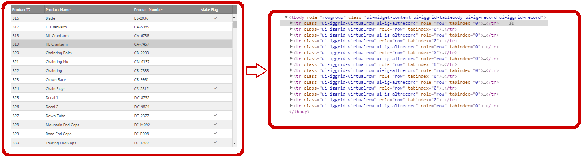

<!--
|metadata|
{
    "fileName": "iggrid-virtualization-overview",
    "controlName": "igGrid",
    "tags": []
}
|metadata|
-->

# Virtualization Overview (igGrid)

## Topic Overview

### Purpose

This topic introduces the Virtualization feature of the `igGrid`™ control.

## Introduction

Virtualization is a feature of the `igGrid` that boosts performance when displaying large data sets containing thousands of records. It works by reducing the number of the DOM objects in-memory and reusing them while user scrolls and operates with the data. Virtualization is local feature, which means that it works on the data, already available on the browser side.
The `igGrid` supports two virtualization types – fixed and continuous. They are described in details in the following sections.

## Supported Virtualization Types

The following provides a brief explanation of the Virtualization types supported by the `igGrid` control.

- [Fixed Row Virtualization](#fixed-row): Only the visible rows are rendered in the grid.
- [Fixed Column Virtualization](#fixed-column): Only the visible columns are rendered in the grid.
- [Continuous Row Virtualization](#continuous): A pre-defined number of rows is rendered in the grid.

###  Fixed Row Virtualization 

With Fixed Row Virtualization, only the visible rows are rendered in the grid and these rendered rows are later reused (when user scrolls the grid) to display the subsequent data from the data source.

Reuse of existing DOM elements translates to constant rendering speed and a very low memory footprint. For example, whether you load 100 or 10,000 records into the grid, the memory and CPU consumption is exactly the same (excluding overhead for data binding).

As noted in the introduction the Virtualization works with the data already available on the client. If you prefer not to load the entire data set to the client at once (which in some circumstances may not be optimal, particularly when you have a very large set of data), you can still combine Virtualization with Paging, and set your grid to have a large page size.

Specific to the Fixed Row Virtualization is that all visible rows share the same height. You should accomodate for a row height that can hold the cell with the largest data (especially when the data will span multiple lines).

Checkout the [Feature Compatibility Matrix (igGrid)](Feature-Compatibility-Matrix(igGrid).html) for the list of the grid features that work in combination with Fixed Row Virtualization.

The picture on the left demonstrates a grid with 500 records. The picture on the right shows the actual HTML table elements that exist in the DOM to support the virtualized grid.

**Related Topics:**

-   [Enabling and Configuring Virtualization (Fixed)](igGrid-Enabling-and-Configuring-Virtualization.html#fixed)

###  Fixed Column Virtualization 

With Fixed Column Virtualization only the visible columns are rendereding in the grid.
As users start scrolling horizontally in the grid the currently visible columns are updated and the related DOM elements are reused to display the column data of the new visible columns.

Fixed Column Virtualization depends on Fixed Row Virtualization and will enable it implicitly if it is not enabled explicitly.

Similarly to Fixed Row Virtualization, Column Virtualization also only works with the data already available on the client and does not make server requests to fetch any additional data.

Setting different column widths have little to no effect, because the content is shifted between columns during horizontal scrolling, but the visible columns width stays intact.

Checkout the [Feature Compatibility Matrix (igGrid)](Feature-Compatibility-Matrix(igGrid).html) for the list of the grid features that work in combination with Fixed Column Virtualization.

The picture on the left demonstrates a grid with 25 columns and 500 records loaded on the client. The picture on the right shows the actual HTML table elements that exist in the DOM to support the virtualized grid.

**Related Topics:**

-   [Enabling and Configuring Virtualization (Column)](igGrid-Enabling-and-Configuring-Virtualization.html#column)

###  Continuous Row Virtualization 

Continuous Virtualization uses a pre-defined number of rows. As the user scrolls vertically the Virtualization determines whether the currently rendered rows are sufficient to display the next/previous chunk of records. If not, the current chunk of rows is being disposed and the required chunk of records is loaded. Thus, having 1000 data rows will be displayed by only say 30 as opposed to 1000 row tables which significantly loads the DOM structure.

Continuous Virtualization supports variable row height. To determine which rows should be displayed after a scroll takes place, the virtualization calculates the average row height. However, this average row height is just an approximate estimation, because its calculation based on the currently rendered rows and not on all available rows. From here, each time when it is being scrolled, the rows about to be displayed are estimated. This might lead to incorrect scroller position when the scroller is at the top/end positions. The Virtualization checks for such situations after each scroll and corrects scroller’s position if necessary.

Checkout the [Feature Compatibility Matrix (igGrid)](Feature-Compatibility-Matrix(igGrid).html) for the list of the grid features that work in combination with Continuous Row Virtualization.

The picture on the left demonstrates a grid with 500 records loaded at on the client. The picture on the right shows the actual HTML table elements that exist in the DOM to support the virtualized grid.

> **Note**: Continuous Virtualization enjoys the widest support among features in `igGrid` and should be your first choice when selecting a virtualization mode. However it does not support Column Virtualization, so if you want Column Virtualization you should stick with Fixed Virtualization instead.

**Related Topics:**

-   [Enabling and Configuring Virtualization (Continuous)](igGrid-Enabling-and-Configuring-Virtualization.html#continuous)

### Keyboard Interactions

When virtualization is enabled and mouse is over the virtual table, the following key interactions are available:

- UP/DOWN: Scrolls the container up or down.

##  Related Content

###  Topics

The following topics provide additional information related to this topic.

- [Enabling and Configuring Virtualization](igGrid-Enabling-and-Configuring-Virtualization.html): This topic explains, with code examples, how to enable and configure the Virtualization feature in the `igGrid`.
- [Performance Guide](iggrid-performance-guide.html): This topic explains in more details the different grid settings that can further improve the performance.
- [Feature Compatibility Matrix (igGrid)](Feature-Compatibility-Matrix(igGrid).html): This topic show the compatible feature combinations in `igGrid`.

###  Samples

The following samples provide additional information related to this topic.

- [Virtualization (Fixed)](%%SamplesUrl%%/grid/virtualization-fixed): This sample demonstrates the HTML virtualization capabilities of the `igGrid` using fixed number of rows.

- [Continuous Virtualization](%%SamplesUrl%%/grid/virtualization-continuous): This sample demonstrates the Continuous Virtualization capabilities of the `igGrid` control.

 

 

