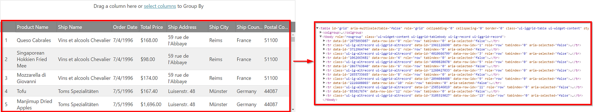

<!--
|metadata|
{
    "fileName": "iggrid-enabling-and-configuring-virtualization",
    "controlName": "igGrid",
    "tags": []
}
|metadata|
-->

# Enabling and Configuring Virtualization (igGrid)

## Topic Overview

### Purpose

This topic explains, with code examples, how to enable and configure the Virtualization feature in the `igGrid`™.

### In this topic

This topic contains the following sections:

-   [**Configuring Virtualization Overview**](#configuring)
-   [**Enabling and Configuring Fixed Row Virtualization**](#fixed-row)
    - [Configuring the rows’ height](#fixed-row-configuring)
    - [Fixed Row Virtualization Example](#fixed-row-example)
-   [**Enabling and Configuring Column Virtualization**](#fixed-column)
	-   [Configuring the columns’ width](#fixed-configuring-rows-columns)
    -   [Column Virtualization Example](#fixed-column-example)
-   [**Enabling and Configuring Continuous Row Virtualization**](#continuous)
    -   [Property settings](#continuous-property-settings)
    -   [Example](#continuous-example)
-   [**Related Content**](#related-content)
    -   [Topics](#topics)


## <a id="configuring"></a> Configuring Virtualization Overview 

The following table lists the different configurable settings of the Virtualization feature and maps them to the respective properties that manage them.

Setting | Property | Description
---|---|---
Row virtualization | [rowVirtualization](%%jQueryApiUrl%%/ui.iggrid#options:rowVirtualization) | Enables/Disables virtualization for rows only.
Column virtualization | [columnVirtualization](%%jQueryApiUrl%%/ui.iggrid#options:columnVirtualization) | Enables/Disables Column Virtualization. Column Virtualization depends on Fixed Row Virtualization and will enable it implicitly if it is not enabled explicitly.
Both Row and Column virtualization | [virtualization](%%jQueryApiUrl%%/ui.iggrid#options:virtualization) | Shorthand for setting `rowVirtualization` and `columnVirtualization` via a single option.
Virtualization mode | [virtualizationMode](%%jQueryApiUrl%%/ui.iggrid#options:virtualizationMode) | Determines Row Virtualization mode.
Average Row Height | [avgRowHeight](%%jQueryApiUrl%%/ui.iggrid#options:avgRowHeight) | Used for Fixed Row Virtualization. Determines the average value in pixels that will be used to calculate how many rows to render. All row heights will be automatically set to this value.
Average Column Width| [avgColumnWidth](%%jQueryApiUrl%%/ui.iggrid#options:avgColumnWidth) | Used for Column Virtualization. This is the average value in pixels for the column widths.

## <a id="fixed-row"></a> Enabling and Configuring Fixed Row Virtualization

Fixed Row Virtualization is enabled by setting the [`rowVirtualization`](%%jQueryApiUrl%%/ui.iggrid#options:rowVirtualization) option of the `igGrid` control to `true`.

It requires the following additional options to be set:

- [height](%%jQueryApiUrl%%/ui.iggrid#options:height)
- [avgRowHeight](%%jQueryApiUrl%%/ui.iggrid#options:avgRowHeight)

When Fixed Row Virtualization is used, all rows have the same height. That height is determined by the `avgRowHeight` option. Please refer to the ['Configuring the average rows’ height'](#fixed-row-configuring) section for more details on how this option should be calculated.
Note that if average row height is not set correctly, the last rows may be cut off (not shown) in the grid.

### <a id="fixed-row-configuring"></a> Configuring the average rows’ height

An important aspect of configuring Fixed Virtualization is the process of determining the value for the `avgRowHeight` property. The `avgRowHeight` property determines the average height of the displayed rows in the grid.
The general rule for setting this option is to always set an `avgRowHeight` to value that is evenly divisible by the value of the height of the grid. 
By default, the grid sets a row height of "30px" that would work for most data sources, however a greater `avgRowHeight` value may have to be set in order to accommodate word wrapping.

Example:

Grid Height: 600px => `avgRowHeight`: 30, or 15, or 60.


### <a id="fixed-row-example"></a> Fixed Row Virtualization Example

The following table demonstrates how to configure Fixed Row Virtualization.

Property | Value
---|---
[rowVirtualization](%%jQueryApiUrl%%/ui.iggrid#options:rowVirtualization) | true
[virtualizationMode](%%jQueryApiUrl%%/ui.iggrid#options:virtualizationMode) (Optional) | "fixed" (Default value)
[height](%%jQueryApiUrl%%/ui.iggrid#options:height) | "600px"
[avgRowHeight](%%jQueryApiUrl%%/ui.iggrid#options:avgRowHeight) (Optional)| "30px" (Default value)

#### Code

The following code configures the setting in the Example.

**In JavaScript:**

```js
$("#grid1").igGrid({
        rowVirtualization: true,
        virtualizationMode: "fixed",
        height: "600px",
        avgRowHeight: "30px"
});
```

**In ASPX:**

```csharp
<%=Html.Infragistics().Grid(Model).ID("grid1")
    .LoadOnDemand(false)
    .AutoGenerateColumns(false)
    .AutoGenerateLayouts(false)
    .PrimaryKey("ProjectID")
    .Columns(column => 
    {
        column.For(x => x.ProjectID).HeaderText("ProjectID");
        column.For(x => x.Name).HeaderText("Name");
        column.For(x => x.StartDate).HeaderText("StartDate");
        column.For(x => x.EndDate).HeaderText("EndDate");
    })
    .Height("600px")
    .RowVirtualization(true)
    .VirtualizationMode(VirtualizationMode.Fixed)
    .AvgRowHeight("30px")
}).DataBind().Render() %>
```

The sample below demonstrates how the fixed virtualization works:

<div class="embed-sample">
    [Virtualization (Fixed)](%%SamplesEmbedUrl%%/grid/virtualization-fixed)
 </div>

## <a id="fixed-column"></a> Enabling and Configuring Column Virtualization

Column Virtualization is enabled by setting the [`columnVirtualization`](%%jQueryApiUrl%%/ui.iggrid#options:columnVirtualization) option of the `igGrid` control to `true`. When enabled it also **enables Fixed Row Virtualization**.

It requires the following additional options to be set:

- [width](%%jQueryApiUrl%%/ui.iggrid#options:width)
- [defaultColumnWidth](%%jQueryApiUrl%%/ui.iggrid#options:defaultColumnWidth) or column [width](%%jQueryApiUrl%%/ui.iggrid#options:columns.width) for each column.
- [avgColumnWidth](%%jQueryApiUrl%%/ui.iggrid#options:avgColumnWidth)
- [height](%%jQueryApiUrl%%/ui.iggrid#options:height) (due to auto enabling row virtualization)
- [avgRowHeight](%%jQueryApiUrl%%/ui.iggrid#options:avgRowHeight) (due to auto enabling row virtualization)

When Column Virtualization is enabled the sum of the visible column widths should be equal to the grid width so that the currentlt visible columns are fully visible in the viewport.
The `avgColumnWidth` option should also be calculated and set in order for the horizontal scrollbar width to be correct and to allow scrolling to the last visible column.
Next section explains how to calculate `avgColumnWidth` option.

### <a id="fixed-configuring-columns"></a> Configuring the average columns' width

The `avgColumnWidth` option determines the average width of the columns defined in the grid. This option should be set to the average width of the columns in the current grid configuration in pixels.

Example:

Grid Width: 300px, example column widths for 4 columns: 100px, 200px, 100px, 200px => `avgColumnWidth`: 150


### <a id="fixed-column-example"></a> Column Virtualization Example

The following table demonstrates how to configure Column Virtualization.

Property | Value
---|---
[columnVirtualization](%%jQueryApiUrl%%/ui.iggrid#options:columnVirtualization) | true
[virtualizationMode](%%jQueryApiUrl%%/ui.iggrid#options:virtualizationMode) (Optional)| "fixed" (Default Value)
[width](%%jQueryApiUrl%%/ui.iggrid#options:width) | "400px"
[defaultColumnWidth](%%jQueryApiUrl%%/ui.iggrid#options:defaultColumnWidth) | "200px"
[avgColumnWidth](%%jQueryApiUrl%%/ui.iggrid#options:avgColumnWidth)| "200px"
[height](%%jQueryApiUrl%%/ui.iggrid#options:height) | "600px"
[avgRowHeight](%%jQueryApiUrl%%/ui.iggrid#options:avgRowHeight) (Optional) | "30px" (Default Value)

>**Note:** Note that instead of `defaultColumnWidth` you can instead define specific width for each column.

#### Code

The following code configures the setting in the Example.

**In JavaScript:**

```js
$("#grid1").igGrid({
        columnVirtualization: true,
        width: "400px",
        height: "600px",
        defaultColumnWidth: "200px",
        avgColumnWidth: "200px",
        avgRowHeight: "30px"        
});
```

**In ASPX:**

```csharp
<%=Html.Infragistics().Grid(Model).ID("grid1")
    .LoadOnDemand(false)
    .AutoGenerateColumns(false)
    .AutoGenerateLayouts(false)
    .PrimaryKey("ProjectID")
    .Columns(column => 
    {
        column.For(x => x.ProjectID).HeaderText("ProjectID");
        column.For(x => x.Name).HeaderText("Name");
        column.For(x => x.StartDate).HeaderText("StartDate");
        column.For(x => x.EndDate).HeaderText("EndDate");
    })
    .Width("400px")
    .Height("600px")
    .DefaultColumnWidth("200px")
	.ColumnVirtualization(true)
    .AvgRowHeight("30px")
    .AvgColumnWidth("200px")
}).DataBind().Render() %>
```

As a result you'll have only two columns rendered in the grid viewport.

## <a id="continuous"></a> Enabling and Configuring Continuous Virtualization

Continuous Virtualization is enabled by setting the [rowVirtualization](%%jQueryApiUrl%%/ui.iggrid#options:rowVirtualization) option of the igGrid control to `true` and [virtualizationMode](%%jQueryApiUrl%%/ui.iggrid#options:virtualizationMode) to "continuous".

It requires the following additional options to be set:

- [height](%%jQueryApiUrl%%/ui.iggrid#options:height)

> **Note:** Column Virtualization is not supported with Continuous Virtualization.

### <a id="continuous-example"></a> Example

The following table demonstrates how to configure Continuous Virtualization for both rows and columns with row height of 400 pixels.

Property | Value
---|---
[rowVirtualization](%%jQueryApiUrl%%/ui.iggrid#options:rowVirtualization) | true
[virtualizationMode](%%jQueryApiUrl%%/ui.iggrid#options:virtualizationMode) | "continuous"
[height](%%jQueryApiUrl%%/ui.iggrid#options:height) | "400px"




#### Code
The following code configures the setting in the Example.

**In JavaScript:**

```js
$("#grid1").igGrid({
        rowVirtualization: true,
        virtualizationMode: "continuous",
        height: "400px"
});
```

**In ASPX:**

```csharp
<%=Html.Infragistics().Grid(Model).ID("grid1")
    .LoadOnDemand(false)
    .AutoGenerateColumns(false)
    .AutoGenerateLayouts(false)
    .PrimaryKey("ProjectID")
    .Columns(column => 
    {
        column.For(x => x.ProjectID).HeaderText("ProjectID");
        column.For(x => x.Name).HeaderText("Name");
        column.For(x => x.StartDate).HeaderText("StartDate");
        column.For(x => x.EndDate).HeaderText("EndDate");
    })
    .RowVirtualization(true)
    .VirtualizationMode(VirtualizationMode.Continuous)
    .Height("400px")
    .DataBind().Render()
 %>
```

The sample below demonstrates how the continuous virtualization works:

<div class="embed-sample">
   [Virtualization (Continuous)](%%SamplesEmbedUrl%%/grid/virtualization-continuous)
</div>

## <a id="related-content"></a> Related Content

### <a id="topics"></a> Topics

The following topics provide additional information related to this topic.

- [Virtualization Overview](igGrid-Virtualization-Overview.html): This topic introduces the Virtualization feature of the `igGrid` control.
- [Feature Compatibility Matrix (igGrid)](Feature-Compatibility-Matrix(igGrid).html): This topic shows the compatibility between `igGrid` features when enabled at the same time.