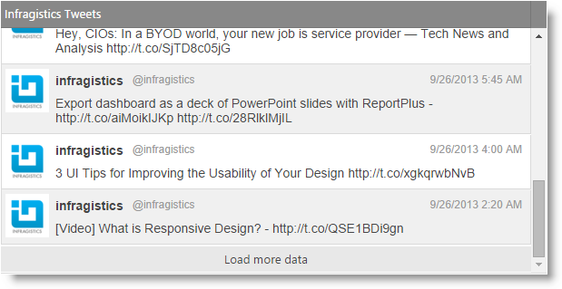

<!--
|metadata|
{
    "fileName": "append-rows-on-demand-overview",
    "controlName": ["igGrid"],
    "tags": ["Grids"]
}
|metadata|
-->

#Append Rows On Demand Overview

## Topic Overview

This topic contains an overview of the Append Rows on Demand feature for the `igGrid`.

### Required background

The following lists the concepts, topics, and articles required as a prerequisite to understanding this topic.

### Topics

- [igDataSource Overview](igDataSource-igDataSource-Overview.html)

- [igGrid Overview](igGrid-Overview.html)

### In this topic

-   [Introduction](#introduction)
-   [Enabling Append Rows on Demand](#append-rows-on-demand)
    -   [Required resources](#required-resources)
    -   [Initialization](#initialization)
-   [Performance considerations](#performance-consideration)
-   [CTP Migration Guide](#migration-guide)
-   [Related Content](#related-content)
    -   [Topics](#topics)
    -   [Samples](#samples)

## <a id="introduction"></a>Introduction

This feature provides progressive loading of data records into the page DOM while the user interacts with the grid. It is a one-way forward-only operation in which the records are appended to the grid at the bottom. This experience pattern is very suitable for ordered datasets where the most recent records are rendered first (at the top) while the rest of the data is loaded when the user needs it. The feature operates in two modes: automatic and button.

In automatic mode, data is loaded implicitly while the user scrolls the grid and reaches the bottom of the loaded content.

In button mode, the there is a button at the bottom of the grid which loads more rows when the user click/taps on it.

The features is built on top of the [$.ig.DataSource](%%jQueryApiUrl%%/ig.datasource) paging functionality, thus it supports all range of data sources supported by the `$.ig.DataSource`. This however makes the feature incompatible with the Paging feature itself. For the supported integration scenarios please refer to the [Feature Matrix (igGrid)](Feature-Compatibility-Matrix%28igGrid%29.html) topic.



Note: The feature was previously called Load on Demand. This caused confusion in some customers which referred to the `igHierarchicalGrid` Load on Demand functionality. In order to differentiate with the Load on Demand functionality in other controls like `igCombo`, `igHierarchicalGrid` and `igTree` the feature is renamed to Append Rows on Demand. For migration instructions see the [CTP Migration Guide](#migration-guide) section.

## <a id="append-rows-on-demand"></a>Enabling Append Rows on Demand

### <a id="required-resources"></a>Required resources

To use the Append Rows on Demand feature (without Infragistics Loader) you must reference the following resources:

CSS files

-   css\structure\infragistics.css
-   css\themes\infragistics\infragistics.theme.css

JavaScript files

-   jquery.js
-   jqueryui.js
-   js\modules\infragistics.util.js
-   js\modules\infragistics.ui.shared.js
-   js\modules\infragistics.datasource.js
-   js\modules\infragistics.ui.grid.framework.js
-   js\modules\infragistics.ui.grid.appendrowsondemand.js

### <a id="initialization"></a>Initialization

The following code snippet initializes an `igGrid` with Append Rows on Demand feature enabled which loads 4 records at a time when new data is requested.

**In JavaScript:**
```js
$(function () {
      var products = [
            { "ProductID": 1, "Name": "Adjustable Race", "ProductNumber": "AR-5381" },
            { "ProductID": 2, "Name": "Bearing Ball", "ProductNumber": "BA-8327" },
            { "ProductID": 3, "Name": "BB Ball Bearing", "ProductNumber": "BE-2349" },
            { "ProductID": 4, "Name": "Headset Ball Bearings", "ProductNumber": "BE-2908" },
            { "ProductID": 316, "Name": "Blade", "ProductNumber": "BL-2036" },
            { "ProductID": 317, "Name": "LL Crankarm", "ProductNumber": "CA-5965" },
            { "ProductID": 318, "Name": "ML Crankarm", "ProductNumber": "CA-6738" },
            { "ProductID": 319, "Name": "HL Crankarm", "ProductNumber": "CA-7457" },
            { "ProductID": 320, "Name": "Chainring Bolts", "ProductNumber": "CB-2903" }
      ];
      $("#grid").igGrid({
            dataSource: products,
            features: [
                  {
                        name: "AppendRowsOnDemand",
                        chunkSize: 4
                  }
            ]
      });
});
```
### <a id="performance-consideration"></a>Performance Considerations

The Append Rows on Demand feature does not re-render the grid contents when records are requested from the `$.ig.DataSource` and loaded in the DOM. However when used in combination with other features grid contents re-rendering may apply if the other feature requires it. For example, the Sorting feature will re-render the DOM while retaining the current chunk index. This may affect performance depending on how many records are rendered in the DOM.

Another scenario to consider that may be a performance issue is when Append Rows on Demand is configured with remote data source, while features like Sorting and Filtering are configured to execute locally. To keep the sort and filter results up-to-date an additional sorting or filtering operation is done under the hood once the new data from the remote server is received.

### <a id="migration-guide"></a>CTP Migration Guide

As noted previously the feature was renamed from “Load on Demand” to “Append Rows on Demand” in order to differentiate from other functionality with the same name. In order to upgrade from previous versions of Ignite UI you need to know the following information:

-   The feature file in the “<installation_folder>\js\modules” folder is renamed from “`infragistics.ui.grid.loadondemand.js`” to “`infragistics.ui.grid.appendrowsondemand.js`”
-   In Infragistics Loader the feature name from “igGrid.LoadOnDemand” to “igGrid.AppendRowsOnDemand”
-   Feature name is changed from “igGridLoadOnDemand” to “[igGridAppendRowsOnDemand](%%jQueryApiUrl%%/ui.igGridAppendRowsOnDemand)”. You need to replace all your API calls to the new feature name.
-   In igGrid [features](%%jQueryApiUrl%%/ui.iggrid_tg#options:features) option array the feature is renamed from “LoadOnDemand” to “AppendRowsOnDemand”
-   In Infragistics.Web.Mvc.dll
   -   In Controller – the GridLoadOnDemand class is renamed to [GridAppendRowsOnDemand](Infragistics.Web.Mvc~Infragistics.Web.Mvc.GridAppendRowsOnDemand.html)
    -   In View – the GridLoadOnDemand method is renamed to [GridAppendRowsOnDemand](Infragistics.Web.Mvc~Infragistics.Web.Mvc.GridFeatureBuilder`1~AppendRowsOnDemand.html)


## <a id="related-content"></a>Related Content

### <a id="topics"></a>Topics

The following topics provide additional information related to this topic.

- [Feature Matrix (igGrid)](Feature-Compatibility-Matrix%28igGrid%29.html)

### <a id="samples"></a>Samples

The igGrid Append Rows On Demand feature adds functionality to append data to the grid. It works in two modes: Automatic and Button. Use the upper grid to experience the Automatic mode. Scroll to the bottom of the grid to see that the new data will be appended to the grid. Use the bottom grid to experience the Button mode. Scroll to the bottom of the grid and then press the "Load more data" button to append new data.


<div class="embed-sample">
    [Append Rows on Demand](%%SamplesEmbedUrl%%/grid/append-rows-on-demand)
</div>