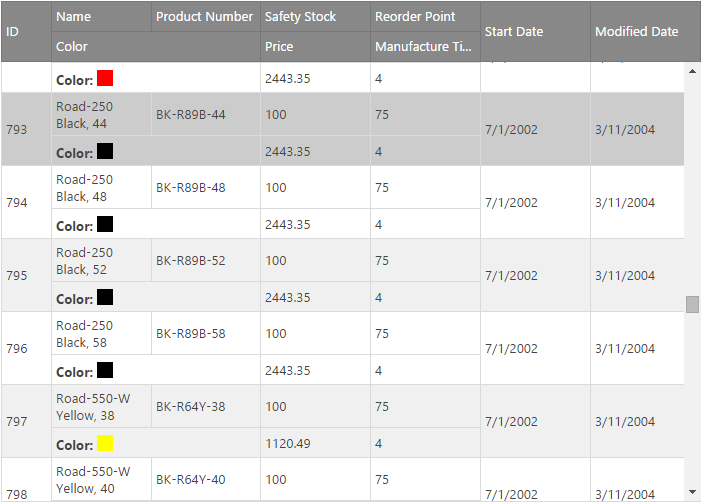

<!--
|metadata|
{
    "fileName": "iggrid-multirowlayout",
    "controlName": "igGrid",
    "tags": ["Getting Started","Grids","Multi-Row Layout"]
}
|metadata|
-->

# Grid Multi-Row Layout

## In this topic

- [Overview](#overview)
- [Initialization](#initialization)
- [API in a Multi-Row Layout Grid](#api)
- [Supported Features](#features)
- [Features Integration](#features-integration)
- [Related Content](#related-content)

## <a id="overview"></a> Overview

Multi-Row Layout is a feature for the Ignite UI™ grid, or `igGrid`. It allows you to create a complex structure that repeats for each record and contains multiple physical rows with cells in them that can span multiple columns and rows. Such structure allows for greater rendering flexibility for grids with many columns that would otherwise require a horizontal scrollbar or when the data shown is better presented in a non-tabular fashion.

**Figure 1: Visual example of a Multi-Row Layout Grid**



> **Note:** The Multi-Row Layout feature is implemented as part of the igGrid widget, and therefore follows the standard igGrid lifecycle.

## <a id="initialization"></a> Initialization

Initializing the Multi-Row Layout is done entirely through the igGrid's column collection. Four new properties are added to the column definition that specify the position and size of the column - [rowIndex](%%jQueryApiUrl%%/ui.igGrid#options:columns.rowIndex), [columnIndex](%%jQueryApiUrl%%/ui.igGrid#options:columns.columnIndex), [rowSpan](%%jQueryApiUrl%%/ui.igGrid#options:columns.rowSpan) and [colSpan](%%jQueryApiUrl%%/ui.igGrid#options:columns.colSpan). HTML tables are rendered stricly based on rows and columns and the size of a cell in a Multi-Row Layout grid is based on how many rows and columns it spans. To enable the feature all columns definitions in the column's collection should have `rowIndex` and `columnIndex`. The `rowSpan` and `colSpan` properties can be omitted in which case they default to a value of 1. The columns definitions should create a matrix of cells that doesn't contain empty spaces and no two cells should occupy the same space. In case any of the two happen a user-friendly initialization exception will be thrown pointing to the issue's origin.

In a Multi-Row Layout grid widths can be defined for only part of the columns. The grid will attempt to make the necessery calculations and fill widths for columns that depend on the width of others leaving those without such relation to be sized by the browser.

To put the information so far into perspective, the Multi-Row Layout in Figure 1 is generated with the following code snippet: 

**In Javascript:**

```js
columns: [
			{ headerText: "Company", key: "company", dataType: "string", rowIndex: 0, columnIndex: 0, colSpan: 2 },
			{ headerText: "Lifetime Sales", key: "sales_lifetimeSales", dataType: "number", rowIndex: 0, columnIndex: 2, colSpan: 2, rowSpan: 2 },
			{ headerText: "Market Potential", key: "sales_marketPotential", dataType: "number", rowIndex: 0, columnIndex: 4, rowSpan: 3, width: "10%" },
			{ headerText: "Assets Cash", key: "assets_cash", dataType: "number", rowIndex: 0, columnIndex: 5, width: "10%" },
			{ headerText: "Accounts Receivable", key: "assets_accRec", dataType: "number", rowIndex: 0, columnIndex: 6, width: "20%" },
			{ headerText: "Country", key: "country", dataType: "string", rowIndex: 1, columnIndex: 0, width: "10%" },
			{ headerText: "City", key: "city", dataType: "string", rowIndex: 1, columnIndex: 1, width: "10%" },
			{ headerText: "Assets Books", key: "assets_books", dataType: "number", rowIndex: 1, columnIndex: 5, colSpan: 2, rowSpan: 2 },
			{ headerText: "Address", key: "address", dataType: "string", rowIndex: 2, columnIndex: 0, colSpan: 2 },
			{ headerText: "Quarterly", key: "sales_quarterlySales", dataType: "number", rowIndex: 2, columnIndex: 2, width: "10%" },
			{ headerText: "Yearly", key: "sales_yearlySales", dataType: "number", rowIndex: 2, columnIndex: 3, width: "10%" }
]
```

> **Note:** For cells that span one column the `colSpan` property is omitted and for those that span one row the `rowSpan` property is omitted. Widths are defined for two columns only.
The sample below demonstrates how to setup an igGrid with a Multi-Row Layout.
<div class="embed-sample">
   [igGrid Multi-Row Layout sample](%%SamplesEmbedUrl%%/grid/multi-row-layout)
</div>
## <a id="api"></a> API in a Multi-Row Layout Grid

Since Multi-Row Layout changes how cells are rendered and therefore breaks the corelation between the cell's index in a row and its overall position in the layout and because of the fact one record no longer corresponds to a single `TR` element, a number of changes and considerations were made on how API functions and events works in the context of such grids.

* [rowById](%%jQueryApiUrl%%/ui.igGrid#methods:rowById)(rowId) - returns all `TR` elements that are rendered for the record with the specified `rowId`
* [rowAt](%%jQueryApiUrl%%/ui.igGrid#methods:rowAt)(rowIndex) - returns the `TR` element at the specified `rowIndex`
* [cellAt](%%jQueryApiUrl%%/ui.igGrid#methods:cellAt)(columnIndex, rowIndex) - returns the `TD` element at the specified coordinates based on the Multi-Row Layout matrix. This means that cells with row/col spans will be taken into account when determining the element to be returned.
* [cellById](%%jQueryApiUrl%%/ui.igGrid#methods:cellById)(rowId, columnKey) - returns the `TD` element specified by the `rowId` and `columnKey`.
* [getCellValue](%%jQueryApiUrl%%/ui.igGrid#methods:getCellValue)(rowId/recordIndex, columnKey) - returns the value associated with the `rowId` (if a primary key is specified) or `recordIndex` (if no primary key is specified) and the `columnKey`
* [getCellText](%%jQueryApiUrl%%/ui.igGrid#methods:getCellText)(rowId/recordIndex, columnKey) - returns the text for the cell associated with the `rowId` (if a primary key is specified) or `recordIndex` (if no primary key is specified) and the `columnKey`

An additional function is added to the public API that accepts a DOM element and returns information about it in the context of the grid's layout.

[getElementInfo](%%jQueryApiUrl%%/ui.iggrid#methods:getElementInfo) - accepts a DOM element and returns an object containing the following properties:

* rowId - will be null if no primary key is specified
* rowIndex - the index of the row (the element itself of its parent in case of `TD`/`TH`) in the DOM 
* recordIndex - the index of the data record the element is rendered for in the data view
* columnObject - only applicable if the parameter is a `TD` or `TH` - the column object in the column collection for that cell

Finally, two arguments returned by two igGrid events received some clarification in the context of Multi-Row Layout.

* [cellClick](%%jQueryApiUrl%%/ui.igGrid#events:cellClick)
    * rowIndex - the DOM index of the parent `TR` element of the clicked cell
    * colIndex - the index of the `COL` element in the `COLGROUP` the cell belongs to
* [cellRightClick](%%jQueryApiUrl%%/ui.igGrid#events:cellRightClick)
    * rowIndex - the DOM index of the parent `TR` element of the clicked cell
    * colIndex - the index of the `COL` element in the `COLGROUP` the cell belongs to

## <a id="features"></a> Supported Features

When igGrid is rendered in a multi-row layout mode the following features are supported: Sorting, Filtering, Paging and Updating, as well as virtualization in `continuous` mode. Enabling any of the other features native to igGrid will result in unexpected behavior or initialization exceptions. The supported features have certain limitations in this mode. They are listed below.

* Filtering is supported only in `advanced` mode. Attempting to use it in `simple` mode will result in an initialization exception.

## <a id="features-integration"></a> Features Integration

The following table summarizes the integration between Grid Multi-Row Layout and other `igGrid` features.

Feature | Description
-------|-------------
Updating | In inline editing (`editMode` is `row` or `cell` ) use [`navigationIndex`](%%jQueryApiUrl%%/ui.iggrid#options:columns.navigationIndex) option to configure the tab order of the editors. Note that the option has no effect when not in edit mode and the default browser tab navigation will be applied in this case. 

## <a id="related-content"></a> Related Content

### <a id="topics"></a> Topics

-   [igGrid Overview](igGrid-Overview.html)
