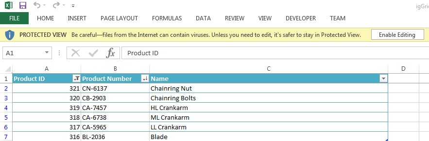

<!--
|metadata|
{
    "fileName": "iggridexcelexporter-overview",
    "controlName": ["igExcel", "igGrid", "igGridExcelExporter"],
    "tags": ["Exporting"]
}
|metadata|
-->

# Grid Excel Exporter Overview
The `igGridExcelExporter` component allows you to export data from the `igGrid` into a Microsoft Excel document. The export can support themes and workbook customization while reflecting data manipulated in the grid through features Sorting, Filtering, Paging, etc. The following screenshot demonstrates what an exported `igGrid` looks like in Excel.

 

The `igGridExcelExporter` includes the following characteristics:  

 - Overall theme support
 - Supports defining file name and worksheet name
 - Supports defining table style in Excel
 - Supports reflecting the data and layout manipulations caused by the `igGrid`’s `Filtering`, `Hiding`, `Paging`, `Sorting`, `Summaries` and `Column Fixing` features
 - Supports `igGrid`’s Header and Alternate Row Styles
 - Supports defining `igGrid` columns to be skipped and columns that will not get applied any filtering
 - Supports exporting all sublevel data from `igHierarchicalGrid` or just data under expanded rows
 - Provides callbacks (events) throughout the export process.

## Required Background
- [Ignite UI Overview](NetAdvantage-for-jQuery-Overview.html "Ignite UI Overview") - General information on the Ignite UI™ library.  
- [igGrid Overview](igGrid-Overview.html "igGrid Overview") - General information on the `igGrid` control.

## Dependencies

The `igGridExcelExporter` is dependent upon the Infragistics JavaScript Excel library, so we need to add references to the library js files and the `igGridExcelExporter` js file:

```html
<script src="igniteui/js/modules/infragistics.documents.core.js" type="text/javascript"></script>
<script src="igniteui/js/modules/infragistics.excel.js" type="text/javascript"></script>
<script src="igniteui/js/modules/infragistics.gridexcelexporter.js" type="text/javascript"></script>
```

or just use the `igLoader` that will load all the needed resources for the `igGrid` and `igGridExcelExporter`:

```javascript
$.ig.loader({
    scriptPath: "http://localhost/igniteui/js/",
    cssPath: "http://localhost/igniteui/css/",
    resources:'igGrid,' + 'igGridExcelExporter'
});
```

The `igGridExcelExporter` is also dependent upon the following open source libraries:

- [FileSaver.js](https://github.com/eligrey/FileSaver.js/): A polyfill of the W3C `saveAs` specification
- [Blob.js](https://github.com/eligrey/Blob.js/): A polyfill of the W3C [`Blob`](https://developer.mozilla.org/en-US/docs/Web/API/Blob) interface.

so references to these need to be added to the page as well:

```html
<!-- External files for exporting -->
<script src="/scripts/lib/FileSaver.js"></script>
<script src="/scripts/lib/Blob.js"></script>
```

  
## Using igGridExcelExporter with an igGrid
You can export the entire content of a grid by passing the instance of the grid to the exporter's `exportGrid` static method. 

```javascript
$.ig.GridExcelExporter.exportGrid(
    $('#grid'),
    { 	
        fileName: 'igGrid',
        worksheetName: 'Sheet1',
    },
    {
        success: function() {
            alert("exporting has finished!")
        }
    }
);
```
The `exportGrid` takes three objects as arguments - `igGrid` instance, a user settings object (containing the file and worksheet name, etc.) and a user callbacks object, containing callbacks for the events.

> **Note**: The only required argument for the exporter is the instance of the grid. All other properties will fall back to defaults if you do not explicitly provide values.

For more information on all the available properties of the exporter you can explore the [API documentation](%%jQueryApiUrl%%/ig.gridexcelexporter#overview).


### <a id="Preview"></a>Preview
The following is a preview of the final result.

<div class="embed-sample">
   [%%SamplesEmbedUrl%%/grid/export-basic-grid](%%SamplesEmbedUrl%%/grid/export-basic-grid)
</div>
 
## Related Content

### Topics
- [Using the JavaScript Excel Library](Using-the-JavaScript-Excel-Library.html)
- [JavaScript Excel Library Overview](JavaScript-Excel-Library-Overview.html)

### <a id="samples"></a> Samples

-   [Export Basic Grid to Excel](%%SamplesUrl%%/grid/export-basic-grid)
-   [Exporting Grid to Excel with Features](%%SamplesUrl%%/grid/export-feature-rich-grid)
-   [Customizing Grid Excel Export](%%SamplesUrl%%/grid/export-client-events)
