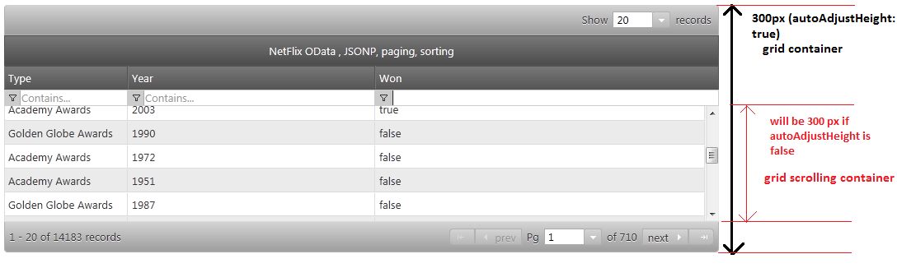

<!--
|metadata|
{
    "fileName": "iggrid-performance-guide",
    "controlName": "igGrid",
    "tags": ["Grids","Performance"]
}
|metadata|
-->

# Performance Guide (igGrid)

## In this topic

This topic contains the following sections:

-   [**Introduction**](#overview)
-   [**Rendering and Re-Rendering**](#rendering)
-   [**Data-binding**](#data-binding)
-   [**Data Formatting**](#data-formatting)
-   [**Grid Features**](#grid-features)
-   [**Enabling/Disabling Features (Initial Feature Setup and Rendering)**](#toggle-features)
-   [**Performance-Related Widget Properties (Options)**](#options)
	-   [virtualization (default: false)](#options-virtualization)
	-   [Infragistics Templating Engine (columns.template)](#options-column-template)
	-   [autoAdjustHeight (default: true)](#options-auto-height)
	-   [autoFormat (default: “date”)](#options-auto-format)
	-   [alternateRowStyles (default: true)](#options-alt-row)
-   [**Feature-Specific Properties**](#features)
	-   [mode (Filtering) (default: simple)](#filter-mode)
	-   [applySortedColumnCss (Sorting) (default: true)](#sorting-style)
-   [**Best practices**](#best-practices)
-   [**Related Content**](#related-content)
    -   [Topics](#topics)
	-   [Samples](#samples)

##  Overview

The Ignite UI® `igGrid` provides exceptional performance out-of-the box. Going beyond the default settings, however, gives you an opportunity to further increase the grid’s performance ability (without sacrificing functionality) in special cases. 

Before learning about ways to adjust the grid to fine-tune performance, first get acquainted with some the underlying building blocks of the grid.

##  Rendering and Re-Rendering

Since the grid’s rendering lifecycle is entirely on the client, rendering and re-rendering of data incurs most of the processing overhead. Rendering boils down to generating HTML markup for the data source values, and appending this markup to the HTML data table. Once data is rendered and the grid needs to rebind itself (regardless of the source of rebind – explicit API call, a sorting/filtering operation through the UI, etc.), then the existing content of the grid must be cleared.

Clearing the grid involves carefully removing data, bound events or established references associated with each DOM element before removing it from the DOM tree. This clean-up process is usually an involved set of operations that affects performance, and is described in greater detail below.

Further, the grid supports two rendering modes. The first mode is a custom, high-performance rendering mode, and the second is using the Infragistics Templating Engine.

> **Note:** The Infragistics Templating Engine is required whenever you need custom column templates.

##  Data-binding

Data binding does introduce extra overhead, but the performance impact is negligible. Most modern browsers come equipped with native JSON parsing, which means that all JSON parsing, traversal, and transformation happen in a small fraction of the total processing time.

##  Data Formatting

If the data source contains data values which are not directly suitable for rendering to the user, you often need to format the data for more appropriate display. The `igGrid` control includes a very rich set of format strings (patterns) available for both numbers and dates.

##  Grid Features

Grid features such as Filtering, Paging, Sorting and the like do have an impact on grid performance. The processing time and memory overhead for operations such as filtering or sorting can be broken down into three parts:

-   Perform the business logic (such as sorting or filtering data)
-   Clear the existing records in the grid
    -   This operation can be intensive, if done properly to avoid memory leaks
-   Render the new records in the grid

##  Enabling/Disabling Features (Initial Feature Setup and Rendering)

Some features tend to affect performance more than others. The differentiation arises because some features add additional UI elements and require additional processing behind the scenes during initialization. As an example, the sorting header indicators or the whole filter row (when mode=”simple”) are among the features that require some work during initialization. However, the performance penalty is usually a small fraction of the total processing time for rendering/re-rendering the grid.

The following section describes in detail each of the `igGrid` widget options and how they affect performance.

##  Performance-Related Widget Properties (Options)

**Note:** The order in which properties are presented below is directly associated with the impact they have on performance. Options listed first have the greatest impact on performance.

###  virtualization (default: false)

Virtualization is a unique feature of the `igGrid` control that is simply stated as a technique that only renders visible parts of the grid to the user. Existing DOM elements are reused as the user scrolls the grid. When the grid is scrolling to view more data, new data is added to the grid in real time. "Real time" refers to the fact that no server-side requests are involved as all the data is waiting on the client not just the data shown upon initial rendering.

Using this approach, the rendering overhead, both time and memory usage, remains constant regardless of the number of records that are data-bound. The user experience still remains the same as if users are viewing all data at once. By enabling [`virtualization`](%%jQueryApiUrl%%/ui.iggrid#options:virtualization), a significant performance boost is available in terms of speed, CPU utilization, and memory.

Keep in mind that since virtualization takes control on the whole UI rendering, it could require an extra step at deployment or during development. You may need to define the average row height ([`avgRowHeight`](%%jQueryApiUrl%%/ui.iggrid#options:avgRowHeight)), which is tightly dependent on the height setting of the grid ([`virtualization`](%%jQueryApiUrl%%/ui.iggrid#options:virtualization) cannot function if a height is not set on the grid).

Usually the `avgRowHeight` defines the number of visible records on the grid. For example:

-   Grid height: 600, `avgRowHeight`: 30 => number of visible records in the viewport: 20
-   Grid height: 600, `avgRowHeight`: 60 => number of visible records in the viewport: 10

Usually the grid is smart enough to render and fit the virtual UI without an explicit need for an `avgRowHeight`, but the details are important to consider.

Therefore consider that the bigger your grid height and the larger amount of visible records you have loaded at a time, the greater the likelihood that real-time scrolling performance will suffer. On the contrary, the smaller the height of the grid combined with a smaller number of visible records at a time results in faster scrolling.

Virtualization is optimal for scenarios handling 1000 - 10000 records. For greater number of records please consider using remote Paging.

> **Note:** Scrolling performance is also affected by the browser in which the grid is loaded. Chrome, WebKit, Opera, FireFox and IE9 all tend to demonstrate better results with the grid than IE7 and IE8.

Virtualization does impose some restictions on the supported functionalities and grid features which should be considered when designing your grid configuration (please see the [Feature Compatibility Matrix (igGrid)](Feature-Compatibility-Matrix(igGrid).html) and [Known Issues and Limitations (igGrid)](igGrid-Known-Issues.html) topics for details). It's recommended that you first consider using local or remote Paging, because Paging has better integration with other igGrid features. 

###  Infragistics Templating Engine (columns.template)

When columns.template is set (null by default), the Infragistics Templating Engine is used to render the contents of the grid.

When [`columns.template`](%%jQueryApiUrl%%/ui.iggrid#options:columns.template) is disabled, a high performance approach is used to render the data by first adding strings consisting of the data and generated markup into an array. Then the array’s join method is called to produce the final grid markup. Using this approach, combined with the absence of template parsing overhead, results in a better performance than Infragistics Templating Engine. Avoiding the use of Infragistics Templating Enging can achieve approximately a 25% to 50% performance boost to the grid.

> **Note:** The JavaScript array join method performs much faster than concatenating strings, in JavaScript.

> **Note:** Whether Infragistics Templating is used or not, formatting of data values for dates and numbers is still transparently supported out-of-the-box.

###  autoAdjustHeight (default: true)

If [`autoAdjustHeight`](%%jQueryApiUrl%%/ui.iggrid#options:autoAdjustHeight) is enabled (default), the height which is set on the grid (if any), is applied on the topmost grid container DIV. Then, if features such as paging or filtering are enabled, all other inner container sizes are subsequently calculated in order to calculate the scrolling container height of the element which holds all data rows.

This calculation is an expensive operation in most modern browsers (primarily FireFox and Internet Explorer), because it causes a [reflow](http://code.google.com/speed/articles/reflow.html) of the document. The DOM property which causes the reflow, simply by accessing it, is `offsetHeight`. Therefore, you can significantly decrease the initial rendering time of the `igGrid` control by setting `autoAdjustHeight` to false.

Then `autoAdjustHeight` is disabled, the height specified as option during initialization is applied directly to the scrolling data container. Once the height is a known value then all other elements are added resulting in the final height of the grid. The ultimate height of the grid can more than the actual height setting depending on whether features such as paging or Filtering enabled or whether [`fixedHeaders`](%%jQueryApiUrl%%/ui.iggrid#options:fixedHeaders) is enabled, and so on.

Figure 1: `autoAdjustHeight` - depicted

###  autoFormat (default: “date”)

By default, date values are automatically formatted before rendering. Other options for the [`autoFormat`](%%jQueryApiUrl%%/ui.iggrid#options:autoFormat) option are true, and false. When set to true the grid formats both date and number values, while false does not format any data values. The performance overhead of enabling or disabling `autoFormat` is relatively small.

###  alternateRowStyles (default: true)

When [`alternateRowStyles`](%%jQueryApiUrl%%/ui.iggrid#options:alternateRowStyles) is enabled (default), every odd row receives a different style than every even row. This is implemented by setting a specific class name to every odd row. The performance overhead of enabling this feature is relatively small.

##  Feature-Specific Properties

###  mode (Filtering) (default: simple)

When you have filtering enabled, and the filtering [`mode`](%%jQueryApiUrl%%/ui.iggridfiltering#options:mode) is set to "simple". The filtering feature renders a filter row below the grid headers, which implies that there is a dedicated editor present for every column. As the number of columns increases, the performance benefit of using the advanced mode as compared to simple, could be significant.

Under "advanced" mode there is no filter row rendered on the grid and all filtering is achieved through the advanced filter dialog. This dialog is opened by clicking on a filter icon, which is rendered in the column header next to the sorting indicator

###  applySortedColumnCss (Sorting) (default: true)

When a column is sorted, by default all cells in that column get a specific CSS class applied to them to enable styling to signify a sorted column. In some circumstances, the grid’s performance may improve if the [`applySortedColumnCss`](%%jQueryApiUrl%%/ui.iggridsorting#options:applySortedColumnCss) option is disabled. The overhead of enabling this option is usually very small.

##  Best practices

-   If you need to load more than 1,000 records at the a time in the grid and you select not to use Paging or any similar feature, it is strongly advised that you enable Row Virtualization.
-   If you do not need custom templates, then do not set columns.template options, because they are implicilty using the Infragistics Templating Engine.
-   If you must configure the grid with more than 20 columns, consider enabling Column Virtualization. By default, when `virtualization` is set to true it applies to both rows and columns.
-   If you have grid Filtering enabled in simple mode, and your grid renders more than 20 columns, consider using the Advanced Filtering mode. Advanced Filtering only renders filtering editors on demand.
-   If your data source contains thousands or millions of records and you would like to render all currently bound local data at once, the best way to achieve this is to enable remote Paging.
-   Even if you enable Virtualization, be careful about the amount of data you transfer to the client. Large data sets sent to the client may turn out to be the bottleneck of your page. For example, the rough JSON size for 10,000 records for 5 columns is over 2 MB of uncompressed data for a single request. The recommended number of records to use with Virtualization is 1000 - 10000. If you want to handle more records than that use remote Paging.
-   As often as possible enable gzip compression in your web server. This is a general guideline that will affect both download times, and bandwidth consumption.
-   If your application does not impose specific height constraints on the grid, to set the `autoAdjustHeight` option to false as often as possible. Disabling this option guarantees that no additional reflows are required by the browser to calculate and size the inner containers of the grid.
-   If you are not binding the grid to numeric or date columns, for which you need additional formatting, set `autoFormat` to false as often as possible. In the end the performance difference may be minimal, but if you are trying to fine-tune the grid for performance you may want to consider this option.

##  Related Content

###  Topics

-   [igGrid Overview](igGrid-Overview.html)
-   [Virtualization Overview](igGrid-Virtualization-Overview.html): This topic introduces the Virtualization feature of the `igGrid` control.

###  Samples

-   [Performance Options](%%SamplesUrl%%/grid/grid-performance)
