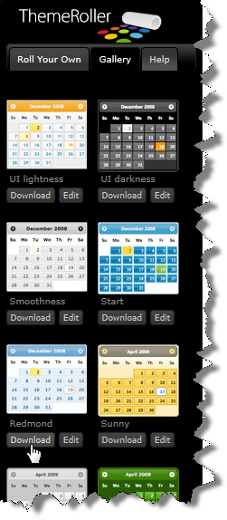
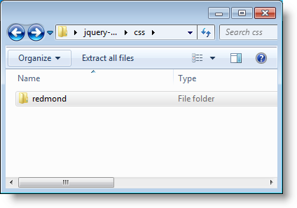
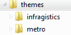
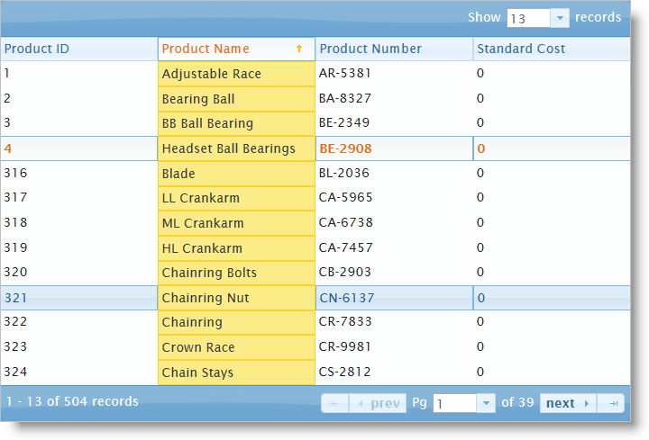

<!--
|metadata|
{
    "fileName": "iggrid-styling-and-theming",
    "controlName": "igGrid",
    "tags": ["Grids","Styling","Theming"]
}
|metadata|
-->

# Styling igGrid

## Required CSS and Themes

The %%ProductName%%™ grid (or `igGrid`), like other jQuery widgets, utilizes the jQuery UI CSS Framework for styling. Included in %%ProductName%% are custom jQuery UI themes called Infragistics and Metro. These themes provide a professional and attractive design to all Infragistics and standard jQuery UI widgets.

In addition to the Infragistics and Metro themes, there is a structure directory, which is required for the basic CSS layout of the Infragistics widgets.

### Adding Required Themes to a Website

The Infragistics and Metro themes are located in the installed directory within the css folder. To add the themes to your application, copy the whole css folder (including structure and themes directories) into your site’s location.

> **Note:** When using Infragistics Loader, the folder structure must be preserved. Thus the loader will work as expected. If some of the themes are not used they can be deleted, but the structure should remain the same.

**Figure 1: Included theme folders upon product install**


### Infragistics and Metro Themes

The Infragistics Theme is a custom theme which includes all of the styles typically found in a jQuery UI theme. This theme may be replaced by a different theme but for the jQuery widgets to display correctly a reference to file *{IG Resources root}\css\structure\infragistics.css* is required..

Metro theme is implementation of the clean, modern and fast Metro design language. It has the same requirements for*{IG Resources root}\css\structure\infragistics.css* like Infragistics theme.

When using a theme other than the Infragistics (or Metro) theme, the grid has some additional styling points that may need customization to achieve a complete design (depending on the grid’s enabled features and theme).

The `igGrid` control requires having a link to the stylesheet of a standard jQuery UI theme. For the IG Theme, you must include reference to the theme’s stylesheet in the page:

### Listing 1: Manual CSS reference to Infragistics theme

**In HTML:**

```html
<link href="css/themes/infragistics/infragistics.theme.css" rel="stylesheet" type="text/css" />
<link href="css/structure/modules/infragistics.ui.grid.css" rel="stylesheet" type="text/css" />
```

### Listing 2: CSS reference to Infragistics theme in ASP.NET MVC

**In HTML:**

```html
<%@ Import Namespace="Infragistics.Web.Mvc" %>
<!DOCTYPE html>
<html>
<head runat="server">
<link href="<%= Url.Content("~/css/themes/infragistics/infragistics.theme.css") %>” rel="stylesheet" type="text/css" />
<link href="<%= Url.Content("~/css/structure/modules/infragistics.ui.grid.css") %>” rel="stylesheet" type="text/css" />
```


### Listing 3 : Manual CSS reference to the Metro theme

The Metro Theme is referenced after the jQuery Theme. The following stylesheets are required when using the `igGrid` control:

**In HTML:**

```html
<link href="css/themes/metro/infragistics.theme.css " rel="stylesheet" type="text/css" />
<link href="css/structure/modules/infragistics.ui.grid.css" rel="stylesheet" type="text/css" />
```

### Listing 4 : CSS reference to the Metro theme in ASP.NET MVC

**In HTML:**

```html
<%@ Import Namespace="Infragistics.Web.Mvc" %>
<!DOCTYPE html>
<html>
<head runat="server">
<link href="<%= Url.Content("~/css/themes/metro/infragistics.theme.css ") %>” rel="stylesheet" type="text/css" />
<link href="<%= Url.Content("~/css/structure/modules/infragistics.ui.grid.css") %>” rel="stylesheet" type="text/css" />
```

## Using ThemeRoller

The ThemeRoller is a tool provided by jQuery UI which facilitates the creation of custom themes that are compatible with jQuery UI widgets. Many pre-built themes that can be downloaded and incorporated into your website. The %%ProductName%% widgets support the use of ThemeRoller themes. 

In addition to incorporating individual themes, the [jQuery UI Theme Switcher widget](http://docs.jquery.com/UI/Theming/ThemeSwitcher) is available to change pre-built jQuery UI themes dynamically in the browser. For more information on ThemeRoller and the Theme Switcher widget, see the [**External References**](#external-references) below.

> **Note:** The Infragistics Theme and Metro Theme cannot be used in conjunction with other ThemeRoller themes because infragistics.theme.css, as well as any other css with final overrides, is not compatible with ThemeRoller. When application uses ThemeRoller, then the only permitted css file is *jquery.ui.theme.css.*

To fix this through the loader, you can set the *theme* option to “” (empty string). That way the loader will not attempt to load the default theme (which is *Infragistics* for the jQuery widgets).

### Adding Custom jQuery UI Themes

Adding a custom theme is similar to adding the *Infragistics* theme.

1.  Go to the Theme Roller website and click the Gallery tab to find a theme to download:

	

2.  Click Download next to the Redmond theme and once the download completes, unzip the compressed folder to the file system.
3.  In the zip file, there is a css directory. Inside this directory there is a folder with the name of the theme - "redmond".

	

3.  Drag this directory into the themes directory of your website:

	

4.  Update the CSS links to replace the ‘Infragistics theme with the Redmond theme:

	#### Listing 5 : Manual CSS reference to Redmond theme
	
	**In HTML:**
	
	```html
	<link href="/css/themes/redmond/jquery-ui-1.8.13.custom.css" rel="stylesheet" type="text/css" />
    <link href="/css/structure/modules/infragistics.ui.grid.css" rel="stylesheet" type="text/css" />
	```
	
	#### Listing 6 : CSS reference to the Redmond theme in ASP.NET MVC
	
	**In HTML:**
	
	```html
	<%@ Import Namespace="Infragistics.Web.Mvc" %>
    <!DOCTYPE html>
    <html>
    <head runat="server">
    <link href="<%= Url.Content("~css/themes/redmond/jquery-ui-1.8.13.custom.css") %>” rel="stylesheet" type="text/css" />
    <link href="<%= Url.Content("~/css/structure/modules/infragistics.ui.grid.css") %>” rel="stylesheet" type="text/css" />
	```

5.  Finally, run the web page and the `igGrid` renders with the Redmond theme:

	

## <a id="external-references"></a> External References

-   [jQuery UI](http://www.jqueryui.com)
-   [Working with jQuery Widgets](http://wiki.jqueryui.com/w/page/12138135/Widget%20factory)
-   [jQuery ThemeRoller](http://jqueryui.com/themeroller/)
-   [jQuery UI Theme Switcher](http://docs.jquery.com/UI/Theming/ThemeSwitcher)

## <a id="related-content"></a> Related Content

### <a id="topics"></a> Topics

-   [Styling and Theming](Deployment-Guide-Styling-and-Theming.html)

### <a id="samples"></a> Samples

-   [Windows UI Theme sample](%%SamplesUrl%%/grid/windows-ui-theme)

 

 


